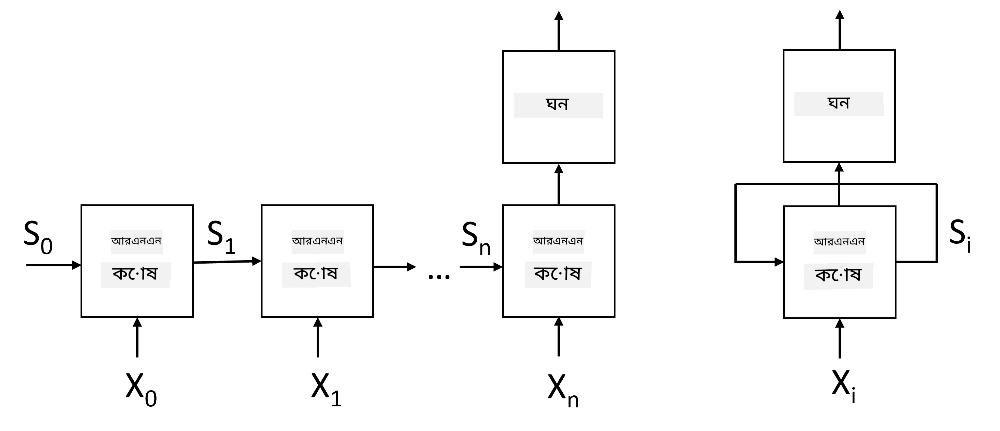
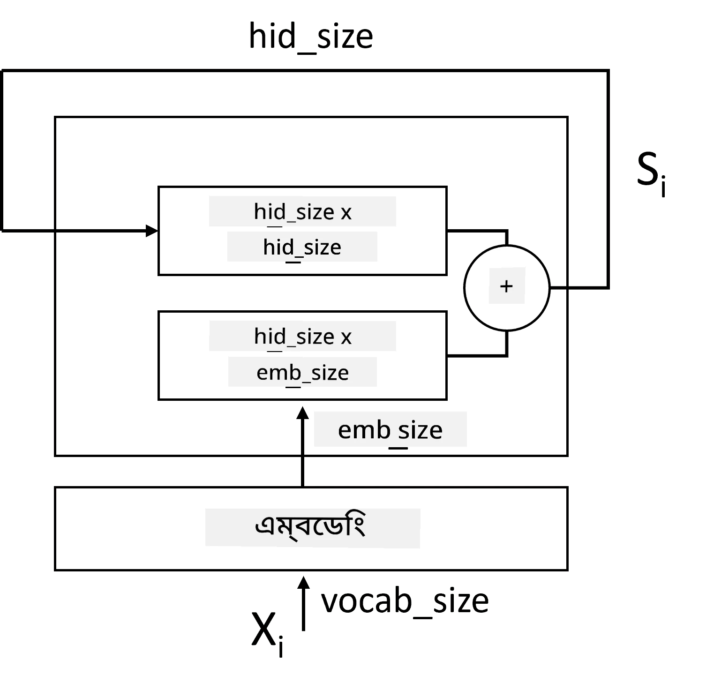
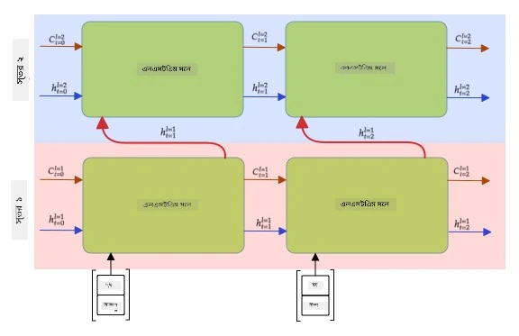

# রিকারেন্ট নিউরাল নেটওয়ার্ক

## [পূর্ব-লেকচার কুইজ](https://ff-quizzes.netlify.app/en/ai/quiz/31)

পূর্ববর্তী অংশগুলোতে, আমরা টেক্সটের সমৃদ্ধ সেমান্টিক উপস্থাপন ব্যবহার করেছি এবং এমবেডিংয়ের উপর একটি সাধারণ লিনিয়ার ক্লাসিফায়ার প্রয়োগ করেছি। এই আর্কিটেকচারটি বাক্যের শব্দগুলোর সম্মিলিত অর্থ ধারণ করে, কিন্তু এটি শব্দগুলোর **ক্রম** বিবেচনা করে না, কারণ এমবেডিংয়ের উপর অ্যাগ্রিগেশন অপারেশন মূল টেক্সট থেকে এই তথ্যটি সরিয়ে দেয়। যেহেতু এই মডেলগুলো শব্দের ক্রম মডেল করতে অক্ষম, তাই তারা টেক্সট জেনারেশন বা প্রশ্নোত্তর করার মতো জটিল বা দ্ব্যর্থক কাজ সমাধান করতে পারে না।

টেক্সট সিকোয়েন্সের অর্থ ধারণ করতে, আমাদের আরেকটি নিউরাল নেটওয়ার্ক আর্কিটেকচার ব্যবহার করতে হবে, যেটিকে **রিকারেন্ট নিউরাল নেটওয়ার্ক** বা RNN বলা হয়। RNN-এ, আমরা আমাদের বাক্যটি নেটওয়ার্কের মাধ্যমে একবারে একটি প্রতীক পাঠাই, এবং নেটওয়ার্ক কিছু **স্টেট** তৈরি করে, যা আমরা পরবর্তী প্রতীকের সাথে আবার নেটওয়ার্কে পাঠাই।

> লেখকের তৈরি ছবি

টোকেনের ইনপুট সিকোয়েন্স X0,...,Xn দেওয়া হলে, RNN একটি নিউরাল নেটওয়ার্ক ব্লকের সিকোয়েন্স তৈরি করে এবং ব্যাকপ্রোপাগেশনের মাধ্যমে এই সিকোয়েন্সটি এন্ড-টু-এন্ড প্রশিক্ষণ দেয়। প্রতিটি নেটওয়ার্ক ব্লক (Xi,Si) জোড়া ইনপুট হিসেবে গ্রহণ করে এবং ফলাফল হিসেবে Si+1 তৈরি করে। চূড়ান্ত স্টেট Sn বা (আউটপুট Yn) একটি লিনিয়ার ক্লাসিফায়ারে যায় ফলাফল তৈরি করতে। সমস্ত নেটওয়ার্ক ব্লক একই ওজন শেয়ার করে এবং এক ব্যাকপ্রোপাগেশন পাস ব্যবহার করে এন্ড-টু-এন্ড প্রশিক্ষণ দেওয়া হয়।

যেহেতু স্টেট ভেক্টর S0,...,Sn নেটওয়ার্কের মাধ্যমে পাঠানো হয়, এটি শব্দগুলোর ক্রমাগত নির্ভরতা শিখতে সক্ষম হয়। উদাহরণস্বরূপ, যখন *not* শব্দটি সিকোয়েন্সে কোথাও উপস্থিত হয়, এটি স্টেট ভেক্টরের নির্দিষ্ট উপাদানগুলোকে নেগেট করতে শিখতে পারে, যার ফলে নেগেশন ঘটে।

> ✅ উপরের ছবিতে দেখানো RNN ব্লকের সমস্ত ওজন শেয়ার করা হয়, তাই একই ছবি একটি ব্লক (ডানদিকে) হিসেবে উপস্থাপন করা যেতে পারে, যেখানে একটি রিকারেন্ট ফিডব্যাক লুপ রয়েছে, যা নেটওয়ার্কের আউটপুট স্টেটকে ইনপুটে ফেরত পাঠায়।

## RNN সেলের গঠন

চলুন দেখি একটি সাধারণ RNN সেল কীভাবে সংগঠিত হয়। এটি পূর্ববর্তী স্টেট Si-1 এবং বর্তমান প্রতীক Xi ইনপুট হিসেবে গ্রহণ করে এবং আউটপুট স্টেট Si তৈরি করতে হয় (এবং, কখনও কখনও, আমরা জেনারেটিভ নেটওয়ার্কের ক্ষেত্রে কিছু অন্য আউটপুট Yi নিয়েও আগ্রহী থাকি)।

একটি সাধারণ RNN সেলের ভিতরে দুটি ওজন ম্যাট্রিক্স থাকে: একটি ইনপুট প্রতীককে রূপান্তরিত করে (চলুন একে W বলি), এবং অন্যটি ইনপুট স্টেটকে রূপান্তরিত করে (H)। এই ক্ষেত্রে নেটওয়ার্কের আউটপুট হিসাব করা হয় &sigma;(W&times;Xi+H&times;Si-1+b), যেখানে &sigma; হল অ্যাক্টিভেশন ফাংশন এবং b হল অতিরিক্ত বায়াস।

> লেখকের তৈরি ছবি

অনেক ক্ষেত্রে, ইনপুট টোকেনগুলো RNN-এ প্রবেশ করার আগে এমবেডিং লেয়ারের মাধ্যমে পাঠানো হয় ডাইমেনশনালিটি কমানোর জন্য। এই ক্ষেত্রে, যদি ইনপুট ভেক্টরের ডাইমেনশন *emb_size* হয় এবং স্টেট ভেক্টর *hid_size* হয় - তাহলে W-এর সাইজ হবে *emb_size*&times;*hid_size*, এবং H-এর সাইজ হবে *hid_size*&times;*hid_size*।

## লং শর্ট টার্ম মেমোরি (LSTM)

ক্লাসিক্যাল RNN-এর প্রধান সমস্যাগুলোর একটি হল **vanishing gradients** সমস্যা। যেহেতু RNN-গুলো এক ব্যাকপ্রোপাগেশন পাসে এন্ড-টু-এন্ড প্রশিক্ষণ দেওয়া হয়, এটি নেটওয়ার্কের প্রথম লেয়ারগুলোতে ত্রুটি প্রোপাগেট করতে অসুবিধা হয়, এবং তাই নেটওয়ার্ক দূরবর্তী টোকেনগুলোর মধ্যে সম্পর্ক শিখতে পারে না। এই সমস্যাটি এড়ানোর একটি উপায় হল **explicit state management** প্রবর্তন করা, যা **gates** ব্যবহার করে। এই ধরনের দুটি সুপরিচিত আর্কিটেকচার রয়েছে: **Long Short Term Memory** (LSTM) এবং **Gated Relay Unit** (GRU)।

> ছবির উৎস TBD

LSTM নেটওয়ার্ক RNN-এর মতোই সংগঠিত, কিন্তু এখানে দুটি স্টেট লেয়ার থেকে লেয়ারে পাঠানো হয়: প্রকৃত স্টেট C এবং হিডেন ভেক্টর H। প্রতিটি ইউনিটে, হিডেন ভেক্টর Hi ইনপুট Xi এর সাথে সংযুক্ত হয়, এবং তারা **gates** এর মাধ্যমে স্টেট C-তে কী ঘটবে তা নিয়ন্ত্রণ করে। প্রতিটি গেট একটি নিউরাল নেটওয়ার্ক যার সিগময়েড অ্যাক্টিভেশন রয়েছে (আউটপুট [0,1] পরিসরে), যা স্টেট ভেক্টরের সাথে গুণিত হলে বিটওয়াইজ মাস্ক হিসেবে ভাবা যেতে পারে। নিচের ছবিতে বাম থেকে ডানে গেটগুলো হল:

* **Forget gate** হিডেন ভেক্টর গ্রহণ করে এবং নির্ধারণ করে কোন উপাদানগুলো আমরা ভুলে যেতে চাই এবং কোনগুলো পাস করতে চাই।
* **Input gate** ইনপুট এবং হিডেন ভেক্টর থেকে কিছু তথ্য গ্রহণ করে এবং স্টেটে যোগ করে।
* **Output gate** স্টেটকে *tanh* অ্যাক্টিভেশন সহ একটি লিনিয়ার লেয়ারের মাধ্যমে রূপান্তরিত করে, তারপর এর কিছু উপাদান নির্বাচন করে একটি নতুন স্টেট Ci+1 তৈরি করতে।

স্টেট C-এর উপাদানগুলোকে কিছু ফ্ল্যাগ হিসেবে ভাবা যেতে পারে যা চালু এবং বন্ধ করা যায়। উদাহরণস্বরূপ, যখন আমরা সিকোয়েন্সে *Alice* নামটি পাই, আমরা ধরে নিতে পারি যে এটি একটি মহিলা চরিত্রকে নির্দেশ করে এবং স্টেটে একটি ফ্ল্যাগ বাড়াই যে বাক্যে একটি মহিলা বিশেষ্য রয়েছে। যখন আমরা আরও *and Tom* বাক্যাংশ পাই, আমরা একটি ফ্ল্যাগ বাড়াই যে আমাদের একটি বহুবচন বিশেষ্য রয়েছে। এভাবে স্টেট ম্যানিপুলেট করে আমরা বাক্যের অংশগুলোর ব্যাকরণগত বৈশিষ্ট্যগুলো ট্র্যাক করতে পারি।

> ✅ LSTM-এর অভ্যন্তরীণ বিষয়গুলো বোঝার জন্য একটি চমৎকার রিসোর্স হল ক্রিস্টোফার ওলাহের এই অসাধারণ নিবন্ধ [Understanding LSTM Networks](https://colah.github.io/posts/2015-08-Understanding-LSTMs/)।

## বাইডিরেকশনাল এবং মাল্টিলেয়ার RNN

আমরা রিকারেন্ট নেটওয়ার্ক নিয়ে আলোচনা করেছি যা একদিকে কাজ করে, সিকোয়েন্সের শুরু থেকে শেষ পর্যন্ত। এটি স্বাভাবিক মনে হয়, কারণ এটি আমাদের পড়া এবং কথা শোনার পদ্ধতির মতো। তবে, যেহেতু অনেক বাস্তব ক্ষেত্রে আমাদের ইনপুট সিকোয়েন্সে র‍্যান্ডম অ্যাক্সেস থাকে, তাই রিকারেন্ট কম্পিউটেশন উভয় দিকে চালানো যুক্তিযুক্ত হতে পারে। এই ধরনের নেটওয়ার্ককে **বাইডিরেকশনাল** RNN বলা হয়। বাইডিরেকশনাল নেটওয়ার্কের ক্ষেত্রে, আমাদের দুটি হিডেন স্টেট ভেক্টর প্রয়োজন হবে, প্রতিটি দিকের জন্য একটি।

একটি রিকারেন্ট নেটওয়ার্ক, একদিকে বা বাইডিরেকশনাল, একটি সিকোয়েন্সের নির্দিষ্ট প্যাটার্নগুলো ধারণ করে এবং সেগুলোকে স্টেট ভেক্টরে সংরক্ষণ করতে পারে বা আউটপুটে পাস করতে পারে। কনভোলিউশনাল নেটওয়ার্কের মতো, আমরা প্রথম লেয়ার দ্বারা এক্সট্র্যাক্ট করা নিম্ন-স্তরের প্যাটার্ন থেকে উচ্চ-স্তরের প্যাটার্ন ক্যাপচার করতে প্রথম লেয়ারের উপরে আরেকটি রিকারেন্ট লেয়ার তৈরি করতে পারি। এটি আমাদের **মাল্টিলেয়ার RNN** ধারণায় নিয়ে যায়, যা দুটি বা তার বেশি রিকারেন্ট নেটওয়ার্ক নিয়ে গঠিত, যেখানে পূর্ববর্তী লেয়ারের আউটপুট পরবর্তী লেয়ারের ইনপুট হিসেবে পাঠানো হয়।

*ছবি [এই অসাধারণ পোস্ট](https://towardsdatascience.com/from-a-lstm-cell-to-a-multilayer-lstm-network-with-pytorch-2899eb5696f3) থেকে ফার্নান্দো লোপেজের দ্বারা*

## ✍️ অনুশীলন: এমবেডিং

নিম্নলিখিত নোটবুকগুলোতে আপনার শেখা চালিয়ে যান:

* [PyTorch দিয়ে RNN](RNNPyTorch.ipynb)
* [TensorFlow দিয়ে RNN](RNNTF.ipynb)

## উপসংহার

এই ইউনিটে, আমরা দেখেছি যে RNN-গুলো সিকোয়েন্স ক্লাসিফিকেশনের জন্য ব্যবহার করা যেতে পারে, কিন্তু প্রকৃতপক্ষে, তারা আরও অনেক কাজ পরিচালনা করতে পারে, যেমন টেক্সট জেনারেশন, মেশিন ট্রান্সলেশন এবং আরও অনেক কিছু। আমরা পরবর্তী ইউনিটে এই কাজগুলো বিবেচনা করব।

## 🚀 চ্যালেঞ্জ

LSTM সম্পর্কে কিছু সাহিত্য পড়ুন এবং তাদের প্রয়োগগুলো বিবেচনা করুন:

- [Grid Long Short-Term Memory](https://arxiv.org/pdf/1507.01526v1.pdf)
- [Show, Attend and Tell: Neural Image Caption
Generation with Visual Attention](https://arxiv.org/pdf/1502.03044v2.pdf)

## [পোস্ট-লেকচার কুইজ](https://ff-quizzes.netlify.app/en/ai/quiz/32)

## পর্যালোচনা ও স্ব-অধ্যয়ন

- [Understanding LSTM Networks](https://colah.github.io/posts/2015-08-Understanding-LSTMs/) ক্রিস্টোফার ওলাহের দ্বারা।

## [অ্যাসাইনমেন্ট: নোটবুক](assignment.md)

---

