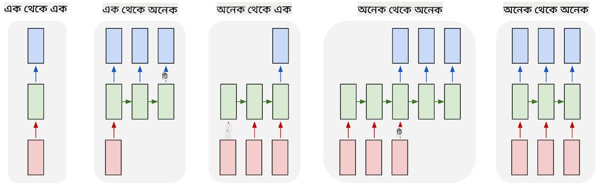

<!--
CO_OP_TRANSLATOR_METADATA:
{
  "original_hash": "d9de7847385eeeda67cfdcce1640ab72",
  "translation_date": "2025-08-26T08:19:52+00:00",
  "source_file": "lessons/5-NLP/17-GenerativeNetworks/README.md",
  "language_code": "bn"
}
-->
# জেনারেটিভ নেটওয়ার্কস

## [পূর্ব-লেকচার কুইজ](https://ff-quizzes.netlify.app/en/ai/quiz/33)

Recurrent Neural Networks (RNNs) এবং তাদের গেটেড সেল ভ্যারিয়েন্ট যেমন Long Short Term Memory Cells (LSTMs) এবং Gated Recurrent Units (GRUs) ভাষা মডেলিংয়ের জন্য একটি পদ্ধতি প্রদান করে, যেখানে তারা শব্দের ক্রম শিখতে পারে এবং একটি সিকোয়েন্সে পরবর্তী শব্দের পূর্বাভাস দিতে পারে। এটি আমাদের RNNs ব্যবহার করে **জেনারেটিভ কাজ** সম্পাদন করতে দেয়, যেমন সাধারণ টেক্সট জেনারেশন, মেশিন ট্রান্সলেশন এবং এমনকি ইমেজ ক্যাপশনিং।

> ✅ ভাবুন, আপনি কতবার জেনারেটিভ কাজের সুবিধা পেয়েছেন, যেমন টাইপ করার সময় টেক্সট সম্পূর্ণ হওয়া। আপনার প্রিয় অ্যাপ্লিকেশনগুলোর উপর গবেষণা করুন এবং দেখুন তারা RNNs ব্যবহার করেছে কিনা।

পূর্ববর্তী ইউনিটে আলোচনা করা RNN আর্কিটেকচারে, প্রতিটি RNN ইউনিট একটি আউটপুট হিসেবে পরবর্তী হিডেন স্টেট তৈরি করত। তবে, আমরা প্রতিটি রিকারেন্ট ইউনিটে আরেকটি আউটপুট যোগ করতে পারি, যা আমাদের একটি **সিকোয়েন্স** আউটপুট করতে দেয় (যা মূল সিকোয়েন্সের দৈর্ঘ্যের সমান)। তদ্ব্যতীত, আমরা এমন RNN ইউনিট ব্যবহার করতে পারি যা প্রতিটি ধাপে ইনপুট গ্রহণ করে না, বরং একটি প্রাথমিক স্টেট ভেক্টর গ্রহণ করে এবং তারপর আউটপুটের একটি সিকোয়েন্স তৈরি করে।

এটি এমন বিভিন্ন নিউরাল আর্কিটেকচারের জন্য অনুমতি দেয় যা নিচের ছবিতে দেখানো হয়েছে:



> ছবি ব্লগ পোস্ট [Unreasonable Effectiveness of Recurrent Neural Networks](http://karpathy.github.io/2015/05/21/rnn-effectiveness/) থেকে, লেখক [Andrej Karpaty](http://karpathy.github.io/)

* **ওয়ান-টু-ওয়ান** একটি ঐতিহ্যবাহী নিউরাল নেটওয়ার্ক যেখানে একটি ইনপুট এবং একটি আউটপুট থাকে
* **ওয়ান-টু-মেনি** একটি জেনারেটিভ আর্কিটেকচার যা একটি ইনপুট ভ্যালু গ্রহণ করে এবং আউটপুট ভ্যালুগুলোর একটি সিকোয়েন্স তৈরি করে। উদাহরণস্বরূপ, যদি আমরা একটি **ইমেজ ক্যাপশনিং** নেটওয়ার্ক প্রশিক্ষণ দিতে চাই যা একটি ছবির টেক্সট বর্ণনা তৈরি করবে, আমরা একটি ছবি ইনপুট হিসেবে গ্রহণ করতে পারি, এটিকে একটি CNN-এর মাধ্যমে পাস করিয়ে তার হিডেন স্টেট পেতে পারি, এবং তারপর একটি রিকারেন্ট চেইন শব্দ ধরে ধরে ক্যাপশন তৈরি করতে পারি।
* **মেনি-টু-ওয়ান** পূর্ববর্তী ইউনিটে বর্ণিত RNN আর্কিটেকচারের সাথে মিলে যায়, যেমন টেক্সট ক্লাসিফিকেশন।
* **মেনি-টু-মেনি**, বা **সিকোয়েন্স-টু-সিকোয়েন্স** এমন কাজের সাথে মিলে যায় যেমন **মেশিন ট্রান্সলেশন**, যেখানে প্রথম RNN ইনপুট সিকোয়েন্স থেকে সমস্ত তথ্য হিডেন স্টেটে সংগ্রহ করে, এবং আরেকটি RNN চেইন এই স্টেটকে আউটপুট সিকোয়েন্সে রূপান্তর করে।

এই ইউনিটে, আমরা সহজ জেনারেটিভ মডেলের উপর ফোকাস করব যা আমাদের টেক্সট তৈরি করতে সাহায্য করে। সরলতার জন্য, আমরা ক্যারেক্টার-লেভেল টোকেনাইজেশন ব্যবহার করব।

আমরা এই RNN-কে ধাপে ধাপে টেক্সট তৈরি করতে প্রশিক্ষণ দেব। প্রতিটি ধাপে, আমরা `nchars` দৈর্ঘ্যের একটি ক্যারেক্টার সিকোয়েন্স নেব এবং নেটওয়ার্ককে প্রতিটি ইনপুট ক্যারেক্টারের জন্য পরবর্তী আউটপুট ক্যারেক্টার তৈরি করতে বলব:


টেক্সট তৈরি করার সময় (ইনফারেন্স চলাকালীন), আমরা কিছু **প্রম্পট** দিয়ে শুরু করি, যা RNN সেলগুলোর মাধ্যমে পাস হয় এবং এর মধ্যবর্তী স্টেট তৈরি করে, এবং তারপর এই স্টেট থেকে জেনারেশন শুরু হয়। আমরা একবারে একটি ক্যারেক্টার তৈরি করি এবং স্টেট ও তৈরি করা ক্যারেক্টারকে আরেকটি RNN সেলে পাস করি পরবর্তীটি তৈরি করার জন্য, যতক্ষণ না আমরা পর্যাপ্ত ক্যারেক্টার তৈরি করি।


> লেখকের তৈরি ছবি

## ✍️ অনুশীলন: জেনারেটিভ নেটওয়ার্কস

নিচের নোটবুকগুলোতে আপনার শেখা চালিয়ে যান:

* [PyTorch দিয়ে জেনারেটিভ নেটওয়ার্কস](../../../../../lessons/5-NLP/17-GenerativeNetworks/GenerativePyTorch.ipynb)
* [TensorFlow দিয়ে জেনারেটিভ নেটওয়ার্কস](../../../../../lessons/5-NLP/17-GenerativeNetworks/GenerativeTF.ipynb)

## নরম টেক্সট জেনারেশন এবং টেম্পারেচার

প্রতিটি RNN সেলের আউটপুট হলো ক্যারেক্টারগুলোর একটি সম্ভাব্যতা বিতরণ। যদি আমরা সর্বদা সর্বোচ্চ সম্ভাব্যতার ক্যারেক্টারকে পরবর্তী ক্যারেক্টার হিসেবে গ্রহণ করি, তাহলে তৈরি করা টেক্সট প্রায়ই একই ক্যারেক্টার সিকোয়েন্সের মধ্যে "ঘুরপাক" খেতে পারে, যেমন এই উদাহরণে:

```
today of the second the company and a second the company ...
```

তবে, যদি আমরা পরবর্তী ক্যারেক্টারের জন্য সম্ভাব্যতা বিতরণ দেখি, তাহলে দেখা যেতে পারে যে কয়েকটি সর্বোচ্চ সম্ভাব্যতার মধ্যে পার্থক্য খুব বেশি নয়, যেমন একটি ক্যারেক্টারের সম্ভাব্যতা ০.২ হতে পারে, আরেকটির ০.১৯, ইত্যাদি। উদাহরণস্বরূপ, '*play*' সিকোয়েন্সে পরবর্তী ক্যারেক্টার সমানভাবে স্পেস বা **e** (যেমন *player* শব্দে) হতে পারে।

এটি আমাদের এই সিদ্ধান্তে পৌঁছায় যে সর্বোচ্চ সম্ভাব্যতার ক্যারেক্টার বেছে নেওয়া সবসময় "ন্যায্য" নয়, কারণ দ্বিতীয় সর্বোচ্চটি বেছে নেওয়াও অর্থপূর্ণ টেক্সট তৈরি করতে পারে। এটি আরও বুদ্ধিমানের কাজ যে নেটওয়ার্ক আউটপুট দ্বারা প্রদত্ত সম্ভাব্যতা বিতরণ থেকে ক্যারেক্টার **স্যাম্পল** করা। আমরা একটি প্যারামিটার, **টেম্পারেচার**, ব্যবহার করতে পারি যা সম্ভাব্যতা বিতরণকে সমতল করতে পারে, যদি আমরা আরও এলোমেলোতা যোগ করতে চাই, অথবা এটিকে আরও খাড়া করতে পারি, যদি আমরা সর্বোচ্চ-সম্ভাব্যতার ক্যারেক্টারগুলোর প্রতি বেশি মনোযোগ দিতে চাই।

উপরের লিঙ্ক করা নোটবুকগুলোতে এই নরম টেক্সট জেনারেশন কীভাবে বাস্তবায়িত হয় তা অন্বেষণ করুন।

## উপসংহার

যদিও টেক্সট জেনারেশন নিজেই উপকারী হতে পারে, প্রধান সুবিধাগুলো আসে RNNs ব্যবহার করে কিছু প্রাথমিক ফিচার ভেক্টর থেকে টেক্সট তৈরি করার ক্ষমতা থেকে। উদাহরণস্বরূপ, টেক্সট জেনারেশন মেশিন ট্রান্সলেশনের অংশ হিসেবে ব্যবহৃত হয় (সিকোয়েন্স-টু-সিকোয়েন্স, এই ক্ষেত্রে *এনকোডার* থেকে স্টেট ভেক্টর ব্যবহার করে অনুবাদিত বার্তা তৈরি বা *ডিকোড* করা হয়), অথবা একটি ছবির টেক্সট বর্ণনা তৈরি করতে (যেখানে ফিচার ভেক্টরটি CNN এক্সট্রাক্টর থেকে আসে)।

## 🚀 চ্যালেঞ্জ

এই বিষয়ে Microsoft Learn থেকে কিছু পাঠ নিন

* [PyTorch](https://docs.microsoft.com/learn/modules/intro-natural-language-processing-pytorch/6-generative-networks/?WT.mc_id=academic-77998-cacaste)/[TensorFlow](https://docs.microsoft.com/learn/modules/intro-natural-language-processing-tensorflow/5-generative-networks/?WT.mc_id=academic-77998-cacaste) দিয়ে টেক্সট জেনারেশন

## [পোস্ট-লেকচার কুইজ](https://ff-quizzes.netlify.app/en/ai/quiz/34)

## পর্যালোচনা ও স্ব-অধ্যয়ন

আপনার জ্ঞান বাড়ানোর জন্য এখানে কিছু প্রবন্ধ রয়েছে

* Markov Chain, LSTM এবং GPT-2 দিয়ে টেক্সট জেনারেশনের বিভিন্ন পদ্ধতি: [ব্লগ পোস্ট](https://towardsdatascience.com/text-generation-gpt-2-lstm-markov-chain-9ea371820e1e)
* [Keras ডকুমেন্টেশনে](https://keras.io/examples/generative/lstm_character_level_text_generation/) টেক্সট জেনারেশনের উদাহরণ

## [অ্যাসাইনমেন্ট](lab/README.md)

আমরা দেখেছি কিভাবে ক্যারেক্টার ধরে ধরে টেক্সট তৈরি করা যায়। ল্যাবে, আপনি শব্দ-লেভেল টেক্সট জেনারেশন অন্বেষণ করবেন।

**অস্বীকৃতি**:  
এই নথিটি AI অনুবাদ পরিষেবা [Co-op Translator](https://github.com/Azure/co-op-translator) ব্যবহার করে অনুবাদ করা হয়েছে। আমরা যথাসাধ্য সঠিক অনুবাদ প্রদানের চেষ্টা করি, তবে অনুগ্রহ করে মনে রাখবেন যে স্বয়ংক্রিয় অনুবাদে ত্রুটি বা অসঙ্গতি থাকতে পারে। নথিটির মূল ভাষায় থাকা সংস্করণটিকেই প্রামাণিক উৎস হিসেবে বিবেচনা করা উচিত। গুরুত্বপূর্ণ তথ্যের জন্য, পেশাদার মানব অনুবাদ সুপারিশ করা হয়। এই অনুবাদ ব্যবহারের ফলে সৃষ্ট কোনো ভুল বোঝাবুঝি বা ভুল ব্যাখ্যার জন্য আমরা দায়ী নই।