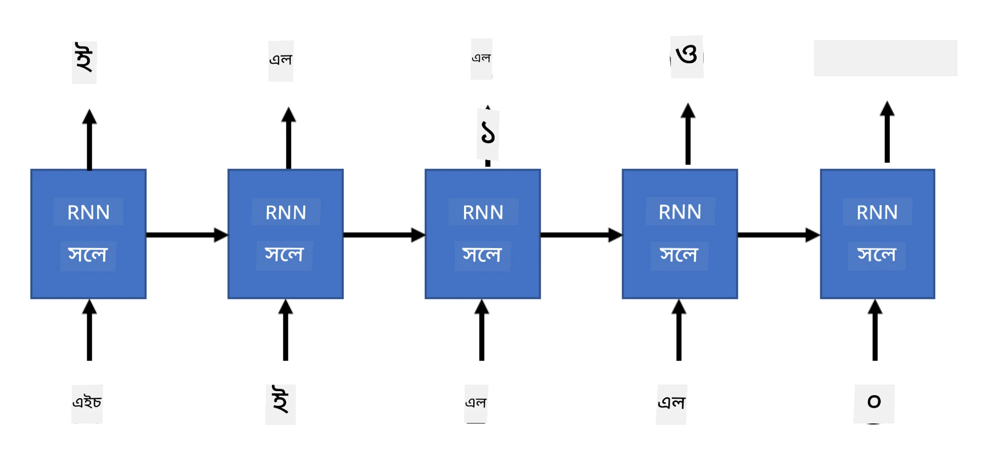

# জেনারেটিভ নেটওয়ার্ক

## [পূর্ব-লেকচার কুইজ](https://ff-quizzes.netlify.app/en/ai/quiz/33)

Recurrent Neural Networks (RNNs) এবং তাদের গেটেড সেল ভেরিয়েন্ট যেমন Long Short Term Memory Cells (LSTMs) এবং Gated Recurrent Units (GRUs) ভাষা মডেলিংয়ের জন্য একটি পদ্ধতি প্রদান করে, যেখানে তারা শব্দের ক্রম শিখতে পারে এবং একটি সিকোয়েন্সে পরবর্তী শব্দের পূর্বাভাস দিতে পারে। এটি আমাদের RNNs ব্যবহার করে **জেনারেটিভ কাজ** সম্পাদন করতে দেয়, যেমন সাধারণ টেক্সট জেনারেশন, মেশিন ট্রান্সলেশন, এবং এমনকি ইমেজ ক্যাপশনিং।

> ✅ ভাবুন, আপনি কতবার টেক্সট সম্পূর্ণ করার মতো জেনারেটিভ কাজ থেকে উপকৃত হয়েছেন। আপনার প্রিয় অ্যাপ্লিকেশনগুলোর উপর গবেষণা করুন এবং দেখুন তারা RNNs ব্যবহার করেছে কিনা।

পূর্ববর্তী ইউনিটে আলোচনা করা RNN আর্কিটেকচারে, প্রতিটি RNN ইউনিট পরবর্তী হিডেন স্টেটকে আউটপুট হিসেবে তৈরি করত। তবে, আমরা প্রতিটি রিকারেন্ট ইউনিটে আরেকটি আউটপুট যোগ করতে পারি, যা আমাদের একটি **সিকোয়েন্স** আউটপুট করতে দেয় (যা মূল সিকোয়েন্সের দৈর্ঘ্যের সমান)। এছাড়াও, আমরা এমন RNN ইউনিট ব্যবহার করতে পারি যা প্রতিটি ধাপে ইনপুট গ্রহণ করে না, বরং শুধুমাত্র একটি প্রাথমিক স্টেট ভেক্টর গ্রহণ করে এবং তারপর আউটপুটের একটি সিকোয়েন্স তৈরি করে।

এটি বিভিন্ন নিউরাল আর্কিটেকচারের জন্য অনুমতি দেয়, যা নিচের ছবিতে দেখানো হয়েছে:


> ছবি ব্লগ পোস্ট [Unreasonable Effectiveness of Recurrent Neural Networks](http://karpathy.github.io/2015/05/21/rnn-effectiveness/) থেকে [Andrej Karpaty](http://karpathy.github.io/) দ্বারা

* **One-to-one** হলো একটি ঐতিহ্যবাহী নিউরাল নেটওয়ার্ক যেখানে একটি ইনপুট এবং একটি আউটপুট থাকে।
* **One-to-many** হলো একটি জেনারেটিভ আর্কিটেকচার যা একটি ইনপুট মান গ্রহণ করে এবং আউটপুট মানগুলোর একটি সিকোয়েন্স তৈরি করে। উদাহরণস্বরূপ, যদি আমরা একটি **ইমেজ ক্যাপশনিং** নেটওয়ার্ক প্রশিক্ষণ দিতে চাই যা একটি ছবির টেক্সট বর্ণনা তৈরি করবে, আমরা একটি ছবি ইনপুট হিসেবে গ্রহণ করতে পারি, এটি একটি CNN-এর মাধ্যমে পাস করে তার হিডেন স্টেট পেতে পারি, এবং তারপর একটি রিকারেন্ট চেইন শব্দ-প্রতি-শব্দ ক্যাপশন তৈরি করতে পারে।
* **Many-to-one** পূর্ববর্তী ইউনিটে বর্ণিত RNN আর্কিটেকচারের সাথে মিলে যায়, যেমন টেক্সট ক্লাসিফিকেশন।
* **Many-to-many**, বা **sequence-to-sequence** এমন কাজের সাথে মিলে যায় যেমন **মেশিন ট্রান্সলেশন**, যেখানে প্রথম RNN ইনপুট সিকোয়েন্স থেকে সমস্ত তথ্য সংগ্রহ করে হিডেন স্টেটে রাখে, এবং অন্য একটি RNN চেইন এই স্টেটকে আউটপুট সিকোয়েন্সে রূপান্তরিত করে।

এই ইউনিটে, আমরা সহজ জেনারেটিভ মডেলের উপর ফোকাস করব যা আমাদের টেক্সট তৈরি করতে সাহায্য করে। সরলতার জন্য, আমরা চরিত্র-স্তরের টোকেনাইজেশন ব্যবহার করব।

আমরা এই RNN-কে ধাপে ধাপে টেক্সট তৈরি করতে প্রশিক্ষণ দেব। প্রতিটি ধাপে, আমরা `nchars` দৈর্ঘ্যের একটি চরিত্রের সিকোয়েন্স গ্রহণ করব এবং নেটওয়ার্ককে প্রতিটি ইনপুট চরিত্রের জন্য পরবর্তী আউটপুট চরিত্র তৈরি করতে বলব:



যখন টেক্সট তৈরি করা হয় (ইনফারেন্সের সময়), আমরা কিছু **প্রম্পট** দিয়ে শুরু করি, যা RNN সেলগুলোর মাধ্যমে পাস করে তার মধ্যবর্তী স্টেট তৈরি করে, এবং তারপর এই স্টেট থেকে জেনারেশন শুরু হয়। আমরা একবারে একটি চরিত্র তৈরি করি এবং স্টেট এবং তৈরি করা চরিত্রকে অন্য RNN সেলে পাস করি পরবর্তী চরিত্র তৈরি করার জন্য, যতক্ষণ না আমরা পর্যাপ্ত চরিত্র তৈরি করি।


> লেখকের তৈরি ছবি

## ✍️ অনুশীলন: জেনারেটিভ নেটওয়ার্ক

নিম্নলিখিত নোটবুকগুলোতে আপনার শেখা চালিয়ে যান:

* [PyTorch দিয়ে জেনারেটিভ নেটওয়ার্ক](GenerativePyTorch.ipynb)
* [TensorFlow দিয়ে জেনারেটিভ নেটওয়ার্ক](GenerativeTF.ipynb)

## নরম টেক্সট জেনারেশন এবং টেম্পারেচার

প্রতিটি RNN সেলের আউটপুট হলো চরিত্রগুলোর একটি সম্ভাব্যতা বিতরণ। যদি আমরা সর্বদা সর্বোচ্চ সম্ভাব্যতার চরিত্রকে তৈরি করা টেক্সটের পরবর্তী চরিত্র হিসেবে গ্রহণ করি, তাহলে টেক্সট প্রায়ই একই চরিত্রের সিকোয়েন্সের মধ্যে "চক্রিত" হতে পারে, যেমন এই উদাহরণে:

```
today of the second the company and a second the company ...
```

তবে, যদি আমরা পরবর্তী চরিত্রের জন্য সম্ভাব্যতা বিতরণ দেখি, তাহলে দেখা যেতে পারে যে কয়েকটি সর্বোচ্চ সম্ভাব্যতার মধ্যে পার্থক্য খুব বেশি নয়, যেমন একটি চরিত্রের সম্ভাব্যতা হতে পারে 0.2, অন্যটির - 0.19, ইত্যাদি। উদাহরণস্বরূপ, '*play*' সিকোয়েন্সে পরবর্তী চরিত্র সমানভাবে স্পেস বা **e** হতে পারে (যেমন শব্দ *player* এ)।

এটি আমাদের এই সিদ্ধান্তে নিয়ে যায় যে সর্বোচ্চ সম্ভাব্যতার চরিত্র নির্বাচন করা সবসময় "ন্যায্য" নয়, কারণ দ্বিতীয় সর্বোচ্চ নির্বাচন করাও অর্থপূর্ণ টেক্সট তৈরি করতে পারে। এটি আরও বুদ্ধিমানের কাজ হবে যদি আমরা নেটওয়ার্ক আউটপুট দ্বারা প্রদত্ত সম্ভাব্যতা বিতরণ থেকে চরিত্রগুলো **স্যাম্পল** করি। আমরা একটি প্যারামিটার, **টেম্পারেচার**, ব্যবহার করতে পারি যা সম্ভাব্যতা বিতরণকে সমতল করে দিতে পারে, যদি আমরা আরও এলোমেলোতা যোগ করতে চাই, অথবা এটিকে আরও খাড়া করতে পারি, যদি আমরা সর্বোচ্চ-সম্ভাব্যতার চরিত্রগুলোর দিকে বেশি মনোযোগ দিতে চাই।

উপরের লিঙ্ক করা নোটবুকগুলোতে এই নরম টেক্সট জেনারেশন কীভাবে বাস্তবায়িত হয় তা অন্বেষণ করুন।

## উপসংহার

যদিও টেক্সট জেনারেশন নিজেই উপকারী হতে পারে, প্রধান সুবিধাগুলো আসে যখন আমরা RNNs ব্যবহার করে কিছু প্রাথমিক ফিচার ভেক্টর থেকে টেক্সট তৈরি করতে পারি। উদাহরণস্বরূপ, টেক্সট জেনারেশন মেশিন ট্রান্সলেশনের অংশ হিসেবে ব্যবহৃত হয় (sequence-to-sequence, এই ক্ষেত্রে *encoder* থেকে স্টেট ভেক্টর ব্যবহার করে অনুবাদিত বার্তা তৈরি বা *decode* করা হয়), অথবা একটি ছবির টেক্সট বর্ণনা তৈরি করতে (যেখানে ফিচার ভেক্টর CNN extractor থেকে আসে)।

## 🚀 চ্যালেঞ্জ

এই বিষয়ে Microsoft Learn-এ কিছু পাঠ নিন

* [PyTorch](https://docs.microsoft.com/learn/modules/intro-natural-language-processing-pytorch/6-generative-networks/?WT.mc_id=academic-77998-cacaste)/[TensorFlow](https://docs.microsoft.com/learn/modules/intro-natural-language-processing-tensorflow/5-generative-networks/?WT.mc_id=academic-77998-cacaste) দিয়ে টেক্সট জেনারেশন

## [পোস্ট-লেকচার কুইজ](https://ff-quizzes.netlify.app/en/ai/quiz/34)

## পর্যালোচনা ও স্ব-অধ্যয়ন

আপনার জ্ঞান বাড়ানোর জন্য এখানে কিছু নিবন্ধ রয়েছে

* Markov Chain, LSTM এবং GPT-2 দিয়ে টেক্সট জেনারেশনের বিভিন্ন পদ্ধতি: [ব্লগ পোস্ট](https://towardsdatascience.com/text-generation-gpt-2-lstm-markov-chain-9ea371820e1e)
* [Keras ডকুমেন্টেশন](https://keras.io/examples/generative/lstm_character_level_text_generation/) এ টেক্সট জেনারেশনের উদাহরণ

## [অ্যাসাইনমেন্ট](lab/README.md)

আমরা দেখেছি কীভাবে চরিত্র-প্রতি-চরিত্র টেক্সট তৈরি করা যায়। ল্যাবে, আপনি শব্দ-স্তরের টেক্সট জেনারেশন অন্বেষণ করবেন।

---

