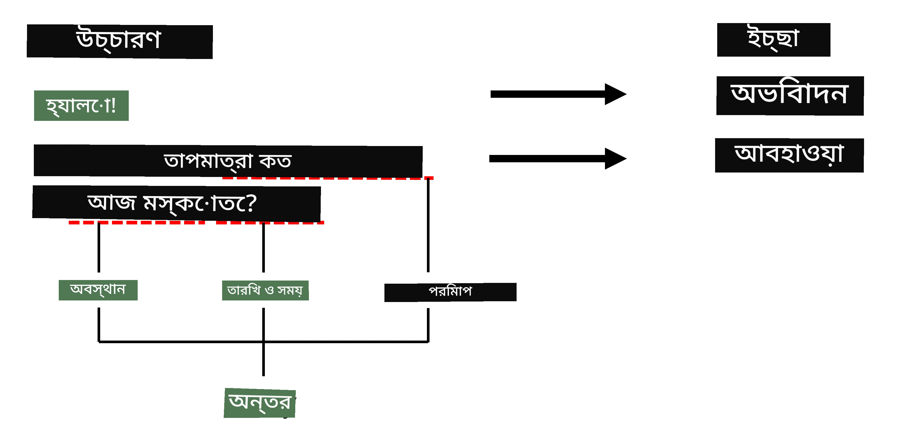
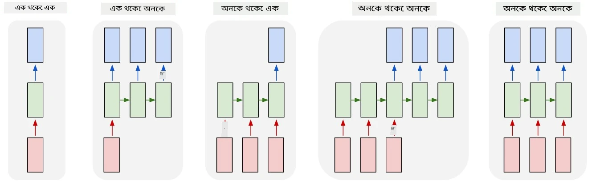

# নামযুক্ত সত্তা সনাক্তকরণ

এখন পর্যন্ত, আমরা মূলত একটি NLP কাজ - শ্রেণীবিন্যাসের উপর মনোযোগ কেন্দ্রীভূত করেছি। তবে, নিউরাল নেটওয়ার্ক ব্যবহার করে আরও অন্যান্য NLP কাজও সম্পন্ন করা যায়। এর মধ্যে একটি কাজ হলো **[নামযুক্ত সত্তা সনাক্তকরণ](https://wikipedia.org/wiki/Named-entity_recognition)** (NER), যা পাঠ্যের মধ্যে নির্দিষ্ট সত্তাগুলি সনাক্ত করার সাথে সম্পর্কিত, যেমন স্থান, ব্যক্তির নাম, তারিখ-সময়, রাসায়নিক সূত্র ইত্যাদি।

## [পাঠ-পূর্ব কুইজ](https://ff-quizzes.netlify.app/en/ai/quiz/37)

## NER ব্যবহারের উদাহরণ

ধরা যাক আপনি একটি প্রাকৃতিক ভাষাভিত্তিক চ্যাট বট তৈরি করতে চান, যেমন Amazon Alexa বা Google Assistant। বুদ্ধিমান চ্যাট বটগুলো কাজ করে ব্যবহারকারীর চাহিদা *বোঝার* মাধ্যমে, যা ইনপুট বাক্যের উপর টেক্সট শ্রেণীবিন্যাস করে। এই শ্রেণীবিন্যাসের ফলাফল হলো **ইচ্ছা** (intent), যা নির্ধারণ করে চ্যাট বটটি কী করবে।

> লেখকের তৈরি চিত্র

তবে, ব্যবহারকারী বাক্যের অংশ হিসেবে কিছু প্যারামিটার সরবরাহ করতে পারেন। উদাহরণস্বরূপ, আবহাওয়ার তথ্য জানতে চাইলে তিনি হয়তো একটি স্থান বা তারিখ উল্লেখ করবেন। একটি বটের উচিত এই সত্তাগুলো বুঝতে পারা এবং সেই অনুযায়ী প্যারামিটার স্লট পূরণ করা। এখানেই NER কার্যকর হয়।

> ✅ আরেকটি উদাহরণ হতে পারে [বৈজ্ঞানিক চিকিৎসা গবেষণাপত্র বিশ্লেষণ](https://soshnikov.com/science/analyzing-medical-papers-with-azure-and-text-analytics-for-health/)। এখানে আমাদের প্রধান কাজ হলো নির্দিষ্ট চিকিৎসা সম্পর্কিত শব্দ খুঁজে বের করা, যেমন রোগ এবং চিকিৎসা উপাদান। যদিও কিছু সংখ্যক রোগ সাবস্ট্রিং অনুসন্ধানের মাধ্যমে বের করা সম্ভব, তবে রাসায়নিক যৌগ এবং ওষুধের নামের মতো জটিল সত্তাগুলোর জন্য আরও জটিল পদ্ধতির প্রয়োজন।

## টোকেন শ্রেণীবিন্যাস হিসেবে NER

NER মডেলগুলো মূলত **টোকেন শ্রেণীবিন্যাস মডেল**, কারণ প্রতিটি ইনপুট টোকেনের জন্য আমাদের সিদ্ধান্ত নিতে হয় এটি কোনো সত্তার অন্তর্ভুক্ত কিনা, এবং যদি হয় - তাহলে কোন সত্তা শ্রেণীতে পড়ে।

নিম্নলিখিত গবেষণাপত্রের শিরোনামটি বিবেচনা করুন:

**Tricuspid valve regurgitation** এবং **lithium carbonate** **toxicity** একটি নবজাতকের মধ্যে।

এখানে সত্তাগুলো হলো:

* Tricuspid valve regurgitation একটি রোগ (`DIS`)
* Lithium carbonate একটি রাসায়নিক পদার্থ (`CHEM`)
* Toxicity-ও একটি রোগ (`DIS`)

লক্ষ্য করুন, একটি সত্তা একাধিক টোকেন জুড়ে থাকতে পারে। এবং, এই ক্ষেত্রে, আমাদের পরপর দুটি সত্তার মধ্যে পার্থক্য করতে হবে। তাই, প্রতিটি সত্তার জন্য দুটি শ্রেণী ব্যবহার করা সাধারণ ব্যাপার - একটি সত্তার প্রথম টোকেন নির্ধারণের জন্য (সাধারণত `B-` প্রিফিক্স ব্যবহার করা হয়, যা **b**eginning নির্দেশ করে), এবং অন্যটি সত্তার অব্যাহত অংশের জন্য (`I-`, যা **i**nner টোকেন নির্দেশ করে)। আমরা `O` ব্যবহার করি সমস্ত **o**ther টোকেনের জন্য। এই ধরনের টোকেন ট্যাগিংকে [BIO ট্যাগিং](https://en.wikipedia.org/wiki/Inside%E2%80%93outside%E2%80%93beginning_(tagging)) (বা IOB) বলা হয়। ট্যাগ করার পর, আমাদের শিরোনামটি এভাবে দেখাবে:

Token | Tag
------|-----
Tricuspid | B-DIS
valve | I-DIS
regurgitation | I-DIS
and | O
lithium | B-CHEM
carbonate | I-CHEM
toxicity | B-DIS
in | O
a | O
newborn | O
infant | O
. | O

যেহেতু আমাদের টোকেন এবং শ্রেণীগুলোর মধ্যে এক-একটি সম্পর্ক তৈরি করতে হবে, আমরা এই চিত্র থেকে একটি ডানদিকের **অনেক-থেকে-অনেক** নিউরাল নেটওয়ার্ক মডেল প্রশিক্ষণ দিতে পারি:

> *[এই ব্লগ পোস্ট](http://karpathy.github.io/2015/05/21/rnn-effectiveness/) থেকে চিত্র, লেখক [Andrej Karpathy](http://karpathy.github.io/)। NER টোকেন শ্রেণীবিন্যাস মডেল এই চিত্রের ডানদিকের নেটওয়ার্ক আর্কিটেকচারের সাথে মিলে যায়।*

## NER মডেল প্রশিক্ষণ

যেহেতু একটি NER মডেল মূলত একটি টোকেন শ্রেণীবিন্যাস মডেল, আমরা এই কাজের জন্য RNN ব্যবহার করতে পারি, যা আমরা ইতিমধ্যে জানি। এই ক্ষেত্রে, পুনরাবৃত্ত নেটওয়ার্কের প্রতিটি ব্লক টোকেন আইডি প্রদান করবে। নিম্নলিখিত নোটবুকটি দেখায় কীভাবে টোকেন শ্রেণীবিন্যাসের জন্য LSTM প্রশিক্ষণ দেওয়া যায়।

## ✍️ উদাহরণ নোটবুক: NER

নিম্নলিখিত নোটবুকে আপনার শেখা চালিয়ে যান:

* [TensorFlow দিয়ে NER](NER-TF.ipynb)

## উপসংহার

একটি NER মডেল হলো একটি **টোকেন শ্রেণীবিন্যাস মডেল**, যা টোকেন শ্রেণীবিন্যাস সম্পাদন করতে ব্যবহৃত হয়। এটি NLP-তে একটি খুব সাধারণ কাজ, যা পাঠ্যের মধ্যে নির্দিষ্ট সত্তাগুলো সনাক্ত করতে সহায়তা করে, যেমন স্থান, নাম, তারিখ ইত্যাদি।

## 🚀 চ্যালেঞ্জ

নিচের লিঙ্কে দেওয়া অ্যাসাইনমেন্টটি সম্পন্ন করুন, যেখানে আপনাকে চিকিৎসা সম্পর্কিত শব্দ সনাক্তকরণের জন্য একটি NER মডেল প্রশিক্ষণ দিতে হবে, তারপর এটি একটি ভিন্ন ডেটাসেটে প্রয়োগ করুন।

## [পাঠ-পরবর্তী কুইজ](https://ff-quizzes.netlify.app/en/ai/quiz/38)

## পর্যালোচনা ও স্ব-অধ্যয়ন

[পুনরাবৃত্ত নিউরাল নেটওয়ার্কের অস্বাভাবিক কার্যকারিতা](http://karpathy.github.io/2015/05/21/rnn-effectiveness/) ব্লগটি পড়ুন এবং সেই নিবন্ধের Further Reading অংশটি অনুসরণ করুন আপনার জ্ঞান আরও গভীর করতে।

## [অ্যাসাইনমেন্ট](lab/README.md)

এই পাঠের অ্যাসাইনমেন্টে, আপনাকে একটি চিকিৎসা সত্তা সনাক্তকরণ মডেল প্রশিক্ষণ দিতে হবে। এই পাঠে বর্ণিত LSTM মডেল দিয়ে শুরু করুন এবং তারপর BERT ট্রান্সফর্মার মডেল ব্যবহার করুন। বিস্তারিত জানতে [নির্দেশাবলী](lab/README.md) পড়ুন।

---

