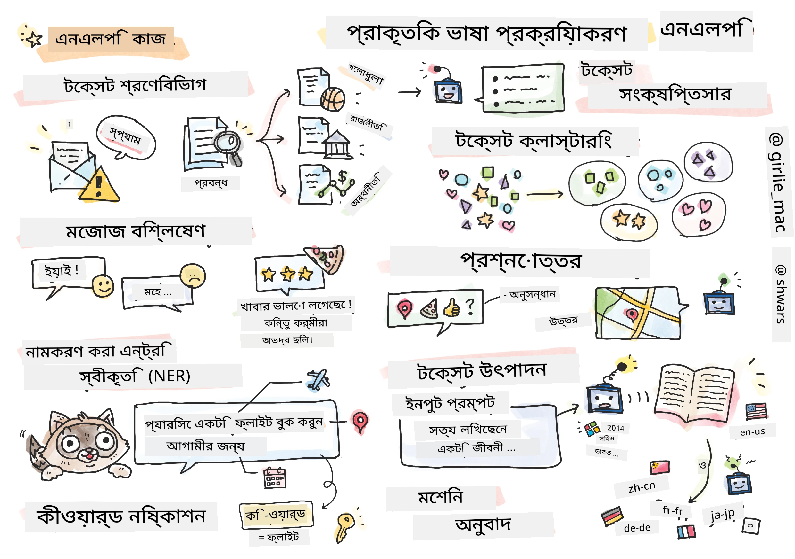

# প্রাকৃতিক ভাষা প্রক্রিয়াকরণ



এই অংশে, আমরা **প্রাকৃতিক ভাষা প্রক্রিয়াকরণ (NLP)** সম্পর্কিত কাজগুলো পরিচালনা করতে নিউরাল নেটওয়ার্ক ব্যবহার করার উপর মনোযোগ দেব। অনেক ধরনের NLP সমস্যা রয়েছে যা আমরা চাই কম্পিউটার সমাধান করতে সক্ষম হোক:

* **টেক্সট শ্রেণীবিন্যাস** হলো টেক্সট সিকোয়েন্সের সাথে সম্পর্কিত একটি সাধারণ শ্রেণীবিন্যাস সমস্যা। উদাহরণস্বরূপ, ই-মেইল বার্তাগুলোকে স্প্যাম বনাম নন-স্প্যাম হিসেবে শ্রেণীবিন্যাস করা, বা নিবন্ধগুলোকে খেলাধুলা, ব্যবসা, রাজনীতি ইত্যাদি হিসেবে শ্রেণীবিন্যাস করা। এছাড়াও, চ্যাটবট তৈরি করার সময়, প্রায়ই আমাদের বুঝতে হয় ব্যবহারকারী কী বলতে চেয়েছেন -- এই ক্ষেত্রে আমরা **ইচ্ছা শ্রেণীবিন্যাস** নিয়ে কাজ করি। ইচ্ছা শ্রেণীবিন্যাসে প্রায়ই অনেক ক্যাটাগরির সাথে কাজ করতে হয়।
* **অনুভূতি বিশ্লেষণ** হলো একটি সাধারণ রিগ্রেশন সমস্যা, যেখানে আমাদের একটি সংখ্যা (অনুভূতি) নির্ধারণ করতে হয় যা একটি বাক্যের অর্থ কতটা ইতিবাচক/নেতিবাচক তা নির্দেশ করে। অনুভূতি বিশ্লেষণের একটি উন্নত সংস্করণ হলো **অ্যাসপেক্ট-ভিত্তিক অনুভূতি বিশ্লেষণ** (ABSA), যেখানে আমরা পুরো বাক্যের পরিবর্তে এর বিভিন্ন অংশে (অ্যাসপেক্ট) অনুভূতি নির্ধারণ করি, যেমন: *এই রেস্টুরেন্টে আমি খাবারটি পছন্দ করেছি, কিন্তু পরিবেশটি ভয়ানক ছিল*।
* **নামযুক্ত সত্তা সনাক্তকরণ** (NER) হলো টেক্সট থেকে নির্দিষ্ট সত্তাগুলো বের করার সমস্যা। উদাহরণস্বরূপ, আমরা বুঝতে চাই যে বাক্য *আমি কাল প্যারিসে উড়ে যেতে চাই*-এ *কাল* শব্দটি তারিখ নির্দেশ করে এবং *প্যারিস* একটি অবস্থান।
* **কীওয়ার্ড নির্ধারণ** NER-এর মতো, তবে এখানে আমাদের স্বয়ংক্রিয়ভাবে বাক্যের অর্থের জন্য গুরুত্বপূর্ণ শব্দগুলো বের করতে হয়, নির্দিষ্ট সত্তার ধরনগুলোর জন্য পূর্ব-প্রশিক্ষণ ছাড়াই।
* **টেক্সট ক্লাস্টারিং** তখন কাজে লাগে যখন আমরা একই ধরনের বাক্যগুলো একত্রিত করতে চাই, যেমন: টেকনিক্যাল সাপোর্ট কথোপকথনে একই ধরনের অনুরোধগুলো।
* **প্রশ্ন উত্তর প্রদান** হলো একটি মডেলের নির্দিষ্ট প্রশ্নের উত্তর দেওয়ার ক্ষমতা। মডেলটি একটি টেক্সট প্যাসেজ এবং একটি প্রশ্ন ইনপুট হিসেবে গ্রহণ করে, এবং এটি টেক্সটে এমন একটি স্থান প্রদান করতে হয় যেখানে প্রশ্নের উত্তর রয়েছে (বা, কখনও কখনও, উত্তর টেক্সট তৈরি করতে হয়)।
* **টেক্সট তৈরি** হলো একটি মডেলের নতুন টেক্সট তৈরি করার ক্ষমতা। এটি এমন একটি শ্রেণীবিন্যাস কাজ হিসেবে বিবেচিত হতে পারে যা কিছু *টেক্সট প্রম্পট* এর উপর ভিত্তি করে পরবর্তী অক্ষর/শব্দ পূর্বাভাস দেয়। উন্নত টেক্সট তৈরি মডেল, যেমন GPT-3, [প্রম্পট প্রোগ্রামিং](https://towardsdatascience.com/software-3-0-how-prompting-will-change-the-rules-of-the-game-a982fbfe1e0) বা [প্রম্পট ইঞ্জিনিয়ারিং](https://medium.com/swlh/openai-gpt-3-and-prompt-engineering-dcdc2c5fcd29) নামক একটি কৌশল ব্যবহার করে শ্রেণীবিন্যাসের মতো অন্যান্য NLP কাজ সমাধান করতে সক্ষম।
* **টেক্সট সারাংশ তৈরি** হলো একটি কৌশল যেখানে আমরা চাই কম্পিউটার দীর্ঘ টেক্সট "পড়ে" কয়েকটি বাক্যে সারাংশ তৈরি করুক।
* **মেশিন অনুবাদ** হলো এক ভাষায় টেক্সট বোঝা এবং অন্য ভাষায় টেক্সট তৈরি করার একটি সমন্বয়।

প্রাথমিকভাবে, বেশিরভাগ NLP কাজগুলো ঐতিহ্যবাহী পদ্ধতি যেমন ব্যাকরণ ব্যবহার করে সমাধান করা হতো। উদাহরণস্বরূপ, মেশিন অনুবাদে পার্সার ব্যবহার করে প্রাথমিক বাক্যকে একটি সিনট্যাক্স ট্রিতে রূপান্তর করা হতো, তারপর উচ্চতর স্তরের অর্থগত কাঠামো বের করে বাক্যের অর্থ উপস্থাপন করা হতো, এবং এই অর্থ এবং লক্ষ্য ভাষার ব্যাকরণের উপর ভিত্তি করে ফলাফল তৈরি করা হতো। বর্তমানে, অনেক NLP কাজ নিউরাল নেটওয়ার্ক ব্যবহার করে আরও কার্যকরভাবে সমাধান করা হয়।

> অনেক ক্লাসিক্যাল NLP পদ্ধতি [Natural Language Processing Toolkit (NLTK)](https://www.nltk.org) পাইথন লাইব্রেরিতে বাস্তবায়িত হয়েছে। অনলাইনে একটি চমৎকার [NLTK বই](https://www.nltk.org/book/) উপলব্ধ রয়েছে যা দেখায় কীভাবে বিভিন্ন NLP কাজ NLTK ব্যবহার করে সমাধান করা যায়।

আমাদের কোর্সে, আমরা মূলত NLP-এর জন্য নিউরাল নেটওয়ার্ক ব্যবহার করার উপর মনোযোগ দেব, এবং যেখানে প্রয়োজন সেখানে NLTK ব্যবহার করব।

আমরা ইতিমধ্যে ট্যাবুলার ডেটা এবং ইমেজ নিয়ে কাজ করার জন্য নিউরাল নেটওয়ার্ক ব্যবহার সম্পর্কে শিখেছি। এই ধরনের ডেটা এবং টেক্সটের মধ্যে প্রধান পার্থক্য হলো টেক্সট একটি পরিবর্তনশীল দৈর্ঘ্যের সিকোয়েন্স, যেখানে ইমেজের ক্ষেত্রে ইনপুট সাইজ পূর্বেই জানা থাকে। যদিও কনভোলিউশনাল নেটওয়ার্ক ইনপুট ডেটা থেকে প্যাটার্ন বের করতে পারে, টেক্সটের প্যাটার্নগুলো আরও জটিল। উদাহরণস্বরূপ, আমরা দেখতে পারি যে বিষয় থেকে নেগেশন অনেক শব্দ দ্বারা আলাদা হতে পারে (যেমন: *আমি কমলালেবু পছন্দ করি না*, বনাম *আমি সেই বড় রঙিন সুস্বাদু কমলালেবু পছন্দ করি না*), এবং এটি এখনও একটি প্যাটার্ন হিসেবে ব্যাখ্যা করা উচিত। তাই, ভাষা পরিচালনা করতে আমাদের নতুন নিউরাল নেটওয়ার্ক টাইপ, যেমন *রিকারেন্ট নেটওয়ার্ক* এবং *ট্রান্সফর্মার* প্রয়োজন।

## লাইব্রেরি ইনস্টল করুন

যদি আপনি এই কোর্স চালানোর জন্য স্থানীয় পাইথন ইনস্টলেশন ব্যবহার করেন, তাহলে NLP-এর জন্য প্রয়োজনীয় সমস্ত লাইব্রেরি নিম্নলিখিত কমান্ডগুলো ব্যবহার করে ইনস্টল করতে হতে পারে:

**PyTorch-এর জন্য**
```bash
pip install -r requirements-torch.txt
```
**TensorFlow-এর জন্য**
```bash
pip install -r requirements-tf.txt
```

> আপনি [Microsoft Learn](https://docs.microsoft.com/learn/modules/intro-natural-language-processing-tensorflow/?WT.mc_id=academic-77998-cacaste) এ TensorFlow দিয়ে NLP চেষ্টা করতে পারেন।

## GPU সতর্কতা

এই অংশে, কিছু উদাহরণে আমরা বেশ বড় মডেল প্রশিক্ষণ করব।
* **GPU-সক্ষম কম্পিউটার ব্যবহার করুন**: বড় মডেল নিয়ে কাজ করার সময় অপেক্ষার সময় কমানোর জন্য GPU-সক্ষম কম্পিউটারে আপনার নোটবুক চালানো পরামর্শ দেওয়া হয়।
* **GPU মেমোরি সীমাবদ্ধতা**: GPU-তে চালানোর সময় বড় মডেল প্রশিক্ষণের সময় GPU মেমোরি শেষ হয়ে যেতে পারে।
* **GPU মেমোরি ব্যবহার**: প্রশিক্ষণের সময় GPU মেমোরি ব্যবহারের পরিমাণ বিভিন্ন বিষয়ের উপর নির্ভর করে, যেমন মিনিব্যাচ সাইজ।
* **মিনিব্যাচ সাইজ কমান**: যদি GPU মেমোরি সমস্যা হয়, তাহলে আপনার কোডে মিনিব্যাচ সাইজ কমানো একটি সম্ভাব্য সমাধান হতে পারে।
* **TensorFlow GPU মেমোরি রিলিজ**: TensorFlow-এর পুরনো সংস্করণগুলো একাধিক মডেল প্রশিক্ষণের সময় GPU মেমোরি সঠিকভাবে রিলিজ করতে পারে না। GPU মেমোরি ব্যবহারের কার্যকর ব্যবস্থাপনার জন্য, আপনি TensorFlow-কে প্রয়োজন অনুযায়ী GPU মেমোরি বরাদ্দ করতে কনফিগার করতে পারেন।
* **কোড অন্তর্ভুক্তি**: TensorFlow-কে GPU মেমোরি শুধুমাত্র প্রয়োজন হলে বরাদ্দ করতে সেট করতে, আপনার নোটবুকে নিম্নলিখিত কোড অন্তর্ভুক্ত করুন:

```python
physical_devices = tf.config.list_physical_devices('GPU') 
if len(physical_devices)>0:
    tf.config.experimental.set_memory_growth(physical_devices[0], True) 
```

যদি আপনি ক্লাসিক্যাল ML দৃষ্টিকোণ থেকে NLP সম্পর্কে শিখতে আগ্রহী হন, তাহলে [এই পাঠগুলোর সংগ্রহ](https://github.com/microsoft/ML-For-Beginners/tree/main/6-NLP) দেখুন।

## এই অংশে
এই অংশে আমরা শিখব:

* [টেক্সটকে টেনসর হিসেবে উপস্থাপন](13-TextRep/README.md)
* [ওয়ার্ড এম্বেডিংস](14-Emdeddings/README.md)
* [ভাষা মডেলিং](15-LanguageModeling/README.md)
* [রিকারেন্ট নিউরাল নেটওয়ার্ক](16-RNN/README.md)
* [জেনারেটিভ নেটওয়ার্ক](17-GenerativeNetworks/README.md)
* [ট্রান্সফর্মার](18-Transformers/README.md)

**অস্বীকৃতি**:  
এই নথিটি AI অনুবাদ পরিষেবা [Co-op Translator](https://github.com/Azure/co-op-translator) ব্যবহার করে অনুবাদ করা হয়েছে। আমরা যথাসাধ্য সঠিক অনুবাদের চেষ্টা করি, তবে অনুগ্রহ করে মনে রাখবেন যে স্বয়ংক্রিয় অনুবাদে ত্রুটি বা অসঙ্গতি থাকতে পারে। নথিটির মূল ভাষায় থাকা সংস্করণটিকে প্রামাণিক উৎস হিসেবে বিবেচনা করা উচিত। গুরুত্বপূর্ণ তথ্যের জন্য, পেশাদার মানব অনুবাদ সুপারিশ করা হয়। এই অনুবাদ ব্যবহারের ফলে সৃষ্ট কোনো ভুল বোঝাবুঝি বা ভুল ব্যাখ্যার জন্য আমরা দায়ী নই।