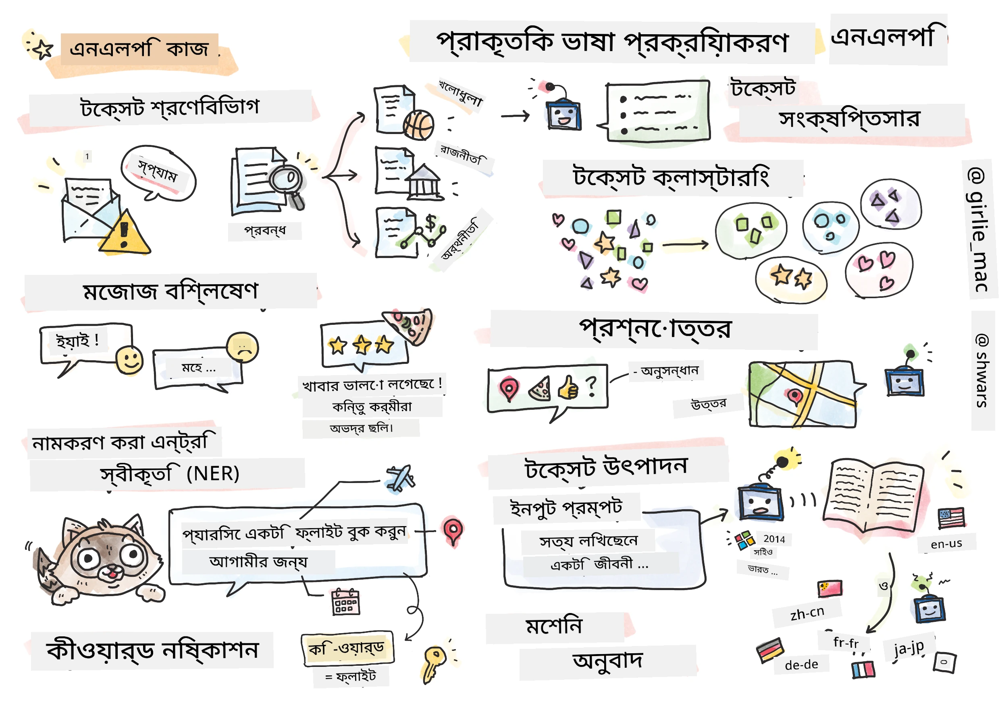

# প্রাকৃতিক ভাষা প্রক্রিয়াকরণ



এই অংশে, আমরা **প্রাকৃতিক ভাষা প্রক্রিয়াকরণ (NLP)** সম্পর্কিত কাজগুলি পরিচালনার জন্য নিউরাল নেটওয়ার্ক ব্যবহার করার উপর মনোযোগ দেব। অনেক ধরনের NLP সমস্যা রয়েছে যেগুলো আমরা চাই কম্পিউটার সমাধান করতে পারে:

* **টেক্সট শ্রেণীবিভাগ** হল পাঠ্যের অনুক্রম সম্পর্কিত একটি সাধারণ শ্রেণীবিভাগ সমস্যা। উদাহরণস্বরূপ ই-মেইল বার্তা স্প্যাম বনাম নন-স্প্যাম হিসাবে শ্রেণীবদ্ধ করা, অথবা প্রবন্ধগুলোকে স্পোর্ট, ব্যবসা, রাজনীতি ইত্যাদি হিসেবে শ্রেণীবদ্ধ করা। এছাড়াও, চ্যাটবট তৈরি করার সময়, আমরা প্রায়ই ব্যবহারকারী কী বলতে চেয়েছিল তা বুঝতে চাই — এই ক্ষেত্রে আমরা **উদ্দেশ্য শ্রেণীবিভাগ** নিয়ে কাজ করি। প্রায়ই, উদ্দেশ্য শ্রেণীবিভাগে আমাদের অনেক ক্যাটাগরির সাথে মোকাবিলা করতে হয়।
* **মনের অবস্থা বিশ্লেষণ** একটি সাধারণ রিগ্রেশন সমস্যা, যেখানে আমাদের একটি সংখ্যা (একটি মনের অবস্থা) নির্ধারণ করতে হয় যেটি বাক্যের অর্থ কতটা ইতিবাচক/নেতিবাচক তা নির্দেশ করে। মনের অবস্থা বিশ্লেষণের উন্নত একটি সংস্করণ হল **অংশ-ভিত্তিক মনের অবস্থা বিশ্লেষণ** (ABSA), যেখানে আমরা মনের অবস্থা পুরো বাক্যের জন্য নয় বরং এর বিভিন্ন অংশের (অংশগুলোর) জন্য নির্ধারণ করি, যেমন *এই রেস্টুরেন্টে, আমি খাবার পছন্দ করেছি, কিন্তু পরিবেশ খুব খারাপ ছিল*।
* **নেমড এন্টিটি রিকগনিশন** (NER) হল টেক্সট থেকে নির্দিষ্ট এন্টিটি বের করার সমস্যা। উদাহরণস্বরূপ, আমাদের বুঝতে হতে পারে যে বাক্য *I need to fly to Paris tomorrow* এ শব্দ *tomorrow* DATE বোঝায়, এবং *Paris* LOCATION।
* **কীওয়ার্ড এক্সট্রাকশন** NER এর মতো, কিন্তু আমাদের স্বয়ংক্রিয়ভাবে বাক্যের অর্থের জন্য গুরুত্বপূর্ণ শব্দগুলি বের করতে হয়, নির্দিষ্ট এন্টিটি ধরনের জন্য প্রি-ট্রেনিং ছাড়াই।
* **টেক্সট ক্লাস্টারিং** কাজে লাগে যখন আমরা অনুরূপ বাক্যগুলিকে একসঙ্গে গ্রুপ করতে চাই, যেমন প্রযুক্তিগত সহায়তা কথোপকথনে অনুরূপ অনুরোধগুলি।
* **প্রশ্নোত্তর** মডেলটির একটি নির্দিষ্ট প্রশ্নের উত্তর দেওয়ার ক্ষমতা বোঝায়। মডেল একটি টেক্সট প্যাসেজ এবং একটি প্রশ্ন ইনপুট হিসেবে পায় এবং তাকে টেক্সটের মধ্যে এমন একটি স্থান দিতে হয় যেখানে প্রশ্নের উত্তর রয়েছে (অথবা কখনও কখনও উত্তর স্বয়ংক্রিয়ভাবে তৈরি করতে হয়)।
* **টেক্সট জেনারেশন** হল একটি মডেলের নতুন টেক্সট তৈরি করার ক্ষমতা। এটিকে একটি শ্রেণীবিভাগ কাজ হিসাবে বিবেচনা করা যেতে পারে যা কিছু *টেক্সট প্রম্পট* এর ভিত্তিতে পরবর্তী অক্ষর/শব্দ পূর্বাভাস দেয়। উন্নত টেক্সট জেনারেশন মডেল যেমন GPT-3, অন্যান্য NLP কাজ যেমন শ্রেণীবিভাগ সমাধান করতে পারে [prompt programming](https://towardsdatascience.com/software-3-0-how-prompting-will-change-the-rules-of-the-game-a982fbfe1e0) বা [prompt engineering](https://medium.com/swlh/openai-gpt-3-and-prompt-engineering-dcdc2c5fcd29) নামে কৌশল ব্যবহারের মাধ্যমে।
* **টেক্সট সারাংশ** হল একটি কৌশল যেখানে আমরা চাই একটি কম্পিউটার দীর্ঘ টেক্সট "পড়ে" কয়েকটি বাক্যে সেটির সারাংশ তৈরি করুক।
* **মেশিন অনুবাদ** কে একটি ভাষায় টেক্সট বোঝার এবং অন্য ভাষায় টেক্সট তৈরি করার সমন্বয় হিসেবে দেখা যেতে পারে।

শুরুতে, বেশিরভাগ NLP কাজ ঐতিহ্যবাহী পদ্ধতি যেমন ব্যাকরণ ব্যবহার করে সমাধান করা হতো। উদাহরণস্বরূপ, মেশিন অনুবাদে পার্সার ব্যবহার করে মূল বাক্যটিকে সিনট্যাক্টিক গাছতে রূপান্তর করা হতো, তারপর উচ্চতর স্তরের অর্থগত কাঠামো বের করে বাক্যের অর্থ বোঝানো হতো, এবং এই অর্থ এবং লক্ষ্যমাত্রা ভাষার ব্যাকরণের ভিত্তিতে ফলাফল জেনারেট করা হতো। এখনকালীন, অনেক NLP কাজ অনেক বেশি কার্যকরীভাবে নিউরাল নেটওয়ার্ক ব্যবহার করে সমাধান করা হয়।

> অনেক ক্লাসিক্যাল NLP পদ্ধতি [Natural Language Processing Toolkit (NLTK)](https://www.nltk.org) পাইথন লাইব্রেরিতে বাস্তবায়িত। একটি দুর্দান্ত [NLTK বই](https://www.nltk.org/book/) অনলাইনে পাওয়া যায় যা কিভাবে বিভিন্ন NLP কাজ NLTK দিয়ে সমাধান করা যায় তা কভার করে।

আমাদের কোর্সে, আমরা মূলত নিউরাল নেটওয়ার্ক দিয়ে NLP এর জন্য কাজ করবো এবং যেখানে প্রয়োজন সেখানে NLTK ব্যবহার করব।

আমরা আগেই শিখেছি ট্যাবুলার ডেটা এবং ইমেজগুলোর জন্য নিউরাল নেটওয়ার্ক ব্যবহার সম্পর্কে। এই ডেটার ধরনগুলির এবং টেক্সটের প্রধান পার্থক্য হল, টেক্সট একটি পরিবর্তনশীল দৈর্ঘ্যের সিকোয়েন্স, যেখানে ইমেজের ক্ষেত্রে ইনপুটের আকার আগেই জানা থাকে। যখন কনভলিউশানাল নেটওয়ার্ক ইনপুট ডেটা থেকে প্যাটার্ন বের করতে পারে, টেক্সটের প্যাটার্নগুলো আরও জটিল। যেমন, একটা নেতিবাচকতা বিষয় থেকে আলাদা অবস্থানে থাকলেও তা একটিই প্যাটার্ন হিসেবে বিবেচনা করা উচিত (যেমন *I do not like oranges* বনাম *I do not like those big colorful tasty oranges*), এবং তা একক প্যাটার্ন হিসেবে বোঝা উচিত। তাই, ভাষা প্রক্রিয়াকরণের জন্য আমাদের নতুন ধরণের নিউরাল নেটওয়ার্ক যেমন *রিকারেন্ট নেটওয়ার্ক* এবং *ট্রান্সফরমার্স* প্রবর্তন করতে হয়।

## লাইব্রেরি ইনস্টল করুন

যদি আপনি এই কোর্স চালানোর জন্য লোকাল পাইথন ইনস্টলেশন ব্যবহার করেন, তবে আপনাকে NLP এর জন্য প্রয়োজনীয় সব লাইব্রেরি ইনস্টল করতে হতে পারে নিম্নলিখিত কমান্ড দিয়ে:

**PyTorch এর জন্য**
```bash
pip install -r requirements-pytorch.txt
```
**TensorFlow এর জন্য**
```bash
pip install -r requirements-tf.txt
```

> আপনি [Microsoft Learn](https://docs.microsoft.com/learn/modules/intro-natural-language-processing-tensorflow/?WT.mc_id=academic-77998-cacaste) এ TensorFlow দিয়ে NLP চেষ্টা করতে পারেন

## GPU সতর্কতা

এই অংশে, কিছু উদাহরণে আমরা বড় মডেল প্রশিক্ষণ করব।
* **GPU-সক্ষম কম্পিউটার ব্যবহার করুন**: বড় মডেলের সাথে কাজ করার সময় অপেক্ষার সময় কমাতে GPU-সক্ষম কম্পিউটার ব্যবহার করে আপনার নোটবুক চালানো পরামর্শযোগ্য।
* **GPU মেমরি সীমাবদ্ধতা**: GPU-তে চালানোর সময় এমন পরিস্থিতি থাকতে পারে যেখানে আপনি GPU মেমরি শেষ হয়ে যেতে পারেন, বিশেষ করে বড় মডেল প্রশিক্ষণ করার সময়।
* **GPU মেমরি ব্যবহার**: প্রশিক্ষণের সময় GPU মেমরির পরিমাণ বিভিন্ন ফ্যাক্টরের উপর নির্ভর করে, যার মধ্যে মিনিব্যাচ সাইজ অন্যতম।
* **মিনিব্যাচ সাইজ কমান**: যদি GPU মেমরি সমস্যা হয়, আপনার কোডে মিনিব্যাচ সাইজ কমানো সমাধান হিসেবে বিবেচনা করতে পারেন।
* **TensorFlow GPU মেমরি মুক্তি**: পুরানো সংস্করণের TensorFlow একাধিক মডেল একই পাইথন কার্নেলে প্রশিক্ষণে GPU মেমরি সঠিকভাবে মুক্তি নাও দিতে পারে। GPU মেমরি ব্যবহারের কার্যকর নিয়ন্ত্রণের জন্য, আপনি TensorFlow-কে শুধুমাত্র প্রয়োজন অনুযায়ী GPU মেমরি বরাদ্দ করতে কনফিগার করতে পারেন।
* **কোড যোগ করুন**: TensorFlow-কে GPU মেমরি বরাদ্দ ব্যবস্থায় শুধুমাত্র প্রয়োজন অনুযায়ী বাড়তে সেট করতে, আপনার নোটবুকে নিম্নলিখিত কোড অন্তর্ভুক্ত করুন:

```python
physical_devices = tf.config.list_physical_devices('GPU') 
if len(physical_devices)>0:
    tf.config.experimental.set_memory_growth(physical_devices[0], True) 
```

যদি আপনি ক্লাসিক্যাল মেশিন লার্নিং দৃষ্টিকোণ থেকে NLP শিখতে আগ্রহী হন, তবে [এই পাঠের সুট](https://github.com/microsoft/ML-For-Beginners/tree/main/6-NLP) দেখুন

## এই অংশে
এই অংশে আমরা শিখব:

* [টেক্সটকে টেনসর হিসেবে উপস্থাপন](13-TextRep/README.md)
* [ওয়ার্ড এম্বেডিংস](14-Embeddings/README.md)
* [ভাষা মডেলিং](15-LanguageModeling/README.md)
* [রিকারেন্ট নিউরাল নেটওয়ার্ক](16-RNN/README.md)
* [জেনারেটিভ নেটওয়ার্ক](17-GenerativeNetworks/README.md)
* [ট্রান্সফরমার্স](18-Transformers/README.md)

---

<!-- CO-OP TRANSLATOR DISCLAIMER START -->
**অস্বীকৃতি**:
এই নথিটি AI অনুবাদ পরিষেবা [Co-op Translator](https://github.com/Azure/co-op-translator) ব্যবহার করে অনূদিত হয়েছে। যদিও আমরা শুদ্ধতার জন্য চেষ্টা করি, অনুগ্রহ করে মনে রাখবেন যে স্বয়ংক্রিয় অনুবাদে ত্রুটি বা অসঙ্গতি থাকতে পারে। মূল নথিটি তার স্বভাষায় কর্তৃত্বপূর্ণ উৎস হিসেবে বিবেচিত হওয়া উচিত। গুরুত্বপূর্ণ তথ্যের জন্য পেশাদার মানব অনুবাদ সুপারিশ করা হয়। এই অনুবাদের ব্যবহারে প্রয়োজনীয় ভুল বোঝাবুঝি বা ভুল ব্যাখ্যার জন্য আমরা দায়বদ্ধ নই।
<!-- CO-OP TRANSLATOR DISCLAIMER END -->