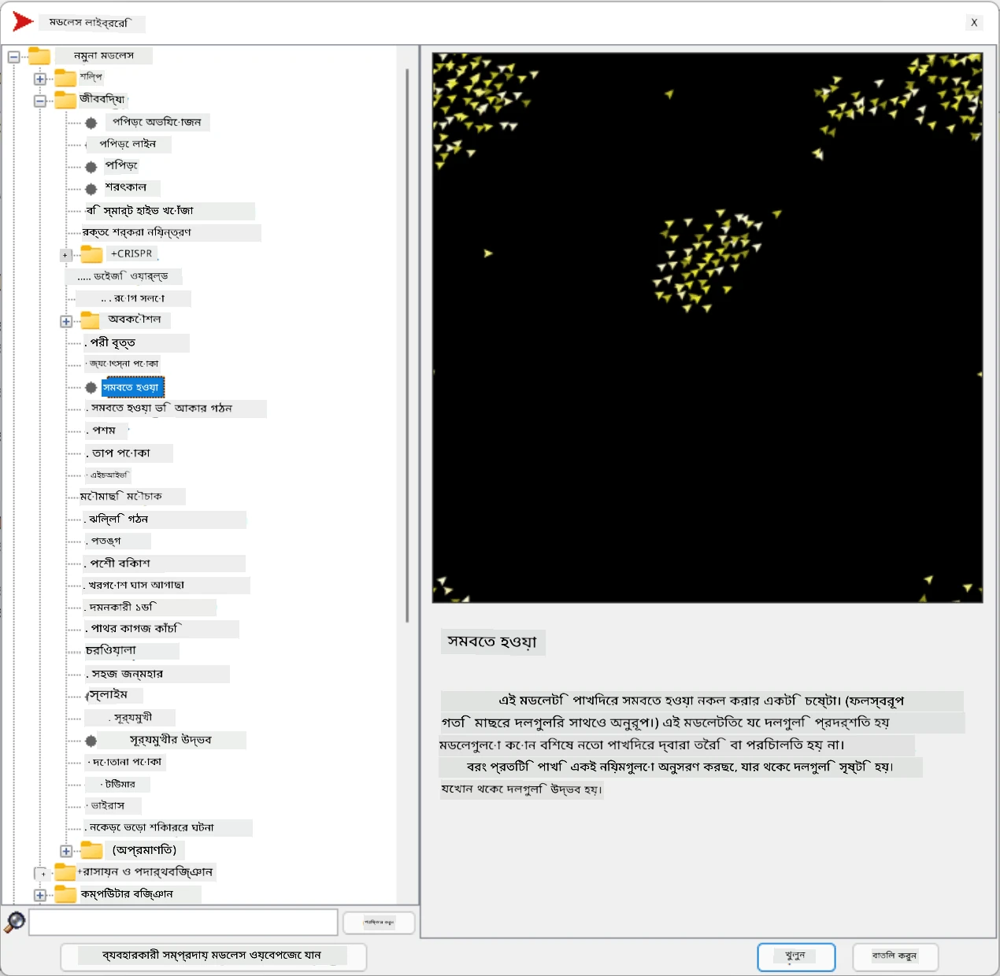
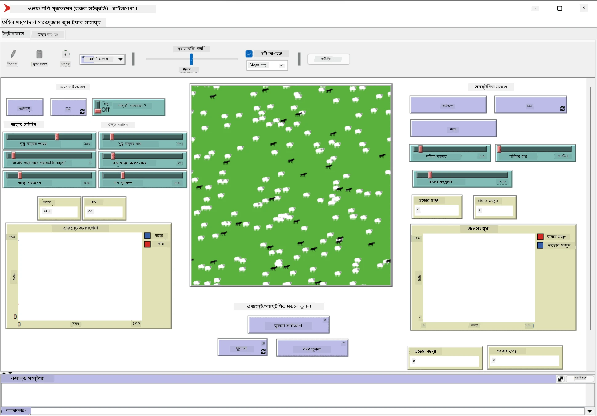

# মাল্টি-এজেন্ট সিস্টেম

বুদ্ধিমত্তা অর্জনের একটি সম্ভাব্য উপায় হলো **উদ্ভূত** (বা **সমন্বিত**) পদ্ধতি, যা এই ধারণার উপর ভিত্তি করে যে অনেক তুলনামূলকভাবে সহজ এজেন্টের সম্মিলিত আচরণ পুরো সিস্টেমের আরও জটিল (বা বুদ্ধিমান) আচরণ তৈরি করতে পারে। তাত্ত্বিকভাবে, এটি [Collective Intelligence](https://en.wikipedia.org/wiki/Collective_intelligence), [Emergentism](https://en.wikipedia.org/wiki/Global_brain) এবং [Evolutionary Cybernetics](https://en.wikipedia.org/wiki/Global_brain) এর নীতির উপর ভিত্তি করে, যা বলে যে উচ্চ-স্তরের সিস্টেমগুলি নিম্ন-স্তরের সিস্টেমগুলি সঠিকভাবে একত্রিত হলে কিছু অতিরিক্ত মান অর্জন করে (*মেটাসিস্টেম ট্রানজিশনের নীতি* নামে পরিচিত)।

## [পূর্ব-লেকচার কুইজ](https://ff-quizzes.netlify.app/en/ai/quiz/45)

**মাল্টি-এজেন্ট সিস্টেম** এর ধারণা ১৯৯০-এর দশকে ইন্টারনেট এবং বিতরণকৃত সিস্টেমের বৃদ্ধির প্রতিক্রিয়া হিসেবে AI-তে উদ্ভূত হয়। ক্লাসিক্যাল AI-এর একটি বিখ্যাত পাঠ্যপুস্তক, [Artificial Intelligence: A Modern Approach](https://en.wikipedia.org/wiki/Artificial_Intelligence:_A_Modern_Approach), মাল্টি-এজেন্ট সিস্টেমের দৃষ্টিকোণ থেকে ক্লাসিক্যাল AI-এর উপর আলোকপাত করে।

মাল্টি-এজেন্ট পদ্ধতির কেন্দ্রে রয়েছে **Agent** এর ধারণা - একটি সত্তা যা কিছু **পরিবেশে** বাস করে, যা এটি উপলব্ধি করতে এবং এর উপর কাজ করতে পারে। এটি একটি খুব বিস্তৃত সংজ্ঞা, এবং এজেন্টের অনেক ভিন্ন ধরণ এবং শ্রেণিবিন্যাস হতে পারে:

* তাদের যুক্তি করার ক্ষমতা অনুযায়ী:
   - **Reactive** এজেন্ট সাধারণত সহজ অনুরোধ-প্রতিক্রিয়া ধরনের আচরণ করে
   - **Deliberative** এজেন্ট কিছু ধরণের যৌক্তিক যুক্তি এবং/অথবা পরিকল্পনা করার ক্ষমতা ব্যবহার করে
* এজেন্টের কোড যেখানে কার্যকর হয় তার ভিত্তিতে:
   - **Static** এজেন্ট একটি নির্দিষ্ট নেটওয়ার্ক নোডে কাজ করে
   - **Mobile** এজেন্ট নেটওয়ার্ক নোডগুলির মধ্যে তাদের কোড স্থানান্তর করতে পারে
* তাদের আচরণ অনুযায়ী:
   - **Passive agents** এর নির্দিষ্ট কোনো লক্ষ্য নেই। এই ধরনের এজেন্ট বাহ্যিক উদ্দীপনার প্রতি প্রতিক্রিয়া জানাতে পারে, কিন্তু নিজের থেকে কোনো পদক্ষেপ শুরু করবে না।
   - **Active agents** কিছু লক্ষ্য অর্জনের চেষ্টা করে
   - **Cognitive agents** জটিল পরিকল্পনা এবং যুক্তি ব্যবহার করে

বর্তমানে মাল্টি-এজেন্ট সিস্টেম বিভিন্ন ক্ষেত্রে ব্যবহৃত হচ্ছে:

* গেমে, অনেক নন-প্লেয়ার চরিত্র কিছু ধরণের AI ব্যবহার করে এবং তাদের বুদ্ধিমান এজেন্ট হিসেবে বিবেচনা করা যেতে পারে
* ভিডিও প্রোডাকশনে, ভিড়যুক্ত জটিল ৩ডি দৃশ্য রেন্ডারিং সাধারণত মাল্টি-এজেন্ট সিমুলেশন ব্যবহার করে করা হয়
* সিস্টেম মডেলিংয়ে, মাল্টি-এজেন্ট পদ্ধতি একটি জটিল মডেলের আচরণ সিমুলেট করতে ব্যবহৃত হয়। উদাহরণস্বরূপ, মাল্টি-এজেন্ট পদ্ধতি সফলভাবে COVID-19 রোগের বিশ্বব্যাপী বিস্তার পূর্বাভাস দিতে ব্যবহৃত হয়েছে। অনুরূপ পদ্ধতি শহরের ট্রাফিক মডেল করতে এবং ট্রাফিক নিয়মের পরিবর্তনের প্রতিক্রিয়া দেখতে ব্যবহার করা যেতে পারে।
* জটিল অটোমেশন সিস্টেমে, প্রতিটি ডিভাইস একটি স্বাধীন এজেন্ট হিসাবে কাজ করতে পারে, যা পুরো সিস্টেমকে কম মনোলিথিক এবং আরও শক্তিশালী করে তোলে।

আমরা মাল্টি-এজেন্ট সিস্টেমের গভীরে যাওয়ার জন্য অনেক সময় ব্যয় করব না, তবে **মাল্টি-এজেন্ট মডেলিং** এর একটি উদাহরণ বিবেচনা করব।

## NetLogo

[NetLogo](https://ccl.northwestern.edu/netlogo/) একটি মাল্টি-এজেন্ট মডেলিং পরিবেশ যা [Logo](https://en.wikipedia.org/wiki/Logo_(programming_language)) প্রোগ্রামিং ভাষার একটি পরিবর্তিত সংস্করণের উপর ভিত্তি করে তৈরি। এই ভাষাটি শিশুদের প্রোগ্রামিং ধারণা শেখানোর জন্য তৈরি করা হয়েছিল এবং এটি আপনাকে **turtle** নামক একটি এজেন্ট নিয়ন্ত্রণ করতে দেয়, যা চলতে পারে এবং পিছনে একটি চিহ্ন রেখে যেতে পারে। এটি জটিল জ্যামিতিক চিত্র তৈরি করতে দেয়, যা একটি এজেন্টের আচরণ বোঝার জন্য একটি খুব দৃশ্যমান উপায়।

NetLogo-তে, আমরা `create-turtles` কমান্ড ব্যবহার করে অনেক টার্টল তৈরি করতে পারি। তারপর আমরা সমস্ত টার্টলকে কিছু কাজ করতে নির্দেশ দিতে পারি (নিচের উদাহরণে - ১০ পয়েন্ট সামনে এগিয়ে যেতে):

```
create-turtles 10
ask turtles [
  forward 10
]
```

অবশ্যই, যখন সমস্ত টার্টল একই কাজ করে তখন এটি আকর্ষণীয় নয়, তাই আমরা নির্দিষ্ট টার্টলদের `ask` করতে পারি, যেমন একটি নির্দিষ্ট পয়েন্টের আশেপাশে থাকা টার্টলদের। আমরা `breed [cats cat]` কমান্ড ব্যবহার করে বিভিন্ন *breed* এর টার্টলও তৈরি করতে পারি। এখানে `cat` একটি breed এর নাম, এবং আমাদের একবচন এবং বহুবচন উভয় শব্দ নির্দিষ্ট করতে হবে, কারণ বিভিন্ন কমান্ড স্পষ্টতার জন্য বিভিন্ন রূপ ব্যবহার করে।

> ✅ আমরা NetLogo ভাষা শেখার দিকে মনোযোগ দেব না - আপনি যদি আরও জানতে আগ্রহী হন তবে [Beginner's Interactive NetLogo Dictionary](https://ccl.northwestern.edu/netlogo/bind/) রিসোর্সটি দেখতে পারেন।

আপনি NetLogo [ডাউনলোড](https://ccl.northwestern.edu/netlogo/download.shtml) করে ইনস্টল করতে পারেন এবং এটি চেষ্টা করতে পারেন।

### মডেল লাইব্রেরি

NetLogo-এর একটি চমৎকার দিক হলো এটি একটি কার্যকরী মডেলের লাইব্রেরি ধারণ করে যা আপনি চেষ্টা করতে পারেন। **File &rightarrow; Models Library** এ যান, এবং আপনার কাছে অনেক ক্যাটাগরির মডেল বেছে নেওয়ার সুযোগ থাকবে।



> দিমিত্রি সশনিকভের মডেল লাইব্রেরির স্ক্রিনশট

আপনি একটি মডেল খুলতে পারেন, উদাহরণস্বরূপ **Biology &rightarrow; Flocking**।

### প্রধান নীতিমালা

মডেলটি খোলার পরে, আপনি NetLogo-এর প্রধান স্ক্রিনে নিয়ে যাওয়া হবে। এখানে একটি নমুনা মডেল রয়েছে যা সীমিত সম্পদ (ঘাস) দেওয়া হলে নেকড়ে এবং ভেড়ার জনসংখ্যা বর্ণনা করে।



> দিমিত্রি সশনিকভের স্ক্রিনশট

এই স্ক্রিনে আপনি দেখতে পাবেন:

* **ইন্টারফেস** বিভাগ, যা ধারণ করে:
  - প্রধান ক্ষেত্র, যেখানে সমস্ত এজেন্ট বাস করে
  - বিভিন্ন নিয়ন্ত্রণ: বোতাম, স্লাইডার ইত্যাদি
  - গ্রাফ, যা আপনি সিমুলেশনের প্যারামিটার প্রদর্শনের জন্য ব্যবহার করতে পারেন
* **কোড** ট্যাব, যা সম্পাদক ধারণ করে, যেখানে আপনি NetLogo প্রোগ্রাম টাইপ করতে পারেন

বেশিরভাগ ক্ষেত্রে, ইন্টারফেসে একটি **Setup** বোতাম থাকবে, যা সিমুলেশনের অবস্থা আরম্ভ করে, এবং একটি **Go** বোতাম থাকবে যা কার্যকর শুরু করে। এগুলি কোডে সংশ্লিষ্ট হ্যান্ডলার দ্বারা পরিচালিত হয় যা এইরকম দেখায়:

```
to go [
...
]
```

NetLogo-এর বিশ্ব নিম্নলিখিত বস্তুগুলি নিয়ে গঠিত:

* **Agents** (turtles) যারা ক্ষেত্রের উপর চলতে পারে এবং কিছু করতে পারে। আপনি `ask turtles [...]` সিনট্যাক্স ব্যবহার করে এজেন্টদের নির্দেশ দিতে পারেন, এবং বন্ধনীর মধ্যে কোডটি *turtle mode* এ সমস্ত এজেন্ট দ্বারা কার্যকর করা হয়।
* **Patches** হলো ক্ষেত্রের বর্গাকার এলাকা, যেখানে এজেন্টরা বাস করে। আপনি একই প্যাচে থাকা সমস্ত এজেন্টকে উল্লেখ করতে পারেন, অথবা আপনি প্যাচের রঙ এবং অন্যান্য কিছু বৈশিষ্ট্য পরিবর্তন করতে পারেন। আপনি `ask patches` ব্যবহার করে প্যাচগুলিকে কিছু করতে বলতে পারেন।
* **Observer** হলো একটি অনন্য এজেন্ট যা বিশ্বকে নিয়ন্ত্রণ করে। সমস্ত বোতাম হ্যান্ডলার *observer mode* এ কার্যকর করা হয়।

> ✅ মাল্টি-এজেন্ট পরিবেশের সৌন্দর্য হলো যে কোডটি *turtle mode* বা *patch mode* এ চলে তা সমস্ত এজেন্ট দ্বারা একসাথে সমান্তরালভাবে কার্যকর করা হয়। ফলে, সামান্য কোড লিখে এবং পৃথক এজেন্টের আচরণ প্রোগ্রাম করে, আপনি পুরো সিমুলেশন সিস্টেমের জটিল আচরণ তৈরি করতে পারেন।

### Flocking

মাল্টি-এজেন্ট আচরণের একটি উদাহরণ হিসেবে, আসুন **[Flocking](https://en.wikipedia.org/wiki/Flocking_(behavior))** বিবেচনা করি। Flocking একটি জটিল প্যাটার্ন যা পাখির ঝাঁকের উড়ার মতো। তাদের উড়তে দেখে আপনি ভাবতে পারেন যে তারা কোনো ধরনের সম্মিলিত অ্যালগরিদম অনুসরণ করছে, অথবা তাদের কিছু *সমষ্টিগত বুদ্ধিমত্তা* রয়েছে। তবে, এই জটিল আচরণ তখনই উদ্ভূত হয় যখন প্রতিটি পৃথক এজেন্ট (এই ক্ষেত্রে, একটি *পাখি*) শুধুমাত্র তার কাছাকাছি কিছু এজেন্টকে পর্যবেক্ষণ করে এবং তিনটি সহজ নিয়ম অনুসরণ করে:

* **Alignment** - এটি প্রতিবেশী এজেন্টদের গড় গতিপথের দিকে চালিত হয়
* **Cohesion** - এটি প্রতিবেশীদের গড় অবস্থানের দিকে চালিত হয় (*দীর্ঘ পরিসরের আকর্ষণ*)
* **Separation** - যখন অন্য পাখিদের খুব কাছাকাছি আসে, এটি দূরে সরে যাওয়ার চেষ্টা করে (*সংক্ষিপ্ত পরিসরের প্রতিক্রিয়া*)

আপনি Flocking উদাহরণটি চালাতে পারেন এবং আচরণটি পর্যবেক্ষণ করতে পারেন। আপনি *separation* এর ডিগ্রি বা *viewing range* এর মতো প্যারামিটারও সামঞ্জস্য করতে পারেন, যা সংজ্ঞায়িত করে যে প্রতিটি পাখি কত দূর পর্যন্ত দেখতে পারে। লক্ষ্য করুন যে আপনি যদি viewing range 0-তে কমিয়ে দেন, সমস্ত পাখি অন্ধ হয়ে যায় এবং Flocking বন্ধ হয়ে যায়। যদি separation 0-তে কমিয়ে দেন, সমস্ত পাখি একটি সরল রেখায় একত্রিত হয়।

> ✅ **Code** ট্যাবে যান এবং দেখুন Flocking এর তিনটি নিয়ম (alignment, cohesion এবং separation) কোডে কোথায় বাস্তবায়িত হয়েছে। লক্ষ্য করুন যে আমরা শুধুমাত্র সেই এজেন্টদের উল্লেখ করি যারা দৃষ্টিসীমার মধ্যে রয়েছে।

### দেখার জন্য অন্যান্য মডেল

আরও কিছু আকর্ষণীয় মডেল রয়েছে যা আপনি পরীক্ষা করতে পারেন:

* **Art &rightarrow; Fireworks** দেখায় কিভাবে একটি আতশবাজি পৃথক আগুনের প্রবাহের সম্মিলিত আচরণ হিসেবে বিবেচিত হতে পারে
* **Social Science &rightarrow; Traffic Basic** এবং **Social Science &rightarrow; Traffic Grid** শহরের ট্রাফিকের মডেল দেখায় ১ডি এবং ২ডি গ্রিডে ট্রাফিক লাইট সহ বা ছাড়া। সিমুলেশনে প্রতিটি গাড়ি নিম্নলিখিত নিয়ম অনুসরণ করে:
   - যদি সামনে জায়গা খালি থাকে - গতি বাড়ান (একটি নির্দিষ্ট সর্বোচ্চ গতির পর্যন্ত)
   - যদি সামনে বাধা দেখতে পায় - ব্রেক করুন (এবং আপনি সামঞ্জস্য করতে পারেন যে একজন চালক কত দূর পর্যন্ত দেখতে পারে)
* **Social Science &rightarrow; Party** দেখায় কিভাবে একটি ককটেল পার্টিতে মানুষ একত্রিত হয়। আপনি এমন প্যারামিটারগুলির সংমিশ্রণ খুঁজে পেতে পারেন যা দলের সুখ দ্রুত বৃদ্ধি করে।

এই উদাহরণগুলি থেকে আপনি দেখতে পারেন, মাল্টি-এজেন্ট সিমুলেশন একটি জটিল সিস্টেমের আচরণ বোঝার জন্য একটি খুব কার্যকর উপায় হতে পারে, যা একই বা অনুরূপ যুক্তি অনুসরণ করে। এটি ভার্চুয়াল এজেন্ট নিয়ন্ত্রণ করতেও ব্যবহার করা যেতে পারে, যেমন [NPCs](https://en.wikipedia.org/wiki/NPC) কম্পিউটার গেমে বা ৩ডি অ্যানিমেটেড জগতে এজেন্ট।

## Deliberative Agents

উপরের এজেন্টগুলি খুবই সহজ, পরিবেশের পরিবর্তনের প্রতি প্রতিক্রিয়া জানায় কিছু ধরণের অ্যালগরিদম ব্যবহার করে। এদের **reactive agents** বলা হয়। তবে, কখনও কখনও এজেন্টরা যুক্তি করতে এবং তাদের পদক্ষেপ পরিকল্পনা করতে পারে, সেক্ষেত্রে তাদের **deliberative** বলা হয়।

একটি সাধারণ উদাহরণ হতে পারে একটি ব্যক্তিগত এজেন্ট যা একজন মানুষের কাছ থেকে একটি নির্দেশনা পায় একটি ছুটির ট্যুর বুক করার জন্য। ধরুন ইন্টারনেটে অনেক এজেন্ট রয়েছে যারা এটি করতে সাহায্য করতে পারে। এটি তখন অন্যান্য এজেন্টদের সাথে যোগাযোগ করবে দেখতে যে কোন ফ্লাইট উপলব্ধ, বিভিন্ন তারিখের জন্য হোটেলের দাম কী, এবং সেরা মূল্য নিয়ে আলোচনা করার চেষ্টা করবে। যখন ছুটির পরিকল্পনা সম্পূর্ণ এবং মালিক দ্বারা নিশ্চিত হয়, এটি বুকিংয়ের সাথে এগিয়ে যেতে পারে।

এটি করতে এজেন্টদের **যোগাযোগ** করতে হবে। সফল যোগাযোগের জন্য তাদের প্রয়োজন:

* **জ্ঞান বিনিময়ের জন্য কিছু মানক ভাষা**, যেমন [Knowledge Interchange Format](https://en.wikipedia.org/wiki/Knowledge_Interchange_Format) (KIF) এবং [Knowledge Query and Manipulation Language](https://en.wikipedia.org/wiki/Knowledge_Query_and_Manipulation_Language) (KQML)। এই ভাষাগুলি [Speech Act theory](https://en.wikipedia.org/wiki/Speech_act) এর উপর ভিত্তি করে ডিজাইন করা হয়েছে।
* এই ভাষাগুলিতে **আলোচনার জন্য কিছু প্রোটোকল** অন্তর্ভুক্ত করা উচিত, বিভিন্ন **নিলামের ধরণের** উপর ভিত্তি করে।
* একটি **সাধারণ ontology** ব্যবহার করতে হবে, যাতে তারা একই ধারণাগুলিকে উল্লেখ করতে পারে এবং তাদের অর্থ বুঝতে পারে
* **আবিষ্কার করার একটি উপায়** থাকা উচিত যে বিভিন্ন এজেন্ট কী করতে পারে, যা কিছু ধরণের ontology এর উপর ভিত্তি করে

Deliberative এজেন্টরা reactive এজেন্টদের তুলনায় অনেক বেশি জটিল, কারণ তারা শুধুমাত্র পরিবেশের পরিবর্তনের প্রতি প্রতিক্রিয়া জানায় না, তারা পদক্ষেপ শুরু করতেও সক্ষম হতে হবে। Deliberative এজেন্টদের জন্য প্রস্তাবিত আর্কিটেকচারগুলির মধ্যে একটি হলো Belief-Desire-Intention (BDI) এজেন্ট:

* **Beliefs** একটি এজেন্টের পরিবেশ সম্পর্কে জ্ঞানের সেট গঠন করে। এটি একটি জ্ঞানভাণ্ডার বা নিয়মের সেট হিসাবে গঠন করা যেতে পারে যা একটি এজেন্ট পরিবেশে একটি নির্দিষ্ট পরিস্থিতিতে প্রয়োগ করতে পারে।
* **Desires** একটি এজেন্ট কী করতে চায় তা সংজ্ঞায়িত করে, অর্থাৎ তার লক্ষ্য। উদাহরণস্বরূপ, উপরের ব্যক্তিগত সহকারী এজেন্টের লক্ষ্য হলো একটি ট্যুর বুক করা, এবং একটি হোটেল এজেন্টের লক্ষ্য হলো লাভ সর্বাধিক করা।
* **Intentions** হলো নির্দিষ্ট পদক্ষেপ যা একটি এজেন্ট তার লক্ষ্য অর্জনের জন্য পরিকল্পনা করে। পদক্ষেপগুলি সাধারণত পরিবেশ পরিবর্তন করে এবং অন্যান্য এজেন্টদের সাথে যোগাযোগ সৃষ্টি করে।

মাল্টি-এজেন্ট সিস্টেম তৈরির জন্য কিছু প্ল্যাটফর্ম উপলব্ধ রয়েছে, যেমন [JADE](https://jade.tilab.com/)। [এই গবেষণাপত্র](https://arxiv.org/ftp/arxiv/papers/2007/2007.08961.pdf) মাল্টি-এজেন্ট প্ল্যাটফর্মগুলির একটি পর্যালোচনা ধারণ করে, মাল্টি-এজেন্ট সিস্টেমের সংক্ষিপ্ত ইতিহাস এবং তাদের বিভিন্ন ব্যবহারিক দৃশ্যপট সহ।

## উপসংহার

মাল্টি-এজেন্ট সিস্টেম বিভিন্ন রূপ নিতে পারে এবং অনেক ভিন্ন অ্যাপ্লিকেশনে ব্যবহার করা যেতে পারে। 
এগুলি সাধারণত একটি পৃথক এজেন্টের সহজ আচরণের উপর মনোযোগ কেন্দ্রীভূত করে এবং **সমন্বিত প্রভাব** এর কারণে পুরো সিস্টেমের আরও জটিল আচরণ অর্জন করে।

## 🚀 চ্যালেঞ্জ

এই পাঠটি বাস্তব জগতে নিয়ে যান এবং একটি সমস্যা সমাধানের জন্য একটি মাল্টি-এজেন্ট সিস্টেম ধারণা করার চেষ্টা করুন। উদাহরণস্বরূপ, একটি মাল্টি-এজেন্ট সিস্টেম একটি স্কুল বাসের রুট অপ্টিমাইজ করতে কী করতে পারে? এটি একটি বেকারিতে কীভাবে কাজ করতে পারে?

## [পোস্ট-লেকচার কুইজ](https://ff-quizzes.netlify.app/en/ai/quiz/46)

## পর্যালোচনা এবং স্ব-অধ্যয়ন

শিল্পে এই ধরনের সিস্টেমের ব্যবহার পর্যালোচনা করুন। একটি ডোমেইন যেমন উৎপাদন বা ভিডিও গেম শিল্প বেছে নিন এবং আবিষ্কার করুন কীভাবে মাল্টি-এজেন্ট সিস্টেম অনন্য সমস্যাগুলি সমাধান করতে ব্যবহার করা যেতে পারে।

## [NetLogo অ্যাসাইনমেন্ট](assignment.md)

---

