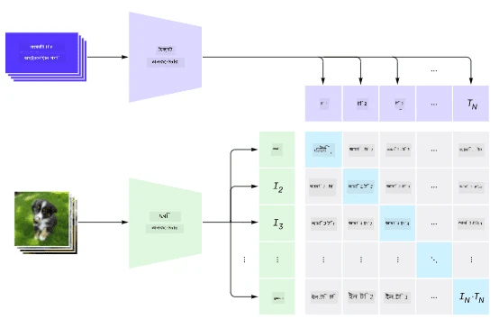
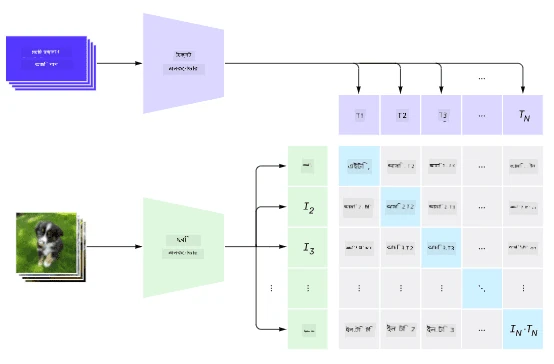
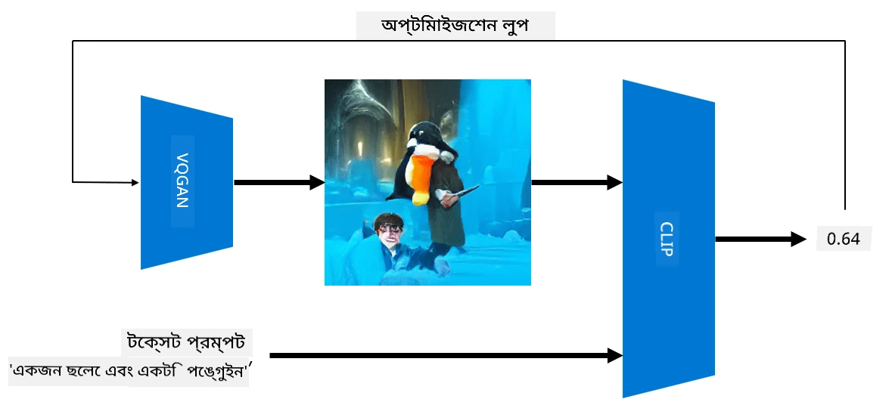

# মাল্টি-মোডাল নেটওয়ার্ক

ট্রান্সফর্মার মডেলগুলো NLP কাজের ক্ষেত্রে সফল হওয়ার পর, একই বা অনুরূপ আর্কিটেকচার কম্পিউটার ভিশন কাজের জন্য প্রয়োগ করা হয়েছে। ভিশন এবং প্রাকৃতিক ভাষার ক্ষমতা *একত্রিত* করার জন্য মডেল তৈরি করার প্রতি আগ্রহ বাড়ছে। এরকম একটি প্রচেষ্টা OpenAI দ্বারা করা হয়েছে, যার নাম CLIP এবং DALL.E।

## কনট্রাস্টিভ ইমেজ প্রি-ট্রেনিং (CLIP)

CLIP-এর মূল ধারণা হলো টেক্সট প্রম্পটের সাথে একটি ইমেজ তুলনা করা এবং নির্ধারণ করা যে ইমেজটি প্রম্পটের সাথে কতটা সঙ্গতিপূর্ণ।

> *ছবি [এই ব্লগ পোস্ট](https://openai.com/blog/clip/) থেকে নেওয়া হয়েছে*

মডেলটি ইন্টারনেট থেকে প্রাপ্ত ইমেজ এবং তাদের ক্যাপশন দিয়ে প্রশিক্ষিত হয়। প্রতিটি ব্যাচে, আমরা N জোড়া (ইমেজ, টেক্সট) নিই এবং সেগুলোকে কিছু ভেক্টর রিপ্রেজেন্টেশনে রূপান্তর করি।

সেই রিপ্রেজেন্টেশনগুলো একসাথে মিলানো হয়। লস ফাংশনটি এমনভাবে সংজ্ঞায়িত করা হয়েছে যাতে একটি জোড়ার (যেমন I এবং T) ভেক্টরের মধ্যে কসমাইন সাদৃশ্য সর্বাধিক হয় এবং অন্য সব জোড়ার মধ্যে কসমাইন সাদৃশ্য সর্বনিম্ন হয়। এই কারণেই এই পদ্ধতিকে **কনট্রাস্টিভ** বলা হয়।

CLIP মডেল/লাইব্রেরি [OpenAI GitHub](https://github.com/openai/CLIP) থেকে পাওয়া যায়। এই পদ্ধতি [এই ব্লগ পোস্ট](https://openai.com/blog/clip/) এবং আরও বিস্তারিতভাবে [এই পেপার](https://arxiv.org/pdf/2103.00020.pdf)-এ বর্ণিত হয়েছে।

একবার এই মডেলটি প্রি-ট্রেনিং সম্পন্ন হলে, আমরা এটিকে একটি ব্যাচ ইমেজ এবং একটি ব্যাচ টেক্সট প্রম্পট দিতে পারি, এবং এটি আমাদের একটি টেনসর প্রদান করবে যার মধ্যে সম্ভাবনার মান থাকবে। CLIP বিভিন্ন কাজের জন্য ব্যবহার করা যেতে পারে:

**ইমেজ ক্লাসিফিকেশন**

ধরা যাক আমাদের ইমেজগুলোকে বিড়াল, কুকুর এবং মানুষের মধ্যে শ্রেণীবদ্ধ করতে হবে। এই ক্ষেত্রে, আমরা মডেলটিকে একটি ইমেজ এবং একটি সিরিজ টেক্সট প্রম্পট দিতে পারি: "*একটি বিড়ালের ছবি*", "*একটি কুকুরের ছবি*", "*একটি মানুষের ছবি*"। ফলাফল হিসেবে প্রাপ্ত ৩টি সম্ভাবনার ভেক্টরে আমরা সর্বোচ্চ মানের ইনডেক্সটি নির্বাচন করব।

> *ছবি [এই ব্লগ পোস্ট](https://openai.com/blog/clip/) থেকে নেওয়া হয়েছে*

**টেক্সট-ভিত্তিক ইমেজ অনুসন্ধান**

আমরা বিপরীত কাজও করতে পারি। যদি আমাদের কাছে একটি ইমেজের সংগ্রহ থাকে, আমরা এই সংগ্রহটি মডেলে দিতে পারি এবং একটি টেক্সট প্রম্পট দিতে পারি - এটি আমাদের সেই ইমেজটি প্রদান করবে যা প্রম্পটের সাথে সবচেয়ে বেশি সঙ্গতিপূর্ণ।

## ✍️ উদাহরণ: [ইমেজ ক্লাসিফিকেশন এবং ইমেজ অনুসন্ধানের জন্য CLIP ব্যবহার](../../../../../lessons/X-Extras/X1-MultiModal/Clip.ipynb)

CLIP-এর কার্যকারিতা দেখতে [Clip.ipynb](../../../../../lessons/X-Extras/X1-MultiModal/Clip.ipynb) নোটবুকটি খুলুন।

## VQGAN+CLIP দিয়ে ইমেজ তৈরি

CLIP টেক্সট প্রম্পট থেকে **ইমেজ তৈরি** করার জন্যও ব্যবহার করা যেতে পারে। এটি করতে হলে আমাদের একটি **জেনারেটর মডেল** প্রয়োজন যা কিছু ভেক্টর ইনপুটের ভিত্তিতে ইমেজ তৈরি করতে সক্ষম। এরকম একটি মডেল হলো [VQGAN](https://compvis.github.io/taming-transformers/) (ভেক্টর-কোয়ান্টাইজড GAN)।

VQGAN-এর প্রধান ধারণাগুলো যা সাধারণ [GAN](../../4-ComputerVision/10-GANs/README.md) থেকে আলাদা:
* অটো-রিগ্রেসিভ ট্রান্সফর্মার আর্কিটেকচার ব্যবহার করে একটি সিকোয়েন্স তৈরি করা যা প্রসঙ্গ-সমৃদ্ধ ভিজ্যুয়াল অংশ তৈরি করে যা ইমেজ গঠন করে। এই ভিজ্যুয়াল অংশগুলো [CNN](../../4-ComputerVision/07-ConvNets/README.md) দ্বারা শেখা হয়।
* সাব-ইমেজ ডিসক্রিমিনেটর ব্যবহার করে ইমেজের অংশগুলো "বাস্তব" বা "নকল" কিনা তা সনাক্ত করা (সাধারণ GAN-এর "সব-বা-কিছুই নয়" পদ্ধতির বিপরীতে)।

VQGAN সম্পর্কে আরও জানতে [Taming Transformers](https://compvis.github.io/taming-transformers/) ওয়েবসাইট দেখুন।

VQGAN এবং সাধারণ GAN-এর মধ্যে একটি গুরুত্বপূর্ণ পার্থক্য হলো, সাধারণ GAN যেকোনো ইনপুট ভেক্টর থেকে একটি ভালো ইমেজ তৈরি করতে পারে, কিন্তু VQGAN সম্ভবত একটি অসঙ্গতিপূর্ণ ইমেজ তৈরি করবে। তাই, ইমেজ তৈরির প্রক্রিয়াকে আরও নির্দেশনা দিতে হবে, এবং এটি CLIP ব্যবহার করে করা যেতে পারে।

টেক্সট প্রম্পটের সাথে সঙ্গতিপূর্ণ একটি ইমেজ তৈরি করতে, আমরা কিছু র্যান্ডম এনকোডিং ভেক্টর দিয়ে শুরু করি যা VQGAN-এর মাধ্যমে একটি ইমেজ তৈরি করে। তারপর CLIP ব্যবহার করে একটি লস ফাংশন তৈরি করা হয় যা দেখায় ইমেজটি টেক্সট প্রম্পটের সাথে কতটা সঙ্গতিপূর্ণ। এরপর লক্ষ্য হলো এই লসকে কমানো, ব্যাক প্রোপাগেশন ব্যবহার করে ইনপুট ভেক্টর প্যারামিটারগুলো সামঞ্জস্য করা।

VQGAN+CLIP বাস্তবায়নের জন্য একটি চমৎকার লাইব্রেরি হলো [Pixray](http://github.com/pixray/pixray)

 |   | 
----|----|----
প্রম্পট থেকে তৈরি ছবি *একটি বই সহ তরুণ পুরুষ সাহিত্য শিক্ষকের একটি ক্লোজআপ জলরঙের প্রতিকৃতি* | প্রম্পট থেকে তৈরি ছবি *একটি কম্পিউটার সহ তরুণ নারী কম্পিউটার বিজ্ঞান শিক্ষকের একটি ক্লোজআপ তেল প্রতিকৃতি* | প্রম্পট থেকে তৈরি ছবি *একটি ব্ল্যাকবোর্ডের সামনে বৃদ্ধ পুরুষ গণিত শিক্ষকের একটি ক্লোজআপ তেল প্রতিকৃতি*

> **Artificial Teachers** সংগ্রহ থেকে ছবি, [Dmitry Soshnikov](http://soshnikov.com) দ্বারা

## DALL-E
### [DALL-E 1](https://openai.com/research/dall-e)
DALL-E হলো GPT-3-এর একটি সংস্করণ যা প্রম্পট থেকে ইমেজ তৈরি করতে প্রশিক্ষিত। এটি ১২-বিলিয়ন প্যারামিটার দিয়ে প্রশিক্ষিত হয়েছে।

CLIP-এর বিপরীতে, DALL-E টেক্সট এবং ইমেজ উভয়কেই একটি একক টোকেন স্ট্রিম হিসেবে গ্রহণ করে। তাই, একাধিক প্রম্পট থেকে টেক্সটের ভিত্তিতে ইমেজ তৈরি করা যায়।

### [DALL-E 2](https://openai.com/dall-e-2)
DALL-E 1 এবং 2-এর প্রধান পার্থক্য হলো, এটি আরও বাস্তবসম্মত ইমেজ এবং শিল্পকর্ম তৈরি করে।

DALL-E দিয়ে তৈরি ইমেজের উদাহরণ:
 |   | 
----|----|----
প্রম্পট থেকে তৈরি ছবি *একটি বই সহ তরুণ পুরুষ সাহিত্য শিক্ষকের একটি ক্লোজআপ জলরঙের প্রতিকৃতি* | প্রম্পট থেকে তৈরি ছবি *একটি কম্পিউটার সহ তরুণ নারী কম্পিউটার বিজ্ঞান শিক্ষকের একটি ক্লোজআপ তেল প্রতিকৃতি* | প্রম্পট থেকে তৈরি ছবি *একটি ব্ল্যাকবোর্ডের সামনে বৃদ্ধ পুরুষ গণিত শিক্ষকের একটি ক্লোজআপ তেল প্রতিকৃতি*

## রেফারেন্স

* VQGAN পেপার: [Taming Transformers for High-Resolution Image Synthesis](https://compvis.github.io/taming-transformers/paper/paper.pdf)
* CLIP পেপার: [Learning Transferable Visual Models From Natural Language Supervision](https://arxiv.org/pdf/2103.00020.pdf)

**অস্বীকৃতি**:  
এই নথিটি AI অনুবাদ পরিষেবা [Co-op Translator](https://github.com/Azure/co-op-translator) ব্যবহার করে অনুবাদ করা হয়েছে। আমরা যথাসাধ্য সঠিকতা নিশ্চিত করার চেষ্টা করি, তবে অনুগ্রহ করে মনে রাখবেন যে স্বয়ংক্রিয় অনুবাদে ত্রুটি বা অসঙ্গতি থাকতে পারে। মূল ভাষায় থাকা নথিটিকে প্রামাণিক উৎস হিসেবে বিবেচনা করা উচিত। গুরুত্বপূর্ণ তথ্যের জন্য, পেশাদার মানব অনুবাদ সুপারিশ করা হয়। এই অনুবাদ ব্যবহারের ফলে কোনো ভুল বোঝাবুঝি বা ভুল ব্যাখ্যা হলে আমরা দায়ী থাকব না।