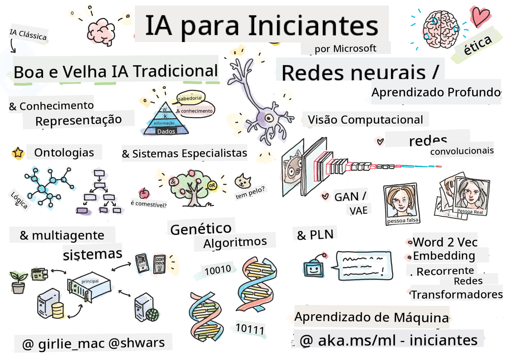

<!--
CO_OP_TRANSLATOR_METADATA:
{
  "original_hash": "0dc6311637b811abb415a936669d7e76",
  "translation_date": "2026-01-05T15:16:48+00:00",
  "source_file": "README.md",
  "language_code": "br"
}
-->
[](https://github.com/microsoft/AI-For-Beginners/blob/main/LICENSE)
[](https://GitHub.com/microsoft/AI-For-Beginners/graphs/contributors/)
[](https://GitHub.com/microsoft/AI-For-Beginners/issues/)
[](https://GitHub.com/microsoft/AI-For-Beginners/pulls/)
[](http://makeapullrequest.com)

[](https://GitHub.com/microsoft/AI-For-Beginners/watchers/)
[](https://GitHub.com/microsoft/AI-For-Beginners/network/)
[](https://GitHub.com/microsoft/AI-For-Beginners/stargazers/)
[](https://mybinder.org/v2/gh/microsoft/ai-for-beginners/HEAD)
[](https://gitter.im/Microsoft/ai-for-beginners?utm_source=badge&utm_medium=badge&utm_campaign=pr-badge)

[](https://discord.gg/nTYy5BXMWG)

# Inteligência Artificial para Iniciantes - Um Currículo

||
|:---:|
| AI For Beginners - _Sketchnote por [@girlie_mac](https://twitter.com/girlie_mac)_ |

Explore o mundo da **Inteligência Artificial** (IA) com nosso currículo de 12 semanas e 24 aulas! Inclui aulas práticas, questionários e laboratórios. O currículo é amigável para iniciantes e cobre ferramentas como TensorFlow e PyTorch, além de ética em IA.

### 🌐 Suporte Multilíngue

#### Suportado via GitHub Action (Automatizado e Sempre Atualizado)

<!-- CO-OP TRANSLATOR LANGUAGES TABLE START -->
[Árabe](../ar/README.md) | [Bengali](../bn/README.md) | [Búlgaro](../bg/README.md) | [Birmanês (Myanmar)](../my/README.md) | [Chinês (Simplificado)](../zh/README.md) | [Chinês (Tradicional, Hong Kong)](../hk/README.md) | [Chinês (Tradicional, Macau)](../mo/README.md) | [Chinês (Tradicional, Taiwan)](../tw/README.md) | [Croata](../hr/README.md) | [Tcheco](../cs/README.md) | [Dinamarquês](../da/README.md) | [Holandês](../nl/README.md) | [Estoniano](../et/README.md) | [Finlandês](../fi/README.md) | [Francês](../fr/README.md) | [Alemão](../de/README.md) | [Grego](../el/README.md) | [Hebraico](../he/README.md) | [Hindi](../hi/README.md) | [Húngaro](../hu/README.md) | [Indonésio](../id/README.md) | [Italiano](../it/README.md) | [Japonês](../ja/README.md) | [Kannada](../kn/README.md) | [Coreano](../ko/README.md) | [Lituano](../lt/README.md) | [Malaio](../ms/README.md) | [Malaiala](../ml/README.md) | [Marathi](../mr/README.md) | [Nepali](../ne/README.md) | [Pidgin Nigeriano](../pcm/README.md) | [Norueguês](../no/README.md) | [Persa (Farsi)](../fa/README.md) | [Polonês](../pl/README.md) | [Português (Brasil)](./README.md) | [Português (Portugal)](../pt/README.md) | [Punjabi (Gurmukhi)](../pa/README.md) | [Romeno](../ro/README.md) | [Russo](../ru/README.md) | [Sérvio (Cirílico)](../sr/README.md) | [Eslovaco](../sk/README.md) | [Esloveno](../sl/README.md) | [Espanhol](../es/README.md) | [Suaíli](../sw/README.md) | [Sueco](../sv/README.md) | [Tagalog (Filipino)](../tl/README.md) | [Tamil](../ta/README.md) | [Telugu](../te/README.md) | [Tailandês](../th/README.md) | [Turco](../tr/README.md) | [Ucraniano](../uk/README.md) | [Urdu](../ur/README.md) | [Vietnamita](../vi/README.md)

> **Prefere Clonar Localmente?**

> Este repositório inclui mais de 50 traduções de idiomas, o que aumenta significativamente o tamanho do download. Para clonar sem as traduções, use o sparse checkout:
> ```bash
> git clone --filter=blob:none --sparse https://github.com/microsoft/AI-For-Beginners.git
> cd AI-For-Beginners
> git sparse-checkout set --no-cone '/*' '!translations' '!translated_images'
> ```
> Isso lhe dá tudo que você precisa para completar o curso com um download muito mais rápido.
<!-- CO-OP TRANSLATOR LANGUAGES TABLE END -->

**Se desejar adicionar suporte para mais idiomas de tradução, estão listados [aqui](https://github.com/Azure/co-op-translator/blob/main/getting_started/supported-languages.md)**

## Junte-se à Comunidade
[](https://discord.gg/nTYy5BXMWG)

## O que você vai aprender

**[Mapa Mental do Curso](http://soshnikov.com/courses/ai-for-beginners/mindmap.html)**

Neste currículo, você irá aprender:

* Diferentes abordagens para Inteligência Artificial, incluindo a "boa e velha" abordagem simbólica com **Representação do Conhecimento** e raciocínio ([GOFAI](https://en.wikipedia.org/wiki/Symbolic_artificial_intelligence)).
* **Redes Neurais** e **Aprendizado Profundo**, que estão no centro da IA moderna. Ilustraremos os conceitos por trás desses tópicos importantes usando código em dois dos frameworks mais populares - [TensorFlow](http://Tensorflow.org) e [PyTorch](http://pytorch.org).
* **Arquiteturas Neurais** para trabalhar com imagens e texto. Cobriremos modelos recentes, mas talvez com poucas novidades em relação ao estado da arte.
* Abordagens menos populares de IA, como **Algoritmos Genéticos** e **Sistemas Multiagentes**.

O que não será coberto neste currículo:

> [Encontre todos os recursos adicionais para este curso na nossa coleção Microsoft Learn](https://learn.microsoft.com/en-us/collections/7w28iy2xrqzdj0?WT.mc_id=academic-77998-bethanycheum)

* Casos de negócios do uso de **IA nos Negócios**. Considere fazer o caminho de aprendizado [Introdução à IA para usuários de negócios](https://docs.microsoft.com/learn/paths/introduction-ai-for-business-users/?WT.mc_id=academic-77998-bethanycheum) na Microsoft Learn, ou a [AI Business School](https://www.microsoft.com/ai/ai-business-school/?WT.mc_id=academic-77998-bethanycheum), desenvolvida em cooperação com a [INSEAD](https://www.insead.edu/).
* **Aprendizado de Máquina Clássico**, que está bem descrito no nosso [Currículo de Aprendizado de Máquina para Iniciantes](http://github.com/Microsoft/ML-for-Beginners).
* Aplicações práticas de IA construídas usando **[Cognitive Services](https://azure.microsoft.com/services/cognitive-services/?WT.mc_id=academic-77998-bethanycheum)**. Para isso, recomendamos começar com módulos da Microsoft Learn para [visão](https://docs.microsoft.com/learn/paths/create-computer-vision-solutions-azure-cognitive-services/?WT.mc_id=academic-77998-bethanycheum), [processamento de linguagem natural](https://docs.microsoft.com/learn/paths/explore-natural-language-processing/?WT.mc_id=academic-77998-bethanycheum), **[IA Generativa com Azure OpenAI Service](https://learn.microsoft.com/en-us/training/paths/develop-ai-solutions-azure-openai/?WT.mc_id=academic-77998-bethanycheum)** e outros.
* **Frameworks de Nuvem específicos para ML**, como [Azure Machine Learning](https://azure.microsoft.com/services/machine-learning/?WT.mc_id=academic-77998-bethanycheum), [Microsoft Fabric](https://learn.microsoft.com/en-us/training/paths/get-started-fabric/?WT.mc_id=academic-77998-bethanycheum), ou [Azure Databricks](https://docs.microsoft.com/learn/paths/data-engineer-azure-databricks?WT.mc_id=academic-77998-bethanycheum). Considere usar os caminhos de aprendizado [Construir e operar soluções de aprendizado de máquina com Azure Machine Learning](https://docs.microsoft.com/learn/paths/build-ai-solutions-with-azure-ml-service/?WT.mc_id=academic-77998-bethanycheum) e [Construir e operar soluções de aprendizado de máquina com Azure Databricks](https://docs.microsoft.com/learn/paths/build-operate-machine-learning-solutions-azure-databricks/?WT.mc_id=academic-77998-bethanycheum).
* **IA Conversacional** e **Chat Bots**. Existe um caminho de aprendizado separado [Criar soluções de IA conversacional](https://docs.microsoft.com/learn/paths/create-conversational-ai-solutions/?WT.mc_id=academic-77998-bethanycheum), e você também pode consultar [este post no blog](https://soshnikov.com/azure/hello-bot-conversational-ai-on-microsoft-platform/) para mais detalhes.
* **Matemática Profunda** por trás do aprendizado profundo. Para isso, recomendamos [Deep Learning](https://www.amazon.com/Deep-Learning-Adaptive-Computation-Machine/dp/0262035618) de Ian Goodfellow, Yoshua Bengio e Aaron Courville, que também está disponível online em [https://www.deeplearningbook.org/](https://www.deeplearningbook.org/).

Para uma introdução suave aos tópicos de _IA na Nuvem_, você pode considerar cursar o caminho de aprendizado [Começando com inteligência artificial no Azure](https://docs.microsoft.com/learn/paths/get-started-with-artificial-intelligence-on-azure/?WT.mc_id=academic-77998-bethanycheum).

# Conteúdo

|     |                                                                 Link da Aula                                                              |                                           PyTorch/Keras/TensorFlow                                          | Laboratório                                                      |
| :-: | :------------------------------------------------------------------------------------------------------------------------------------------: | :---------------------------------------------------------------------------------------------: | ------------------------------------------------------------------------------ |
| 0  |                                 [Configuração do Curso](./lessons/0-course-setup/setup.md)                                 |                      [Configure seu Ambiente de Desenvolvimento](./lessons/0-course-setup/how-to-run.md)                       |   |
| I  |               [**Introdução à IA**](./lessons/1-Intro/README.md)      | | |
| 01  |       [Introdução e História da IA](./lessons/1-Intro/README.md)       |           -                            | -  |
| II |              **IA Simbólica**              |
| 02  |       [Representação do Conhecimento e Sistemas Especialistas](./lessons/2-Symbolic/README.md)       |            [Sistemas Especialistas](./lessons/2-Symbolic/Animals.ipynb) /  [Ontologia](./lessons/2-Symbolic/FamilyOntology.ipynb) /[Grafo de Conceitos](./lessons/2-Symbolic/MSConceptGraph.ipynb)                             |  |
| III |                        [**Introdução às Redes Neurais**](./lessons/3-NeuralNetworks/README.md) |||
| 03  |                [Perceptron](./lessons/3-NeuralNetworks/03-Perceptron/README.md)                 |                       [Notebook](./lessons/3-NeuralNetworks/03-Perceptron/Perceptron.ipynb)                      | [Lab](./lessons/3-NeuralNetworks/03-Perceptron/lab/README.md) |
| 04  |                   [Perceptron Multicamadas e Criando nosso próprio Framework](./lessons/3-NeuralNetworks/04-OwnFramework/README.md)                   |        [Notebook](./lessons/3-NeuralNetworks/04-OwnFramework/OwnFramework.ipynb)        | [Lab](./lessons/3-NeuralNetworks/04-OwnFramework/lab/README.md) |
| 05  |            [Introdução a Frameworks (PyTorch/TensorFlow) e Overfitting](./lessons/3-NeuralNetworks/05-Frameworks/README.md)             |           [PyTorch](./lessons/3-NeuralNetworks/05-Frameworks/IntroPyTorch.ipynb) / [Keras](./lessons/3-NeuralNetworks/05-Frameworks/IntroKeras.ipynb) / [TensorFlow](./lessons/3-NeuralNetworks/05-Frameworks/IntroKerasTF.ipynb)             | [Lab](./lessons/3-NeuralNetworks/05-Frameworks/lab/README.md) |
| IV  |            [**Visão Computacional**](./lessons/4-ComputerVision/README.md)             | [PyTorch](https://docs.microsoft.com/learn/modules/intro-computer-vision-pytorch/?WT.mc_id=academic-77998-cacaste) / [TensorFlow](https://docs.microsoft.com/learn/modules/intro-computer-vision-TensorFlow/?WT.mc_id=academic-77998-cacaste)| [Explore a Visão Computacional no Microsoft Azure](https://learn.microsoft.com/en-us/collections/7w28iy2xrqzdj0?WT.mc_id=academic-77998-bethanycheum) |
| 06  |            [Introdução à Visão Computacional. OpenCV](./lessons/4-ComputerVision/06-IntroCV/README.md)             |           [Notebook](./lessons/4-ComputerVision/06-IntroCV/OpenCV.ipynb)         | [Lab](./lessons/4-ComputerVision/06-IntroCV/lab/README.md) |
| 07  |            [Redes Neurais Convolucionais](./lessons/4-ComputerVision/07-ConvNets/README.md) &  [Arquiteturas CNN](./lessons/4-ComputerVision/07-ConvNets/CNN_Architectures.md)             |           [PyTorch](./lessons/4-ComputerVision/07-ConvNets/ConvNetsPyTorch.ipynb) /[TensorFlow](./lessons/4-ComputerVision/07-ConvNets/ConvNetsTF.ipynb)             | [Lab](./lessons/4-ComputerVision/07-ConvNets/lab/README.md) |
| 08  |            [Redes Pré-treinadas e Transfer Learning](./lessons/4-ComputerVision/08-TransferLearning/README.md) e [Dicas de Treinamento](./lessons/4-ComputerVision/08-TransferLearning/TrainingTricks.md)             |           [PyTorch](./lessons/4-ComputerVision/08-TransferLearning/TransferLearningPyTorch.ipynb) / [TensorFlow](./lessons/3-NeuralNetworks/05-Frameworks/IntroKerasTF.ipynb)             | [Lab](./lessons/4-ComputerVision/08-TransferLearning/lab/README.md) |
| 09  |            [Autoencoders e VAEs](./lessons/4-ComputerVision/09-Autoencoders/README.md)             |           [PyTorch](./lessons/4-ComputerVision/09-Autoencoders/AutoEncodersPyTorch.ipynb) / [TensorFlow](./lessons/4-ComputerVision/09-Autoencoders/AutoencodersTF.ipynb)             |  |
| 10  |            [Redes Generativas Adversariais & Transferência de Estilo Artístico](./lessons/4-ComputerVision/10-GANs/README.md)             |           [PyTorch](./lessons/4-ComputerVision/10-GANs/GANPyTorch.ipynb) / [TensorFlow](./lessons/4-ComputerVision/10-GANs/GANTF.ipynb)             |  |
| 11  |            [Detecção de Objetos](./lessons/4-ComputerVision/11-ObjectDetection/README.md)             |         [TensorFlow](./lessons/4-ComputerVision/11-ObjectDetection/ObjectDetection.ipynb)             | [Lab](./lessons/4-ComputerVision/11-ObjectDetection/lab/README.md) |
| 12  |            [Segmentação Semântica. U-Net](./lessons/4-ComputerVision/12-Segmentation/README.md)             |           [PyTorch](./lessons/4-ComputerVision/12-Segmentation/SemanticSegmentationPytorch.ipynb) / [TensorFlow](./lessons/4-ComputerVision/12-Segmentation/SemanticSegmentationTF.ipynb)             |  |
| V  |            [**Processamento de Linguagem Natural**](./lessons/5-NLP/README.md)             | [PyTorch](https://docs.microsoft.com/learn/modules/intro-natural-language-processing-pytorch/?WT.mc_id=academic-77998-cacaste) /[TensorFlow](https://docs.microsoft.com/learn/modules/intro-natural-language-processing-TensorFlow/?WT.mc_id=academic-77998-cacaste) | [Explore Processamento de Linguagem Natural no Microsoft Azure](https://learn.microsoft.com/en-us/collections/7w28iy2xrqzdj0?WT.mc_id=academic-77998-bethanycheum)|
| 13  |            [Representação de Texto. Bag of Words/TF-IDF](./lessons/5-NLP/13-TextRep/README.md)             |           [PyTorch](https://github.com/microsoft/AI-For-Beginners/blob/main/lessons/5-NLP/13-TextRep/TextRepresentationPyTorch.ipynb) / [TensorFlow](https://github.com/microsoft/AI-For-Beginners/blob/main/lessons/5-NLP/13-TextRep/TextRepresentationTF.ipynb)             | |
| 14  |            [Embeddings semânticos de palavras. Word2Vec e GloVe](./lessons/5-NLP/14-Embeddings/README.md)             |           [PyTorch](https://github.com/microsoft/AI-For-Beginners/blob/main/lessons/5-NLP/14-Embeddings/EmbeddingsPyTorch.ipynb) / [TensorFlow](https://github.com/microsoft/AI-For-Beginners/blob/main/lessons/5-NLP/14-Embeddings/EmbeddingsTF.ipynb)             |  |
| 15  |            [Modelagem de Linguagem. Treinando seus próprios embeddings](./lessons/5-NLP/15-LanguageModeling/README.md)             |           [PyTorch](https://github.com/microsoft/AI-For-Beginners/blob/main/lessons/5-NLP/15-LanguageModeling/CBoW-PyTorch.ipynb) / [TensorFlow](https://github.com/microsoft/AI-For-Beginners/blob/main/lessons/5-NLP/15-LanguageModeling/CBoW-TF.ipynb)             | [Lab](./lessons/5-NLP/15-LanguageModeling/lab/README.md) |
| 16  |            [Redes Neurais Recorrentes](./lessons/5-NLP/16-RNN/README.md)             |           [PyTorch](https://github.com/microsoft/AI-For-Beginners/blob/main/lessons/5-NLP/16-RNN/RNNPyTorch.ipynb) / [TensorFlow](https://github.com/microsoft/AI-For-Beginners/blob/main/lessons/5-NLP/16-RNN/RNNTF.ipynb)             |  |
| 17  |            [Redes Recorrentes Generativas](./lessons/5-NLP/17-GenerativeNetworks/README.md)             |           [PyTorch](https://github.com/microsoft/AI-For-Beginners/blob/main/lessons/5-NLP/17-GenerativeNetworks/GenerativePyTorch.ipynb) / [TensorFlow](https://github.com/microsoft/AI-For-Beginners/blob/main/lessons/5-NLP/17-GenerativeNetworks/GenerativeTF.ipynb)             | [Lab](./lessons/5-NLP/17-GenerativeNetworks/lab/README.md) |
| 18  |            [Transformers. BERT.](./lessons/5-NLP/18-Transformers/README.md)             |           [PyTorch](https://github.com/microsoft/AI-For-Beginners/blob/main/lessons/5-NLP/18-Transformers/TransformersPyTorch.ipynb) /[TensorFlow](https://github.com/microsoft/AI-For-Beginners/blob/main/lessons/5-NLP/18-Transformers/TransformersTF.ipynb)             |  |
| 19  |            [Reconhecimento de Entidades Nomeadas](./lessons/5-NLP/19-NER/README.md)             |           [TensorFlow](https://microsoft.github.io/AI-For-Beginners/lessons/5-NLP/19-NER/NER-TF.ipynb)             | [Lab](./lessons/5-NLP/19-NER/lab/README.md) |
| 20  |            [Grandes Modelos de Linguagem, Programação de Prompt e Tarefas Few-Shot](./lessons/5-NLP/20-LangModels/README.md)             |           [PyTorch](https://microsoft.github.io/AI-For-Beginners/lessons/5-NLP/20-LangModels/GPT-PyTorch.ipynb) | |
| VI |            **Outras Técnicas de IA** || |
| 21  |            [Algoritmos Genéticos](./lessons/6-Other/21-GeneticAlgorithms/README.md)             |           [Notebook](./lessons/6-Other/21-GeneticAlgorithms/Genetic.ipynb) | |
| 22  |            [Aprendizado por Reforço Profundo](./lessons/6-Other/22-DeepRL/README.md)             |           [PyTorch](./lessons/6-Other/22-DeepRL/CartPole-RL-PyTorch.ipynb) /[TensorFlow](./lessons/6-Other/22-DeepRL/CartPole-RL-TF.ipynb)             | [Lab](./lessons/6-Other/22-DeepRL/lab/README.md) |
| 23  |            [Sistemas Multiagente](./lessons/6-Other/23-MultiagentSystems/README.md)             |  | |
| VII |            **Ética em IA** | | |
| 24  |            [Ética em IA e IA Responsável](./lessons/7-Ethics/README.md)             |           [Microsoft Learn: Princípios de IA Responsável](https://docs.microsoft.com/learn/paths/responsible-ai-business-principles/?WT.mc_id=academic-77998-cacaste) | |
| IX  |            **Extras** | | |
| 25  |            [Redes Multimodais, CLIP e VQGAN](./lessons/X-Extras/X1-MultiModal/README.md)             |           [Notebook](./lessons/X-Extras/X1-MultiModal/Clip.ipynb)    | |

## Cada lição contém

* Material para leitura prévia
* Notebooks Jupyter executáveis, frequentemente específicos para o framework (**PyTorch** ou **TensorFlow**). O notebook executável também contém muito material teórico, portanto, para entender o tópico, você precisa passar por pelo menos uma versão do notebook (PyTorch ou TensorFlow).
* **Labs** disponíveis para alguns tópicos, que te dão a oportunidade de tentar aplicar o material aprendido a um problema específico.
* Algumas seções contêm links para módulos do [**MS Learn**](https://learn.microsoft.com/en-us/collections/7w28iy2xrqzdj0?WT.mc_id=academic-77998-bethanycheum) que abordam tópicos relacionados.

## Começando

### 🎯 Novo em IA? Comece aqui!

Se você é totalmente novo em IA e quer exemplos rápidos e práticos, confira nossos [**Exemplos para Iniciantes**](./examples/README.md)! Eles incluem:

- 🌟 **Olá Mundo IA** - Seu primeiro programa de IA (reconhecimento de padrões)
- 🧠 **Rede Neural Simples** - Construa uma rede neural do zero  
- 🖼️ **Classificador de Imagens** - Classifique imagens com comentários detalhados
- 💬 **Sentimento do Texto** - Analise texto positivo/negativo

Estes exemplos foram projetados para ajudar você a entender conceitos de IA antes de mergulhar no currículo completo.

### 📚 Configuração do Currículo Completo

- Criamos uma [aula de configuração](./lessons/0-course-setup/setup.md) para ajudar você a configurar seu ambiente de desenvolvimento. - Para Educadores, também criamos uma [aula de configuração do currículo](./lessons/0-course-setup/for-teachers.md)!
- Como [Executar o código em um VSCode ou um Codepace](./lessons/0-course-setup/how-to-run.md)

Siga estas etapas:

Fork do Repositório: Clique no botão "Fork" no canto superior direito desta página.

Clone o Repositório: `git clone https://github.com/microsoft/AI-For-Beginners.git`

Não esqueça de dar estrela (🌟) neste repositório para encontrá-lo mais facilmente depois.

## Conheça outros Aprendizes

Junte-se ao nosso [servidor oficial de Discord de IA](https://aka.ms/genai-discord?WT.mc_id=academic-105485-bethanycheum) para conhecer e se conectar com outros aprendizes que estão fazendo este curso e obter suporte.

Se você tiver feedback de produto ou dúvidas durante a construção, visite nosso [Fórum de Desenvolvedores Azure AI Foundry](https://aka.ms/foundry/forum)

## Questionários

> **Uma nota sobre questionários**: Todos os questionários estão contidos na pasta Quiz-app em etc\quiz-app, ou [Online Aqui](https://ff-quizzes.netlify.app/) Eles são linkados dentro das aulas; o app de questionários pode ser executado localmente ou implantado no Azure; siga as instruções na pasta `quiz-app`. Eles estão sendo progressivamente localizados.

## Ajuda Necessária

Você tem sugestões ou encontrou erros de ortografia ou no código? Abra uma issue ou crie um pull request.

## Agradecimentos Especiais

* **✍️ Autor Principal:** [Dmitry Soshnikov](http://soshnikov.com), PhD
* **🔥 Editor:** [Jen Looper](https://twitter.com/jenlooper), PhD
* **🎨 Ilustrador de Sketchnote:** [Tomomi Imura](https://twitter.com/girlie_mac)
* **✅ Criador de Questionários:** [Lateefah Bello](https://github.com/CinnamonXI), [MLSA](https://studentambassadors.microsoft.com/)
* **🙏 Contribuidores Principais:** [Evgenii Pishchik](https://github.com/Pe4enIks)

## Outros Currículos

Nossa equipe produz outros currículos! Confira:

<!-- CO-OP TRANSLATOR OTHER COURSES START -->
### LangChain
[](https://aka.ms/langchain4j-for-beginners)
[](https://aka.ms/langchainjs-for-beginners?WT.mc_id=m365-94501-dwahlin)

---

### Azure / Edge / MCP / Agentes
[](https://github.com/microsoft/AZD-for-beginners?WT.mc_id=academic-105485-koreyst)
[](https://github.com/microsoft/edgeai-for-beginners?WT.mc_id=academic-105485-koreyst)
[](https://github.com/microsoft/mcp-for-beginners?WT.mc_id=academic-105485-koreyst)
[](https://github.com/microsoft/ai-agents-for-beginners?WT.mc_id=academic-105485-koreyst)

---
 
### Série de IA Generativa
[](https://github.com/microsoft/generative-ai-for-beginners?WT.mc_id=academic-105485-koreyst)
[-9333EA?style=for-the-badge&labelColor=E5E7EB&color=9333EA)](https://github.com/microsoft/Generative-AI-for-beginners-dotnet?WT.mc_id=academic-105485-koreyst)
[-C084FC?style=for-the-badge&labelColor=E5E7EB&color=C084FC)](https://github.com/microsoft/generative-ai-for-beginners-java?WT.mc_id=academic-105485-koreyst)
[-E879F9?style=for-the-badge&labelColor=E5E7EB&color=E879F9)](https://github.com/microsoft/generative-ai-with-javascript?WT.mc_id=academic-105485-koreyst)

---
 
### Aprendizado Básico
[](https://aka.ms/ml-beginners?WT.mc_id=academic-105485-koreyst)
[](https://aka.ms/datascience-beginners?WT.mc_id=academic-105485-koreyst)
[](https://aka.ms/ai-beginners?WT.mc_id=academic-105485-koreyst)
[](https://github.com/microsoft/Security-101?WT.mc_id=academic-96948-sayoung)
[](https://aka.ms/webdev-beginners?WT.mc_id=academic-105485-koreyst)
[](https://aka.ms/iot-beginners?WT.mc_id=academic-105485-koreyst)
[](https://github.com/microsoft/xr-development-for-beginners?WT.mc_id=academic-105485-koreyst)

---
 
### Série Copilot
[](https://aka.ms/GitHubCopilotAI?WT.mc_id=academic-105485-koreyst)
[](https://github.com/microsoft/mastering-github-copilot-for-dotnet-csharp-developers?WT.mc_id=academic-105485-koreyst)
[](https://github.com/microsoft/CopilotAdventures?WT.mc_id=academic-105485-koreyst)
<!-- CO-OP TRANSLATOR OTHER COURSES END -->

## Obtendo Ajuda

Se você ficar preso ou tiver quaisquer dúvidas sobre como criar aplicativos de IA. Junte-se a outros aprendizes e desenvolvedores experientes em discussões sobre MCP. É uma comunidade solidária onde perguntas são bem-vindas e o conhecimento é compartilhado livremente.

[](https://discord.gg/nTYy5BXMWG)

Se você tiver feedback sobre o produto ou erros durante a construção, visite:

[](https://aka.ms/foundry/forum)

---

<!-- CO-OP TRANSLATOR DISCLAIMER START -->
**Aviso Legal**:  
Este documento foi traduzido utilizando o serviço de tradução automática [Co-op Translator](https://github.com/Azure/co-op-translator). Embora nos esforcemos para garantir a precisão, esteja ciente de que traduções automatizadas podem conter erros ou imprecisões. O documento original em seu idioma nativo deve ser considerado a fonte autorizada. Para informações críticas, recomenda-se tradução profissional humana. Não nos responsabilizamos por quaisquer mal-entendidos ou interpretações incorretas decorrentes do uso desta tradução.
<!-- CO-OP TRANSLATOR DISCLAIMER END -->