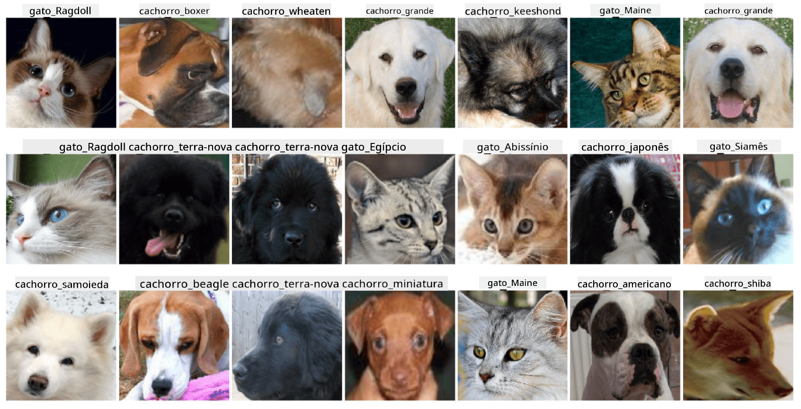

<!--
CO_OP_TRANSLATOR_METADATA:
{
  "original_hash": "b70fcf7fcee862990f848c679090943f",
  "translation_date": "2025-10-03T14:54:27+00:00",
  "source_file": "lessons/4-ComputerVision/07-ConvNets/lab/README.md",
  "language_code": "br"
}
-->
# Classificação de Rostos de Animais de Estimação

Atividade de laboratório do [Currículo de IA para Iniciantes](https://github.com/microsoft/ai-for-beginners).

## Tarefa

Imagine que você precisa desenvolver um aplicativo para um berçário de animais de estimação para catalogar todos os animais. Uma das grandes funcionalidades de tal aplicativo seria identificar automaticamente a raça a partir de uma fotografia. Isso pode ser feito com sucesso usando redes neurais.

Você precisa treinar uma rede neural convolucional para classificar diferentes raças de gatos e cães usando o conjunto de dados **Pet Faces**.

## O Conjunto de Dados

Usaremos o [Oxford-IIIT Pet Dataset](https://www.robots.ox.ac.uk/~vgg/data/pets/), que contém imagens de 37 diferentes raças de cães e gatos.



Para baixar o conjunto de dados, use este trecho de código:

```python
!wget https://thor.robots.ox.ac.uk/~vgg/data/pets/images.tar.gz
!tar xfz images.tar.gz
!rm images.tar.gz
```

**Nota:** As imagens do Oxford-IIIT Pet Dataset estão organizadas por nome de arquivo (por exemplo, `Abyssinian_1.jpg`, `Bengal_2.jpg`). O notebook inclui código para organizar essas imagens em subdiretórios específicos de raças para facilitar a classificação.

## Notebook Inicial

Comece o laboratório abrindo [PetFaces.ipynb](PetFaces.ipynb)

## Conclusão

Você resolveu um problema relativamente complexo de classificação de imagens do zero! Havia muitas classes, e você ainda conseguiu obter uma precisão razoável! Também faz sentido medir a precisão top-k, porque é fácil confundir algumas classes que não são claramente diferentes, mesmo para seres humanos.

---

**Aviso Legal**:  
Este documento foi traduzido utilizando o serviço de tradução por IA [Co-op Translator](https://github.com/Azure/co-op-translator). Embora nos esforcemos para garantir a precisão, é importante estar ciente de que traduções automáticas podem conter erros ou imprecisões. O documento original em seu idioma nativo deve ser considerado a fonte autoritativa. Para informações críticas, recomenda-se a tradução profissional realizada por humanos. Não nos responsabilizamos por quaisquer mal-entendidos ou interpretações equivocadas decorrentes do uso desta tradução.