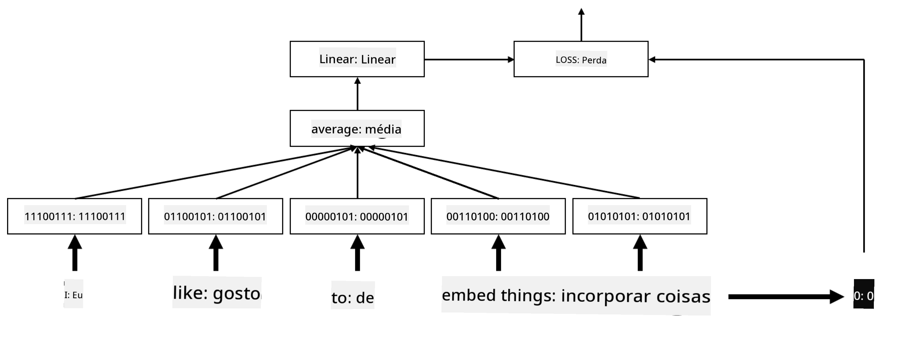

<!--
CO_OP_TRANSLATOR_METADATA:
{
  "original_hash": "e40b47ac3fd48f71304ede1474e66293",
  "translation_date": "2025-08-26T08:17:12+00:00",
  "source_file": "lessons/5-NLP/14-Embeddings/README.md",
  "language_code": "br"
}
-->
# Embeddings

## [Pre-lecture quiz](https://red-field-0a6ddfd03.1.azurestaticapps.net/quiz/114)

Ao treinar classificadores baseados em BoW ou TF/IDF, trabalhamos com vetores de bag-of-words de alta dimensionalidade com comprimento `vocab_size`, e estávamos convertendo explicitamente de vetores de representação posicional de baixa dimensionalidade para representações esparsas de uma única posição ativa (one-hot). No entanto, essa representação one-hot não é eficiente em termos de memória. Além disso, cada palavra é tratada de forma independente, ou seja, vetores codificados em one-hot não expressam nenhuma similaridade semântica entre palavras.

A ideia de **embedding** é representar palavras por vetores densos de menor dimensionalidade, que de alguma forma refletem o significado semântico de uma palavra. Mais adiante, discutiremos como construir embeddings de palavras significativos, mas, por enquanto, vamos apenas pensar em embeddings como uma forma de reduzir a dimensionalidade de um vetor de palavras.

Assim, a camada de embedding receberia uma palavra como entrada e produziria um vetor de saída com o tamanho especificado em `embedding_size`. De certa forma, é muito semelhante a uma camada `Linear`, mas, em vez de receber um vetor codificado em one-hot, ela será capaz de receber um número de palavra como entrada, permitindo evitar a criação de grandes vetores codificados em one-hot.

Ao usar uma camada de embedding como a primeira camada em nossa rede de classificação, podemos mudar de um modelo de bag-of-words para um modelo de **embedding bag**, onde primeiro convertemos cada palavra em nosso texto no embedding correspondente e, em seguida, calculamos alguma função agregada sobre todos esses embeddings, como `sum`, `average` ou `max`.  

> Imagem do autor

## ✍️ Exercícios: Embeddings

Continue seu aprendizado nos seguintes notebooks:
* [Embeddings com PyTorch](../../../../../lessons/5-NLP/14-Embeddings/EmbeddingsPyTorch.ipynb)
* [Embeddings com TensorFlow](../../../../../lessons/5-NLP/14-Embeddings/EmbeddingsTF.ipynb)

## Embeddings Semânticos: Word2Vec

Embora a camada de embedding tenha aprendido a mapear palavras para representações vetoriais, essa representação não necessariamente possui muito significado semântico. Seria interessante aprender uma representação vetorial em que palavras semelhantes ou sinônimos correspondam a vetores próximos entre si em termos de alguma distância vetorial (por exemplo, distância Euclidiana).

Para isso, precisamos pré-treinar nosso modelo de embedding em uma grande coleção de textos de uma maneira específica. Uma forma de treinar embeddings semânticos é chamada de [Word2Vec](https://en.wikipedia.org/wiki/Word2vec). Ela se baseia em duas arquiteturas principais usadas para produzir uma representação distribuída de palavras:

 - **Continuous bag-of-words** (CBoW) — nesta arquitetura, treinamos o modelo para prever uma palavra a partir do contexto ao redor. Dado o ngram $(W_{-2},W_{-1},W_0,W_1,W_2)$, o objetivo do modelo é prever $W_0$ a partir de $(W_{-2},W_{-1},W_1,W_2)$.
 - **Continuous skip-gram** é o oposto do CBoW. O modelo usa a janela de palavras de contexto ao redor para prever a palavra atual.

CBoW é mais rápido, enquanto skip-gram é mais lento, mas faz um trabalho melhor ao representar palavras menos frequentes.

> Imagem retirada [deste artigo](https://arxiv.org/pdf/1301.3781.pdf)

Embeddings pré-treinados do Word2Vec (assim como outros modelos semelhantes, como GloVe) também podem ser usados no lugar da camada de embedding em redes neurais. No entanto, precisamos lidar com vocabulários, porque o vocabulário usado para pré-treinar o Word2Vec/GloVe provavelmente será diferente do vocabulário em nosso corpus de texto. Confira os notebooks acima para ver como esse problema pode ser resolvido.

## Embeddings Contextuais

Uma limitação importante das representações tradicionais de embeddings pré-treinados, como Word2Vec, é o problema de desambiguação de sentidos das palavras. Embora embeddings pré-treinados possam capturar parte do significado das palavras no contexto, todos os possíveis significados de uma palavra são codificados no mesmo embedding. Isso pode causar problemas em modelos posteriores, já que muitas palavras, como a palavra 'play', têm significados diferentes dependendo do contexto em que são usadas.

Por exemplo, a palavra 'play' nas duas frases abaixo tem significados bastante diferentes:

- Eu fui a uma **peça** no teatro.
- John quer **brincar** com seus amigos.

Os embeddings pré-treinados acima representam ambos os significados da palavra 'play' no mesmo embedding. Para superar essa limitação, precisamos construir embeddings baseados no **modelo de linguagem**, que é treinado em um grande corpus de texto e *sabe* como as palavras podem ser combinadas em diferentes contextos. Discutir embeddings contextuais está fora do escopo deste tutorial, mas voltaremos a eles ao falar sobre modelos de linguagem mais adiante no curso.

## Conclusão

Nesta lição, você descobriu como construir e usar camadas de embedding no TensorFlow e PyTorch para refletir melhor os significados semânticos das palavras.

## 🚀 Desafio

Word2Vec tem sido usado em algumas aplicações interessantes, incluindo a geração de letras de músicas e poesias. Confira [este artigo](https://www.politetype.com/blog/word2vec-color-poems), que explica como o autor usou Word2Vec para gerar poesia. Assista também [este vídeo de Dan Shiffmann](https://www.youtube.com/watch?v=LSS_bos_TPI&ab_channel=TheCodingTrain) para descobrir uma explicação diferente dessa técnica. Depois, tente aplicar essas técnicas ao seu próprio corpus de texto, talvez obtido no Kaggle.

## [Post-lecture quiz](https://red-field-0a6ddfd03.1.azurestaticapps.net/quiz/214)

## Revisão e Autoestudo

Leia este artigo sobre Word2Vec: [Efficient Estimation of Word Representations in Vector Space](https://arxiv.org/pdf/1301.3781.pdf)

## [Assignment: Notebooks](assignment.md)

**Aviso Legal**:  
Este documento foi traduzido utilizando o serviço de tradução por IA [Co-op Translator](https://github.com/Azure/co-op-translator). Embora nos esforcemos para garantir a precisão, esteja ciente de que traduções automáticas podem conter erros ou imprecisões. O documento original em seu idioma nativo deve ser considerado a fonte oficial. Para informações críticas, recomenda-se a tradução profissional feita por humanos. Não nos responsabilizamos por quaisquer mal-entendidos ou interpretações equivocadas decorrentes do uso desta tradução.