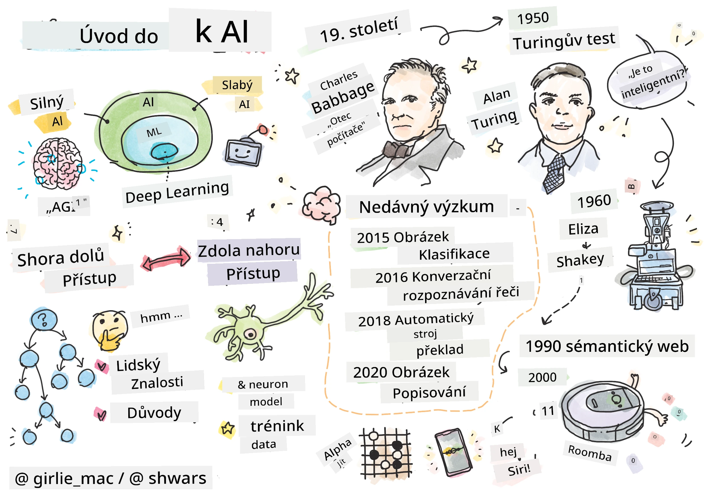
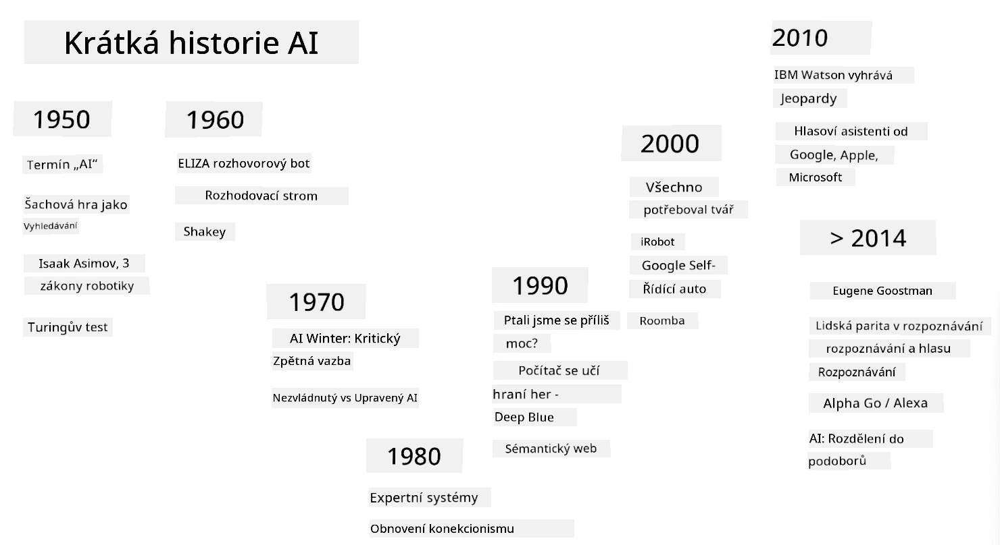
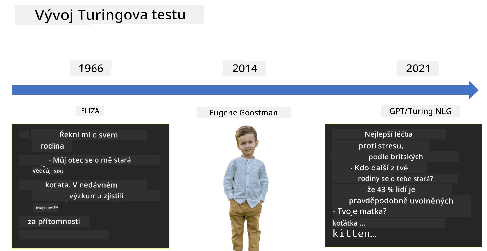

# Úvod do AI

> Kresba od [Tomomi Imura](https://twitter.com/girlie_mac)

## [Kvíz před přednáškou](https://ff-quizzes.netlify.app/en/ai/quiz/1)

**Umělá inteligence** je fascinující vědecká disciplína, která zkoumá, jak můžeme přimět počítače, aby vykazovaly inteligentní chování, například dělaly věci, ve kterých jsou lidé dobří.

Původně byly počítače vynalezeny [Charlesem Babbagem](https://en.wikipedia.org/wiki/Charles_Babbage) k práci s čísly podle přesně definovaného postupu – algoritmu. Moderní počítače, i když jsou mnohem pokročilejší než původní model navržený v 19. století, stále vycházejí ze stejné myšlenky řízených výpočtů. Proto je možné naprogramovat počítač, aby něco vykonal, pokud známe přesnou posloupnost kroků, které je třeba provést k dosažení cíle.

> Foto od [Vickie Soshnikova](http://twitter.com/vickievalerie)

> ✅ Určení věku osoby z její fotografie je úkol, který nelze explicitně naprogramovat, protože nevíme, jak v hlavě dospějeme k číslu, když to děláme.

---

Existují však úkoly, u kterých nevíme, jak je přesně vyřešit. Zvažte například určení věku osoby z její fotografie. Nějak se to naučíme, protože jsme viděli mnoho příkladů lidí různého věku, ale nemůžeme přesně vysvětlit, jak to děláme, ani to nemůžeme naprogramovat do počítače. Právě takové úkoly jsou předmětem zájmu **umělé inteligence** (zkráceně AI).

✅ Zamyslete se nad některými úkoly, které byste mohli přenechat počítači a které by mohly těžit z AI. Zvažte oblasti financí, medicíny a umění – jak tyto oblasti dnes těží z AI?

## Slabá AI vs. Silná AI

Slabá AI | Silná AI
---------------------------------------|-------------------------------------
Slabá AI označuje systémy AI, které jsou navrženy a trénovány pro konkrétní úkol nebo úzkou sadu úkolů.|Silná AI, nebo také Obecná umělá inteligence (AGI), označuje systémy AI s inteligencí a porozuměním na úrovni člověka.
Tyto systémy AI nejsou obecně inteligentní; vynikají v provádění předdefinovaného úkolu, ale postrádají skutečné porozumění nebo vědomí.|Tyto systémy AI mají schopnost vykonávat jakýkoli intelektuální úkol, který dokáže člověk, přizpůsobit se různým oblastem a disponovat formou vědomí nebo sebeuvědomění.
Příklady slabé AI zahrnují virtuální asistenty jako Siri nebo Alexa, doporučovací algoritmy používané streamovacími službami a chatboty navržené pro specifické úkoly zákaznické podpory.|Dosažení silné AI je dlouhodobým cílem výzkumu AI a vyžadovalo by vývoj systémů AI, které dokážou uvažovat, učit se, chápat a přizpůsobovat se široké škále úkolů a kontextů.
Slabá AI je vysoce specializovaná a nemá kognitivní schopnosti podobné člověku ani obecné schopnosti řešení problémů mimo svou úzkou oblast.|Silná AI je v současnosti teoretickým konceptem a žádný systém AI této úrovně obecné inteligence nedosáhl.

Pro více informací se podívejte na **[Obecná umělá inteligence](https://en.wikipedia.org/wiki/Artificial_general_intelligence)** (AGI).

## Definice inteligence a Turingův test

Jedním z problémů při práci s termínem **[inteligence](https://en.wikipedia.org/wiki/Intelligence)** je, že neexistuje jasná definice tohoto pojmu. Lze argumentovat, že inteligence souvisí s **abstraktním myšlením** nebo **sebeuvědoměním**, ale nemůžeme ji přesně definovat.

> [Foto](https://unsplash.com/photos/75715CVEJhI) od [Amber Kipp](https://unsplash.com/@sadmax) z Unsplash

Pro pochopení nejednoznačnosti pojmu *inteligence* zkuste odpovědět na otázku: „Je kočka inteligentní?“. Různí lidé mají tendenci dávat různé odpovědi na tuto otázku, protože neexistuje univerzálně přijatý test, který by dokázal, zda je toto tvrzení pravdivé nebo ne. A pokud si myslíte, že existuje – zkuste dát své kočce IQ test...

✅ Zamyslete se na chvíli nad tím, jak definujete inteligenci. Je vrána, která dokáže vyřešit bludiště a dostat se k jídlu, inteligentní? Je dítě inteligentní?

---

Když mluvíme o AGI, potřebujeme nějaký způsob, jak zjistit, zda jsme vytvořili skutečně inteligentní systém. [Alan Turing](https://en.wikipedia.org/wiki/Alan_Turing) navrhl způsob zvaný **[Turingův test](https://en.wikipedia.org/wiki/Turing_test)**, který zároveň funguje jako definice inteligence. Test porovnává daný systém s něčím inherentně inteligentním – skutečným člověkem, a protože jakékoli automatické porovnání může být počítačovým programem obejito, používáme lidského tazatele. Pokud člověk není schopen rozlišit mezi skutečnou osobou a počítačovým systémem v textovém dialogu, je systém považován za inteligentní.

> Chatbot jménem [Eugene Goostman](https://en.wikipedia.org/wiki/Eugene_Goostman), vyvinutý v Petrohradě, se v roce 2014 přiblížil k úspěšnému složení Turingova testu pomocí chytrého triku s osobností. Předem oznámil, že je 13letý ukrajinský chlapec, což by vysvětlovalo nedostatek znalostí a některé nesrovnalosti v textu. Bot přesvědčil 30 % porotců, že je člověk, po 5minutovém dialogu, což je metrika, o které Turing věřil, že ji stroj bude schopen splnit do roku 2000. Je však třeba pochopit, že to neznamená, že jsme vytvořili inteligentní systém, nebo že počítačový systém oklamal lidského tazatele – systém neoklamal lidi, ale spíše tvůrci bota!

✅ Už vás někdy chatbot oklamal, že si myslíte, že mluvíte s člověkem? Jak vás přesvědčil?

## Různé přístupy k AI

Pokud chceme, aby se počítač choval jako člověk, musíme nějakým způsobem modelovat naše myšlení uvnitř počítače. Proto musíme zkusit pochopit, co dělá člověka inteligentním.

> Abychom mohli naprogramovat inteligenci do stroje, musíme pochopit, jak fungují naše vlastní procesy rozhodování. Pokud se trochu zamyslíte nad sebou, uvědomíte si, že některé procesy probíhají podvědomě – např. dokážeme rozlišit kočku od psa, aniž bychom o tom přemýšleli – zatímco jiné zahrnují uvažování.

Existují dva možné přístupy k tomuto problému:

Přístup shora dolů (symbolické uvažování) | Přístup zdola nahoru (neuronové sítě)
---------------------------------------|-------------------------------------
Přístup shora dolů modeluje způsob, jakým člověk uvažuje při řešení problému. Zahrnuje extrakci **znalostí** od člověka a jejich reprezentaci ve formě čitelné pro počítač. Také musíme vyvinout způsob, jak modelovat **uvažování** uvnitř počítače. | Přístup zdola nahoru modeluje strukturu lidského mozku, který se skládá z obrovského množství jednoduchých jednotek zvaných **neurony**. Každý neuron funguje jako vážený průměr svých vstupů a můžeme trénovat síť neuronů k řešení užitečných problémů poskytováním **tréninkových dat**.

Existují také další možné přístupy k inteligenci:

* **Emergentní**, **synergický** nebo **multi-agentní přístup** vycházejí z faktu, že složité inteligentní chování může vzniknout interakcí velkého množství jednoduchých agentů. Podle [evoluční kybernetiky](https://en.wikipedia.org/wiki/Global_brain#Evolutionary_cybernetics) může inteligence *vzejít* z jednoduššího, reaktivního chování v procesu *metasystémového přechodu*.

* **Evoluční přístup**, nebo **genetický algoritmus**, je optimalizační proces založený na principech evoluce.

Těmito přístupy se budeme zabývat později v kurzu, ale nyní se zaměříme na dva hlavní směry: shora dolů a zdola nahoru.

### Přístup shora dolů

V **přístupu shora dolů** se snažíme modelovat naše uvažování. Protože můžeme sledovat své myšlenky, když uvažujeme, můžeme se pokusit tento proces formalizovat a naprogramovat ho do počítače. To se nazývá **symbolické uvažování**.

Lidé mají tendenci mít v hlavě určité pravidla, která řídí jejich rozhodovací procesy. Například když lékař diagnostikuje pacienta, může si uvědomit, že osoba má horečku, a proto může v těle probíhat nějaký zánět. Použitím velké sady pravidel na konkrétní problém může lékař dojít k finální diagnóze.

Tento přístup se silně spoléhá na **reprezentaci znalostí** a **uvažování**. Extrakce znalostí od lidského experta může být nejtěžší částí, protože lékař v mnoha případech nemusí přesně vědět, proč dochází k určité diagnóze. Někdy řešení prostě přijde do jeho hlavy bez explicitního přemýšlení. Některé úkoly, jako je určení věku osoby z fotografie, nelze vůbec redukovat na manipulaci se znalostmi.

### Přístup zdola nahoru

Alternativně můžeme zkusit modelovat nejjednodušší prvky uvnitř našeho mozku – neuron. Můžeme vytvořit takzvanou **umělou neuronovou síť** uvnitř počítače a poté se ji pokusit naučit řešit problémy tím, že jí poskytneme příklady. Tento proces je podobný tomu, jak se novorozené dítě učí o svém okolí pozorováním.

✅ Proveďte malý výzkum o tom, jak se učí děti. Jaké jsou základní prvky mozku dítěte?

> | Co je ML?         |      |
> |--------------|-----------|
> | Část umělé inteligence, která je založena na tom, že se počítač učí řešit problém na základě určitých dat, se nazývá **strojové učení**. V tomto kurzu se nebudeme zabývat klasickým strojovým učením – odkazujeme vás na samostatný [kurikulum Strojové učení pro začátečníky](http://aka.ms/ml-beginners). |       |

## Stručná historie AI

Umělá inteligence vznikla jako obor v polovině 20. století. Zpočátku byl převládajícím přístupem symbolický přístup, který vedl k řadě důležitých úspěchů, jako byly expertní systémy – počítačové programy, které dokázaly fungovat jako odborník v některých omezených oblastech problémů. Brzy se však ukázalo, že tento přístup není dobře škálovatelný. Extrakce znalostí od experta, jejich reprezentace v počítači a udržování této znalostní báze přesné se ukázalo být velmi složitým úkolem a v mnoha případech příliš nákladným na to, aby bylo praktické. To vedlo k takzvané [AI zimě](https://en.wikipedia.org/wiki/AI_winter) v 70. letech.

> Obrázek od [Dmitry Soshnikov](http://soshnikov.com)

Jak čas plynul, výpočetní zdroje se staly levnějšími a bylo k dispozici více dat, takže přístupy neuronových sítí začaly vykazovat skvělý výkon v soutěžení s lidmi v mnoha oblastech, jako je počítačové vidění nebo porozumění řeči. V posledním desetiletí byl termín umělá inteligence většinou používán jako synonymum pro neuronové sítě, protože většina úspěchů AI, o kterých slyšíme, je na nich založena.

Můžeme pozorovat, jak se přístupy měnily, například při vytváření počítačového programu na hraní šachu:

* Rané šachové programy byly založeny na vyhledávání – program se explicitně snažil odhadnout možné tahy soupeře pro daný počet následujících tahů a vybral optimální tah na základě optimální pozice, které lze dosáhnout během několika tahů. To vedlo k vývoji takzvaného [alpha-beta prořezávání](https://en.wikipedia.org/wiki/Alpha%E2%80%93beta_pruning).
* Strategie vyhledávání fungují dobře ke konci hry, kde je vyhledávací prostor omezen malým počtem možných tahů. Na začátku hry je však vyhledávací prostor obrovský a algoritmus lze vylepšit učením z existujících zápasů mezi lidskými hráči. Následné experimenty využívaly takzvané [uvažování na základě případů](https://en.wikipedia.org/wiki/Case-based_reasoning), kde program hledal případy v databázi znalostí velmi podobné aktuální pozici ve hře.
* Moderní programy, které porážejí lidské hráče, jsou založeny na neuronových sítích a [posilovaném učení](https://en.wikipedia.org/wiki/Reinforcement_learning), kde se programy učí hrát výhradně tím, že dlouhou dobu hrají samy proti sobě a učí se ze svých vlastních chyb – podobně jako lidé, když se učí hrát šachy. Počítačový program však může odehrát mnohem více her za mnohem kratší dobu, a tak se může učit mnohem rychleji.

✅ Proveďte malý výzkum o dalších hrách, které byly hrány AI.

Podobně můžeme vidět, jak se přístup k vytváření „mluvících programů“ (které by mohly projít Turingovým testem) změnil:

* Rané programy tohoto druhu, jako například [Eliza](https://en.wikipedia.org/wiki/ELIZA), byly založeny na velmi jednoduchých gramatických pravidlech a přeformulování vstupní věty na otázku.
* Moderní asistenti, jako Cortana, Siri nebo Google Assistant, jsou všechny hybridní systémy, které používají neuronové sítě k převodu řeči na text a rozpoznání našeho záměru, a poté využívají určité uvažování nebo explicitní algoritmy k provedení požadovaných akcí.
* V budoucnu můžeme očekávat kompletní model založený na neuronových sítích, který bude sám zvládat dialog. Nedávné GPT a [Turing-NLG](https://www.microsoft.com/research/blog/turing-nlg-a-17-billion-parameter-language-model-by-microsoft) rodiny neuronových sítí ukazují velký úspěch v tomto směru.

> Obrázek od Dmitry Soshnikov, [fotografie](https://unsplash.com/photos/r8LmVbUKgns) od [Marina Abrosimova](https://unsplash.com/@abrosimova_marina_foto), Unsplash

## Nedávný výzkum v oblasti AI

Obrovský nárůst výzkumu neuronových sítí začal kolem roku 2010, kdy se začaly objevovat velké veřejné datové sady. Obrovská sbírka obrázků nazvaná [ImageNet](https://en.wikipedia.org/wiki/ImageNet), která obsahuje přibližně 14 milionů anotovaných obrázků, dala vzniknout [ImageNet Large Scale Visual Recognition Challenge](https://image-net.org/challenges/LSVRC/).

> Obrázek od [Dmitry Soshnikov](http://soshnikov.com)

V roce 2012 byly [Konvoluční neuronové sítě](../4-ComputerVision/07-ConvNets/README.md) poprvé použity pro klasifikaci obrázků, což vedlo k výraznému snížení chybovosti klasifikace (z téměř 30 % na 16,4 %). V roce 2015 architektura ResNet od Microsoft Research [dosáhla přesnosti na úrovni člověka](https://doi.org/10.1109/ICCV.2015.123).

Od té doby neuronové sítě prokázaly velmi úspěšné chování v mnoha úlohách:

---

Rok | Dosažení úrovně člověka
-----|--------
2015 | [Klasifikace obrázků](https://doi.org/10.1109/ICCV.2015.123)
2016 | [Rozpoznávání mluvené řeči](https://arxiv.org/abs/1610.05256)
2018 | [Automatický strojový překlad](https://arxiv.org/abs/1803.05567) (z čínštiny do angličtiny)
2020 | [Popisování obrázků](https://arxiv.org/abs/2009.13682)

V posledních několika letech jsme byli svědky obrovských úspěchů s velkými jazykovými modely, jako jsou BERT a GPT-3. To se stalo především díky tomu, že je k dispozici velké množství obecných textových dat, která umožňují trénovat modely tak, aby zachytily strukturu a význam textů, předtrénovat je na obecných textových kolekcích a poté tyto modely specializovat na konkrétnější úkoly. O [zpracování přirozeného jazyka](../5-NLP/README.md) se dozvíme více později v tomto kurzu.

## 🚀 Výzva

Prozkoumejte internet a určete, kde je podle vás AI nejefektivněji využívána. Je to v mapové aplikaci, nějaké službě převodu řeči na text nebo ve videohře? Zjistěte, jak byl tento systém vytvořen.

## [Kvíz po přednášce](https://ff-quizzes.netlify.app/en/ai/quiz/2)

## Přehled a samostudium

Projděte si historii AI a ML přečtením [této lekce](https://github.com/microsoft/ML-For-Beginners/tree/main/1-Introduction/2-history-of-ML). Vyberte si prvek ze sketchnotu na začátku této lekce nebo této a prozkoumejte jej podrobněji, abyste pochopili kulturní kontext, který ovlivnil jeho vývoj.

**Úkol**: [Game Jam](assignment.md)

---

<!-- CO-OP TRANSLATOR DISCLAIMER START -->
**Prohlášení**:  
Tento dokument byl přeložen pomocí služby AI pro překlady [Co-op Translator](https://github.com/Azure/co-op-translator). I když se snažíme o přesnost, mějte prosím na paměti, že automatizované překlady mohou obsahovat chyby nebo nepřesnosti. Původní dokument v jeho původním jazyce by měl být považován za autoritativní zdroj. Pro důležité informace se doporučuje profesionální lidský překlad. Neodpovídáme za žádná nedorozumění nebo nesprávné interpretace vyplývající z použití tohoto překladu.
<!-- CO-OP TRANSLATOR DISCLAIMER END -->