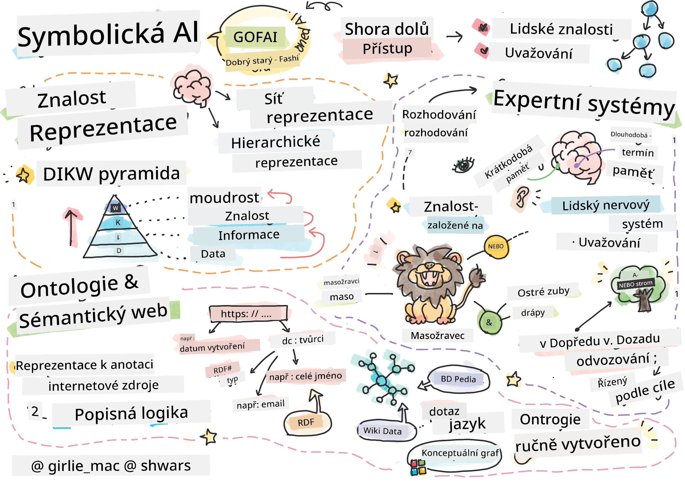
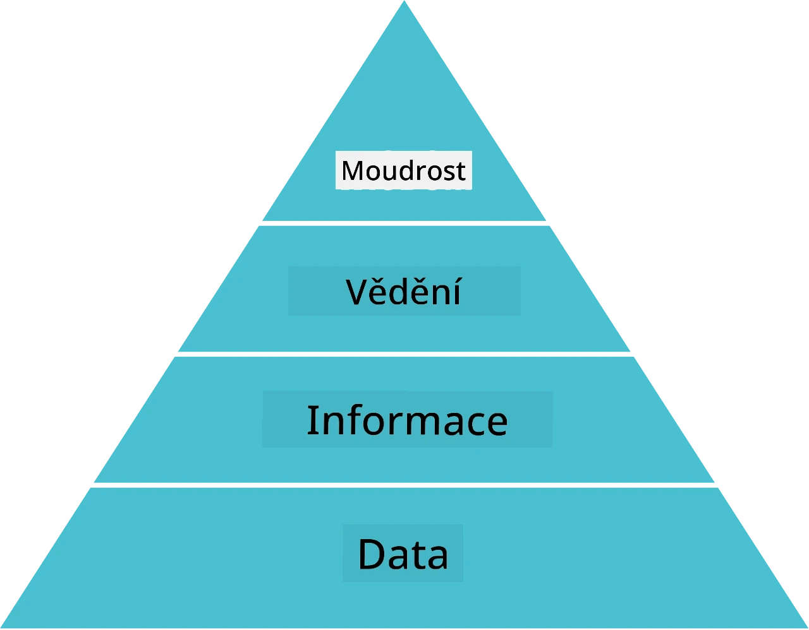
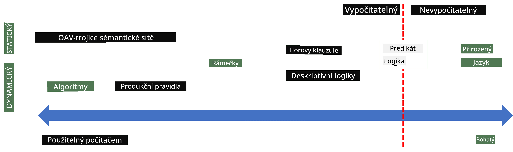
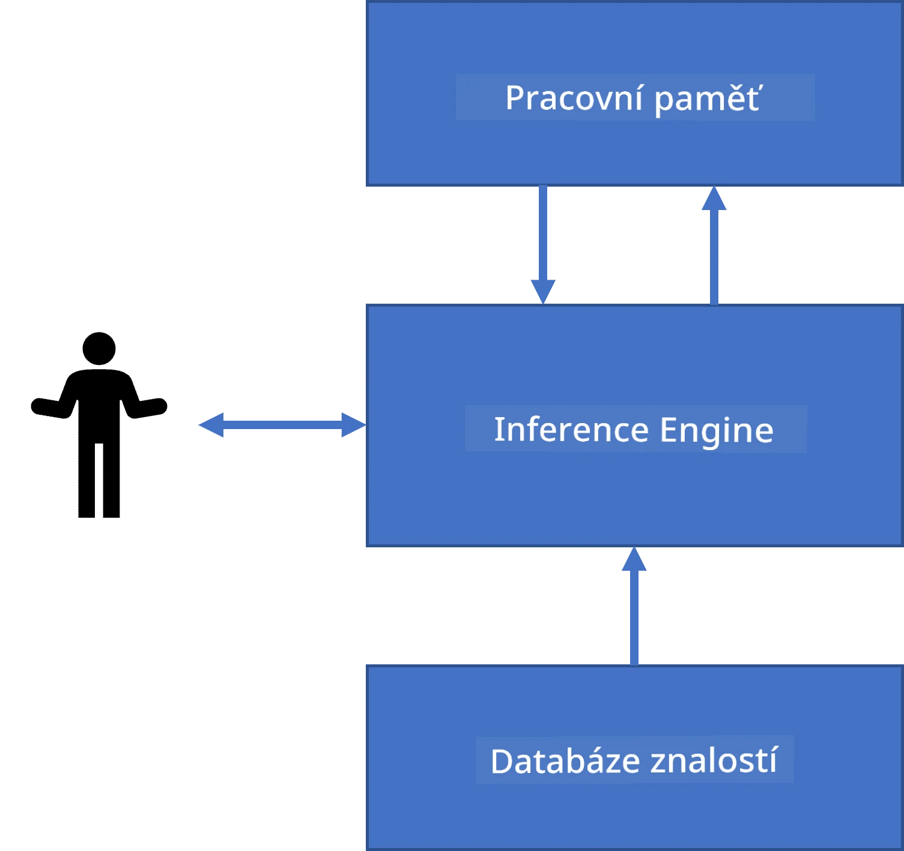
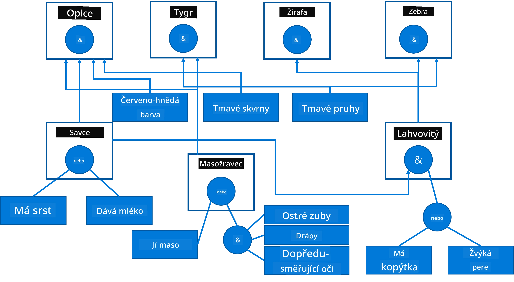
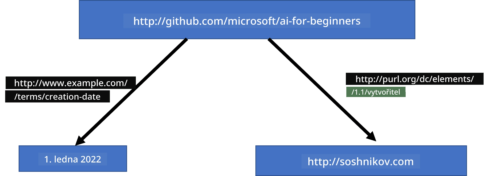
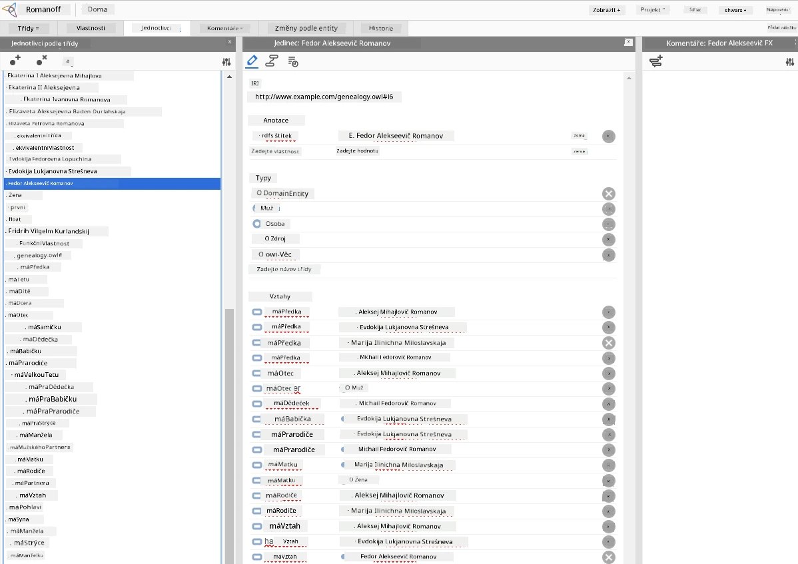

# Reprezentace znalostí a expertní systémy



> Sketchnote od [Tomomi Imura](https://twitter.com/girlie_mac)

Hledání umělé inteligence je založeno na hledání znalostí, aby bylo možné porozumět světu podobně jako lidé. Ale jak to lze provést?

## [Přednáškový kvíz](https://ff-quizzes.netlify.app/en/ai/quiz/3)

V počátcích AI byl populární přístup shora dolů k vytváření inteligentních systémů (probráno v předchozí lekci). Myšlenka spočívala v extrahování znalostí od lidí do nějaké strojově čitelné podoby a jejich použití k automatickému řešení problémů. Tento přístup byl založen na dvou hlavních myšlenkách:

* Reprezentace znalostí
* Uvažování

## Reprezentace znalostí

Jedním z důležitých pojmů v symbolické AI jsou **znalosti**. Je důležité rozlišovat znalosti od *informací* či *dat*. Například lze říci, že knihy obsahují znalosti, protože se z nich lze učit a stát se odborníkem. Co ale knihy skutečně obsahují, se nazývá *data*, a čtením knih a integrací těchto dat do našeho modelu světa tato data přeměňujeme na znalosti.

> ✅ **Znalost** je něco, co máme v naší hlavě a představuje naše porozumění světu. Získává se aktivním **učením**, které integruje informace, jež přijímáme, do našeho aktivního modelu světa.

Většinou znalosti přesně nedefinujeme, ale zarovnáváme je s jinými příbuznými pojmy pomocí [DIKW pyramidu](https://en.wikipedia.org/wiki/DIKW_pyramid). Obsahuje následující pojmy:

* **Data** jsou něco reprezentovaného v fyzickém médiu, jako je psaný text nebo mluvená slova. Data existují nezávisle na lidech a mohou být předávána mezi lidmi.
* **Informace** jsou způsob, jak interpretujeme data v naší hlavě. Například když slyšíme slovo *počítač*, máme nějaké porozumění, co to je.
* **Znalosti** jsou integrací informací do našeho modelu světa. Například jakmile se naučíme, co je počítač, začneme mít představy o tom, jak funguje, kolik stojí a k čemu se používá. Tato síť vzájemně propojených pojmů tvoří naše znalosti.
* **Moudrost** je další úroveň našeho porozumění světu a představuje *meta-znalosti*, např. pojem o tom, jak a kdy by se měly znalosti používat.



*Obrázek [z Wikipedie](https://commons.wikimedia.org/w/index.php?curid=37705247), autor Longlivetheux - vlastní dílo, CC BY-SA 4.0*

Tedy problém **reprezentace znalostí** je najít efektivní způsob, jak reprezentovat znalosti uvnitř počítače ve formě dat, aby byly automaticky použitelné. Lze to vidět jako spektrum:



> Obrázek od [Dmitry Soshnikov](http://soshnikov.com)

* Nalevo jsou velmi jednoduché typy reprezentací znalostí, které mohou počítače efektivně používat. Nejjednodušší je algoritmická, kde jsou znalosti reprezentovány počítačovým programem. To však není nejlepší způsob reprezentace znalostí, protože není flexibilní. Znalosti v naší hlavě jsou často nealgoritmické.
* Napravo jsou reprezentace jako přirozený text. Je to nejsilnější způsob, ale nelze je použít pro automatické uvažování.

> ✅ Zamyslete se na chvíli nad tím, jak reprezentujete znalosti ve své hlavě a jak je převádíte do poznámek. Existuje nějaký konkrétní formát, který vám pomáhá lépe si je zapamatovat?

## Klasifikace počítačových reprezentací znalostí

Můžeme rozdělit různé metody počítačové reprezentace znalostí do následujících kategorií:

* **Síťové reprezentace** vycházejí z faktu, že v naší hlavě máme síť vzájemně propojených pojmů. Můžeme se pokusit reprodukovat stejnou síť jako graf uvnitř počítače – tzv. **sémantická síť**.

1. **Trojičky objekt-vlastnost-hodnota** nebo **páry vlastnost-hodnota**. Protože graf lze uvnitř počítače reprezentovat jako seznam uzlů a hran, můžeme sémantickou síť reprezentovat jako seznam trojiček obsahujících objekty, vlastnosti a hodnoty. Například sestavíme tyto trojičky o programovacích jazycích:

Objekt | Vlastnost | Hodnota
-------|------------|---------
Python | je | Neutypovaný-jazyk
Python | vynalezl | Guido van Rossum
Python | syntaxe bloku | odsazení
Neutypovaný-jazyk | nemá | definice typů

> ✅ Zamyslete se, jak lze trojičky použít k reprezentaci jiných typů znalostí.

2. **Hierarchické reprezentace** zdůrazňují fakt, že často vytváříme hierarchii objektů v naší hlavě. Například víme, že kanárek je pták a všichni ptáci mají křídla. Máme také představu o barvě kanárka a o jeho rychlosti letu.

   - **Reprezentace rámců** je založena na reprezentaci každého objektu nebo třídy objektů jako **rámce**, který obsahuje **sloty**. Sloty mají možné výchozí hodnoty, omezení hodnot nebo uložené procedury, které lze vyvolat k získání hodnoty slotu. Všechny rámce tvoří hierarchii podobnou hierarchii objektů v objektově orientovaných programovacích jazycích.
   - **Scénáře** jsou zvláštní druh rámců, které reprezentují komplexní situace, které se mohou odehrávat v čase.

**Python**

Slot | Hodnota | Výchozí hodnota | Interval |
-----|---------|-----------------|----------|
Jméno | Python | | |
Je | Neutypovaný-jazyk | | |
Psaní proměnných | | CamelCase | |
Délka programu | | | 5-5000 řádků |
Syntaxe bloku | Odsazení | | |

3. **Procedurální reprezentace** jsou založeny na reprezentaci znalostí jako seznamu akcí, které lze vykonat po splnění určité podmínky.
   - Produkční pravidla jsou if-then výroky, které nám umožňují vyvodit závěry. Například lékař může mít pravidlo říkající, že **POKUD** má pacient vysokou horečku **NEBO** vysokou hladinu C-reaktivního proteinu v krevním testu, **TAK** má zánět. Jakmile se setkáme s jednou z podmínek, můžeme usoudit na zánět a pak to využít v další úvaze.
   - Algoritmy lze také považovat za formu procedurální reprezentace, ač se téměř nikdy přímo nepoužívají v systémech založených na znalostech.

4. **Logika** byla původně navržena Aristotelem jako způsob reprezentace univerzálních lidských znalostí.
   - Predikátová logika jako matematická teorie je příliš bohatá na výpočetně řešitelnou úroveň, proto se obvykle používá její podmnožina, např. Hornovy klauzule používané v jazyce Prolog.
   - Popisná logika je rodina logických systémů používaných k reprezentaci a uvažování o hierarchii objektů a distribuovaných reprezentacích znalostí jako *sémantický web*.

## Expertní systémy

Jedním z prvních úspěchů symbolické AI byly tzv. **expertní systémy** – počítačové systémy navržené tak, aby fungovaly jako odborníci v omezeném problémovém oboru. Byly založeny na **základně znalostí** získané od jednoho nebo více lidských expertů a obsahovaly **inferenční stroj**, který na jejím základě prováděl uvažování.

 | 
--------------------------------------------|------------------------------------------------
Zjednodušená struktura lidského nervového systému | Architektura systému založeného na znalostech

Expertní systémy jsou postaveny podobně jako lidský systém uvažování, který obsahuje **krátkodobou paměť** a **dlouhodobou paměť**. Podobně v systémech založených na znalostech rozlišujeme následující komponenty:

* **Paměť problému**: obsahuje znalosti o právě řešeném problému, např. teplotu nebo krevní tlak pacienta, zda má či nemá zánět apod. Tato znalost se nazývá také **statická znalost**, protože obsahuje momentální snímek toho, co o problému víme – tzv. *stav problému*.
* **Základna znalostí**: reprezentuje dlouhodobé znalosti o dané oblasti problému. Je manuálně extrahována od lidských expertů a nemění se během konzultace. Protože nám umožňuje přecházet z jednoho stavu problému do druhého, nazývá se také **dynamická znalost**.
* **Inference engine**: řídí celý proces prohledávání prostoru stavů problému a v případě potřeby klade uživateli otázky. Je také zodpovědný za nalezení vhodných pravidel pro aplikaci na každý stav.

Jako příklad zvažme následující expertní systém určování zvířete podle jeho fyzikálních vlastností:



> Obrázek od [Dmitry Soshnikov](http://soshnikov.com)

Tento diagram se nazývá **AND-OR strom** a je grafickou reprezentací množiny produkčních pravidel. Nakreslení stromu je užitečné na začátku extrakce znalostí od experta. Pro reprezentaci znalostí uvnitř počítače je pohodlnější použít pravidla:

```
IF the animal eats meat
OR (animal has sharp teeth
    AND animal has claws
    AND animal has forward-looking eyes
) 
THEN the animal is a carnivore
```

Můžete si všimnout, že každá podmínka na levé straně pravidla a akce jsou v podstatě trojičky objekt-vlastnost-hodnota (OAV). **Pracovní paměť** obsahuje množinu OAV trojiček odpovídajících problému, který je právě řešen. **Pravidlový engine** hledá pravidla, u kterých je podmínka splněna, a aplikuje je, čímž přidává další trojičku do pracovní paměti.

> ✅ Nakreslete svůj vlastní AND-OR strom na téma, které vás zajímá!

### Dopředné vs. zpětné uvažování

Výše popsaný proces se nazývá **dopředné uvažování**. Začíná s nějakými počátečními daty o problému dostupnými v pracovní paměti a poté opakuje následující smyčku uvažování:

1. Pokud je cílová vlastnost přítomna v pracovní paměti – zastav a dej výsledek
2. Vyhledej všechna pravidla, jejichž podmínka je momentálně splněna – získání **konfliktní množiny** pravidel
3. Proveď **řešení konfliktu** – vyber jedno pravidlo, které bude na tomto kroku aplikováno. Mohou existovat různé strategie řešení konfliktu:
   - Vybrat první použitelné pravidlo v základně znalostí
   - Vybrat náhodné pravidlo
   - Vybrat *specifičtější* pravidlo, tj. které splňuje nejvíce podmínek na levé straně (LHS)
4. Aplikuj vybrané pravidlo a vlož nový kus znalosti do stavu problému
5. Opakuj od kroku 1.

V některých případech bychom ale chtěli začít s prázdnými znalostmi o problému a klást otázky, které nám pomohou dojít k závěru. Například při lékařské diagnostice obvykle neprovádíme všechny testy předem, ale chceme je provádět, když je potřeba udělat rozhodnutí.

Tento proces lze modelovat pomocí **zpětného uvažování**. Je poháněn **cílem** – hodnotou atributu, kterou hledáme:

1. Vyber všechna pravidla, která nám mohou dát hodnotu cíle (tj. s cílem na pravé straně (RHS)) – konfliktní množina
1. Pokud neexistují pravidla pro tento atribut nebo je pravidlo, které říká, že se hodnota má zeptat uživatele – zeptej se, jinak:
1. Použij strategii řešení konfliktu pro výběr jednoho pravidla, které použijeme jako *hypotézu* – pokusíme se ji dokázat
1. Rekurzivně opakuj proces pro všechny atributy na levé straně pravidla (LHS), snaž se je dokázat jako cíle
1. Pokud proces v kterémkoli bodě selže – použij jiné pravidlo v kroku 3.

> ✅ V jakých situacích je dopředné uvažování vhodnější? A co zpětné uvažování?

### Implementace expertních systémů

Expertní systémy lze implementovat pomocí různých nástrojů:

* Programování přímo v nějakém vysokourovňovém programovacím jazyce. To není nejlepší nápad, protože hlavní výhodou systému založeného na znalostech je oddělení znalostí od inference, a teoreticky by expert v daném oboru měl být schopen psát pravidla bez znalosti detailů inferenčního procesu.
* Použití **shellu expertního systému**, tj. systému speciálně navrženého k naplňování znalostmi pomocí nějakého jazyka reprezentace znalostí.

## ✍️ Cvičení: Určování zvířat

Viz [Animals.ipynb](https://github.com/microsoft/AI-For-Beginners/blob/main/lessons/2-Symbolic/Animals.ipynb) jako příklad implementace dopředného a zpětného uvažování v expertním systému.

> **Poznámka**: Tento příklad je spíše jednoduchý a dává pouze představu, jak expertní systém vypadá. Jakmile začnete takový systém vytvářet, uvidíte *inteligentní* chování až při dosažení určitého počtu pravidel, kolem 200+. V určitém okamžiku pravidla bývají příliš složitá na to, abyste je mohli všechny držet v hlavě, a začnete si klást otázku, proč systém dělá určitá rozhodnutí. Nicméně důležitou vlastností systémů založených na znalostech je, že vždy můžete přesně *vysvětlit*, jak jakékoli rozhodnutí bylo učiněno.

## Ontologie a sémantický web

Na konci 20. století vznikla iniciativa použít reprezentaci znalostí k anotaci internetových zdrojů, aby bylo možné najít zdroje odpovídající velmi konkrétním dotazům. Tento směr se nazýval **sémantický web** a spoléhal na několik konceptů:

- Speciální reprezentaci znalostí založenou na **[popisné logice](https://en.wikipedia.org/wiki/Description_logic)** (DL). Je podobná rámcové reprezentaci znalostí, protože buduje hierarchii objektů s vlastnostmi, ale má formální logickou sémantiku a inferenci. Existuje celá rodina DL, které vyvažují mezi expresivitou a algoritmickou složitostí inference.
- Distribuovanou reprezentaci znalostí, kde jsou všechny pojmy reprezentovány globálním URI identifikátorem, což umožňuje vytvářet hierarchie znalostí pokrývající internet.
- Rodina jazyků založených na XML pro popis znalostí: RDF (Resource Description Framework), RDFS (RDF Schema), OWL (Ontology Web Language).

Základním konceptem v sémantickém webu je pojem **ontologie**. Odkazuje na explicitní specifikaci domény problému pomocí nějaké formální reprezentace znalostí. Nejjednodušší ontologie může být jen hierarchie objektů v doméně problému, ale složitější ontologie budou obsahovat pravidla, která lze použít pro odvozování.

Ve sémantickém webu jsou všechna zobrazení založena na trojicích. Každý objekt a každý vztah jsou jednoznačně identifikovány pomocí URI. Například pokud chceme uvést skutečnost, že tento AI Curriculum byl vytvořen Dmitrym Soshnikovem dne 1. ledna 2022 - zde jsou trojice, které můžeme použít:



```
http://github.com/microsoft/ai-for-beginners http://www.example.com/terms/creation-date “Jan 1, 2022”
http://github.com/microsoft/ai-for-beginners http://purl.org/dc/elements/1.1/creator http://soshnikov.com
```

> ✅ Zde `http://www.example.com/terms/creation-date` a `http://purl.org/dc/elements/1.1/creator` jsou některé dobře známé a univerzálně přijímané URI pro vyjádření konceptů *tvůrce* a *data vytvoření*.

V složitějším případě, pokud chceme definovat seznam tvůrců, můžeme použít nějaké datové struktury definované v RDF.


> Výkresy výše od [Dmitry Soshnikov](http://soshnikov.com)

Pokrok při budování sémantického webu byl částečně zpomalen úspěchem vyhledávačů a technik zpracování přirozeného jazyka, které umožňují extrahovat strukturovaná data z textu. Nicméně v některých oblastech stále existují významné snahy udržovat ontologie a znalostní báze. Několik projektů stojí za zmínku:

* [WikiData](https://wikidata.org/) je sbírka strojově čitelných znalostních bází spojených s Wikipedií. Většina dat je získávána z informačních boxů Wikipedie, částí strukturovaného obsahu uvnitř článků Wikipedie. Můžete [dotazovat](https://query.wikidata.org/) wikidata pomocí SPARQL, speciálního dotazovacího jazyka pro sémantický web. Zde je ukázkový dotaz, který zobrazuje nejpopulárnější barvy očí mezi lidmi:

```sparql
#defaultView:BubbleChart
SELECT ?eyeColorLabel (COUNT(?human) AS ?count)
WHERE
{
  ?human wdt:P31 wd:Q5.       # human instance-of homo sapiens
  ?human wdt:P1340 ?eyeColor. # human eye-color ?eyeColor
  SERVICE wikibase:label { bd:serviceParam wikibase:language "en". }
}
GROUP BY ?eyeColorLabel
```

* [DBpedia](https://www.dbpedia.org/) je další pokus podobný WikiData.

> ✅ Pokud chcete experimentovat s tvorbou vlastních ontologií, nebo otevírat existující, existuje skvělý vizuální editor ontologií s názvem [Protégé](https://protege.stanford.edu/). Stáhněte si ho nebo jej použijte online.



*Webový editor Protégé otevřený s rodinnou ontologií Romanov. Screenshot od Dmitry Soshnikov*

## ✍️ Cvičení: Rodinná ontologie

Podívejte se na [FamilyOntology.ipynb](https://github.com/Ezana135/AI-For-Beginners/blob/main/lessons/2-Symbolic/FamilyOntology.ipynb) jako příklad použití technik sémantického webu pro uvažování o rodinných vztazích. Vezmeme rodokmen reprezentovaný běžným formátem GEDCOM a ontologii rodinných vztahů a postavíme graf všech rodinných vztahů pro zadanou sadu jedinců.

## Microsoft Concept Graph

Ve většině případů jsou ontologie pečlivě vytvářeny ručně. Je však také možné **těžit** ontologie z nestrukturovaných dat, například z textů v přirozeném jazyce.

Takový pokus provedl Microsoft Research, což vedlo k [Microsoft Concept Graph](https://blogs.microsoft.com/ai/microsoft-researchers-release-graph-that-helps-machines-conceptualize/?WT.mc_id=academic-77998-cacaste).

Jedná se o velkou sbírku entit seskupených pomocí vztahu dědičnosti `is-a`. Umožňuje odpovídat na otázky jako "Co je Microsoft?" - odpověď je něco jako "společnost s pravděpodobností 0,87 a značka s pravděpodobností 0,75".

Graf je k dispozici buď jako REST API, nebo jako velký ke stažení textový soubor, který uvádí všechny páry entit.

## ✍️ Cvičení: Koncepční graf

Vyzkoušejte poznámkový blok [MSConceptGraph.ipynb](https://github.com/microsoft/AI-For-Beginners/blob/main/lessons/2-Symbolic/MSConceptGraph.ipynb), kde zjistíte, jak můžeme použít Microsoft Concept Graph ke kategorizaci novinových článků do několika kategorií.

## Závěr

Dnes je AI často považováno za synonymum pro *strojové učení* nebo *neurální sítě*. Nicméně člověk také projevuje explicitní uvažování, což je něco, co neurální sítě momentálně nezvládají. V reálných projektech se explicitní uvažování stále používá k vykonávání úloh, které vyžadují vysvětlení nebo možnost kontrolovaně upravit chování systému.

## 🚀 Výzva

V poznámkovém bloku Rodinná ontologie spojeném s touto lekcí je příležitost experimentovat s dalšími rodinnými vztahy. Zkuste objevit nové spojení mezi lidmi v rodokmenu.

## [Kvíz po přednášce](https://ff-quizzes.netlify.app/en/ai/quiz/4)

## Recenze & samostudium

Proveďte si průzkum na internetu a objevte oblasti, ve kterých lidé zkoušeli kvantifikovat a kodifikovat znalosti. Pohlédněte na Bloomovu taxonomii a podívejte se do historie, jak se lidé snažili chápat svůj svět. Prozkoumejte práci Linnaeuse při vytváření taxonomie organismů a pozorujte, jak Dmitrij Mendělejev vytvořil způsob, jak chemické prvky popsat a seskupit. Jaké další zajímavé příklady můžete nalézt?

**Úkol**: [Vytvořit ontologii](assignment.md)

---

<!-- CO-OP TRANSLATOR DISCLAIMER START -->
**Prohlášení o vyloučení odpovědnosti**:  
Tento dokument byl přeložen pomocí AI překladatelské služby [Co-op Translator](https://github.com/Azure/co-op-translator). Přestože usilujeme o přesnost, berte prosím na vědomí, že automatické překlady mohou obsahovat chyby nebo nepřesnosti. Původní dokument v jeho rodném jazyce by měl být považován za závazný zdroj. Pro důležité informace se doporučuje využít profesionální lidský překlad. Nejsme odpovědní za jakékoliv neporozumění nebo nesprávné interpretace vzniklé použitím tohoto překladu.
<!-- CO-OP TRANSLATOR DISCLAIMER END -->