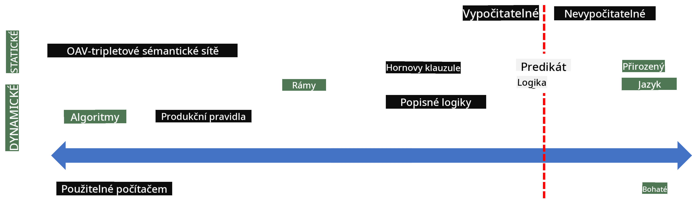
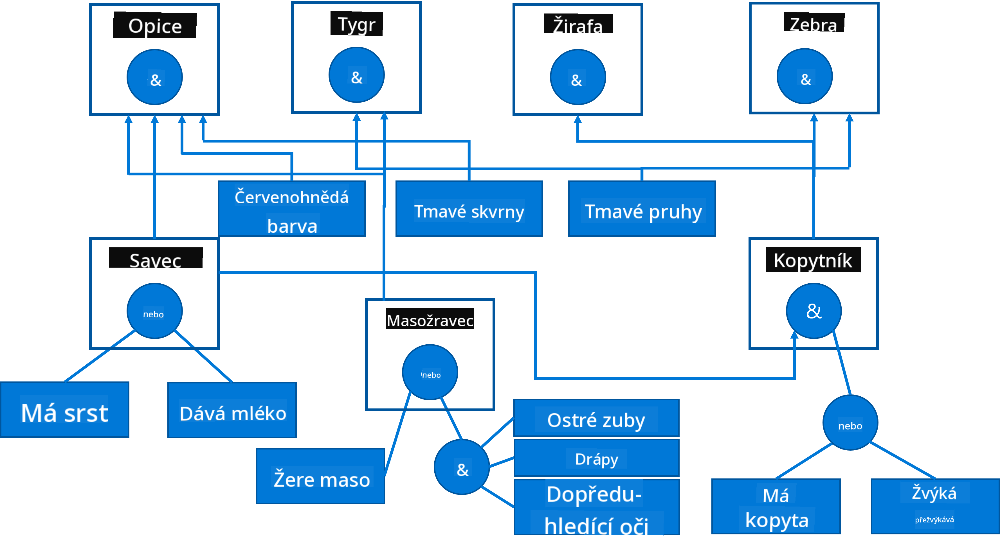

<!--
CO_OP_TRANSLATOR_METADATA:
{
  "original_hash": "7d097f7fda9166ead615e4c34552381b",
  "translation_date": "2025-09-23T11:25:40+00:00",
  "source_file": "lessons/2-Symbolic/README.md",
  "language_code": "cs"
}
-->
# Reprezentace znalostí a expertní systémy


> Sketchnote od [Tomomi Imura](https://twitter.com/girlie_mac)

Hledání umělé inteligence je založeno na snaze o získání znalostí, aby bylo možné chápat svět podobně jako lidé. Ale jak toho dosáhnout?

## [Kvíz před přednáškou](https://ff-quizzes.netlify.app/en/ai/quiz/3)

V počátcích AI byl populární přístup shora dolů k vytváření inteligentních systémů (diskutovaný v předchozí lekci). Myšlenka spočívala v extrakci znalostí od lidí do nějaké strojově čitelné podoby, kterou by bylo možné automaticky využít k řešení problémů. Tento přístup byl založen na dvou hlavních myšlenkách:

* Reprezentace znalostí
* Usuzování

## Reprezentace znalostí

Jedním z důležitých konceptů v Symbolické AI jsou **znalosti**. Je důležité odlišit znalosti od *informací* nebo *dat*. Například můžeme říci, že knihy obsahují znalosti, protože jejich studiem se můžeme stát expertem. Ve skutečnosti však knihy obsahují *data*, která čtením a integrací do našeho modelu světa přeměňujeme na znalosti.

> ✅ **Znalosti** jsou něco, co máme v hlavě a co představuje naše pochopení světa. Získávají se aktivním procesem **učení**, který integruje informace, které přijímáme, do našeho aktivního modelu světa.

Znalosti často nedefinujeme striktně, ale porovnáváme je s jinými souvisejícími koncepty pomocí [DIKW pyramidy](https://en.wikipedia.org/wiki/DIKW_pyramid). Obsahuje následující koncepty:

* **Data** jsou něco, co je reprezentováno na fyzických médiích, jako je psaný text nebo mluvená slova. Data existují nezávisle na lidech a mohou být mezi nimi předávána.
* **Informace** je způsob, jak interpretujeme data v naší hlavě. Například když slyšíme slovo *počítač*, máme určité pochopení, co to je.
* **Znalosti** jsou informace integrované do našeho modelu světa. Například jakmile se naučíme, co je počítač, začneme mít představu o tom, jak funguje, kolik stojí a k čemu ho lze použít. Tato síť vzájemně propojených konceptů tvoří naše znalosti.
* **Moudrost** je ještě vyšší úroveň našeho pochopení světa a představuje *meta-znalosti*, například představu o tom, jak a kdy by měly být znalosti použity.


*Obrázek [z Wikipedie](https://commons.wikimedia.org/w/index.php?curid=37705247), By Longlivetheux - Vlastní dílo, CC BY-SA 4.0*

Problém **reprezentace znalostí** tedy spočívá v nalezení efektivního způsobu, jak reprezentovat znalosti uvnitř počítače ve formě dat, aby byly automaticky použitelné. To lze chápat jako spektrum:



> Obrázek od [Dmitry Soshnikov](http://soshnikov.com)

* Na levé straně jsou velmi jednoduché typy reprezentace znalostí, které mohou být efektivně použity počítači. Nejjednodušší je algoritmická reprezentace, kdy jsou znalosti reprezentovány počítačovým programem. To však není nejlepší způsob reprezentace znalostí, protože není flexibilní. Znalosti v naší hlavě jsou často nealgoritmické.
* Na pravé straně jsou reprezentace, jako je přirozený text. Ten je nejmocnější, ale nelze jej použít pro automatické usuzování.

> ✅ Zamyslete se na chvíli nad tím, jak reprezentujete znalosti ve své hlavě a převádíte je na poznámky. Existuje konkrétní formát, který vám pomáhá při zapamatování?

## Klasifikace počítačových reprezentací znalostí

Různé metody reprezentace znalostí v počítači můžeme klasifikovat do následujících kategorií:

* **Síťové reprezentace** jsou založeny na faktu, že máme síť vzájemně propojených konceptů v naší hlavě. Můžeme se pokusit reprodukovat stejné sítě jako graf uvnitř počítače - tzv. **sémantická síť**.

1. **Triplet objekt-atribut-hodnota** nebo **páry atribut-hodnota**. Protože graf může být reprezentován uvnitř počítače jako seznam uzlů a hran, můžeme sémantickou síť reprezentovat seznamem tripletů obsahujících objekty, atributy a hodnoty. Například vytvoříme následující triplety o programovacích jazycích:

Objekt | Atribut | Hodnota
-------|---------|--------
Python | je | Netypovaný jazyk
Python | vynalezl | Guido van Rossum
Python | bloková syntaxe | odsazení
Netypovaný jazyk | nemá | definice typů

> ✅ Zamyslete se, jak lze triplety použít k reprezentaci jiných typů znalostí.

2. **Hierarchické reprezentace** zdůrazňují fakt, že často vytváříme hierarchii objektů v naší hlavě. Například víme, že kanárek je pták a všichni ptáci mají křídla. Máme také představu o tom, jakou barvu kanárek obvykle má a jaká je jeho rychlost letu.

   - **Reprezentace rámců** je založena na reprezentaci každého objektu nebo třídy objektů jako **rámce**, který obsahuje **sloty**. Sloty mají možné výchozí hodnoty, omezení hodnot nebo uložené procedury, které lze volat pro získání hodnoty slotu. Všechny rámce tvoří hierarchii podobnou hierarchii objektů v objektově orientovaných programovacích jazycích.
   - **Scénáře** jsou speciální druh rámců, které reprezentují složité situace, jež se mohou rozvíjet v čase.

**Python**

Slot | Hodnota | Výchozí hodnota | Interval |
-----|---------|-----------------|----------|
Název | Python | | |
Je | Netypovaný jazyk | | |
Případ proměnné | | CamelCase | |
Délka programu | | | 5-5000 řádků |
Bloková syntaxe | Odsazení | | |

3. **Procedurální reprezentace** jsou založeny na reprezentaci znalostí seznamem akcí, které lze provést, když nastane určitá podmínka.
   - Produkční pravidla jsou if-then výroky, které nám umožňují vyvozovat závěry. Například lékař může mít pravidlo říkající, že **POKUD** má pacient vysokou horečku **NEBO** vysokou hladinu C-reaktivního proteinu v krevním testu **PAK** má zánět. Jakmile narazíme na jednu z podmínek, můžeme učinit závěr o zánětu a poté jej použít v dalším usuzování.
   - Algoritmy lze považovat za další formu procedurální reprezentace, i když se téměř nikdy nepoužívají přímo v systémech založených na znalostech.

4. **Logika** byla původně navržena Aristotelem jako způsob reprezentace univerzálních lidských znalostí.
   - Predikátová logika jako matematická teorie je příliš bohatá na to, aby byla výpočetně proveditelná, proto se obvykle používá její podmnožina, jako jsou Hornovy klauzule používané v Prologu.
   - Popisná logika je rodina logických systémů používaných k reprezentaci a usuzování o hierarchiích objektů distribuovaných reprezentací znalostí, jako je *sémantický web*.

## Expertní systémy

Jedním z raných úspěchů symbolické AI byly tzv. **expertní systémy** - počítačové systémy navržené tak, aby fungovaly jako expert v omezené oblasti problémů. Byly založeny na **bázi znalostí** získané od jednoho nebo více lidských expertů a obsahovaly **inferenční stroj**, který na ní prováděl usuzování.

 | 
---------------------------------------------|------------------------------------------------
Zjednodušená struktura lidského nervového systému | Architektura systému založeného na znalostech

Expertní systémy jsou postaveny podobně jako lidský systém usuzování, který obsahuje **krátkodobou paměť** a **dlouhodobou paměť**. Podobně v systémech založených na znalostech rozlišujeme následující komponenty:

* **Paměť problému**: obsahuje znalosti o právě řešeném problému, tj. teplotu nebo krevní tlak pacienta, zda má zánět nebo ne, atd. Tyto znalosti se také nazývají **statické znalosti**, protože obsahují snímek toho, co aktuálně víme o problému - tzv. *stav problému*.
* **Báze znalostí**: představuje dlouhodobé znalosti o oblasti problémů. Je manuálně získána od lidských expertů a nemění se od konzultace ke konzultaci. Protože nám umožňuje navigovat z jednoho stavu problému do druhého, nazývá se také **dynamické znalosti**.
* **Inferenční stroj**: organizuje celý proces hledání v prostoru stavů problému, klade otázky uživateli, když je to nutné. Je také zodpovědný za nalezení správných pravidel, která mají být aplikována na každý stav.

Jako příklad si vezměme následující expertní systém určování zvířete na základě jeho fyzických charakteristik:



> Obrázek od [Dmitry Soshnikov](http://soshnikov.com)

Tento diagram se nazývá **AND-OR strom** a je grafickou reprezentací sady produkčních pravidel. Nakreslení stromu je užitečné na začátku získávání znalostí od experta. Pro reprezentaci znalostí uvnitř počítače je však pohodlnější použít pravidla:

```
IF the animal eats meat
OR (animal has sharp teeth
    AND animal has claws
    AND animal has forward-looking eyes
) 
THEN the animal is a carnivore
```

Můžete si všimnout, že každá podmínka na levé straně pravidla a akce jsou v podstatě triplet objekt-atribut-hodnota (OAV). **Pracovní paměť** obsahuje sadu OAV tripletů, které odpovídají právě řešenému problému. **Pravidlový stroj** hledá pravidla, jejichž podmínka je splněna, a aplikuje je, čímž přidává další triplet do pracovní paměti.

> ✅ Nakreslete svůj vlastní AND-OR strom na téma, které vás zajímá!

### Dopředné vs. zpětné usuzování

Proces popsaný výše se nazývá **dopředné usuzování**. Začíná s nějakými počátečními daty o problému dostupnými v pracovní paměti a poté provádí následující smyčku usuzování:

1. Pokud je cílový atribut přítomen v pracovní paměti - zastavte a dejte výsledek
2. Hledejte všechna pravidla, jejichž podmínka je aktuálně splněna - získáte **konfliktní množinu** pravidel.
3. Proveďte **řešení konfliktů** - vyberte jedno pravidlo, které bude provedeno v tomto kroku. Mohou existovat různé strategie řešení konfliktů:
   - Vyberte první použitelné pravidlo v bázi znalostí
   - Vyberte náhodné pravidlo
   - Vyberte *specifičtější* pravidlo, tj. to, které splňuje nejvíce podmínek na "levé straně" (LHS)
4. Aplikujte vybrané pravidlo a vložte nový kus znalostí do stavu problému
5. Opakujte od kroku 1.

V některých případech však můžeme chtít začít s prázdnými znalostmi o problému a klást otázky, které nám pomohou dojít k závěru. Například při lékařské diagnostice obvykle neprovádíme všechny lékařské analýzy předem, než začneme diagnostikovat pacienta. Spíše chceme provádět analýzy, když je třeba učinit rozhodnutí.

Tento proces lze modelovat pomocí **zpětného usuzování**. Je řízen **cílem** - hodnotou atributu, kterou hledáme:

1. Vyberte všechna pravidla, která nám mohou dát hodnotu cíle (tj. s cílem na RHS ("pravé straně")) - konfliktní množinu
1. Pokud neexistují žádná pravidla pro tento atribut nebo existuje pravidlo říkající, že bychom měli hodnotu zeptat uživatele - zeptejte se, jinak:
1. Použijte strategii řešení konfliktů k výběru jednoho pravidla, které použijeme jako *hypotézu* - pokusíme se ji dokázat
1. Rekurzivně opakujte proces pro všechny atributy na LHS pravidla, pokoušejte se je dokázat jako cíle
1. Pokud proces v jakémkoli bodě selže - použijte jiné pravidlo v kroku 3.

> ✅ V jakých situacích je vhodnější dopředné usuzování? A co zpětné usuzování?

### Implementace expertních systémů

Expertní systémy lze implementovat různými nástroji:

* Programování přímo v nějakém vyšším programovacím jazyce. To není nejlepší nápad, protože hlavní výhodou systému založeného na znalostech je, že znalosti jsou odděleny od usuzování, a potenciálně by měl být expert na danou oblast schopen psát pravidla bez pochopení detailů procesu usuzování.
* Použití **shellu expertních systémů**, tj. systému speciálně navrženého k naplnění znalostmi pomocí nějakého jazyka reprezentace znalostí.

## ✍️ Cvičení: Usuzování o zvířatech

Podívejte se na [Animals.ipynb](https://github.com/microsoft/AI-For-Beginners/blob/main/lessons/2-Symbolic/Animals.ipynb) pro příklad implementace expertního systému s dopředným a zpětným usuzováním.

> **Poznámka**: Tento příklad je poměrně jednoduchý a pouze ukazuje, jak expertní systém vypadá. Jakmile začnete takový systém vytvářet, zaznamenáte určité *inteligentní* chování až při dosažení určitého počtu pravidel, přibližně 200+. V určitém bodě se pravidla stanou příliš složitými na to, aby bylo možné je všechny udržet v hlavě, a v tomto bodě se můžete začít ptát, proč systém činí určitá rozhodnutí. Důležitou vlastností systémů založených na znalostech však je, že vždy můžete *vysvětlit*, jak bylo kterékoliv rozhodnutí učiněno.

## Ontologie a sémantický web

Na konci 20. století vznikla iniciativa využít reprezentaci znalostí k anotaci internetových zdrojů, aby bylo možné najít zdroje odpovídající velmi specifickým dotazům. Tento směr byl nazván **sémantický web** a opíral se o několik konceptů:

- Speciální reprezentaci znalostí založenou na **[popisné logice](https://en.wikipedia.org/wiki/Description_logic)** (DL). Je podobná reprezentaci znalostí pomocí rámců, protože vytváří hierarchii objektů s vlastnostmi, ale má formální logickou sémantiku a usuzování. Existuje celá rodina DL, které vyvažují mezi expresivitou a algoritmickou složitostí usuzování.
- Distribuovanou reprezentaci znalostí, kde jsou všechny koncepty reprezentovány globálním identifikátorem URI, což umožňuje vytvářet hierarchie znalostí, které pokrývají internet.
- Rodina jazyků založených na XML pro popis znalostí: RDF (Resource Description Framework), RDFS (RDF Schema), OWL (Ontology Web Language).

Základním konceptem v sémantickém webu je koncept **ontologie**. Jedná se o explicitní specifikaci problémové domény pomocí formální reprezentace znalostí. Nejjednodušší ontologie může být jen hierarchie objektů v problémové doméně, ale složitější ontologie zahrnují pravidla, která lze použít pro odvozování.

V sémantickém webu jsou všechny reprezentace založeny na trojicích. Každý objekt a každá relace jsou jednoznačně identifikovány pomocí URI. Například pokud chceme uvést fakt, že tento AI Curriculum vytvořil Dmitry Soshnikov 1. ledna 2022, zde jsou trojice, které můžeme použít:


```
http://github.com/microsoft/ai-for-beginners http://www.example.com/terms/creation-date “Jan 13, 2007”
http://github.com/microsoft/ai-for-beginners http://purl.org/dc/elements/1.1/creator http://soshnikov.com
```

> ✅ Zde `http://www.example.com/terms/creation-date` a `http://purl.org/dc/elements/1.1/creator` jsou dobře známé a univerzálně přijímané URI pro vyjádření konceptů *tvůrce* a *datum vytvoření*.

V složitějším případě, pokud chceme definovat seznam tvůrců, můžeme použít některé datové struktury definované v RDF.


> Diagramy výše od [Dmitry Soshnikov](http://soshnikov.com)

Pokrok ve vytváření sémantického webu byl do jisté míry zpomalen úspěchem vyhledávačů a technik zpracování přirozeného jazyka, které umožňují extrahovat strukturovaná data z textu. Nicméně v některých oblastech stále existují významné snahy o udržování ontologií a znalostních bází. Několik projektů, které stojí za zmínku:

* [WikiData](https://wikidata.org/) je sbírka strojově čitelných znalostních bází spojených s Wikipedií. Většina dat je těžena z *InfoBoxů* Wikipedie, což jsou kusy strukturovaného obsahu uvnitř stránek Wikipedie. Můžete [dotazovat](https://query.wikidata.org/) WikiData pomocí SPARQL, speciálního dotazovacího jazyka pro sémantický web. Zde je ukázkový dotaz, který zobrazuje nejoblíbenější barvy očí mezi lidmi:

```sparql
#defaultView:BubbleChart
SELECT ?eyeColorLabel (COUNT(?human) AS ?count)
WHERE
{
  ?human wdt:P31 wd:Q5.       # human instance-of homo sapiens
  ?human wdt:P1340 ?eyeColor. # human eye-color ?eyeColor
  SERVICE wikibase:label { bd:serviceParam wikibase:language "en". }
}
GROUP BY ?eyeColorLabel
```

* [DBpedia](https://www.dbpedia.org/) je další projekt podobný WikiData.

> ✅ Pokud si chcete vyzkoušet vytváření vlastních ontologií nebo otevírání existujících, existuje skvělý vizuální editor ontologií nazvaný [Protégé](https://protege.stanford.edu/). Stáhněte si ho nebo ho použijte online.


*Editor Web Protégé otevřený s ontologií rodiny Romanovů. Screenshot od Dmitry Soshnikov*

## ✍️ Cvičení: Ontologie rodiny

Podívejte se na [FamilyOntology.ipynb](https://github.com/Ezana135/AI-For-Beginners/blob/main/lessons/2-Symbolic/FamilyOntology.ipynb) pro příklad použití technik sémantického webu k odvozování rodinných vztahů. Vezmeme rodokmen reprezentovaný v běžném formátu GEDCOM a ontologii rodinných vztahů a vytvoříme graf všech rodinných vztahů pro danou skupinu jednotlivců.

## Microsoft Concept Graph

Ve většině případů jsou ontologie pečlivě vytvářeny ručně. Nicméně je také možné **těžit** ontologie z nestrukturovaných dat, například z textů v přirozeném jazyce.

Jedním z takových pokusů byl projekt Microsoft Research, který vedl k vytvoření [Microsoft Concept Graph](https://blogs.microsoft.com/ai/microsoft-researchers-release-graph-that-helps-machines-conceptualize/?WT.mc_id=academic-77998-cacaste).

Jedná se o velkou sbírku entit seskupených pomocí vztahu dědičnosti `is-a`. Umožňuje odpovídat na otázky jako "Co je Microsoft?" - odpověď by mohla být například "společnost s pravděpodobností 0,87 a značka s pravděpodobností 0,75".

Graf je dostupný buď jako REST API, nebo jako velký stažitelný textový soubor, který uvádí všechny páry entit.

## ✍️ Cvičení: Graf konceptů

Vyzkoušejte notebook [MSConceptGraph.ipynb](https://github.com/microsoft/AI-For-Beginners/blob/main/lessons/2-Symbolic/MSConceptGraph.ipynb), abyste viděli, jak můžeme použít Microsoft Concept Graph ke kategorizaci zpravodajských článků.

## Závěr

Dnes je AI často považována za synonymum pro *strojové učení* nebo *neuronové sítě*. Nicméně člověk také vykazuje explicitní uvažování, což je něco, co neuronové sítě aktuálně nezvládají. V reálných projektech se explicitní uvažování stále používá k plnění úkolů, které vyžadují vysvětlení nebo schopnost kontrolovaně měnit chování systému.

## 🚀 Výzva

V notebooku Ontologie rodiny spojeném s touto lekcí je příležitost experimentovat s dalšími rodinnými vztahy. Pokuste se objevit nové spojení mezi lidmi v rodokmenu.

## [Kvíz po přednášce](https://ff-quizzes.netlify.app/en/ai/quiz/4)

## Přehled a samostudium

Proveďte výzkum na internetu a objevte oblasti, kde se lidé snažili kvantifikovat a kodifikovat znalosti. Podívejte se na Bloomovu taxonomii a vraťte se v historii, abyste zjistili, jak se lidé snažili porozumět svému světu. Prozkoumejte práci Linnaea na vytvoření taxonomie organismů a sledujte, jak Dmitrij Mendělejev vytvořil způsob popisu a seskupování chemických prvků. Jaké další zajímavé příklady můžete najít?

**Úkol**: [Vytvořte ontologii](assignment.md)

---

