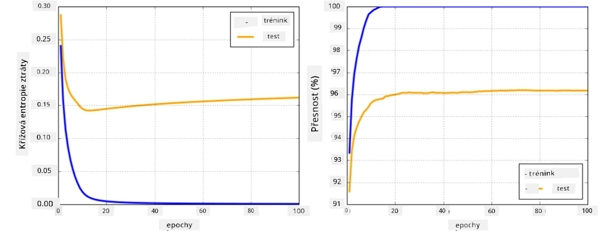

# Frameworky pro neuronové sítě

Jak jsme se již naučili, abychom mohli efektivně trénovat neuronové sítě, musíme udělat dvě věci:

* Pracovat s tensory, například násobit, sčítat a počítat některé funkce, jako sigmoid nebo softmax
* Vypočítat gradienty všech výrazů, abychom mohli provádět optimalizaci pomocí gradientního sestupu

## [Kvíz před lekcí](https://ff-quizzes.netlify.app/en/ai/quiz/9)

Zatímco knihovna `numpy` dokáže první část, potřebujeme nějaký mechanismus pro výpočet gradientů. V [našem frameworku](../04-OwnFramework/OwnFramework.ipynb), který jsme vyvinuli v předchozí sekci, jsme museli ručně naprogramovat všechny derivace funkcí uvnitř metody `backward`, která provádí zpětnou propagaci. Ideálně by nám framework měl umožnit vypočítat gradienty *jakéhokoliv výrazu*, který můžeme definovat.

Další důležitou věcí je schopnost provádět výpočty na GPU nebo jiných specializovaných výpočetních jednotkách, jako je [TPU](https://en.wikipedia.org/wiki/Tensor_Processing_Unit). Trénování hlubokých neuronových sítí vyžaduje *velké množství* výpočtů, a možnost paralelizovat tyto výpočty na GPU je velmi důležitá.

> ✅ Termín 'paralelizovat' znamená rozdělit výpočty mezi více zařízení.

V současnosti jsou nejpopulárnějšími frameworky pro neuronové sítě: [TensorFlow](http://TensorFlow.org) a [PyTorch](https://pytorch.org/). Oba poskytují nízkoúrovňové API pro práci s tensory na CPU i GPU. Nad nízkoúrovňovým API existuje také vysokoúrovňové API, nazývané [Keras](https://keras.io/) a [PyTorch Lightning](https://pytorchlightning.ai/) odpovídajícím způsobem.

Nízkoúrovňové API | [TensorFlow](http://TensorFlow.org) | [PyTorch](https://pytorch.org/)
------------------|-------------------------------------|--------------------------------
Vysokoúrovňové API| [Keras](https://keras.io/) | [PyTorch Lightning](https://pytorchlightning.ai/)

**Nízkoúrovňová API** v obou frameworcích umožňují vytvářet tzv. **výpočetní grafy**. Tento graf definuje, jak vypočítat výstup (obvykle ztrátovou funkci) s danými vstupními parametry, a může být odeslán k výpočtu na GPU, pokud je dostupné. Existují funkce pro diferenciaci tohoto výpočetního grafu a výpočet gradientů, které lze následně použít k optimalizaci parametrů modelu.

**Vysokoúrovňová API** považují neuronové sítě spíše za **sekvenci vrstev** a usnadňují konstrukci většiny neuronových sítí. Trénování modelu obvykle vyžaduje přípravu dat a následné volání funkce `fit`, která provede práci.

Vysokoúrovňové API umožňuje velmi rychle konstruovat typické neuronové sítě, aniž byste se museli starat o mnoho detailů. Na druhou stranu nízkoúrovňové API nabízí mnohem větší kontrolu nad procesem trénování, a proto se často používá ve výzkumu, když pracujete s novými architekturami neuronových sítí.

Je také důležité pochopit, že můžete používat obě API společně, například můžete vyvinout vlastní architekturu vrstvy pomocí nízkoúrovňového API a poté ji použít uvnitř větší sítě konstruované a trénované pomocí vysokoúrovňového API. Nebo můžete definovat síť pomocí vysokoúrovňového API jako sekvenci vrstev a poté použít vlastní nízkoúrovňovou trénovací smyčku k provedení optimalizace. Obě API používají stejné základní koncepty a jsou navrženy tak, aby spolu dobře fungovaly.

## Učení

V tomto kurzu nabízíme většinu obsahu jak pro PyTorch, tak pro TensorFlow. Můžete si vybrat preferovaný framework a projít pouze odpovídající notebooky. Pokud si nejste jisti, který framework zvolit, přečtěte si některé diskuse na internetu o **PyTorch vs. TensorFlow**. Můžete se také podívat na oba frameworky, abyste získali lepší představu.

Kde je to možné, použijeme vysokoúrovňová API pro jednoduchost. Nicméně věříme, že je důležité pochopit, jak neuronové sítě fungují od základů, proto na začátku začneme pracovat s nízkoúrovňovým API a tensory. Pokud však chcete začít rychle a nechcete trávit mnoho času učením těchto detailů, můžete je přeskočit a jít přímo do notebooků s vysokoúrovňovým API.

## ✍️ Cvičení: Frameworky

Pokračujte ve svém učení v následujících noteboocích:

Nízkoúrovňové API | [TensorFlow+Keras Notebook](IntroKerasTF.ipynb) | [PyTorch](IntroPyTorch.ipynb)
------------------|-------------------------------------|--------------------------------
Vysokoúrovňové API| [Keras](IntroKeras.ipynb) | *PyTorch Lightning*

Po zvládnutí frameworků si zopakujeme pojem přeučení.

# Přeučení

Přeučení je extrémně důležitý koncept v strojovém učení a je velmi důležité ho správně pochopit!

Zvažte následující problém aproximace 5 bodů (reprezentovaných `x` na grafech níže):

 | 
-------------------------|--------------------------
**Lineární model, 2 parametry** | **Nelineární model, 7 parametrů**
Chyba trénování = 5.3 | Chyba trénování = 0
Chyba validace = 5.1 | Chyba validace = 20

* Na levé straně vidíme dobrou aproximaci přímkou. Protože počet parametrů je přiměřený, model správně pochopí rozložení bodů.
* Na pravé straně je model příliš výkonný. Protože máme pouze 5 bodů a model má 7 parametrů, může se přizpůsobit tak, aby prošel všemi body, což způsobí, že chyba trénování bude 0. To však brání modelu pochopit správný vzor v datech, což vede k velmi vysoké chybě validace.

Je velmi důležité najít správnou rovnováhu mezi složitostí modelu (počtem parametrů) a počtem trénovacích vzorků.

## Proč dochází k přeučení

  * Nedostatek trénovacích dat
  * Příliš výkonný model
  * Příliš mnoho šumu ve vstupních datech

## Jak detekovat přeučení

Jak můžete vidět z grafu výše, přeučení lze detekovat velmi nízkou chybou trénování a vysokou chybou validace. Během trénování obvykle vidíme, že chyby trénování i validace začínají klesat, a poté v určitém bodě může chyba validace přestat klesat a začít stoupat. To bude znakem přeučení a indikátorem, že bychom pravděpodobně měli v tomto bodě zastavit trénování (nebo alespoň vytvořit snímek modelu).

## Jak zabránit přeučení

Pokud vidíte, že dochází k přeučení, můžete udělat následující:

 * Zvýšit množství trénovacích dat
 * Snížit složitost modelu
 * Použít nějakou [techniku regularizace](../../4-ComputerVision/08-TransferLearning/TrainingTricks.md), jako například [Dropout](../../4-ComputerVision/08-TransferLearning/TrainingTricks.md#Dropout), kterou si později probereme.

## Přeučení a kompromis mezi zkreslením a rozptylem

Přeučení je vlastně případ obecnějšího problému ve statistice nazývaného [kompromis mezi zkreslením a rozptylem](https://en.wikipedia.org/wiki/Bias%E2%80%93variance_tradeoff). Pokud zvažujeme možné zdroje chyb v našem modelu, můžeme vidět dva typy chyb:

* **Chyby zkreslení** jsou způsobeny tím, že náš algoritmus nedokáže správně zachytit vztah mezi trénovacími daty. Může to být důsledek toho, že náš model není dostatečně výkonný (**podtrénování**).
* **Chyby rozptylu**, které jsou způsobeny tím, že model aproximuje šum ve vstupních datech místo smysluplného vztahu (**přeučení**).

Během trénování se chyba zkreslení snižuje (jak se náš model učí aproximovat data) a chyba rozptylu se zvyšuje. Je důležité zastavit trénování - buď manuálně (když detekujeme přeučení), nebo automaticky (zavedením regularizace) - aby se zabránilo přeučení.

## Závěr

V této lekci jste se naučili rozdíly mezi různými API pro dva nejpopulárnější AI frameworky, TensorFlow a PyTorch. Kromě toho jste se naučili o velmi důležitém tématu, přeučení.

## 🚀 Výzva

V přiložených noteboocích najdete 'úkoly' na konci; projděte notebooky a splňte úkoly.

## [Kvíz po lekci](https://ff-quizzes.netlify.app/en/ai/quiz/10)

## Přehled & Samostudium

Proveďte výzkum na následující témata:

- TensorFlow
- PyTorch
- Přeučení

Zeptejte se sami sebe na následující otázky:

- Jaký je rozdíl mezi TensorFlow a PyTorch?
- Jaký je rozdíl mezi přeučením a podtrénováním?

## [Úkol](lab/README.md)

V tomto laboratorním cvičení máte za úkol vyřešit dva klasifikační problémy pomocí jedno- a vícevrstvých plně propojených sítí s využitím PyTorch nebo TensorFlow.

* [Instrukce](lab/README.md)
* [Notebook](lab/LabFrameworks.ipynb)

---

