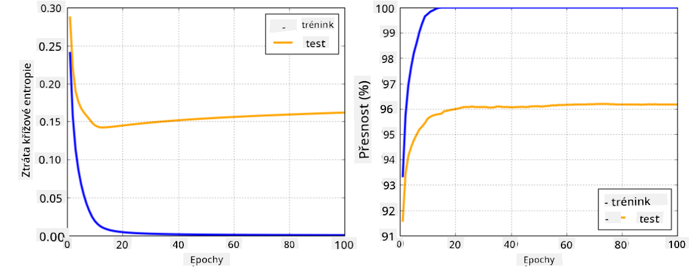

<!--
CO_OP_TRANSLATOR_METADATA:
{
  "original_hash": "2b544f20b796402507fb05a0df893323",
  "translation_date": "2025-08-25T23:50:18+00:00",
  "source_file": "lessons/3-NeuralNetworks/05-Frameworks/README.md",
  "language_code": "cs"
}
-->
# Frameworky pro neuronové sítě

Jak jsme se již naučili, abychom mohli efektivně trénovat neuronové sítě, musíme udělat dvě věci:

* Pracovat s tensory, např. násobit, sčítat a počítat některé funkce, jako je sigmoid nebo softmax
* Počítat gradienty všech výrazů, abychom mohli provádět optimalizaci pomocí gradientního sestupu

## [Kvíz před přednáškou](https://ff-quizzes.netlify.app/en/ai/quiz/9)

Zatímco knihovna `numpy` zvládne první část, potřebujeme nějaký mechanismus pro výpočet gradientů. V [našem frameworku](../../../../../lessons/3-NeuralNetworks/04-OwnFramework/OwnFramework.ipynb), který jsme vytvořili v předchozí sekci, jsme museli ručně programovat všechny derivace funkcí uvnitř metody `backward`, která provádí zpětnou propagaci. Ideálně by nám framework měl umožnit počítat gradienty *jakéhokoliv výrazu*, který můžeme definovat.

Další důležitou věcí je schopnost provádět výpočty na GPU nebo jiných specializovaných výpočetních jednotkách, jako je [TPU](https://en.wikipedia.org/wiki/Tensor_Processing_Unit). Trénování hlubokých neuronových sítí vyžaduje *obrovské množství* výpočtů, a možnost paralelizovat tyto výpočty na GPU je velmi důležitá.

> ✅ Termín 'paralelizovat' znamená rozdělit výpočty mezi více zařízení.

V současnosti jsou nejpopulárnějšími frameworky pro neuronové sítě: [TensorFlow](http://TensorFlow.org) a [PyTorch](https://pytorch.org/). Oba poskytují nízkoúrovňové API pro práci s tensory na CPU i GPU. Nad těmito nízkoúrovňovými API existují také vysokoúrovňová API, nazývaná [Keras](https://keras.io/) a [PyTorch Lightning](https://pytorchlightning.ai/).

Nízkoúrovňové API | [TensorFlow](http://TensorFlow.org) | [PyTorch](https://pytorch.org/)
------------------|-------------------------------------|--------------------------------
Vysokoúrovňové API| [Keras](https://keras.io/) | [PyTorch Lightning](https://pytorchlightning.ai/)

**Nízkoúrovňová API** v obou frameworcích umožňují vytvářet tzv. **výpočetní grafy**. Tento graf definuje, jak vypočítat výstup (obvykle ztrátovou funkci) s danými vstupními parametry a může být odeslán k výpočtu na GPU, pokud je k dispozici. Existují funkce pro diferenciaci tohoto výpočetního grafu a výpočet gradientů, které lze následně použít k optimalizaci parametrů modelu.

**Vysokoúrovňová API** považují neuronové sítě za **sekvenci vrstev** a usnadňují konstrukci většiny neuronových sítí. Trénování modelu obvykle vyžaduje přípravu dat a následné zavolání funkce `fit`, která provede potřebné operace.

Vysokoúrovňová API umožňují velmi rychle sestavit typické neuronové sítě, aniž byste se museli starat o mnoho detailů. Na druhou stranu nízkoúrovňová API poskytují mnohem větší kontrolu nad procesem trénování, a proto se často používají ve výzkumu, když pracujete s novými architekturami neuronových sítí.

Je také důležité pochopit, že můžete používat obě API společně, např. můžete vyvinout vlastní architekturu vrstvy s použitím nízkoúrovňového API a poté ji použít uvnitř větší sítě vytvořené a trénované pomocí vysokoúrovňového API. Nebo můžete definovat síť pomocí vysokoúrovňového API jako sekvenci vrstev a poté použít vlastní nízkoúrovňovou trénovací smyčku pro optimalizaci. Obě API používají stejné základní koncepty a jsou navržena tak, aby spolu dobře fungovala.

## Učení

V tomto kurzu nabízíme většinu obsahu jak pro PyTorch, tak pro TensorFlow. Můžete si vybrat preferovaný framework a projít pouze odpovídající notebooky. Pokud si nejste jisti, který framework zvolit, přečtěte si některé diskuse na internetu na téma **PyTorch vs. TensorFlow**. Můžete se také podívat na oba frameworky, abyste získali lepší představu.

Kde je to možné, použijeme pro jednoduchost vysokoúrovňová API. Nicméně věříme, že je důležité pochopit, jak neuronové sítě fungují od základů, a proto začínáme prací s nízkoúrovňovým API a tensory. Pokud však chcete začít rychle a nechcete trávit příliš mnoho času učením těchto detailů, můžete tyto části přeskočit a přejít rovnou k notebookům s vysokoúrovňovým API.

## ✍️ Cvičení: Frameworky

Pokračujte ve svém učení v následujících noteboocích:

Nízkoúrovňové API | [TensorFlow+Keras Notebook](../../../../../lessons/3-NeuralNetworks/05-Frameworks/IntroKerasTF.ipynb) | [PyTorch](../../../../../lessons/3-NeuralNetworks/05-Frameworks/IntroPyTorch.ipynb)
------------------|-------------------------------------|--------------------------------
Vysokoúrovňové API| [Keras](../../../../../lessons/3-NeuralNetworks/05-Frameworks/IntroKeras.ipynb) | *PyTorch Lightning*

Po zvládnutí frameworků si zopakujme pojem přeučení.

# Přeučení

Přeučení je extrémně důležitý koncept ve strojovém učení a je velmi důležité jej správně pochopit!

Zvažte následující problém aproximace 5 bodů (reprezentovaných `x` na grafech níže):

 | 
-------------------------|--------------------------
**Lineární model, 2 parametry** | **Nelineární model, 7 parametrů**
Chyba na trénovacích datech = 5.3 | Chyba na trénovacích datech = 0
Chyba na validačních datech = 5.1 | Chyba na validačních datech = 20

* Na levé straně vidíme dobrou aproximaci přímkou. Protože počet parametrů je přiměřený, model správně zachycuje rozložení bodů.
* Na pravé straně je model příliš výkonný. Protože máme pouze 5 bodů a model má 7 parametrů, může se přizpůsobit tak, aby prošel všemi body, což způsobí, že chyba na trénovacích datech bude 0. To však brání modelu pochopit správný vzor v datech, a proto je chyba na validačních datech velmi vysoká.

Je velmi důležité najít správnou rovnováhu mezi složitostí modelu (počtem parametrů) a počtem trénovacích vzorků.

## Proč dochází k přeučení

  * Nedostatek trénovacích dat
  * Příliš výkonný model
  * Příliš mnoho šumu ve vstupních datech

## Jak detekovat přeučení

Jak můžete vidět z grafu výše, přeučení lze detekovat velmi nízkou chybou na trénovacích datech a vysokou chybou na validačních datech. Během trénování obvykle vidíme, že chyby na trénovacích i validačních datech začínají klesat, ale v určitém bodě může chyba na validačních datech přestat klesat a začít růst. To bude známka přeučení a indikátor, že bychom měli pravděpodobně trénování v tomto bodě zastavit (nebo alespoň uložit aktuální stav modelu).

## Jak zabránit přeučení

Pokud zjistíte, že dochází k přeučení, můžete udělat následující:

 * Zvýšit množství trénovacích dat
 * Snížit složitost modelu
 * Použít nějakou [regularizační techniku](../../4-ComputerVision/08-TransferLearning/TrainingTricks.md), jako je [Dropout](../../4-ComputerVision/08-TransferLearning/TrainingTricks.md#Dropout), kterou si později probereme.

## Přeučení a kompromis mezi zkreslením a rozptylem

Přeučení je ve skutečnosti případ obecnějšího problému ve statistice nazývaného [kompromis mezi zkreslením a rozptylem](https://en.wikipedia.org/wiki/Bias%E2%80%93variance_tradeoff). Pokud vezmeme v úvahu možné zdroje chyb v našem modelu, můžeme rozlišit dva typy chyb:

* **Chyby způsobené zkreslením** jsou způsobeny tím, že náš algoritmus nedokáže správně zachytit vztah mezi trénovacími daty. Může to být důsledek toho, že náš model není dostatečně výkonný (**podtrénování**).
* **Chyby způsobené rozptylem**, které jsou způsobeny tím, že model aproximuje šum ve vstupních datech místo smysluplného vztahu (**přeučení**).

Během trénování se chyba způsobená zkreslením snižuje (jak se model učí aproximovat data) a chyba způsobená rozptylem roste. Je důležité zastavit trénování - buď manuálně (když detekujeme přeučení), nebo automaticky (zavedením regularizace) - aby se zabránilo přeučení.

## Závěr

V této lekci jste se dozvěděli o rozdílech mezi různými API pro dva nejpopulárnější AI frameworky, TensorFlow a PyTorch. Kromě toho jste se naučili o velmi důležitém tématu, přeučení.

## 🚀 Výzva

V přiložených noteboocích najdete na konci 'úkoly'; projděte si notebooky a splňte úkoly.

## [Kvíz po přednášce](https://ff-quizzes.netlify.app/en/ai/quiz/10)

## Přehled a samostudium

Proveďte výzkum na následující témata:

- TensorFlow
- PyTorch
- Přeučení

Zeptejte se sami sebe na následující otázky:

- Jaký je rozdíl mezi TensorFlow a PyTorch?
- Jaký je rozdíl mezi přeučením a podtrénováním?

## [Zadání](lab/README.md)

V tomto laboratorním cvičení máte za úkol vyřešit dva klasifikační problémy pomocí jednovrstvých a vícevrstvých plně propojených sítí s využitím PyTorch nebo TensorFlow.

* [Instrukce](lab/README.md)
* [Notebook](../../../../../lessons/3-NeuralNetworks/05-Frameworks/lab/LabFrameworks.ipynb)

**Prohlášení:**  
Tento dokument byl přeložen pomocí služby pro automatický překlad [Co-op Translator](https://github.com/Azure/co-op-translator). Ačkoli se snažíme o přesnost, mějte prosím na paměti, že automatické překlady mohou obsahovat chyby nebo nepřesnosti. Původní dokument v jeho původním jazyce by měl být považován za autoritativní zdroj. Pro důležité informace se doporučuje profesionální lidský překlad. Neodpovídáme za žádná nedorozumění nebo nesprávné interpretace vyplývající z použití tohoto překladu.