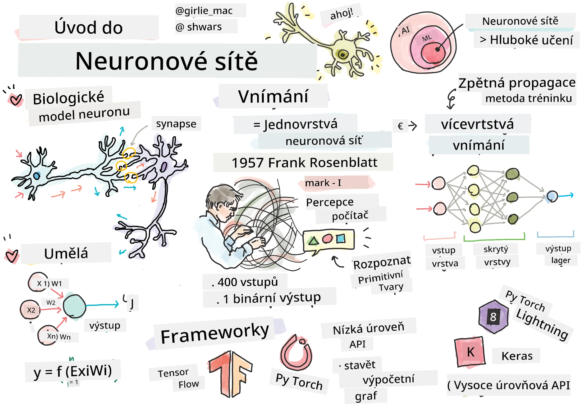
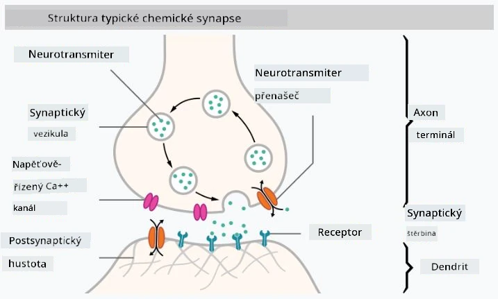
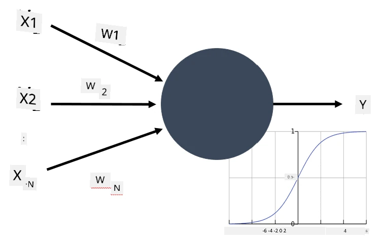

# Úvod do neuronových sítí

Jak jsme si řekli v úvodu, jedním ze způsobů, jak dosáhnout inteligence, je trénovat **počítačový model** nebo **umělý mozek**. Od poloviny 20. století vědci zkoušeli různé matematické modely, až se v posledních letech ukázalo, že tento směr je velmi úspěšný. Tyto matematické modely mozku se nazývají **neuronové sítě**.

> Neuronové sítě se někdy nazývají *Umělé neuronové sítě* (Artificial Neural Networks, ANNs), aby bylo jasné, že mluvíme o modelech, nikoli o skutečných sítích neuronů.

## Strojové učení

Neuronové sítě jsou součástí širší disciplíny nazvané **Strojové učení**, jejímž cílem je využít data k trénování počítačových modelů, které dokážou řešit problémy. Strojové učení tvoří velkou část umělé inteligence, avšak klasické strojové učení v tomto kurzu neprobíráme.

> Navštivte náš samostatný **[Strojové učení pro začátečníky](http://github.com/microsoft/ml-for-beginners)** kurz, kde se dozvíte více o klasickém strojovém učení.

Ve strojovém učení předpokládáme, že máme nějakou datovou sadu příkladů **X** a odpovídající výstupní hodnoty **Y**. Příklady jsou často N-dimenzionální vektory, které se skládají z **atributů**, a výstupy se nazývají **štítky**.

Budeme se zabývat dvěma nejběžnějšími problémy strojového učení:

* **Klasifikace**, kde je třeba zařadit vstupní objekt do dvou nebo více tříd.
* **Regrese**, kde je třeba předpovědět číselnou hodnotu pro každý z vstupních vzorků.

> Při reprezentaci vstupů a výstupů jako tenzorů je vstupní datová sada matice o velikosti M&times;N, kde M je počet vzorků a N je počet atributů. Výstupní štítky Y jsou vektor o velikosti M.

V tomto kurzu se zaměříme pouze na modely neuronových sítí.

## Model neuronu

Z biologie víme, že náš mozek se skládá z nervových buněk (neuronů), z nichž každá má několik "vstupů" (dendritů) a jeden "výstup" (axon). Dendrity i axony mohou vést elektrické signály a spojení mezi nimi — známá jako synapse — mohou vykazovat různé stupně vodivosti, které jsou regulovány neurotransmitery.

 | 
----|----
Skutečný neuron *([Obrázek](https://en.wikipedia.org/wiki/Synapse#/media/File:SynapseSchematic_lines.svg) z Wikipedie)* | Umělý neuron *(Obrázek od autora)*

Nejjednodušší matematický model neuronu tedy obsahuje několik vstupů X1, ..., XN a jeden výstup Y, a řadu vah W1, ..., WN. Výstup se vypočítá jako:

kde f je nějaká nelineární **aktivační funkce**.

> Rané modely neuronu byly popsány v klasickém článku [A logical calculus of the ideas immanent in nervous activity](https://www.cs.cmu.edu/~./epxing/Class/10715/reading/McCulloch.and.Pitts.pdf) od Warrena McCullocka a Waltera Pittse z roku 1943. Donald Hebb ve své knize "[The Organization of Behavior: A Neuropsychological Theory](https://books.google.com/books?id=VNetYrB8EBoC)" navrhl způsob, jak tyto sítě trénovat.

## V této sekci

V této sekci se naučíme:
* [Perceptron](03-Perceptron/README.md), jeden z nejstarších modelů neuronových sítí pro dvoutřídovou klasifikaci
* [Vícevrstvé sítě](04-OwnFramework/README.md) s doprovodným notebookem [jak vytvořit vlastní framework](04-OwnFramework/OwnFramework.ipynb)
* [Frameworky neuronových sítí](05-Frameworks/README.md), s těmito notebooky: [PyTorch](05-Frameworks/IntroPyTorch.ipynb) a [Keras/Tensorflow](05-Frameworks/IntroKerasTF.ipynb)
* [Přeučení](../../../../lessons/3-NeuralNetworks/05-Frameworks)

---

**Prohlášení**:  
Tento dokument byl přeložen pomocí služby AI pro překlad [Co-op Translator](https://github.com/Azure/co-op-translator). I když se snažíme o přesnost, mějte prosím na paměti, že automatizované překlady mohou obsahovat chyby nebo nepřesnosti. Původní dokument v jeho rodném jazyce by měl být považován za autoritativní zdroj. Pro důležité informace se doporučuje profesionální lidský překlad. Nejsme zodpovědní za jakékoli nedorozumění nebo nesprávné interpretace vyplývající z použití tohoto překladu.