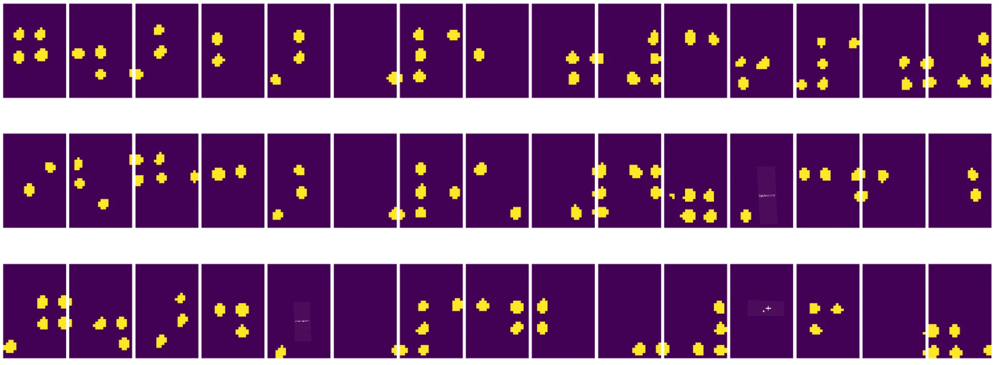
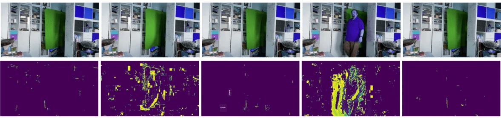

# Úvod do počítačového vidění

[Počítačové vidění](https://wikipedia.org/wiki/Computer_vision) je obor, jehož cílem je umožnit počítačům získat vysokou úroveň porozumění digitálním obrazům. Toto je poměrně široká definice, protože *porozumění* může znamenat mnoho různých věcí, včetně nalezení objektu na obrázku (**detekce objektů**), pochopení, co se děje (**detekce událostí**), popisu obrázku textem nebo rekonstrukce scény ve 3D. Existují také speciální úkoly související s lidskými obrazy: odhad věku a emocí, detekce a identifikace obličeje, odhad 3D pozice a další.

## [Kvíz před přednáškou](https://ff-quizzes.netlify.app/en/ai/quiz/11)

Jedním z nejjednodušších úkolů počítačového vidění je **klasifikace obrázků**.

Počítačové vidění je často považováno za odvětví AI. V současnosti je většina úkolů počítačového vidění řešena pomocí neuronových sítí. V této sekci se dozvíme více o speciálním typu neuronových sítí používaných pro počítačové vidění, [konvolučních neuronových sítích](../07-ConvNets/README.md).

Nicméně, než obrázek předáte neuronové síti, v mnoha případech má smysl použít některé algoritmické techniky k jeho vylepšení.

Existuje několik knihoven v Pythonu dostupných pro zpracování obrázků:

* **[imageio](https://imageio.readthedocs.io/en/stable/)** lze použít pro čtení/zápis různých formátů obrázků. Podporuje také ffmpeg, užitečný nástroj pro převod video snímků na obrázky.
* **[Pillow](https://pillow.readthedocs.io/en/stable/index.html)** (známý také jako PIL) je o něco výkonnější a podporuje také některé manipulace s obrázky, jako je morfování, úpravy palety a další.
* **[OpenCV](https://opencv.org/)** je výkonná knihovna pro zpracování obrázků napsaná v C++, která se stala *de facto* standardem pro zpracování obrázků. Má pohodlné rozhraní pro Python.
* **[dlib](http://dlib.net/)** je knihovna v C++, která implementuje mnoho algoritmů strojového učení, včetně některých algoritmů počítačového vidění. Má také rozhraní pro Python a lze ji použít pro náročné úkoly, jako je detekce obličeje a detekce klíčových bodů na obličeji.

## OpenCV

[OpenCV](https://opencv.org/) je považováno za *de facto* standard pro zpracování obrázků. Obsahuje mnoho užitečných algoritmů implementovaných v C++. OpenCV můžete volat i z Pythonu.

Dobré místo pro učení OpenCV je [tento kurz Learn OpenCV](https://learnopencv.com/getting-started-with-opencv/). V našem kurzu není cílem naučit se OpenCV, ale ukázat vám některé příklady, kdy jej lze použít a jak.

### Načítání obrázků

Obrázky v Pythonu lze pohodlně reprezentovat pomocí NumPy polí. Například šedotónové obrázky o velikosti 320x200 pixelů by byly uloženy v poli 200x320 a barevné obrázky stejného rozměru by měly tvar 200x320x3 (pro 3 barevné kanály). K načtení obrázku můžete použít následující kód:

```python
import cv2
import matplotlib.pyplot as plt

im = cv2.imread('image.jpeg')
plt.imshow(im)
```

Tradičně OpenCV používá kódování BGR (modrá-zelená-červená) pro barevné obrázky, zatímco ostatní nástroje v Pythonu používají tradičnější RGB (červená-zelená-modrá). Aby obrázek vypadal správně, je třeba jej převést do barevného prostoru RGB, buď přeházením rozměrů v poli NumPy, nebo voláním funkce OpenCV:

```python
im = cv2.cvtColor(im,cv2.COLOR_BGR2RGB)
```

Stejnou funkci `cvtColor` lze použít k provádění dalších transformací barevného prostoru, jako je převod obrázku na šedotónový nebo na barevný prostor HSV (odstín-sytost-hodnota).

OpenCV můžete také použít k načítání videa snímek po snímku – příklad je uveden v cvičení [OpenCV Notebook](OpenCV.ipynb).

### Zpracování obrázků

Než obrázek předáte neuronové síti, můžete chtít provést několik kroků předzpracování. OpenCV dokáže mnoho věcí, včetně:

* **Změny velikosti** obrázku pomocí `im = cv2.resize(im, (320,200),interpolation=cv2.INTER_LANCZOS)`
* **Rozmazání** obrázku pomocí `im = cv2.medianBlur(im,3)` nebo `im = cv2.GaussianBlur(im, (3,3), 0)`
* Změna **jasu a kontrastu** obrázku lze provést manipulací s poli NumPy, jak je popsáno [v této poznámce na Stackoverflow](https://stackoverflow.com/questions/39308030/how-do-i-increase-the-contrast-of-an-image-in-python-opencv).
* Použití [prahování](https://docs.opencv.org/4.x/d7/d4d/tutorial_py_thresholding.html) voláním funkcí `cv2.threshold`/`cv2.adaptiveThreshold`, což je často výhodnější než úprava jasu nebo kontrastu.
* Použití různých [transformací](https://docs.opencv.org/4.5.5/da/d6e/tutorial_py_geometric_transformations.html) na obrázek:
    - **[Afinní transformace](https://docs.opencv.org/4.5.5/d4/d61/tutorial_warp_affine.html)** mohou být užitečné, pokud potřebujete kombinovat rotaci, změnu velikosti a zkosení obrázku a znáte zdrojovou a cílovou polohu tří bodů na obrázku. Afinní transformace zachovávají rovnoběžné čáry rovnoběžné.
    - **[Perspektivní transformace](https://medium.com/analytics-vidhya/opencv-perspective-transformation-9edffefb2143)** mohou být užitečné, když znáte zdrojové a cílové pozice 4 bodů na obrázku. Například pokud pořídíte fotografii obdélníkového dokumentu pomocí kamery smartphonu z určitého úhlu a chcete vytvořit obdélníkový obrázek samotného dokumentu.
* Pochopení pohybu uvnitř obrázku pomocí **[optického toku](https://docs.opencv.org/4.5.5/d4/dee/tutorial_optical_flow.html)**.

## Příklady použití počítačového vidění

V našem [OpenCV Notebook](OpenCV.ipynb) uvádíme některé příklady, kdy lze počítačové vidění použít k provádění konkrétních úkolů:

* **Předzpracování fotografie Braillovy knihy**. Zaměřujeme se na to, jak můžeme použít prahování, detekci prvků, perspektivní transformaci a manipulace s NumPy k oddělení jednotlivých Braillových symbolů pro další klasifikaci neuronovou sítí.

 |  | 
----|-----|-----

> Obrázek z [OpenCV.ipynb](OpenCV.ipynb)

* **Detekce pohybu ve videu pomocí rozdílu snímků**. Pokud je kamera pevná, pak by snímky z kamerového záznamu měly být velmi podobné. Protože snímky jsou reprezentovány jako pole, pouhým odečtením těchto polí pro dva po sobě jdoucí snímky získáme rozdíl pixelů, který by měl být nízký pro statické snímky a stoupat, jakmile dojde k výraznému pohybu na obrázku.



> Obrázek z [OpenCV.ipynb](OpenCV.ipynb)

* **Detekce pohybu pomocí optického toku**. [Optický tok](https://docs.opencv.org/3.4/d4/dee/tutorial_optical_flow.html) nám umožňuje pochopit, jak se jednotlivé pixely na video snímcích pohybují. Existují dva typy optického toku:

   - **Hustý optický tok** počítá vektorové pole, které ukazuje, kam se každý pixel pohybuje.
   - **Řídký optický tok** je založen na výběru některých výrazných prvků na obrázku (např. hran) a sestavení jejich trajektorie snímek po snímku.


> Obrázek z [OpenCV.ipynb](OpenCV.ipynb)

## ✍️ Příkladové notebooky: OpenCV [vyzkoušejte OpenCV v akci](OpenCV.ipynb)

Pojďme provést několik experimentů s OpenCV prozkoumáním [OpenCV Notebook](OpenCV.ipynb)

## Závěr

Někdy lze relativně složité úkoly, jako je detekce pohybu nebo detekce špičky prstu, vyřešit čistě pomocí počítačového vidění. Proto je velmi užitečné znát základní techniky počítačového vidění a co knihovny jako OpenCV dokážou.

## 🚀 Výzva

Podívejte se na [toto video](https://docs.microsoft.com/shows/ai-show/ai-show--2021-opencv-ai-competition--grand-prize-winners--cortic-tigers--episode-32?WT.mc_id=academic-77998-cacaste) z AI show, kde se dozvíte o projektu Cortic Tigers a o tom, jak vytvořili řešení založené na blocích pro demokratizaci úkolů počítačového vidění prostřednictvím robota. Proveďte výzkum dalších podobných projektů, které pomáhají novým studentům vstoupit do tohoto oboru.

## [Kvíz po přednášce](https://ff-quizzes.netlify.app/en/ai/quiz/12)

## Přehled a samostudium

Přečtěte si více o optickém toku [v tomto skvělém tutoriálu](https://learnopencv.com/optical-flow-in-opencv/).

## [Úkol](lab/README.md)

V tomto laboratorním cvičení pořídíte video s jednoduchými gesty a vaším cílem bude extrahovat pohyby nahoru/dolů/vlevo/vpravo pomocí optického toku.


---

