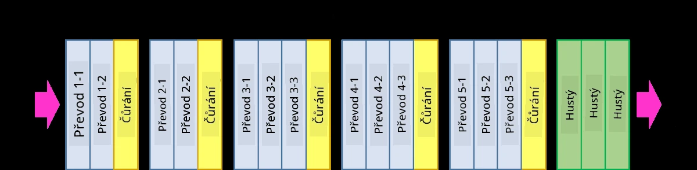
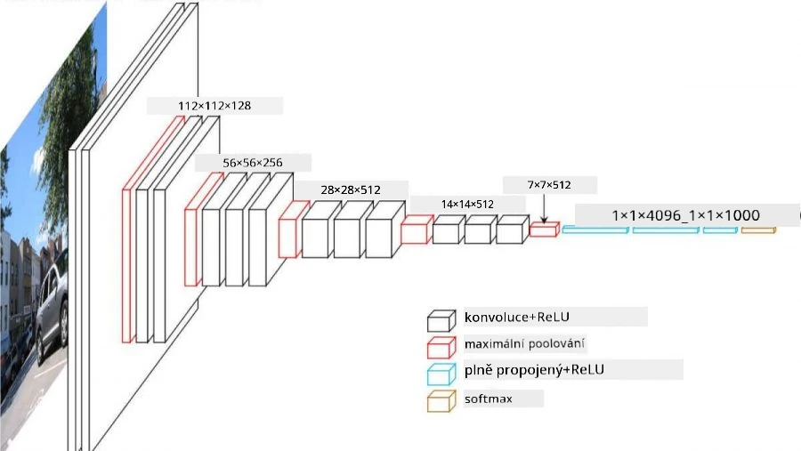
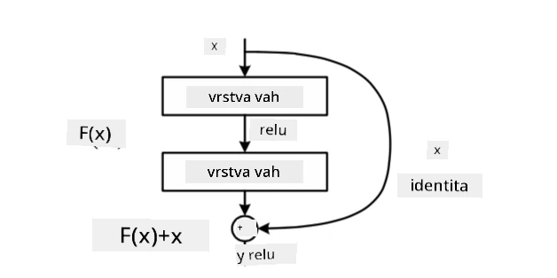
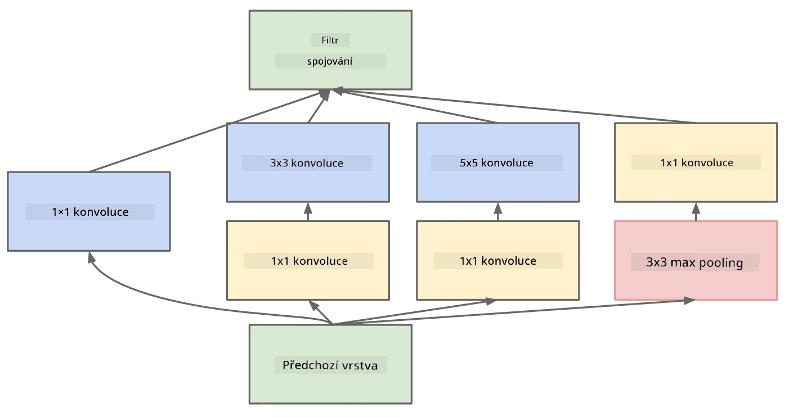

# Dobře známé architektury CNN

### VGG-16

VGG-16 je síť, která dosáhla 92,7% přesnosti v top-5 klasifikaci ImageNet v roce 2014. Má následující strukturu vrstev:

Jak můžete vidět, VGG sleduje tradiční pyramidovou architekturu, což je sekvence vrstev konvoluce a pooling.

> Obrázek z [Researchgate](https://www.researchgate.net/figure/Vgg16-model-structure-To-get-the-VGG-NIN-model-we-replace-the-2-nd-4-th-6-th-7-th_fig2_335194493)

### ResNet

ResNet je rodina modelů navržená Microsoft Research v roce 2015. Hlavní myšlenkou ResNet je použití **reziduálních bloků**:

> Obrázek z [tohoto článku](https://arxiv.org/pdf/1512.03385.pdf)

Důvodem použití identity pass-through je, aby naše vrstva předpovídala **rozdíl** mezi výsledkem předchozí vrstvy a výstupem reziduálního bloku - odtud název *reziduální*. Tyto bloky se mnohem snadněji trénují a lze z nich sestavit sítě s několika stovkami těchto bloků (nejběžnější varianty jsou ResNet-52, ResNet-101 a ResNet-152).

Tuto síť si také můžete představit jako schopnou přizpůsobit svou složitost datové sadě. Na začátku, když začínáte síť trénovat, jsou hodnoty vah malé a většina signálu prochází přes identity vrstvy. Jak trénink pokračuje a váhy se zvětšují, roste význam parametrů sítě a síť se přizpůsobuje tak, aby poskytla potřebnou expresivní sílu pro správnou klasifikaci tréninkových obrázků.

### Google Inception

Architektura Google Inception posouvá tuto myšlenku o krok dále a buduje každou vrstvu sítě jako kombinaci několika různých cest:

> Obrázek z [Researchgate](https://www.researchgate.net/figure/Inception-module-with-dimension-reductions-left-and-schema-for-Inception-ResNet-v1_fig2_355547454)

Zde je třeba zdůraznit roli konvolucí 1x1, protože na první pohled nedávají smysl. Proč bychom měli procházet obrázek filtrem 1x1? Musíte si však uvědomit, že konvoluční filtry pracují také s několika hloubkovými kanály (původně - RGB barvy, v následujících vrstvách - kanály pro různé filtry) a konvoluce 1x1 se používá k míchání těchto vstupních kanálů pomocí různých trénovatelných vah. Může být také vnímána jako downsampling (pooling) přes dimenzi kanálu.

Zde je [dobrý blogový příspěvek](https://medium.com/analytics-vidhya/talented-mr-1x1-comprehensive-look-at-1x1-convolution-in-deep-learning-f6b355825578) na toto téma a [původní článek](https://arxiv.org/pdf/1312.4400.pdf).

### MobileNet

MobileNet je rodina modelů s menší velikostí, vhodná pro mobilní zařízení. Použijte je, pokud máte omezené zdroje a můžete obětovat trochu přesnosti. Hlavní myšlenkou je tzv. **hloubkově oddělitelná konvoluce**, která umožňuje reprezentovat konvoluční filtry jako kompozici prostorových konvolucí a konvoluce 1x1 přes hloubkové kanály. To výrazně snižuje počet parametrů, což činí síť menší a také snadněji trénovatelnou s menším množstvím dat.

Zde je [dobrý blogový příspěvek o MobileNet](https://medium.com/analytics-vidhya/image-classification-with-mobilenet-cc6fbb2cd470).

## Závěr

V této jednotce jste se naučili hlavní koncept za neuronovými sítěmi pro počítačové vidění - konvolučními sítěmi. Architektury používané v reálném světě, které pohánějí klasifikaci obrázků, detekci objektů a dokonce i generování obrázků, jsou všechny založeny na CNN, jen s více vrstvami a některými dalšími tréninkovými triky.

## 🚀 Výzva

V přiložených noteboocích jsou na konci poznámky o tom, jak dosáhnout vyšší přesnosti. Proveďte několik experimentů a zjistěte, zda můžete dosáhnout vyšší přesnosti.

## [Kvíz po přednášce](https://ff-quizzes.netlify.app/en/ai/quiz/14)

## Přehled a samostudium

I když se CNN nejčastěji používají pro úlohy počítačového vidění, obecně jsou dobré pro extrakci vzorů pevné velikosti. Například pokud pracujeme se zvuky, můžeme také chtít použít CNN k hledání specifických vzorů v audio signálu - v takovém případě by filtry byly jednorozměrné (a tato CNN by se nazývala 1D-CNN). Někdy se také používá 3D-CNN k extrakci vlastností v vícerozměrném prostoru, například k detekci určitých událostí na videu - CNN může zachytit určité vzory změn vlastností v čase. Proveďte přehled a samostudium o dalších úlohách, které lze s CNN provádět.

## [Úkol](lab/README.md)

V tomto laboratorním cvičení máte za úkol klasifikovat různé plemena koček a psů. Tyto obrázky jsou složitější než dataset MNIST, mají vyšší rozměry a je zde více než 10 tříd.

---

