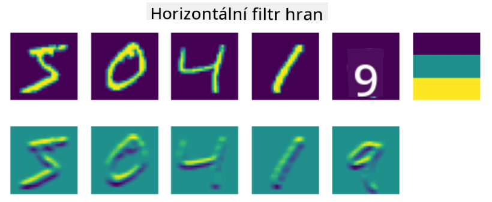

<!--
CO_OP_TRANSLATOR_METADATA:
{
  "original_hash": "088837b42b7d99198bf62db8a42411e0",
  "translation_date": "2025-08-25T22:51:39+00:00",
  "source_file": "lessons/4-ComputerVision/07-ConvNets/README.md",
  "language_code": "cs"
}
-->
# Konvoluční neuronové sítě

Už jsme viděli, že neuronové sítě jsou poměrně dobré při práci s obrázky, a dokonce i jednovrstvý perceptron dokáže rozpoznat ručně psané číslice z datasetu MNIST s přiměřenou přesností. Dataset MNIST je však velmi specifický – všechna čísla jsou vycentrovaná uvnitř obrázku, což úlohu zjednodušuje.

## [Kvíz před přednáškou](https://red-field-0a6ddfd03.1.azurestaticapps.net/quiz/107)

V reálném světě chceme být schopni rozpoznat objekty na obrázku bez ohledu na jejich přesnou polohu. Počítačové vidění se liší od obecné klasifikace, protože když se snažíme najít určitý objekt na obrázku, prohledáváme obraz a hledáme specifické **vzory** a jejich kombinace. Například při hledání kočky bychom mohli nejprve hledat horizontální linie, které mohou tvořit vousky, a poté určitá kombinace vousků nám může říct, že se jedná o obrázek kočky. Relativní poloha a přítomnost určitých vzorů jsou důležité, nikoli jejich přesná poloha na obrázku.

K extrakci vzorů použijeme pojem **konvolučních filtrů**. Jak víte, obrázek je reprezentován jako 2D matice nebo 3D tenzor s barevnou hloubkou. Aplikace filtru znamená, že vezmeme relativně malou matici **jádra filtru** a pro každý pixel v původním obrázku vypočítáme vážený průměr s okolními body. Můžeme si to představit jako malé okno, které se posouvá po celém obrázku a průměruje všechny pixely podle vah v matici jádra filtru.

 | 
----|----

> Obrázek od Dmitry Soshnikov

Například pokud aplikujeme 3x3 vertikální a horizontální filtry hran na číslice z MNIST, získáme zvýraznění (např. vysoké hodnoty) tam, kde jsou vertikální a horizontální hrany v původním obrázku. Tyto dva filtry tedy mohou být použity k "hledání" hran. Podobně můžeme navrhnout různé filtry pro hledání jiných nízkoúrovňových vzorů:

> Obrázek [Leung-Malik Filter Bank](https://www.robots.ox.ac.uk/~vgg/research/texclass/filters.html)

Nicméně, zatímco můžeme navrhnout filtry pro extrakci některých vzorů ručně, můžeme také navrhnout síť tak, aby se vzory učila automaticky. To je jedna z hlavních myšlenek za CNN.

## Hlavní myšlenky za CNN

Fungování CNN je založeno na následujících důležitých myšlenkách:

* Konvoluční filtry dokážou extrahovat vzory
* Síť můžeme navrhnout tak, aby se filtry učily automaticky
* Stejný přístup můžeme použít k hledání vzorů ve vysokoúrovňových prvcích, nejen v původním obrázku. Extrakce vlastností v CNN tedy funguje na hierarchii vlastností, počínaje nízkoúrovňovými kombinacemi pixelů až po vysokoúrovňové kombinace částí obrázku.

> Obrázek z [práce Hislop-Lynch](https://www.semanticscholar.org/paper/Computer-vision-based-pedestrian-trajectory-Hislop-Lynch/26e6f74853fc9bbb7487b06dc2cf095d36c9021d), založený na [jejich výzkumu](https://dl.acm.org/doi/abs/10.1145/1553374.1553453)

## ✍️ Cvičení: Konvoluční neuronové sítě

Pokračujme v průzkumu, jak konvoluční neuronové sítě fungují a jak můžeme dosáhnout trénovatelných filtrů, prostřednictvím následujících notebooků:

* [Konvoluční neuronové sítě - PyTorch](../../../../../lessons/4-ComputerVision/07-ConvNets/ConvNetsPyTorch.ipynb)
* [Konvoluční neuronové sítě - TensorFlow](../../../../../lessons/4-ComputerVision/07-ConvNets/ConvNetsTF.ipynb)

## Pyramidová architektura

Většina CNN používaných pro zpracování obrázků následuje tzv. pyramidovou architekturu. První konvoluční vrstva aplikovaná na původní obrázky obvykle obsahuje relativně malý počet filtrů (8-16), které odpovídají různým kombinacím pixelů, jako jsou horizontální/vertikální linie nebo tahy. Na další úrovni snižujeme prostorovou dimenzi sítě a zvyšujeme počet filtrů, což odpovídá většímu počtu možných kombinací jednoduchých vlastností. S každou vrstvou, jak se blížíme k finálnímu klasifikátoru, se prostorové rozměry obrázku zmenšují a počet filtrů roste.

Jako příklad se podívejme na architekturu VGG-16, sítě, která dosáhla 92,7% přesnosti v top-5 klasifikaci ImageNet v roce 2014:

> Obrázek z [Researchgate](https://www.researchgate.net/figure/Vgg16-model-structure-To-get-the-VGG-NIN-model-we-replace-the-2-nd-4-th-6-th-7-th_fig2_335194493)

## Nejznámější architektury CNN

[Pokračujte ve studiu nejznámějších architektur CNN](CNN_Architectures.md)

**Prohlášení:**  
Tento dokument byl přeložen pomocí služby pro automatický překlad [Co-op Translator](https://github.com/Azure/co-op-translator). Ačkoli se snažíme o přesnost, mějte prosím na paměti, že automatické překlady mohou obsahovat chyby nebo nepřesnosti. Původní dokument v jeho původním jazyce by měl být považován za autoritativní zdroj. Pro důležité informace se doporučuje profesionální lidský překlad. Neodpovídáme za žádná nedorozumění nebo nesprávné interpretace vyplývající z použití tohoto překladu.