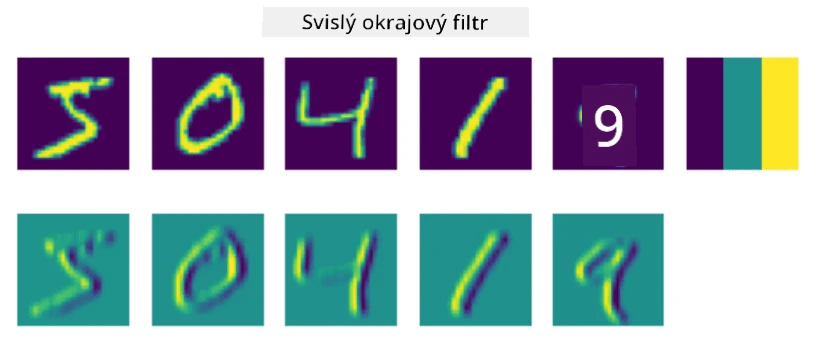
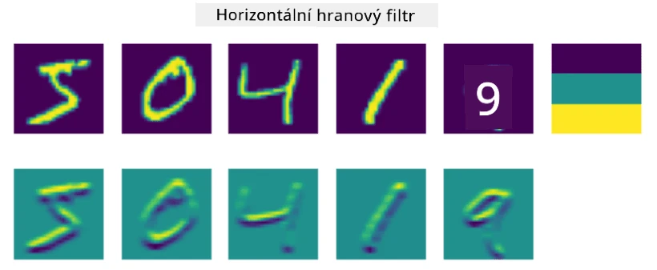
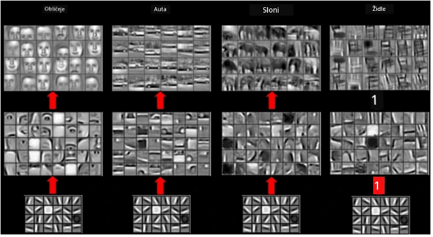

# Konvoluční neuronové sítě

Již jsme viděli, že neuronové sítě jsou poměrně dobré při práci s obrázky, a dokonce i jednovrstvý perceptron dokáže rozpoznat ručně psané číslice z datasetu MNIST s přijatelnou přesností. Nicméně dataset MNIST je velmi specifický, protože všechna čísla jsou vycentrována uvnitř obrázku, což úkol značně zjednodušuje.

## [Kvíz před přednáškou](https://ff-quizzes.netlify.app/en/ai/quiz/13)

V reálném životě chceme být schopni rozpoznat objekty na obrázku bez ohledu na jejich přesnou polohu v obraze. Počítačové vidění se liší od obecné klasifikace, protože když se snažíme najít určitý objekt na obrázku, prohledáváme obraz a hledáme specifické **vzory** a jejich kombinace. Například při hledání kočky můžeme nejprve hledat horizontální linie, které mohou tvořit vousy, a následně určitá kombinace vousů nám může říci, že se jedná o obrázek kočky. Důležitá je relativní poloha a přítomnost určitých vzorů, nikoliv jejich přesná poloha na obrázku.

K extrakci vzorů použijeme koncept **konvolučních filtrů**. Jak víte, obrázek je reprezentován jako 2D-matice nebo 3D-tensor s barevnou hloubkou. Aplikace filtru znamená, že vezmeme relativně malou matici **filtračního jádra** a pro každý pixel v původním obrázku vypočítáme vážený průměr s okolními body. Můžeme si to představit jako malé okno, které se posouvá po celém obrázku a průměruje všechny pixely podle vah v matici filtračního jádra.

 | 
----|----

> Obrázek od Dmitry Soshnikov

Například pokud aplikujeme 3x3 vertikální a horizontální filtry hran na číslice z datasetu MNIST, můžeme získat zvýraznění (např. vysoké hodnoty) tam, kde jsou vertikální a horizontální hrany v původním obrázku. Tyto dva filtry tedy mohou být použity k "hledání" hran. Podobně můžeme navrhnout různé filtry k hledání jiných nízkoúrovňových vzorů:

> Obrázek z [Leung-Malik Filter Bank](https://www.robots.ox.ac.uk/~vgg/research/texclass/filters.html)

Nicméně, zatímco můžeme filtry navrhnout ručně, aby extrahovaly určité vzory, můžeme také navrhnout síť tak, aby se vzory naučila automaticky. To je jedna z hlavních myšlenek za CNN.

## Hlavní myšlenky CNN

Fungování CNN je založeno na následujících důležitých principech:

* Konvoluční filtry mohou extrahovat vzory
* Síť můžeme navrhnout tak, aby se filtry učily automaticky
* Stejný přístup můžeme použít k hledání vzorů ve vysokoúrovňových rysech, nejen v původním obrázku. Extrakce rysů pomocí CNN tedy funguje na hierarchii rysů, počínaje nízkoúrovňovými kombinacemi pixelů až po vysokoúrovňové kombinace částí obrázku.

> Obrázek z [práce Hislop-Lynch](https://www.semanticscholar.org/paper/Computer-vision-based-pedestrian-trajectory-Hislop-Lynch/26e6f74853fc9bbb7487b06dc2cf095d36c9021d), založené na [jejich výzkumu](https://dl.acm.org/doi/abs/10.1145/1553374.1553453)

## ✍️ Cvičení: Konvoluční neuronové sítě

Pokračujme v zkoumání, jak konvoluční neuronové sítě fungují a jak můžeme dosáhnout trénovatelných filtrů, prostřednictvím následujících notebooků:

* [Konvoluční neuronové sítě - PyTorch](ConvNetsPyTorch.ipynb)
* [Konvoluční neuronové sítě - TensorFlow](ConvNetsTF.ipynb)

## Pyramidová architektura

Většina CNN používaných pro zpracování obrázků následuje tzv. pyramidovou architekturu. První konvoluční vrstva aplikovaná na původní obrázky obvykle obsahuje relativně nízký počet filtrů (8-16), které odpovídají různým kombinacím pixelů, jako jsou horizontální/vertikální linie nebo tahy. Na další úrovni snižujeme prostorovou dimenzi sítě a zvyšujeme počet filtrů, což odpovídá více možným kombinacím jednoduchých rysů. S každou vrstvou, jak se blížíme k finálnímu klasifikátoru, prostorové dimenze obrázku klesají a počet filtrů roste.

Jako příklad se podívejme na architekturu VGG-16, sítě, která dosáhla 92,7% přesnosti v top-5 klasifikaci ImageNetu v roce 2014:

> Obrázek z [Researchgate](https://www.researchgate.net/figure/Vgg16-model-structure-To-get-the-VGG-NIN-model-we-replace-the-2-nd-4-th-6-th-7-th_fig2_335194493)

## Nejznámější architektury CNN

[Pokračujte ve studiu nejznámějších architektur CNN](CNN_Architectures.md)

---

