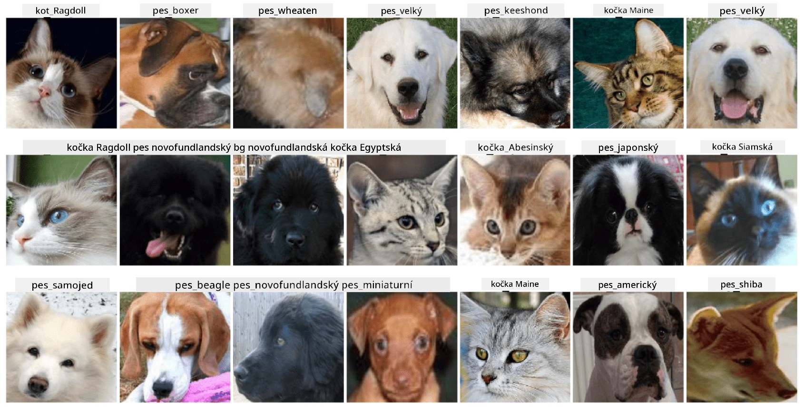

# Klasifikace obličejů domácích mazlíčků

Laboratorní úkol z [AI for Beginners Curriculum](https://github.com/microsoft/ai-for-beginners).

## Úkol

Představte si, že potřebujete vyvinout aplikaci pro školku domácích mazlíčků, která by katalogizovala všechny mazlíčky. Jednou z úžasných funkcí takové aplikace by bylo automatické rozpoznání plemene z fotografie. To lze úspěšně provést pomocí neuronových sítí.

Vaším úkolem je natrénovat konvoluční neuronovou síť, která bude klasifikovat různá plemena koček a psů pomocí datasetu **Pet Faces**.

## Dataset

Použijeme [Oxford-IIIT Pet Dataset](https://www.robots.ox.ac.uk/~vgg/data/pets/), který obsahuje obrázky 37 různých plemen psů a koček.



Pro stažení datasetu použijte tento kód:

```python
!wget https://thor.robots.ox.ac.uk/~vgg/data/pets/images.tar.gz
!tar xfz images.tar.gz
!rm images.tar.gz
```

**Poznámka:** Obrázky v Oxford-IIIT Pet Dataset jsou organizovány podle názvu souboru (např. `Abyssinian_1.jpg`, `Bengal_2.jpg`). Notebook obsahuje kód, který tyto obrázky organizuje do podadresářů podle plemen pro snadnější klasifikaci.

## Výchozí notebook

Začněte laboratorní úkol otevřením [PetFaces.ipynb](PetFaces.ipynb)

## Závěr

Vyřešili jste poměrně složitý problém klasifikace obrázků od základu! Bylo zde mnoho tříd, a přesto jste byli schopni dosáhnout rozumné přesnosti! Má také smysl měřit top-k přesnost, protože je snadné zaměnit některé třídy, které nejsou jasně odlišné ani pro lidské oko.

---

**Prohlášení**:  
Tento dokument byl přeložen pomocí služby AI pro překlady [Co-op Translator](https://github.com/Azure/co-op-translator). I když se snažíme o přesnost, mějte prosím na paměti, že automatizované překlady mohou obsahovat chyby nebo nepřesnosti. Původní dokument v jeho původním jazyce by měl být považován za autoritativní zdroj. Pro důležité informace se doporučuje profesionální lidský překlad. Neodpovídáme za žádná nedorozumění nebo nesprávné interpretace vyplývající z použití tohoto překladu.