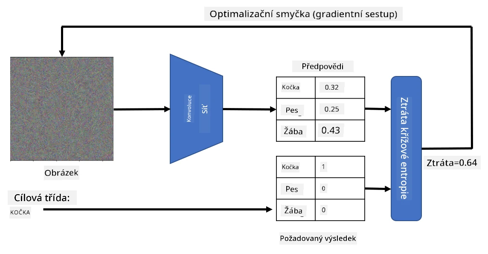

# Předtrénované sítě a transfer learning

Trénování CNN může být časově náročné a vyžaduje velké množství dat. Většina času je však věnována učení nejlepších nízkoúrovňových filtrů, které síť může použít k extrakci vzorů z obrázků. Nabízí se přirozená otázka – můžeme použít neuronovou síť natrénovanou na jednom datasetu a přizpůsobit ji k klasifikaci jiných obrázků bez nutnosti kompletního trénovacího procesu?

## [Kvíz před přednáškou](https://ff-quizzes.netlify.app/en/ai/quiz/15)

Tento přístup se nazývá **transfer learning**, protože přenášíme určité znalosti z jednoho modelu neuronové sítě na jiný. Při transfer learningu obvykle začínáme s předtrénovaným modelem, který byl natrénován na nějakém velkém datasetu obrázků, například na **ImageNet**. Tyto modely již dokážou dobře extrahovat různé rysy z obecných obrázků, a v mnoha případech stačí postavit klasifikátor na vrcholu těchto extrahovaných rysů, aby bylo dosaženo dobrého výsledku.

> ✅ Transfer learning je termín, který se objevuje i v jiných akademických oborech, například ve vzdělávání. Označuje proces přenosu znalostí z jedné oblasti do jiné.

## Předtrénované modely jako extraktory rysů

Konvoluční sítě, o kterých jsme mluvili v předchozí části, obsahují řadu vrstev, z nichž každá má za úkol extrahovat určité rysy z obrázku, počínaje nízkoúrovňovými kombinacemi pixelů (například horizontální/vertikální čáry nebo tahy), až po vyšší úrovně kombinací rysů, odpovídající například oku nebo plameni. Pokud natrénujeme CNN na dostatečně velkém datasetu obecných a různorodých obrázků, síť by se měla naučit extrahovat tyto běžné rysy.

Keras i PyTorch obsahují funkce pro snadné načtení předtrénovaných vah neuronových sítí pro některé běžné architektury, z nichž většina byla natrénována na obrázcích z ImageNet. Nejčastěji používané jsou popsány na stránce [Architektury CNN](../07-ConvNets/CNN_Architectures.md) z předchozí lekce. Zejména můžete zvážit použití některé z následujících:

* **VGG-16/VGG-19**, což jsou relativně jednoduché modely, které stále poskytují dobrou přesnost. Použití VGG jako první pokus je často dobrá volba, jak zjistit, jak transfer learning funguje.
* **ResNet** je rodina modelů navržená Microsoft Research v roce 2015. Mají více vrstev, a proto vyžadují více zdrojů.
* **MobileNet** je rodina modelů s menší velikostí, vhodná pro mobilní zařízení. Použijte je, pokud máte omezené zdroje a můžete obětovat trochu přesnosti.

Zde jsou ukázkové rysy extrahované z obrázku kočky pomocí sítě VGG-16:

## Dataset Kočky vs. Psi

V tomto příkladu použijeme dataset [Kočky a Psi](https://www.microsoft.com/download/details.aspx?id=54765&WT.mc_id=academic-77998-cacaste), který je velmi blízký reálnému scénáři klasifikace obrázků.

## ✍️ Cvičení: Transfer learning

Podívejme se na transfer learning v praxi v odpovídajících noteboocích:

* [Transfer Learning - PyTorch](TransferLearningPyTorch.ipynb)
* [Transfer Learning - TensorFlow](TransferLearningTF.ipynb)

## Vizualizace Adversarial Cat

Předtrénovaná neuronová síť obsahuje různé vzory uvnitř svého *mozku*, včetně představ o **ideální kočce** (stejně jako ideálním psovi, ideální zebře atd.). Bylo by zajímavé nějakým způsobem **vizualizovat tento obrázek**. Není to však jednoduché, protože vzory jsou rozprostřeny po celých vahách sítě a také organizovány v hierarchické struktuře.

Jedním z přístupů, které můžeme použít, je začít s náhodným obrázkem a poté se pokusit pomocí techniky **optimalizace gradientního sestupu** upravit tento obrázek tak, aby si síť začala myslet, že je to kočka.

Pokud to však uděláme, obdržíme něco velmi podobného náhodnému šumu. To je proto, že *existuje mnoho způsobů, jak síť přimět myslet si, že vstupní obrázek je kočka*, včetně některých, které vizuálně nedávají smysl. Zatímco tyto obrázky obsahují mnoho vzorů typických pro kočku, nic je neomezuje, aby byly vizuálně rozlišitelné.

Pro zlepšení výsledku můžeme do ztrátové funkce přidat další člen, který se nazývá **variation loss**. Je to metrika, která ukazuje, jak podobné jsou sousední pixely obrázku. Minimalizace variation loss činí obrázek hladším a zbavuje se šumu – tím odhaluje vizuálně přitažlivější vzory. Zde je příklad takových "ideálních" obrázků, které jsou klasifikovány jako kočka a jako zebra s vysokou pravděpodobností:

 | 
-----|-----
*Ideální kočka* | *Ideální zebra*

Podobný přístup lze použít k provádění tzv. **adversarial útoků** na neuronovou síť. Představme si, že chceme oklamat neuronovou síť a přimět ji, aby psa považovala za kočku. Pokud vezmeme obrázek psa, který je sítí rozpoznán jako pes, můžeme jej trochu upravit pomocí optimalizace gradientního sestupu, dokud síť nezačne klasifikovat obrázek jako kočku:

 | 
-----|-----
*Původní obrázek psa* | *Obrázek psa klasifikovaný jako kočka*

Podívejte se na kód pro reprodukci výše uvedených výsledků v následujícím notebooku:

* [Ideální a Adversarial Cat - TensorFlow](AdversarialCat_TF.ipynb)

## Závěr

Pomocí transfer learningu můžete rychle sestavit klasifikátor pro úlohu klasifikace vlastních objektů a dosáhnout vysoké přesnosti. Vidíte, že složitější úlohy, které nyní řešíme, vyžadují vyšší výpočetní výkon a nelze je snadno řešit na CPU. V další části se pokusíme použít lehčí implementaci k natrénování stejného modelu s nižšími výpočetními zdroji, což povede jen k mírně nižší přesnosti.

## 🚀 Výzva

V doprovodných noteboocích jsou poznámky na konci o tom, jak transfer knowledge nejlépe funguje s podobnými trénovacími daty (například nový typ zvířete). Proveďte experimenty s úplně novými typy obrázků a zjistěte, jak dobře nebo špatně vaše modely transfer knowledge fungují.

## [Kvíz po přednášce](https://ff-quizzes.netlify.app/en/ai/quiz/16)

## Přehled & Samostudium

Projděte si [TrainingTricks.md](TrainingTricks.md), abyste si prohloubili znalosti o dalších způsobech trénování modelů.

## [Úkol](lab/README.md)

V tomto laboratorním cvičení použijeme dataset skutečných [Oxford-IIIT](https://www.robots.ox.ac.uk/~vgg/data/pets/) domácích mazlíčků s 35 plemeny koček a psů a vytvoříme klasifikátor pomocí transfer learningu.

---

