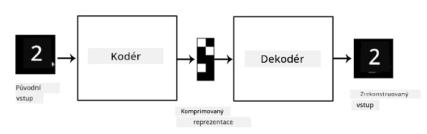
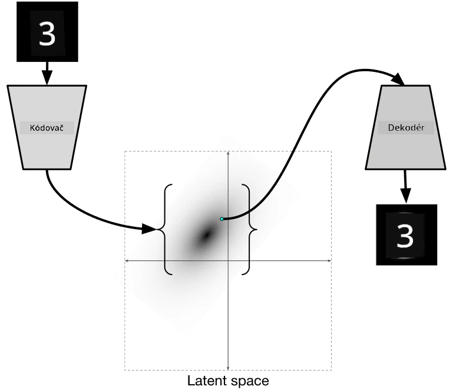

# Autoenkodéry

Při trénování CNN je jedním z problémů, že potřebujeme velké množství označených dat. V případě klasifikace obrázků musíme obrázky rozdělit do různých tříd, což je manuální práce.

## [Kvíz před lekcí](https://ff-quizzes.netlify.app/en/ai/quiz/17)

Nicméně bychom mohli chtít použít surová (neoznačená) data pro trénování extraktorů funkcí CNN, což se nazývá **self-supervised learning** (samostatně řízené učení). Místo štítků použijeme trénovací obrázky jako vstup i výstup sítě. Hlavní myšlenkou **autoenkodéru** je, že budeme mít **enkodérovou síť**, která převádí vstupní obrázek do nějakého **latentního prostoru** (obvykle je to jen vektor menší velikosti), a poté **dekodérovou síť**, jejímž cílem bude rekonstruovat původní obrázek.

> ✅ [Autoenkodér](https://wikipedia.org/wiki/Autoencoder) je "typ umělé neuronové sítě používané k učení efektivního kódování neoznačených dat."

Protože trénujeme autoenkodér, aby zachytil co nejvíce informací z původního obrázku pro přesnou rekonstrukci, síť se snaží najít nejlepší **embedding** vstupních obrázků, aby zachytila jejich význam.

> Obrázek z [blogu Keras](https://blog.keras.io/building-autoencoders-in-keras.html)

## Scénáře použití autoenkodérů

Ačkoli samotná rekonstrukce původních obrázků nemusí být užitečná, existuje několik scénářů, kde jsou autoenkodéry obzvláště užitečné:

* **Snížení dimenze obrázků pro vizualizaci** nebo **trénování obrazových embeddingů**. Autoenkodéry obvykle poskytují lepší výsledky než PCA, protože berou v úvahu prostorovou povahu obrázků a hierarchické funkce.
* **Odstraňování šumu**, tj. odstranění šumu z obrázku. Protože šum obsahuje mnoho zbytečných informací, autoenkodér nemůže vše vměstnat do relativně malého latentního prostoru, a tak zachytí pouze důležité části obrázku. Při trénování odstraňovačů šumu začínáme s původními obrázky a používáme obrázky s uměle přidaným šumem jako vstup pro autoenkodér.
* **Super-rezoluce**, zvýšení rozlišení obrázku. Začínáme s obrázky ve vysokém rozlišení a používáme obrázek s nižším rozlišením jako vstup pro autoenkodér.
* **Generativní modely**. Jakmile autoenkodér vytrénujeme, dekodérovou část můžeme použít k vytvoření nových objektů na základě náhodných latentních vektorů.

## Variabilní autoenkodéry (VAE)

Tradiční autoenkodéry nějakým způsobem snižují dimenzi vstupních dat a zjišťují důležité vlastnosti vstupních obrázků. Latentní vektory však často nedávají příliš smysl. Jinými slovy, pokud vezmeme dataset MNIST jako příklad, zjistit, které číslice odpovídají různým latentním vektorům, není snadný úkol, protože blízké latentní vektory nemusí nutně odpovídat stejným číslicím.

Na druhou stranu, pro trénování *generativních* modelů je lepší mít nějaké pochopení latentního prostoru. Tato myšlenka nás vede k **variabilnímu autoenkodéru** (VAE).

VAE je autoenkodér, který se učí předpovídat *statistické rozložení* latentních parametrů, tzv. **latentní rozložení**. Například můžeme chtít, aby latentní vektory byly normálně rozloženy s nějakým průměrem zmean a směrodatnou odchylkou zsigma (průměr i směrodatná odchylka jsou vektory určité dimenze d). Enkodér ve VAE se učí předpovídat tyto parametry a dekodér poté vezme náhodný vektor z tohoto rozložení k rekonstrukci objektu.

Shrnutí:

 * Ze vstupního vektoru předpovídáme `z_mean` a `z_log_sigma` (místo předpovídání samotné směrodatné odchylky předpovídáme její logaritmus)
 * Vzorkujeme vektor `sample` z rozložení N(zmean,exp(zlog\_sigma))
 * Dekodér se snaží dekódovat původní obrázek pomocí `sample` jako vstupního vektoru

 

> Obrázek z [tohoto blogového příspěvku](https://ijdykeman.github.io/ml/2016/12/21/cvae.html) od Isaaka Dykemana

Variabilní autoenkodéry používají složitou ztrátovou funkci, která se skládá ze dvou částí:

* **Ztráta rekonstrukce** je ztrátová funkce, která ukazuje, jak blízko je rekonstruovaný obrázek cíli (může to být Mean Squared Error, nebo MSE). Je to stejná ztrátová funkce jako u běžných autoenkodérů.
* **KL ztráta**, která zajišťuje, že rozložení latentních proměnných zůstává blízko normálnímu rozložení. Je založena na pojmu [Kullback-Leiblerovy divergence](https://www.countbayesie.com/blog/2017/5/9/kullback-leibler-divergence-explained) - metriky pro odhad podobnosti dvou statistických rozložení.

Jednou z důležitých výhod VAE je, že nám umožňují relativně snadno generovat nové obrázky, protože víme, z jakého rozložení vzorkovat latentní vektory. Například pokud trénujeme VAE s 2D latentním vektorem na MNIST, můžeme poté měnit komponenty latentního vektoru, abychom získali různé číslice:

> Obrázek od [Dmitrije Soshnikova](http://soshnikov.com)

Pozorujte, jak se obrázky prolínají, když začneme získávat latentní vektory z různých částí latentního prostoru parametrů. Tento prostor můžeme také vizualizovat ve 2D:

 

> Obrázek od [Dmitrije Soshnikova](http://soshnikov.com)

## ✍️ Cvičení: Autoenkodéry

Zjistěte více o autoenkodérech v těchto odpovídajících noteboocích:

* [Autoenkodéry v TensorFlow](AutoencodersTF.ipynb)
* [Autoenkodéry v PyTorch](AutoEncodersPyTorch.ipynb)

## Vlastnosti autoenkodérů

* **Specifické pro data** - fungují dobře pouze s typem obrázků, na kterých byly trénovány. Například pokud trénujeme síť pro super-rezoluce na květinách, nebude dobře fungovat na portrétech. Je to proto, že síť může vytvořit obrázek ve vyšším rozlišení tím, že vezme jemné detaily z funkcí naučených z trénovacího datasetu.
* **Ztrátové** - rekonstruovaný obrázek není stejný jako původní obrázek. Povaha ztráty je definována *ztrátovou funkcí* použitou během trénování.
* Funguje na **neoznačených datech**

## [Kvíz po lekci](https://ff-quizzes.netlify.app/en/ai/quiz/18)

## Závěr

V této lekci jste se naučili o různých typech autoenkodérů dostupných pro vědce v oblasti AI. Naučili jste se, jak je vytvořit a jak je použít k rekonstrukci obrázků. Také jste se naučili o VAE a jak je použít k generování nových obrázků.

## 🚀 Výzva

V této lekci jste se naučili používat autoenkodéry pro obrázky. Ale mohou být použity i pro hudbu! Podívejte se na projekt Magenta [MusicVAE](https://magenta.tensorflow.org/music-vae), který používá autoenkodéry k učení rekonstrukce hudby. Udělejte si [experimenty](https://colab.research.google.com/github/magenta/magenta-demos/blob/master/colab-notebooks/Multitrack_MusicVAE.ipynb) s touto knihovnou a zjistěte, co můžete vytvořit.

## [Kvíz po lekci](https://ff-quizzes.netlify.app/en/ai/quiz/16)

## Přehled & Samostudium

Pro referenci si přečtěte více o autoenkodérech v těchto zdrojích:

* [Vytváření autoenkodérů v Keras](https://blog.keras.io/building-autoencoders-in-keras.html)
* [Blogový příspěvek na NeuroHive](https://neurohive.io/ru/osnovy-data-science/variacionnyj-avtojenkoder-vae/)
* [Vysvětlení variabilních autoenkodérů](https://kvfrans.com/variational-autoencoders-explained/)
* [Podmíněné variabilní autoenkodéry](https://ijdykeman.github.io/ml/2016/12/21/cvae.html)

## Zadání

Na konci [tohoto notebooku s TensorFlow](AutoencodersTF.ipynb) najdete 'úkol' - použijte jej jako své zadání.

---

