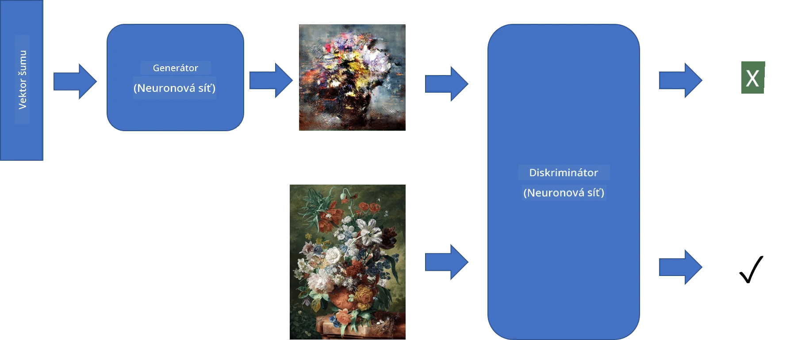
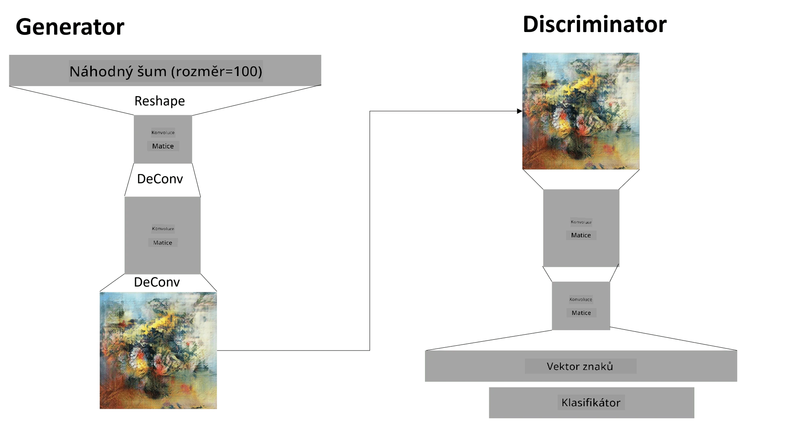

# Generativní adversariální sítě

V předchozí části jsme se naučili o **generativních modelech**: modelech, které dokážou generovat nové obrázky podobné těm v trénovací sadě. VAE byl dobrým příkladem generativního modelu.

## [Kvíz před lekcí](https://ff-quizzes.netlify.app/en/ai/quiz/19)

Pokud se však pokusíme generovat něco opravdu smysluplného, například malbu v rozumném rozlišení, pomocí VAE zjistíme, že trénink neprobíhá dobře. Pro tento případ bychom se měli seznámit s jinou architekturou, která je specificky zaměřená na generativní modely - **Generativní adversariální sítě**, neboli GANs.

Hlavní myšlenkou GAN je mít dvě neuronové sítě, které se budou trénovat proti sobě:

> Obrázek od [Dmitry Soshnikov](http://soshnikov.com)

> ✅ Malý slovníček:
> * **Generátor** je síť, která vezme nějaký náhodný vektor a vytvoří obrázek jako výsledek.
> * **Discriminátor** je síť, která vezme obrázek a má určit, zda se jedná o skutečný obrázek (z trénovací sady), nebo zda byl vytvořen generátorem. V podstatě jde o klasifikátor obrázků.

### Discriminátor

Architektura discriminátoru se neliší od běžné sítě pro klasifikaci obrázků. V nejjednodušším případě může jít o plně propojený klasifikátor, ale pravděpodobněji to bude [konvoluční síť](../07-ConvNets/README.md).

> ✅ GAN založený na konvolučních sítích se nazývá [DCGAN](https://arxiv.org/pdf/1511.06434.pdf)

Discriminátor CNN se skládá z následujících vrstev: několik konvolucí + poolingů (s klesající prostorovou velikostí) a jedné nebo více plně propojených vrstev pro získání "vektorů vlastností", a nakonec binárního klasifikátoru.

> ✅ 'Pooling' v tomto kontextu je technika, která zmenšuje velikost obrázku. "Pooling vrstvy snižují rozměry dat kombinací výstupů neuronových klastrů v jedné vrstvě do jednoho neuronu v další vrstvě." - [zdroj](https://wikipedia.org/wiki/Convolutional_neural_network#Pooling_layers)

### Generátor

Generátor je o něco složitější. Můžete si ho představit jako obrácený discriminátor. Začíná latentním vektorem (namísto vektoru vlastností), má plně propojenou vrstvu, která ho převede na požadovanou velikost/tvar, následovanou dekonvolucemi + zvětšováním. To je podobné *dekodéru* v [autoenkodéru](../09-Autoencoders/README.md).

> ✅ Protože je konvoluční vrstva implementována jako lineární filtr procházející obrázkem, dekonvoluce je v podstatě podobná konvoluci a může být implementována pomocí stejné logiky vrstvy.

> Obrázek od [Dmitry Soshnikov](http://soshnikov.com)

### Trénink GAN

GANy se nazývají **adversariální**, protože mezi generátorem a discriminátorem probíhá neustálá soutěž. Během této soutěže se oba generátor i discriminátor zlepšují, a síť se tak učí vytvářet stále lepší obrázky.

Trénink probíhá ve dvou fázích:

* **Trénink discriminátoru**. Tento úkol je poměrně přímočarý: vygenerujeme dávku obrázků pomocí generátoru, označíme je 0, což znamená falešný obrázek, a vezmeme dávku obrázků z trénovací sady (s označením 1, skutečný obrázek). Získáme nějakou *ztrátu discriminátoru* a provedeme zpětné šíření.
* **Trénink generátoru**. To je o něco složitější, protože neznáme očekávaný výstup generátoru přímo. Vezmeme celou GAN síť sestávající z generátoru následovaného discriminátorem, nakrmíme ji nějakými náhodnými vektory a očekáváme, že výsledek bude 1 (odpovídající skutečným obrázkům). Poté zmrazíme parametry discriminátoru (nechceme, aby se v tomto kroku trénoval) a provedeme zpětné šíření.

Během tohoto procesu ztráty generátoru i discriminátoru neklesají výrazně. V ideálním případě by měly oscilovat, což odpovídá zlepšování výkonu obou sítí.

## ✍️ Cvičení: GANs

* [GAN Notebook v TensorFlow/Keras](GANTF.ipynb)
* [GAN Notebook v PyTorch](GANPyTorch.ipynb)

### Problémy s tréninkem GAN

GANy jsou známé tím, že je obzvláště obtížné je trénovat. Zde je několik problémů:

* **Kolaps módu**. Tento termín znamená, že se generátor naučí vytvářet jeden úspěšný obrázek, který oklame discriminátor, a ne různé obrázky.
* **Citlivost na hyperparametry**. Často se stává, že GAN vůbec nekonverguje, a pak náhle snížení rychlosti učení vede ke konvergenci.
* Udržení **rovnováhy** mezi generátorem a discriminátorem. V mnoha případech může ztráta discriminátoru relativně rychle klesnout na nulu, což způsobí, že generátor nebude schopen dále trénovat. Abychom tomu předešli, můžeme zkusit nastavit různé rychlosti učení pro generátor a discriminátor, nebo přeskočit trénink discriminátoru, pokud je ztráta již příliš nízká.
* Trénink pro **vysoké rozlišení**. Tento problém, podobně jako u autoenkodérů, nastává, protože rekonstrukce příliš mnoha vrstev konvoluční sítě vede k artefaktům. Tento problém se obvykle řeší tzv. **progresivním růstem**, kdy se nejprve několik vrstev trénuje na obrázcích s nízkým rozlišením, a poté se vrstvy "odblokují" nebo přidají. Dalším řešením by bylo přidání dalších spojení mezi vrstvami a trénink několika rozlišení najednou - podrobnosti naleznete v tomto [Multi-Scale Gradient GANs článku](https://arxiv.org/abs/1903.06048).

## Přenos stylu

GANy jsou skvělým způsobem, jak generovat umělecké obrázky. Další zajímavou technikou je tzv. **přenos stylu**, který vezme jeden **obsahový obrázek** a překreslí ho v jiném stylu, aplikováním filtrů z **stylového obrázku**.

Jak to funguje:
* Začneme s náhodným šumovým obrázkem (nebo s obsahovým obrázkem, ale pro pochopení je jednodušší začít s náhodným šumem).
* Naším cílem bude vytvořit takový obrázek, který bude blízký jak obsahovému obrázku, tak stylovému obrázku. To bude určeno dvěma funkcemi ztráty:
   - **Ztráta obsahu** se vypočítá na základě vlastností extrahovaných CNN na některých vrstvách z aktuálního obrázku a obsahového obrázku.
   - **Ztráta stylu** se vypočítá mezi aktuálním obrázkem a stylovým obrázkem chytrým způsobem pomocí Gramových matic (více podrobností v [příkladovém notebooku](StyleTransfer.ipynb)).
* Aby byl obrázek hladší a odstranil šum, zavedeme také **ztrátu variace**, která vypočítá průměrnou vzdálenost mezi sousedními pixely.
* Hlavní optimalizační smyčka upravuje aktuální obrázek pomocí gradientního sestupu (nebo jiného optimalizačního algoritmu) tak, aby minimalizovala celkovou ztrátu, která je váženým součtem všech tří ztrát.

## ✍️ Příklad: [Přenos stylu](StyleTransfer.ipynb)

## [Kvíz po lekci](https://ff-quizzes.netlify.app/en/ai/quiz/20)

## Závěr

V této lekci jste se naučili o GANech a jak je trénovat. Také jste se dozvěděli o speciálních výzvách, kterým tento typ neuronové sítě může čelit, a o některých strategiích, jak je překonat.

## 🚀 Výzva

Projděte si [notebook Přenos stylu](StyleTransfer.ipynb) s použitím vlastních obrázků.

## Přehled a samostudium

Pro další informace si přečtěte více o GANech v těchto zdrojích:

* Marco Pasini, [10 Lessons I Learned Training GANs for one Year](https://towardsdatascience.com/10-lessons-i-learned-training-generative-adversarial-networks-gans-for-a-year-c9071159628)
* [StyleGAN](https://en.wikipedia.org/wiki/StyleGAN), *de facto* architektura GAN, kterou stojí za to zvážit
* [Vytváření generativního umění pomocí GAN na Azure ML](https://soshnikov.com/scienceart/creating-generative-art-using-gan-on-azureml/)

## Zadání

Znovu si projděte jeden ze dvou notebooků spojených s touto lekcí a znovu natrénujte GAN na vlastních obrázcích. Co dokážete vytvořit?

---

