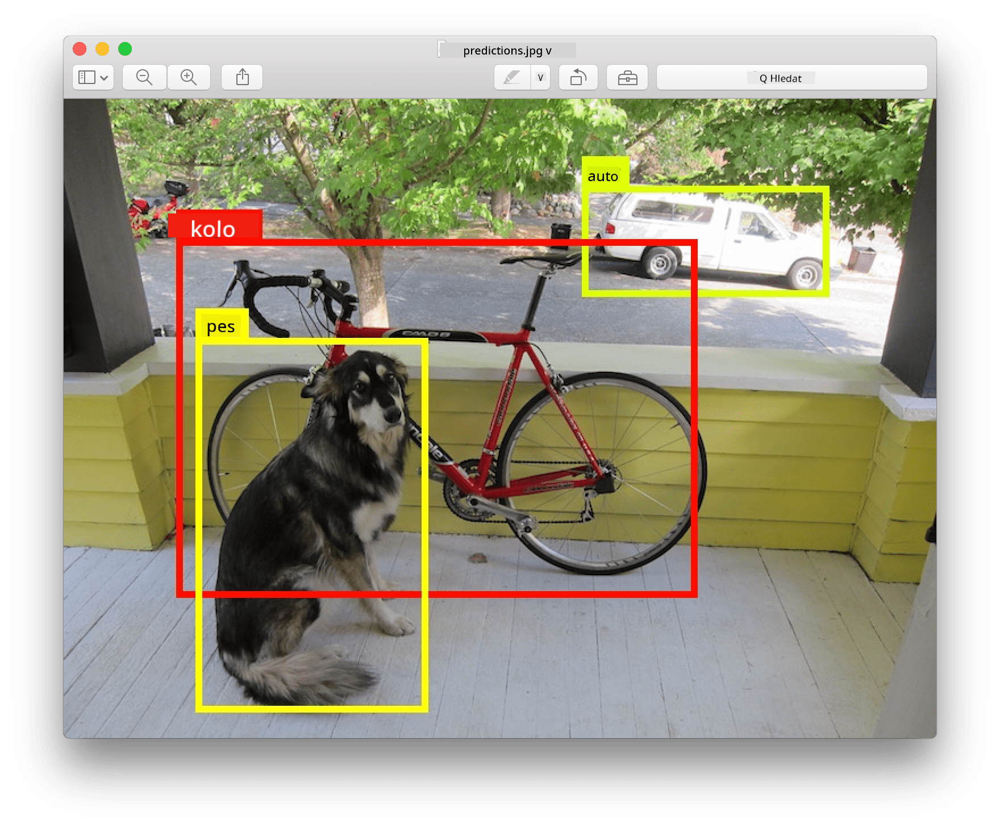
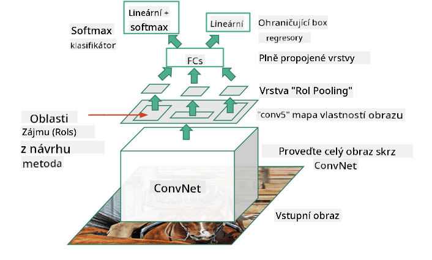

<!--
CO_OP_TRANSLATOR_METADATA:
{
  "original_hash": "d76a7eda28de5210c8b1ba50a6216c69",
  "translation_date": "2025-09-23T11:23:43+00:00",
  "source_file": "lessons/4-ComputerVision/11-ObjectDetection/README.md",
  "language_code": "cs"
}
-->
# Detekce objektů

Modely pro klasifikaci obrázků, se kterými jsme se dosud zabývali, přijímaly obrázek a produkovaly kategorický výsledek, například třídu 'číslo' v problému MNIST. V mnoha případech však nechceme jen vědět, že obrázek zobrazuje objekty – chceme být schopni určit jejich přesnou polohu. Přesně o tom je **detekce objektů**.

## [Kvíz před lekcí](https://ff-quizzes.netlify.app/en/ai/quiz/21)

> Obrázek z [webu YOLO v2](https://pjreddie.com/darknet/yolov2/)

## Naivní přístup k detekci objektů

Předpokládejme, že chceme najít kočku na obrázku. Velmi naivní přístup k detekci objektů by mohl být následující:

1. Rozdělte obrázek na množství dlaždic.
2. Proveďte klasifikaci obrázků na každé dlaždici.
3. Dlaždice, které vykazují dostatečně vysokou aktivaci, lze považovat za obsahující hledaný objekt.

> *Obrázek z [cvičebního notebooku](ObjectDetection-TF.ipynb)*

Tento přístup však není ideální, protože algoritmu umožňuje pouze velmi nepřesně lokalizovat ohraničující rámeček objektu. Pro přesnější lokalizaci potřebujeme použít nějaký typ **regrese**, abychom předpověděli souřadnice ohraničujících rámečků – a k tomu potřebujeme specifické datové sady.

## Regrese pro detekci objektů

[Tento blogový příspěvek](https://towardsdatascience.com/object-detection-with-neural-networks-a4e2c46b4491) nabízí skvělý úvod do detekce tvarů.

## Datové sady pro detekci objektů

Můžete narazit na následující datové sady pro tento úkol:

* [PASCAL VOC](http://host.robots.ox.ac.uk/pascal/VOC/) – 20 tříd
* [COCO](http://cocodataset.org/#home) – Common Objects in Context. 80 tříd, ohraničující rámečky a segmentační masky

## Metriky pro detekci objektů

### Průnik přes sjednocení (Intersection over Union)

Zatímco u klasifikace obrázků je snadné měřit, jak dobře algoritmus funguje, u detekce objektů musíme měřit jak správnost třídy, tak přesnost určené polohy ohraničujícího rámečku. Pro druhé zmíněné používáme tzv. **Průnik přes sjednocení** (IoU), který měří, jak dobře se dva rámečky (nebo dvě libovolné oblasti) překrývají.

> *Obrázek 2 z [tohoto skvělého blogového příspěvku o IoU](https://pyimagesearch.com/2016/11/07/intersection-over-union-iou-for-object-detection/)*

Princip je jednoduchý – rozdělíme plochu průniku dvou útvarů plochou jejich sjednocení. Pro dvě identické oblasti bude IoU rovno 1, zatímco pro zcela nesouvisející oblasti bude rovno 0. Jinak se bude pohybovat mezi 0 a 1. Obvykle bereme v úvahu pouze ty ohraničující rámečky, u kterých je IoU nad určitou hodnotou.

### Průměrná přesnost (Average Precision)

Předpokládejme, že chceme měřit, jak dobře je rozpoznána daná třída objektů $C$. K měření používáme metriku **Průměrná přesnost**, která se vypočítává následujícím způsobem:

1. Zvažte křivku přesnosti a odvolání (Precision-Recall), která ukazuje přesnost v závislosti na hodnotě prahové detekce (od 0 do 1).
2. V závislosti na prahu získáme více či méně detekovaných objektů na obrázku a různé hodnoty přesnosti a odvolání.
3. Křivka bude vypadat takto:

> *Obrázek z [NeuroWorkshop](http://github.com/shwars/NeuroWorkshop)*

Průměrná přesnost pro danou třídu $C$ je plocha pod touto křivkou. Přesněji řečeno, osa odvolání je obvykle rozdělena na 10 částí a přesnost je průměrována přes všechny tyto body:

$$
AP = {1\over11}\sum_{i=0}^{10}\mbox{Precision}(\mbox{Recall}={i\over10})
$$

### AP a IoU

Budeme brát v úvahu pouze ty detekce, u kterých je IoU nad určitou hodnotou. Například v datové sadě PASCAL VOC se obvykle předpokládá $\mbox{IoU Threshold} = 0.5$, zatímco v COCO se AP měří pro různé hodnoty $\mbox{IoU Threshold}$.

> *Obrázek z [NeuroWorkshop](http://github.com/shwars/NeuroWorkshop)*

### Průměrná průměrná přesnost – mAP

Hlavní metrika pro detekci objektů se nazývá **Průměrná průměrná přesnost**, nebo **mAP**. Jedná se o hodnotu průměrné přesnosti, průměrovanou přes všechny třídy objektů, a někdy také přes $\mbox{IoU Threshold}$. Podrobnější popis procesu výpočtu **mAP** najdete
[v tomto blogovém příspěvku](https://medium.com/@timothycarlen/understanding-the-map-evaluation-metric-for-object-detection-a07fe6962cf3)), a také [zde s ukázkami kódu](https://gist.github.com/tarlen5/008809c3decf19313de216b9208f3734).

## Různé přístupy k detekci objektů

Existují dvě široké kategorie algoritmů pro detekci objektů:

* **Sítě pro návrh oblastí** (R-CNN, Fast R-CNN, Faster R-CNN). Hlavní myšlenkou je generovat **oblasti zájmu** (ROI) a spustit na nich CNN, hledající maximální aktivaci. Je to trochu podobné naivnímu přístupu, s výjimkou toho, že ROI jsou generovány chytřejším způsobem. Jednou z hlavních nevýhod těchto metod je, že jsou pomalé, protože potřebujeme mnoho průchodů klasifikátoru CNN přes obrázek.
* **Jednoprůchodové** (YOLO, SSD, RetinaNet) metody. V těchto architekturách navrhujeme síť tak, aby předpovídala jak třídy, tak ROI v jednom průchodu.

### R-CNN: Region-Based CNN

[R-CNN](http://islab.ulsan.ac.kr/files/announcement/513/rcnn_pami.pdf) používá [Selektivní vyhledávání](http://www.huppelen.nl/publications/selectiveSearchDraft.pdf) k vytvoření hierarchické struktury oblastí ROI, které jsou následně zpracovány extraktory funkcí CNN a klasifikátory SVM k určení třídy objektu, a lineární regresí k určení souřadnic *ohraničujícího rámečku*. [Oficiální článek](https://arxiv.org/pdf/1506.01497v1.pdf)

> *Obrázek od van de Sande et al. ICCV’11*

> *Obrázky z [tohoto blogu](https://towardsdatascience.com/r-cnn-fast-r-cnn-faster-r-cnn-yolo-object-detection-algorithms-36d53571365e)*

### F-RCNN - Fast R-CNN

Tento přístup je podobný R-CNN, ale oblasti jsou definovány po aplikaci konvolučních vrstev.

> Obrázek z [oficiálního článku](https://www.cv-foundation.org/openaccess/content_iccv_2015/papers/Girshick_Fast_R-CNN_ICCV_2015_paper.pdf), [arXiv](https://arxiv.org/pdf/1504.08083.pdf), 2015

### Faster R-CNN

Hlavní myšlenkou tohoto přístupu je použití neuronové sítě k předpovědi ROI – tzv. *Region Proposal Network*. [Článek](https://arxiv.org/pdf/1506.01497.pdf), 2016

> Obrázek z [oficiálního článku](https://arxiv.org/pdf/1506.01497.pdf)

### R-FCN: Region-Based Fully Convolutional Network

Tento algoritmus je ještě rychlejší než Faster R-CNN. Hlavní myšlenka je následující:

1. Extrahujeme funkce pomocí ResNet-101.
2. Funkce jsou zpracovány pomocí **Position-Sensitive Score Map**. Každý objekt z $C$ tříd je rozdělen na $k\times k$ oblasti a trénujeme na předpověď částí objektů.
3. Pro každou část z $k\times k$ oblastí všechny sítě hlasují pro třídy objektů a třída objektu s maximálním počtem hlasů je vybrána.

> Obrázek z [oficiálního článku](https://arxiv.org/abs/1605.06409)

### YOLO - You Only Look Once

YOLO je algoritmus pro detekci v reálném čase s jedním průchodem. Hlavní myšlenka je následující:

 * Obrázek je rozdělen na $S\times S$ oblasti.
 * Pro každou oblast **CNN** předpovídá $n$ možných objektů, souřadnice *ohraničujícího rámečku* a *důvěru*=*pravděpodobnost* * IoU.

 

> Obrázek z [oficiálního článku](https://arxiv.org/abs/1506.02640)

### Další algoritmy

* RetinaNet: [oficiální článek](https://arxiv.org/abs/1708.02002)
   - [Implementace v PyTorch v Torchvision](https://pytorch.org/vision/stable/_modules/torchvision/models/detection/retinanet.html)
   - [Implementace v Keras](https://github.com/fizyr/keras-retinanet)
   - [Detekce objektů pomocí RetinaNet](https://keras.io/examples/vision/retinanet/) v ukázkách Keras
* SSD (Single Shot Detector): [oficiální článek](https://arxiv.org/abs/1512.02325)

## ✍️ Cvičení: Detekce objektů

Pokračujte ve svém učení v následujícím notebooku:

[ObjectDetection.ipynb](ObjectDetection.ipynb)

## Závěr

V této lekci jste se rychle seznámili s různými způsoby, jak lze detekci objektů provádět!

## 🚀 Výzva

Projděte si tyto články a notebooky o YOLO a vyzkoušejte je sami:

* [Skvělý blogový příspěvek](https://www.analyticsvidhya.com/blog/2018/12/practical-guide-object-detection-yolo-framewor-python/) popisující YOLO
 * [Oficiální web](https://pjreddie.com/darknet/yolo/)
 * Yolo: [Implementace v Keras](https://github.com/experiencor/keras-yolo2), [podrobný notebook](https://github.com/experiencor/basic-yolo-keras/blob/master/Yolo%20Step-by-Step.ipynb)
 * Yolo v2: [Implementace v Keras](https://github.com/experiencor/keras-yolo2), [podrobný notebook](https://github.com/experiencor/keras-yolo2/blob/master/Yolo%20Step-by-Step.ipynb)

## [Kvíz po lekci](https://ff-quizzes.netlify.app/en/ai/quiz/22)

## Přehled & Samostudium

* [Detekce objektů](https://tjmachinelearning.com/lectures/1718/obj/) od Nikhila Sardany
* [Dobrý přehled algoritmů pro detekci objektů](https://lilianweng.github.io/lil-log/2018/12/27/object-detection-part-4.html)
* [Přehled algoritmů hlubokého učení pro detekci objektů](https://medium.com/comet-app/review-of-deep-learning-algorithms-for-object-detection-c1f3d437b852)
* [Úvod do základních algoritmů pro detekci objektů krok za krokem](https://www.analyticsvidhya.com/blog/2018/10/a-step-by-step-introduction-to-the-basic-object-detection-algorithms-part-1/)
* [Implementace Faster R-CNN v Pythonu pro detekci objektů](https://www.analyticsvidhya.com/blog/2018/11/implementation-faster-r-cnn-python-object-detection/)

## [Úkol: Detekce objektů](lab/README.md)

---

