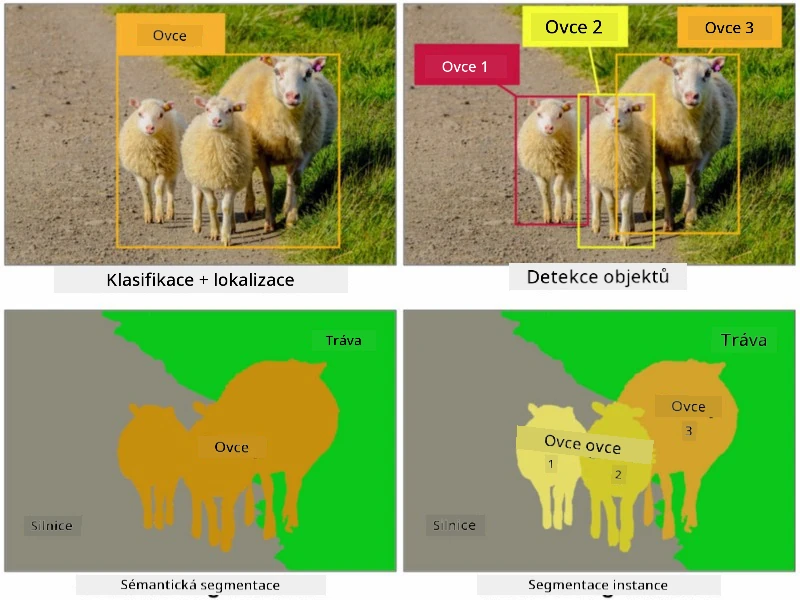
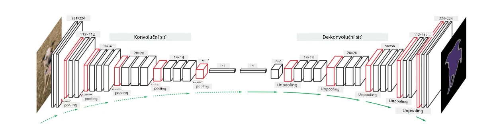

# Segmentace

Dříve jsme se naučili o detekci objektů, která nám umožňuje lokalizovat objekty na obrázku předpovědí jejich *ohraničujících rámečků*. Nicméně, pro některé úkoly nepotřebujeme pouze ohraničující rámečky, ale také přesnější lokalizaci objektů. Tento úkol se nazývá **segmentace**.

## [Kvíz před lekcí](https://ff-quizzes.netlify.app/en/ai/quiz/23)

Segmentaci lze chápat jako **klasifikaci pixelů**, kdy pro **každý** pixel obrázku musíme předpovědět jeho třídu (*pozadí* je jednou z tříd). Existují dva hlavní algoritmy segmentace:

* **Semantická segmentace** pouze určuje třídu pixelu, ale nerozlišuje mezi různými objekty stejné třídy.
* **Instance segmentace** rozděluje třídy na různé instance.

Například u instance segmentace jsou tyto ovce různé objekty, ale u semantické segmentace jsou všechny ovce reprezentovány jednou třídou.

> Obrázek z [tohoto blogového příspěvku](https://nirmalamurali.medium.com/image-classification-vs-semantic-segmentation-vs-instance-segmentation-625c33a08d50)

Existují různé neuronové architektury pro segmentaci, ale všechny mají stejnou strukturu. Do jisté míry je podobná autoenkodéru, o kterém jste se již dříve učili, ale místo dekonstruování původního obrázku je naším cílem dekonstruovat **masku**. Segmentační síť má tedy následující části:

* **Encoder** extrahuje vlastnosti z vstupního obrázku.
* **Decoder** transformuje tyto vlastnosti do **obrázku masky**, který má stejnou velikost a počet kanálů odpovídající počtu tříd.

> Obrázek z [této publikace](https://arxiv.org/pdf/2001.05566.pdf)

Zvláštní pozornost bychom měli věnovat ztrátové funkci, která se používá pro segmentaci. Při použití klasických autoenkodérů potřebujeme měřit podobnost mezi dvěma obrázky, a k tomu můžeme použít průměrnou kvadratickou chybu (MSE). U segmentace každý pixel v cílovém obrázku masky představuje číslo třídy (one-hot-encoded podél třetí dimenze), takže musíme použít ztrátové funkce specifické pro klasifikaci - ztrátu křížové entropie, průměrovanou přes všechny pixely. Pokud je maska binární, používá se **binární ztráta křížové entropie** (BCE).

> ✅ One-hot encoding je způsob, jak zakódovat třídu do vektoru o délce odpovídající počtu tříd. Podívejte se na [tento článek](https://datagy.io/sklearn-one-hot-encode/) o této technice.

## Segmentace v lékařském zobrazování

V této lekci uvidíme segmentaci v praxi tím, že budeme trénovat síť na rozpoznávání lidských névů (známek) na lékařských obrázcích. Budeme používat <a href="https://www.fc.up.pt/addi/ph2%20database.html">PH2 databázi</a> dermoskopických obrázků jako zdroj obrázků. Tento dataset obsahuje 200 obrázků tří tříd: typický névus, atypický névus a melanom. Všechny obrázky také obsahují odpovídající **masku**, která vymezuje névus.

> ✅ Tato technika je obzvláště vhodná pro tento typ lékařského zobrazování, ale jaké další aplikace v reálném světě si dokážete představit?

> Obrázek z PH2 databáze

Budeme trénovat model na segmentaci jakéhokoliv névu z jeho pozadí.

## ✍️ Cvičení: Semantická segmentace

Otevřete níže uvedené notebooky, abyste se dozvěděli více o různých architekturách semantické segmentace, procvičili si práci s nimi a viděli je v akci.

* [Semantická segmentace Pytorch](SemanticSegmentationPytorch.ipynb)
* [Semantická segmentace TensorFlow](SemanticSegmentationTF.ipynb)

## [Kvíz po lekci](https://ff-quizzes.netlify.app/en/ai/quiz/24)

## Závěr

Segmentace je velmi silná technika pro klasifikaci obrázků, která jde nad rámec ohraničujících rámečků až k klasifikaci na úrovni pixelů. Je to technika používaná v lékařském zobrazování, mimo jiné aplikace.

## 🚀 Výzva

Segmentace těla je jen jedním z běžných úkolů, které můžeme provádět s obrázky lidí. Další důležité úkoly zahrnují **detekci kostry** a **detekci póz**. Vyzkoušejte knihovnu [OpenPose](https://github.com/CMU-Perceptual-Computing-Lab/openpose), abyste viděli, jak lze detekci póz využít.

## Přehled & Samostudium

Tento [článek na Wikipedii](https://wikipedia.org/wiki/Image_segmentation) nabízí dobrý přehled různých aplikací této techniky. Zjistěte více o podoblastech instance segmentace a panoptické segmentace v této oblasti zkoumání.

## [Úkol](lab/README.md)

V tomto laboratorním cvičení zkuste **segmentaci lidského těla** pomocí [Segmentation Full Body MADS Dataset](https://www.kaggle.com/datasets/tapakah68/segmentation-full-body-mads-dataset) z Kaggle.

---

