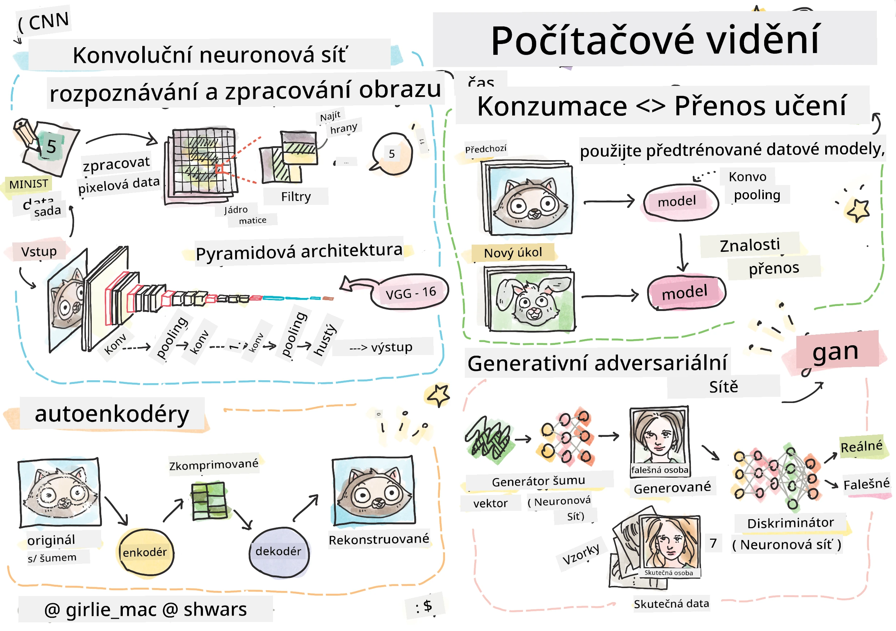

# Počítačové vidění

V této sekci se naučíme:

* [Úvod do počítačového vidění a OpenCV](06-IntroCV/README.md)
* [Konvoluční neuronové sítě](07-ConvNets/README.md)
* [Předtrénované sítě a přenosové učení](08-TransferLearning/README.md) 
* [Autoenkodéry](09-Autoencoders/README.md)
* [Generativní protivníkové sítě](10-GANs/README.md)
* [Detekce objektů](11-ObjectDetection/README.md)
* [Sémantická segmentace](12-Segmentation/README.md)

**Prohlášení:**  
Tento dokument byl přeložen pomocí služby pro automatický překlad [Co-op Translator](https://github.com/Azure/co-op-translator). Přestože se snažíme o přesnost, mějte na paměti, že automatické překlady mohou obsahovat chyby nebo nepřesnosti. Původní dokument v jeho původním jazyce by měl být považován za autoritativní zdroj. Pro důležité informace doporučujeme profesionální lidský překlad. Neodpovídáme za žádná nedorozumění nebo nesprávné interpretace vyplývající z použití tohoto překladu.