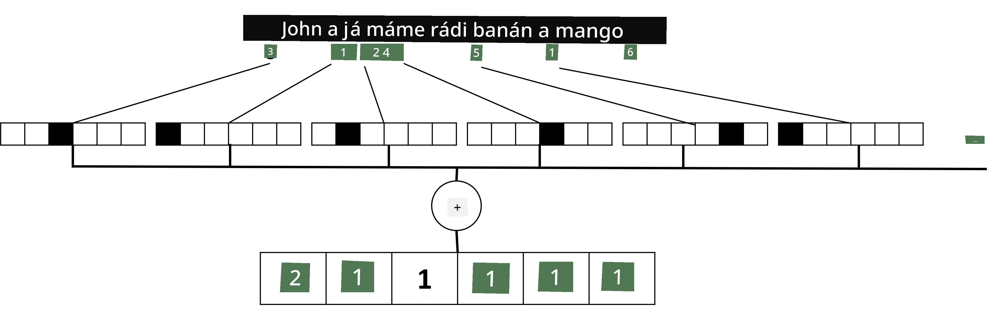

# Reprezentace textu jako tenzory

## [Kvíz před přednáškou](https://ff-quizzes.netlify.app/en/ai/quiz/25)

## Klasifikace textu

V první části této sekce se zaměříme na úkol **klasifikace textu**. Použijeme dataset [AG News](https://www.kaggle.com/amananandrai/ag-news-classification-dataset), který obsahuje zpravodajské články, například:

* Kategorie: Věda/Technologie  
* Titulek: Ky. Společnost získala grant na studium peptidů (AP)  
* Text: AP - Společnost založená chemickým výzkumníkem z University of Louisville získala grant na vývoj...

Naším cílem bude klasifikovat zpravodajský článek do jedné z kategorií na základě textu.

## Reprezentace textu

Pokud chceme řešit úkoly z oblasti zpracování přirozeného jazyka (NLP) pomocí neuronových sítí, potřebujeme způsob, jak reprezentovat text jako tenzory. Počítače již reprezentují textové znaky jako čísla, která mapují na fonty na obrazovce pomocí kódování, jako je ASCII nebo UTF-8.

> [Zdroj obrázku](https://www.seobility.net/en/wiki/ASCII)

Jako lidé rozumíme tomu, co každý znak **reprezentuje**, a jak všechny znaky dohromady tvoří slova ve větě. Počítače však samy o sobě takové porozumění nemají, a neuronová síť se musí význam naučit během tréninku.

Proto můžeme použít různé přístupy při reprezentaci textu:

* **Reprezentace na úrovni znaků**, kdy text reprezentujeme tak, že každý znak považujeme za číslo. Pokud máme *C* různých znaků v našem textovém korpusu, slovo *Hello* by bylo reprezentováno jako tenzor 5x*C*. Každé písmeno by odpovídalo sloupci tenzoru v jednorozměrném kódování (one-hot encoding).  
* **Reprezentace na úrovni slov**, kdy vytvoříme **slovník** všech slov v našem textu a poté slova reprezentujeme pomocí jednorozměrného kódování. Tento přístup je o něco lepší, protože jednotlivé znaky samy o sobě nemají velký význam, a použitím vyšších sémantických konceptů - slov - úkol pro neuronovou síť zjednodušujeme. Nicméně vzhledem k velké velikosti slovníku musíme pracovat s vysoce dimenzionálními řídkými tenzory.

Bez ohledu na způsob reprezentace musíme nejprve převést text na sekvenci **tokenů**, přičemž jeden token může být znak, slovo nebo někdy i část slova. Poté token převedeme na číslo, obvykle pomocí **slovníku**, a toto číslo může být předáno neuronové síti pomocí jednorozměrného kódování.

## N-Gramy

V přirozeném jazyce lze přesný význam slov určit pouze v kontextu. Například významy *neuronová síť* a *rybářská síť* jsou zcela odlišné. Jedním ze způsobů, jak toto zohlednit, je vytvořit model na základě dvojic slov a považovat dvojice slov za samostatné tokeny slovníku. Tímto způsobem bude věta *Rád chodím na ryby* reprezentována následující sekvencí tokenů: *Rád chodím*, *chodím na*, *na ryby*. Problémem tohoto přístupu je, že velikost slovníku se výrazně zvětšuje a kombinace jako *na ryby* a *na nákupy* jsou reprezentovány různými tokeny, které nesdílejí žádnou sémantickou podobnost, přestože obsahují stejné sloveso.

V některých případech můžeme zvážit použití tri-gramů -- kombinací tří slov. Tento přístup se proto často nazývá **n-gramy**. Také má smysl používat n-gramy s reprezentací na úrovni znaků, kdy n-gramy přibližně odpovídají různým slabikám.

## Bag-of-Words a TF/IDF

Při řešení úkolů, jako je klasifikace textu, potřebujeme být schopni reprezentovat text jedním vektorem pevné velikosti, který použijeme jako vstup pro konečný hustý klasifikátor. Jedním z nejjednodušších způsobů, jak toho dosáhnout, je kombinovat všechny jednotlivé reprezentace slov, například jejich sečtením. Pokud sečteme jednorozměrné kódování každého slova, získáme vektor frekvencí, který ukazuje, kolikrát se každé slovo v textu objevuje. Taková reprezentace textu se nazývá **bag of words** (BoW).

> Obrázek od autora

BoW v podstatě reprezentuje, která slova se v textu objevují a v jakém množství, což může být dobrým indikátorem toho, o čem text je. Například zpravodajský článek o politice pravděpodobně obsahuje slova jako *prezident* a *země*, zatímco vědecká publikace by mohla obsahovat slova jako *kolider*, *objeveno* atd. Frekvence slov tak mohou být v mnoha případech dobrým indikátorem obsahu textu.

Problémem BoW je, že určitá běžná slova, jako *a*, *je* atd., se objevují ve většině textů a mají nejvyšší frekvence, což může zakrýt slova, která jsou skutečně důležitá. Můžeme snížit důležitost těchto slov tím, že vezmeme v úvahu frekvenci, s jakou se slova objevují v celé kolekci dokumentů. To je hlavní myšlenka přístupu TF/IDF, který je podrobněji popsán v přiložených noteboocích k této lekci.

Nicméně žádný z těchto přístupů nemůže plně zohlednit **sémantiku** textu. K tomu potřebujeme výkonnější modely neuronových sítí, které probereme později v této sekci.

## ✍️ Cvičení: Reprezentace textu

Pokračujte ve svém učení v následujících noteboocích:

* [Reprezentace textu s PyTorch](TextRepresentationPyTorch.ipynb)  
* [Reprezentace textu s TensorFlow](TextRepresentationTF.ipynb)  

## Závěr

Doposud jsme studovali techniky, které mohou přidat váhu frekvencím různých slov. Ty však nejsou schopny reprezentovat význam nebo pořadí. Jak slavný lingvista J. R. Firth řekl v roce 1935: "Úplný význam slova je vždy kontextový a žádná studie významu bez kontextu nemůže být brána vážně." Později v kurzu se naučíme, jak zachytit kontextové informace z textu pomocí jazykového modelování.

## 🚀 Výzva

Vyzkoušejte další cvičení s bag-of-words a různými datovými modely. Můžete se inspirovat touto [soutěží na Kaggle](https://www.kaggle.com/competitions/word2vec-nlp-tutorial/overview/part-1-for-beginners-bag-of-words)

## [Kvíz po přednášce](https://ff-quizzes.netlify.app/en/ai/quiz/26)

## Přehled & Samostudium

Procvičte si své dovednosti s textovými embeddingy a technikami bag-of-words na [Microsoft Learn](https://docs.microsoft.com/learn/modules/intro-natural-language-processing-pytorch/?WT.mc_id=academic-77998-cacaste)

## [Úkol: Notebooks](assignment.md)

---

