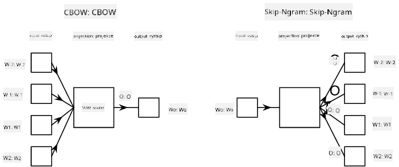

<!--
CO_OP_TRANSLATOR_METADATA:
{
  "original_hash": "e40b47ac3fd48f71304ede1474e66293",
  "translation_date": "2025-08-25T21:38:37+00:00",
  "source_file": "lessons/5-NLP/14-Embeddings/README.md",
  "language_code": "cs"
}
-->
# Vnoření

## [Kvíz před přednáškou](https://ff-quizzes.netlify.app/en/ai/quiz/27)

Při trénování klasifikátorů založených na BoW nebo TF/IDF jsme pracovali s vysoce dimenzionálními vektory bag-of-words o délce `vocab_size` a explicitně jsme převáděli nízko-dimenzionální poziční reprezentace na řídké jednohotové reprezentace. Tato jednohotová reprezentace však není paměťově efektivní. Navíc je každé slovo považováno za nezávislé na ostatních, tj. jednohotové vektory nevyjadřují žádnou sémantickou podobnost mezi slovy.

Myšlenka **vnoření** spočívá v reprezentaci slov pomocí nízko-dimenzionálních hustých vektorů, které nějakým způsobem odrážejí sémantický význam slova. Později si povíme, jak vytvořit smysluplná vnoření slov, ale prozatím si vnoření představme jako způsob snížení dimenzionality vektoru slova.

Vrstva vnoření tedy přijme slovo jako vstup a vytvoří výstupní vektor o specifikované velikosti `embedding_size`. Svým způsobem je velmi podobná vrstvě `Linear`, ale místo jednohotového vektoru bude schopna přijmout číslo slova jako vstup, což nám umožní vyhnout se vytváření velkých jednohotových vektorů.

Použitím vrstvy vnoření jako první vrstvy v naší síti klasifikátoru můžeme přejít od modelu bag-of-words k modelu **embedding bag**, kde nejprve převedeme každé slovo v našem textu na odpovídající vnoření a poté vypočítáme nějakou agregační funkci přes všechna tato vnoření, jako je `sum`, `average` nebo `max`.  

> Obrázek od autora

## ✍️ Cvičení: Vnoření

Pokračujte ve svém učení v následujících noteboocích:
* [Vnoření s PyTorch](../../../../../lessons/5-NLP/14-Embeddings/EmbeddingsPyTorch.ipynb)
* [Vnoření s TensorFlow](../../../../../lessons/5-NLP/14-Embeddings/EmbeddingsTF.ipynb)

## Sémantická vnoření: Word2Vec

Zatímco vrstva vnoření se naučila mapovat slova na vektorovou reprezentaci, tato reprezentace nemusela nutně mít velký sémantický význam. Bylo by skvělé naučit se vektorovou reprezentaci takovou, že podobná slova nebo synonyma odpovídají vektorům, které jsou si blízké z hlediska nějaké vektorové vzdálenosti (např. Euklidovské vzdálenosti).

K tomu potřebujeme předtrénovat náš model vnoření na velké sbírce textů specifickým způsobem. Jedním ze způsobů trénování sémantických vnoření je metoda [Word2Vec](https://en.wikipedia.org/wiki/Word2vec). Ta je založena na dvou hlavních architekturách, které se používají k vytvoření distribuované reprezentace slov:

 - **Kontinuální bag-of-words** (CBoW) — v této architektuře trénujeme model, aby předpověděl slovo na základě okolního kontextu. Daný ngram $(W_{-2},W_{-1},W_0,W_1,W_2)$ má za cíl model předpovědět $W_0$ z $(W_{-2},W_{-1},W_1,W_2)$.
 - **Kontinuální skip-gram** je opakem CBoW. Model používá okolní okno kontextových slov k předpovědi aktuálního slova.

CBoW je rychlejší, zatímco skip-gram je pomalejší, ale lépe reprezentuje méně častá slova.

> Obrázek z [tohoto článku](https://arxiv.org/pdf/1301.3781.pdf)

Předtrénovaná vnoření Word2Vec (stejně jako jiné podobné modely, například GloVe) mohou být také použita místo vrstvy vnoření v neuronových sítích. Musíme se však vypořádat se slovníky, protože slovník použitý k předtrénování Word2Vec/GloVe se pravděpodobně liší od slovníku v našem textovém korpusu. Podívejte se na výše uvedené notebooky, abyste zjistili, jak tento problém vyřešit.

## Kontextová vnoření

Jedním z klíčových omezení tradičních předtrénovaných reprezentací vnoření, jako je Word2Vec, je problém rozlišení významu slov. Zatímco předtrénovaná vnoření mohou zachytit část významu slov v kontextu, každý možný význam slova je zakódován do stejného vnoření. To může způsobit problémy v následných modelech, protože mnoho slov, jako například slovo 'play', má různé významy v závislosti na kontextu, ve kterém jsou použity.

Například slovo 'play' v těchto dvou větách má zcela odlišný význam:

- Šel jsem na **hru** do divadla.
- John si chce **hrát** se svými přáteli.

Předtrénovaná vnoření výše reprezentují oba tyto významy slova 'play' ve stejném vnoření. Abychom toto omezení překonali, musíme vytvořit vnoření založená na **jazykovém modelu**, který je trénován na velkém korpusu textů a *ví*, jak mohou být slova spojována v různých kontextech. Diskuse o kontextových vnořeních přesahuje rámec tohoto tutoriálu, ale vrátíme se k nim při probírání jazykových modelů později v kurzu.

## Závěr

V této lekci jste se naučili, jak vytvořit a používat vrstvy vnoření v TensorFlow a Pytorch, aby lépe odrážely sémantické významy slov.

## 🚀 Výzva

Word2Vec byl použit pro některé zajímavé aplikace, včetně generování textů písní a poezie. Podívejte se na [tento článek](https://www.politetype.com/blog/word2vec-color-poems), který popisuje, jak autor použil Word2Vec k generování poezie. Podívejte se také na [toto video od Dana Shiffmanna](https://www.youtube.com/watch?v=LSS_bos_TPI&ab_channel=TheCodingTrain), kde najdete jiný výklad této techniky. Poté zkuste tyto techniky aplikovat na svůj vlastní textový korpus, možná získaný z Kaggle.

## [Kvíz po přednášce](https://ff-quizzes.netlify.app/en/ai/quiz/28)

## Přehled & Samostudium

Projděte si tento článek o Word2Vec: [Efficient Estimation of Word Representations in Vector Space](https://arxiv.org/pdf/1301.3781.pdf)

## [Úkol: Notebooky](assignment.md)

**Prohlášení:**  
Tento dokument byl přeložen pomocí služby pro automatický překlad [Co-op Translator](https://github.com/Azure/co-op-translator). Ačkoli se snažíme o přesnost, mějte na paměti, že automatické překlady mohou obsahovat chyby nebo nepřesnosti. Původní dokument v jeho původním jazyce by měl být považován za autoritativní zdroj. Pro důležité informace se doporučuje profesionální lidský překlad. Neodpovídáme za žádná nedorozumění nebo nesprávné interpretace vyplývající z použití tohoto překladu.