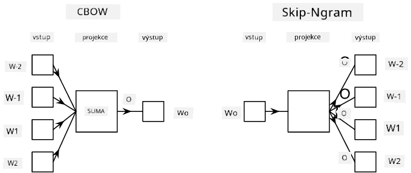

# Vektorizace slov (Embeddings)

## [Kvíz před přednáškou](https://ff-quizzes.netlify.app/en/ai/quiz/27)

Při trénování klasifikátorů založených na BoW nebo TF/IDF jsme pracovali s vysoko-dimenzionálními vektory bag-of-words o délce `vocab_size` a explicitně jsme převáděli nízko-dimenzionální poziční reprezentace na řídké one-hot reprezentace. Tato one-hot reprezentace však není paměťově efektivní. Navíc je s každým slovem zacházeno nezávisle na ostatních, což znamená, že one-hot kódované vektory nevyjadřují žádnou sémantickou podobnost mezi slovy.

Myšlenka **vektorizace slov (embedding)** spočívá v reprezentaci slov pomocí nízko-dimenzionálních hustých vektorů, které nějakým způsobem odrážejí sémantický význam slova. Později si ukážeme, jak vytvořit smysluplné vektorizace slov, ale prozatím si je představme jako způsob, jak snížit dimenzionalitu slovního vektoru.

Vrstva embedding tedy přijme slovo jako vstup a vytvoří výstupní vektor o specifikované velikosti `embedding_size`. V jistém smyslu je to velmi podobné vrstvě `Linear`, ale místo toho, aby přijímala one-hot kódovaný vektor, dokáže přijmout číslo slova jako vstup, což nám umožňuje vyhnout se vytváření velkých one-hot kódovaných vektorů.

Použitím vrstvy embedding jako první vrstvy v naší klasifikační síti můžeme přejít od modelu bag-of-words k modelu **embedding bag**, kde nejprve převedeme každé slovo v textu na odpovídající embedding a poté vypočítáme nějakou agregační funkci nad všemi těmito embeddingy, například `sum`, `average` nebo `max`.

> Obrázek od autora

## ✍️ Cvičení: Vektorizace slov

Pokračujte ve studiu v následujících noteboocích:
* [Embeddings s PyTorch](EmbeddingsPyTorch.ipynb)
* [Embeddings s TensorFlow](EmbeddingsTF.ipynb)

## Sémantické vektorizace: Word2Vec

Zatímco vrstva embedding se naučila mapovat slova na vektorovou reprezentaci, tato reprezentace nutně neobsahuje mnoho sémantického významu. Bylo by užitečné naučit se vektorovou reprezentaci tak, aby podobná slova nebo synonyma odpovídala vektorům, které jsou si blízké z hlediska nějaké vektorové vzdálenosti (např. Euklidovské vzdálenosti).

K tomu je třeba předtrénovat model embedding na velké kolekci textů specifickým způsobem. Jedním ze způsobů trénování sémantických embeddingů je metoda [Word2Vec](https://en.wikipedia.org/wiki/Word2vec). Ta je založena na dvou hlavních architekturách, které se používají k vytvoření distribuované reprezentace slov:

 - **Continuous bag-of-words** (CBoW) — v této architektuře trénujeme model, aby předpověděl slovo na základě okolního kontextu. Pro daný n-gram $(W_{-2},W_{-1},W_0,W_1,W_2)$ je cílem modelu předpovědět $W_0$ na základě $(W_{-2},W_{-1},W_1,W_2)$.
 - **Continuous skip-gram** je opakem CBoW. Model používá okolní okno kontextových slov k předpovědi aktuálního slova.

CBoW je rychlejší, zatímco skip-gram je pomalejší, ale lépe reprezentuje méně častá slova.

> Obrázek z [tohoto článku](https://arxiv.org/pdf/1301.3781.pdf)

Předtrénované embeddingy Word2Vec (stejně jako jiné podobné modely, například GloVe) lze také použít místo vrstvy embedding v neuronových sítích. Musíme se však vypořádat se slovníky, protože slovník použitý pro předtrénování Word2Vec/GloVe se pravděpodobně liší od slovníku v našem textovém korpusu. Podívejte se na výše uvedené notebooky, abyste zjistili, jak tento problém vyřešit.

## Kontextové vektorizace

Jedním z klíčových omezení tradičních předtrénovaných embeddingů, jako je Word2Vec, je problém disambiguace významu slov. Zatímco předtrénované embeddingy dokážou zachytit část významu slov v kontextu, každý možný význam slova je zakódován do stejného embeddingu. To může způsobit problémy v následných modelech, protože mnoho slov, například slovo 'play', má různé významy v závislosti na kontextu, ve kterém jsou použity.

Například slovo 'play' má v těchto dvou větách zcela odlišný význam:

- Šel jsem na **hru** do divadla.
- John si chce **hrát** se svými přáteli.

Výše zmíněné předtrénované embeddingy reprezentují oba tyto významy slova 'play' stejným embeddingem. Abychom toto omezení překonali, musíme vytvářet embeddingy založené na **jazykovém modelu**, který je trénován na velkém korpusu textu a *ví*, jak lze slova skládat v různých kontextech. Diskuze o kontextových embeddingech je mimo rozsah tohoto tutoriálu, ale vrátíme se k nim při probírání jazykových modelů později v kurzu.

## Závěr

V této lekci jste se naučili, jak vytvořit a používat vrstvy embedding v TensorFlow a PyTorch, aby lépe odrážely sémantické významy slov.

## 🚀 Výzva

Word2Vec byl použit pro některé zajímavé aplikace, včetně generování textů písní a poezie. Podívejte se na [tento článek](https://www.politetype.com/blog/word2vec-color-poems), který popisuje, jak autor použil Word2Vec k generování poezie. Podívejte se také na [toto video od Dana Shiffmanna](https://www.youtube.com/watch?v=LSS_bos_TPI&ab_channel=TheCodingTrain), kde najdete jiné vysvětlení této techniky. Poté zkuste tyto techniky aplikovat na svůj vlastní textový korpus, například z Kaggle.

## [Kvíz po přednášce](https://ff-quizzes.netlify.app/en/ai/quiz/28)

## Opakování a samostudium

Přečtěte si tento článek o Word2Vec: [Efficient Estimation of Word Representations in Vector Space](https://arxiv.org/pdf/1301.3781.pdf)

## [Úkol: Notebooks](assignment.md)

---

