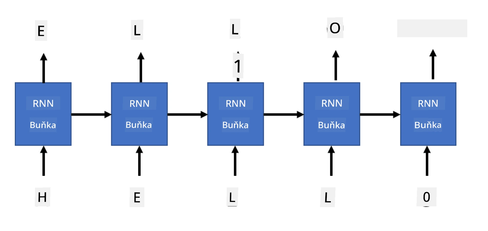

# Generativní sítě

## [Kvíz před přednáškou](https://ff-quizzes.netlify.app/en/ai/quiz/33)

Rekurentní neuronové sítě (RNN) a jejich varianty s bráněnými buňkami, jako jsou Long Short Term Memory Cells (LSTM) a Gated Recurrent Units (GRU), poskytují mechanismus pro modelování jazyka, protože se dokážou naučit pořadí slov a předpovídat další slovo v sekvenci. To nám umožňuje využívat RNN pro **generativní úlohy**, jako je běžná generace textu, strojový překlad nebo dokonce popisování obrázků.

> ✅ Zamyslete se nad všemi situacemi, kdy jste využili generativní úlohy, například při automatickém doplňování textu během psaní. Prozkoumejte své oblíbené aplikace a zjistěte, zda využívají RNN.

V architektuře RNN, kterou jsme probírali v předchozí kapitole, každá jednotka RNN produkovala jako výstup další skrytý stav. Můžeme však také přidat další výstup ke každé rekurentní jednotce, což nám umožní generovat **sekvenci** (která má stejnou délku jako původní sekvence). Navíc můžeme použít RNN jednotky, které nepřijímají vstup na každém kroku, ale pouze počáteční stavový vektor, a poté generují sekvenci výstupů.

To umožňuje různé neuronové architektury, jak je znázorněno na obrázku níže:


> Obrázek z blogového příspěvku [Unreasonable Effectiveness of Recurrent Neural Networks](http://karpathy.github.io/2015/05/21/rnn-effectiveness/) od [Andreje Karpatyho](http://karpathy.github.io/)

* **One-to-one** je tradiční neuronová síť s jedním vstupem a jedním výstupem.
* **One-to-many** je generativní architektura, která přijímá jednu vstupní hodnotu a generuje sekvenci výstupních hodnot. Například pokud chceme trénovat síť pro **popisování obrázků**, která by vytvořila textový popis obrázku, můžeme použít obrázek jako vstup, zpracovat jej pomocí CNN pro získání skrytého stavu a poté nechat rekurentní řetězec generovat popis slovo po slovu.
* **Many-to-one** odpovídá architekturám RNN, které jsme popsali v předchozí kapitole, například klasifikace textu.
* **Many-to-many**, nebo **sekvence na sekvenci**, odpovídá úlohám, jako je **strojový překlad**, kde první RNN shromáždí všechny informace ze vstupní sekvence do skrytého stavu a další řetězec RNN tento stav rozvine do výstupní sekvence.

V této kapitole se zaměříme na jednoduché generativní modely, které nám pomohou generovat text. Pro zjednodušení použijeme tokenizaci na úrovni znaků.

Tuto RNN budeme trénovat na generování textu krok za krokem. Na každém kroku vezmeme sekvenci znaků o délce `nchars` a požádáme síť, aby pro každý vstupní znak vygenerovala další výstupní znak:



Při generování textu (během inference) začínáme s nějakým **podnětem**, který je předán přes RNN buňky pro vytvoření mezistavu, a poté začíná samotné generování. Generujeme jeden znak po druhém a předáváme stav a vygenerovaný znak další RNN buňce, aby vygenerovala další znak, dokud nevygenerujeme dostatek znaků.


> Obrázek od autora

## ✍️ Cvičení: Generativní sítě

Pokračujte ve studiu v následujících noteboocích:

* [Generativní sítě s PyTorch](GenerativePyTorch.ipynb)
* [Generativní sítě s TensorFlow](GenerativeTF.ipynb)

## Měkké generování textu a teplota

Výstup každé RNN buňky je pravděpodobnostní rozdělení znaků. Pokud bychom vždy vybrali znak s nejvyšší pravděpodobností jako další znak v generovaném textu, text by se často mohl "zacyklit" mezi stejnými sekvencemi znaků znovu a znovu, jako v tomto příkladu:

```
today of the second the company and a second the company ...
```

Pokud se však podíváme na pravděpodobnostní rozdělení pro další znak, může se stát, že rozdíl mezi několika nejvyššími pravděpodobnostmi není velký, např. jeden znak může mít pravděpodobnost 0,2, jiný 0,19 atd. Například při hledání dalšího znaku v sekvenci '*play*' může být dalším znakem stejně dobře mezera nebo **e** (jako ve slově *player*).

To nás vede k závěru, že není vždy "spravedlivé" vybírat znak s nejvyšší pravděpodobností, protože výběr druhého nejvyššího může stále vést k smysluplnému textu. Je rozumnější **vzorkovat** znaky z pravděpodobnostního rozdělení daného výstupem sítě. Můžeme také použít parametr **teplota**, který rozprostře pravděpodobnostní rozdělení, pokud chceme přidat více náhodnosti, nebo jej udělá strmějším, pokud chceme více preferovat znaky s nejvyšší pravděpodobností.

Prozkoumejte, jak je toto měkké generování textu implementováno v noteboocích uvedených výše.

## Závěr

Ačkoli generování textu může být užitečné samo o sobě, hlavní přínosy přicházejí z možnosti generovat text pomocí RNN z nějakého počátečního vektorového znaku. Například generování textu se používá jako součást strojového překladu (sekvence na sekvenci, v tomto případě je stavový vektor z *enkodéru* použit pro generování nebo *dekódování* přeložené zprávy) nebo pro generování textového popisu obrázku (v tomto případě pochází vektor znaků z extraktoru CNN).

## 🚀 Výzva

Absolvujte některé lekce na Microsoft Learn na toto téma:

* Generování textu s [PyTorch](https://docs.microsoft.com/learn/modules/intro-natural-language-processing-pytorch/6-generative-networks/?WT.mc_id=academic-77998-cacaste)/[TensorFlow](https://docs.microsoft.com/learn/modules/intro-natural-language-processing-tensorflow/5-generative-networks/?WT.mc_id=academic-77998-cacaste)

## [Kvíz po přednášce](https://ff-quizzes.netlify.app/en/ai/quiz/34)

## Přehled a samostudium

Zde jsou některé články pro rozšíření vašich znalostí:

* Různé přístupy ke generování textu s Markovovým řetězcem, LSTM a GPT-2: [blogový příspěvek](https://towardsdatascience.com/text-generation-gpt-2-lstm-markov-chain-9ea371820e1e)
* Ukázka generování textu v [dokumentaci Keras](https://keras.io/examples/generative/lstm_character_level_text_generation/)

## [Úkol](lab/README.md)

Viděli jsme, jak generovat text znak po znaku. V laboratoři budete zkoumat generování textu na úrovni slov.

---

