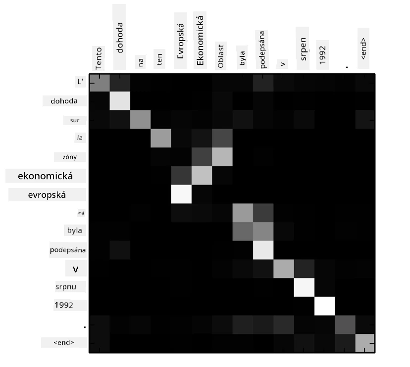
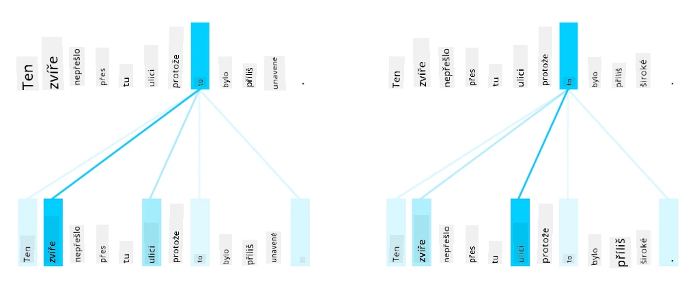
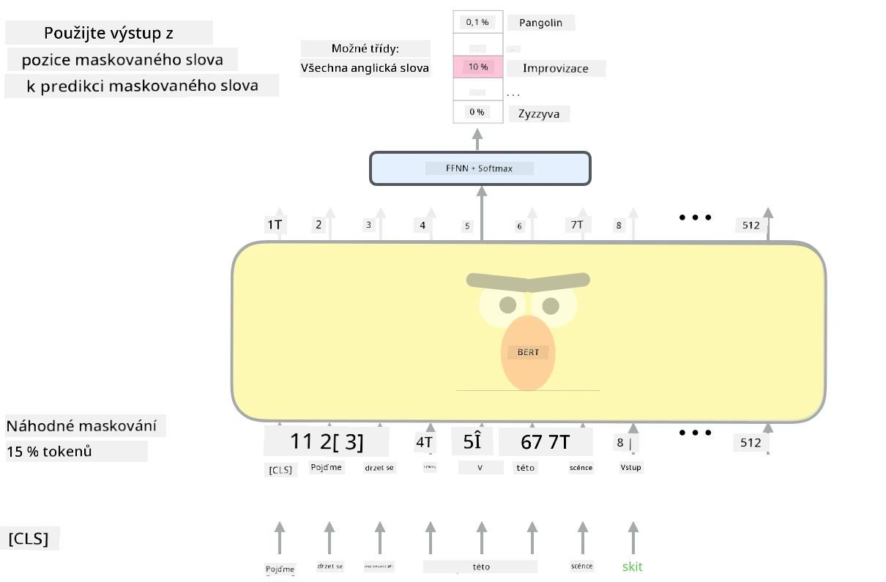

# Mechanismy pozornosti a transformery

## [Kvíz před přednáškou](https://ff-quizzes.netlify.app/en/ai/quiz/35)

Jedním z nejdůležitějších problémů v oblasti NLP je **strojový překlad**, což je klíčový úkol, na kterém jsou založeny nástroje jako Google Translate. V této části se zaměříme na strojový překlad, nebo obecněji na jakýkoli úkol typu *sekvence na sekvenci* (který se také nazývá **převod vět**).

U RNN je sekvence na sekvenci implementována dvěma rekurentními sítěmi, kde jedna síť, **enkodér**, zkomprimuje vstupní sekvenci do skrytého stavu, zatímco druhá síť, **dekodér**, rozvine tento skrytý stav do přeloženého výsledku. Tento přístup má však několik problémů:

* Konečný stav enkodéru má problém si zapamatovat začátek věty, což způsobuje nízkou kvalitu modelu u dlouhých vět.
* Všechna slova v sekvenci mají stejný vliv na výsledek. Ve skutečnosti však konkrétní slova ve vstupní sekvenci často mají větší vliv na výstupy než jiná.

**Mechanismy pozornosti** poskytují způsob, jak vážit kontextuální vliv každého vstupního vektoru na každou výstupní predikci RNN. Implementuje se to vytvořením zkratek mezi mezistavy vstupní RNN a výstupní RNN. Tímto způsobem při generování výstupního symbolu yt zohledníme všechny skryté stavy vstupu hi, s různými váhovými koeficienty &alpha;t,i.

> Model enkodér-dekodér s mechanismem aditivní pozornosti podle [Bahdanau et al., 2015](https://arxiv.org/pdf/1409.0473.pdf), citováno z [tohoto blogového příspěvku](https://lilianweng.github.io/lil-log/2018/06/24/attention-attention.html)

Matice pozornosti {&alpha;i,j} by reprezentovala míru, jakou určitá vstupní slova ovlivňují generování daného slova ve výstupní sekvenci. Níže je příklad takové matice:

> Obrázek z [Bahdanau et al., 2015](https://arxiv.org/pdf/1409.0473.pdf) (Obr.3)

Mechanismy pozornosti jsou zodpovědné za velkou část současného nebo téměř současného stavu umění v NLP. Přidání pozornosti však výrazně zvyšuje počet parametrů modelu, což vedlo k problémům se škálováním u RNN. Klíčovým omezením škálování RNN je, že rekurentní povaha modelů ztěžuje dávkování a paralelizaci tréninku. V RNN musí být každý prvek sekvence zpracován v sekvenčním pořadí, což znamená, že jej nelze snadno paralelizovat.

> Obrázek z [Google Blogu](https://research.googleblog.com/2016/09/a-neural-network-for-machine.html)

Přijetí mechanismů pozornosti v kombinaci s tímto omezením vedlo k vytvoření nyní špičkových modelů Transformer, které dnes známe a používáme, jako jsou BERT a Open-GPT3.

## Modely Transformer

Jednou z hlavních myšlenek za transformery je vyhnout se sekvenční povaze RNN a vytvořit model, který je paralelizovatelný během tréninku. Toho je dosaženo implementací dvou myšlenek:

* poziční kódování
* použití mechanismu vlastní pozornosti k zachycení vzorců místo RNN (nebo CNN) (proto se článek, který představuje transformery, nazývá *[Attention is all you need](https://arxiv.org/abs/1706.03762)*)

### Poziční kódování/embedding

Myšlenka pozičního kódování je následující. 
1. Při použití RNN je relativní pozice tokenů reprezentována počtem kroků, a proto ji není třeba explicitně reprezentovat. 
2. Jakmile však přejdeme k pozornosti, potřebujeme znát relativní pozice tokenů v rámci sekvence. 
3. Abychom získali poziční kódování, rozšíříme naši sekvenci tokenů o sekvenci pozic tokenů v sekvenci (tj. sekvenci čísel 0,1, ...).
4. Poté smícháme pozici tokenu s vektorem embeddingu tokenu. K transformaci pozice (celého čísla) na vektor můžeme použít různé přístupy:

* Trénovatelný embedding, podobně jako embedding tokenů. Tento přístup zde zvažujeme. Aplikujeme vrstvy embeddingu na tokeny i jejich pozice, což vede k embeddingovým vektorům stejných rozměrů, které poté sečteme.
* Fixní funkce pozičního kódování, jak bylo navrženo v původním článku.

> Obrázek od autora

Výsledek, který získáme s pozičním embeddingem, zahrnuje jak původní token, tak jeho pozici v rámci sekvence.

### Multi-Head Self-Attention

Dále potřebujeme zachytit určité vzorce v rámci naší sekvence. K tomu transformery používají mechanismus **vlastní pozornosti**, což je v podstatě pozornost aplikovaná na stejnou sekvenci jako vstup a výstup. Aplikace vlastní pozornosti nám umožňuje zohlednit **kontext** v rámci věty a vidět, která slova jsou vzájemně propojená. Například nám umožňuje vidět, na která slova odkazují koreference, jako *to*, a také zohlednit kontext:

> Obrázek z [Google Blogu](https://research.googleblog.com/2017/08/transformer-novel-neural-network.html)

V transformerech používáme **Multi-Head Attention**, abychom síti dali schopnost zachytit několik různých typů závislostí, např. dlouhodobé vs. krátkodobé vztahy mezi slovy, koreference vs. něco jiného atd.

[TensorFlow Notebook](TransformersTF.ipynb) obsahuje více podrobností o implementaci vrstev transformeru.

### Pozornost mezi enkodérem a dekodérem

V transformerech se pozornost používá na dvou místech:

* K zachycení vzorců ve vstupním textu pomocí vlastní pozornosti
* K provádění překladů sekvencí - jedná se o vrstvu pozornosti mezi enkodérem a dekodérem.

Pozornost mezi enkodérem a dekodérem je velmi podobná mechanismu pozornosti používanému v RNN, jak bylo popsáno na začátku této části. Tento animovaný diagram vysvětluje roli pozornosti mezi enkodérem a dekodérem.

Protože každá vstupní pozice je mapována nezávisle na každou výstupní pozici, transformery mohou lépe paralelizovat než RNN, což umožňuje mnohem větší a expresivnější jazykové modely. Každá hlava pozornosti může být použita k učení různých vztahů mezi slovy, což zlepšuje následné úkoly zpracování přirozeného jazyka.

## BERT

**BERT** (Bidirectional Encoder Representations from Transformers) je velmi velká vícevstvá síť transformeru s 12 vrstvami pro *BERT-base* a 24 pro *BERT-large*. Model je nejprve předtrénován na velkém korpusu textových dat (WikiPedia + knihy) pomocí nesupervizovaného tréninku (predikce maskovaných slov ve větě). Během předtrénování model absorbuje významné úrovně porozumění jazyku, které lze následně využít s jinými datovými sadami pomocí jemného ladění. Tento proces se nazývá **transfer learning**.

> Obrázek [zdroj](http://jalammar.github.io/illustrated-bert/)

## ✍️ Cvičení: Transformery

Pokračujte ve svém učení v následujících noteboocích:

* [Transformery v PyTorch](TransformersPyTorch.ipynb)
* [Transformery v TensorFlow](TransformersTF.ipynb)

## Závěr

V této lekci jste se naučili o transformerech a mechanismech pozornosti, což jsou základní nástroje v NLP. Existuje mnoho variant architektur transformeru, včetně BERT, DistilBERT, BigBird, OpenGPT3 a dalších, které lze jemně ladit. Balíček [HuggingFace](https://github.com/huggingface/) poskytuje repozitář pro trénování mnoha z těchto architektur s použitím PyTorch i TensorFlow.

## 🚀 Výzva

## [Kvíz po přednášce](https://ff-quizzes.netlify.app/en/ai/quiz/36)

## Přehled & Samostudium

* [Blogový příspěvek](https://mchromiak.github.io/articles/2017/Sep/12/Transformer-Attention-is-all-you-need/), vysvětlující klasický článek [Attention is all you need](https://arxiv.org/abs/1706.03762) o transformerech.
* [Série blogových příspěvků](https://towardsdatascience.com/transformers-explained-visually-part-1-overview-of-functionality-95a6dd460452) o transformerech, vysvětlující architekturu podrobně.

## [Úkol](assignment.md)

---

