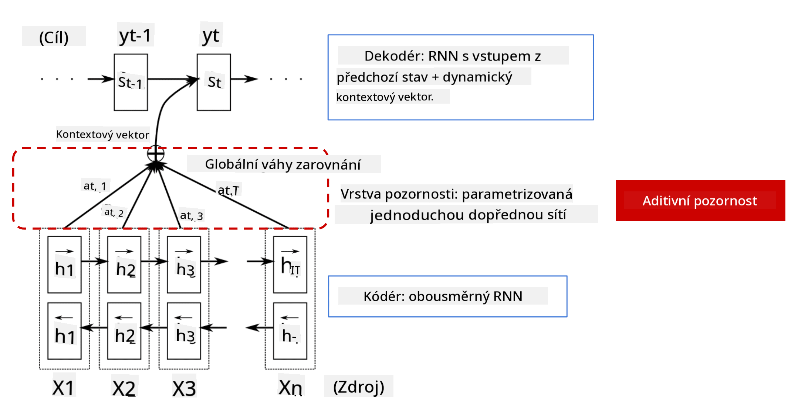

<!--
CO_OP_TRANSLATOR_METADATA:
{
  "original_hash": "7e617f0b8de85a43957a853aba09bfeb",
  "translation_date": "2025-08-25T22:00:17+00:00",
  "source_file": "lessons/5-NLP/18-Transformers/README.md",
  "language_code": "cs"
}
-->
# Mechanismy pozornosti a transformery

## [Kvíz před přednáškou](https://red-field-0a6ddfd03.1.azurestaticapps.net/quiz/118)

Jedním z nejdůležitějších problémů v oblasti NLP je **strojový překlad**, což je klíčový úkol, na kterém stojí nástroje jako Google Překladač. V této sekci se zaměříme na strojový překlad, nebo obecněji na jakýkoli úkol typu *sekvence na sekvenci* (také nazývaný **převod vět**).

U RNN je sekvence na sekvenci implementována dvěma rekurentními sítěmi, kde jedna síť, **enkodér**, zkomprimuje vstupní sekvenci do skrytého stavu, zatímco druhá síť, **dekodér**, tento skrytý stav rozvine do přeloženého výsledku. Tento přístup má však několik problémů:

* Konečný stav enkodéru má problém si zapamatovat začátek věty, což způsobuje nízkou kvalitu modelu u dlouhých vět.
* Všechna slova v sekvenci mají stejný vliv na výsledek. Ve skutečnosti však konkrétní slova ve vstupní sekvenci často mají větší vliv na výstupní sekvenci než jiná.

**Mechanismy pozornosti** poskytují způsob, jak vážit kontextuální vliv každého vstupního vektoru na každou výstupní predikci RNN. To se implementuje vytvořením zkratek mezi mezistavy vstupní RNN a výstupní RNN. Tímto způsobem při generování výstupního symbolu yt zohledníme všechny skryté stavy vstupu hi s různými váhovými koeficienty αt,i.

> Model enkodér-dekodér s aditivním mechanismem pozornosti podle [Bahdanau et al., 2015](https://arxiv.org/pdf/1409.0473.pdf), citováno z [tohoto blogového příspěvku](https://lilianweng.github.io/lil-log/2018/06/24/attention-attention.html)

Matice pozornosti {αi,j} by reprezentovala míru, jakou určitá vstupní slova ovlivňují generování konkrétního slova ve výstupní sekvenci. Níže je příklad takové matice:

> Obrázek z [Bahdanau et al., 2015](https://arxiv.org/pdf/1409.0473.pdf) (Obr. 3)

Mechanismy pozornosti jsou zodpovědné za velkou část současného nebo téměř současného stavu techniky v NLP. Přidání pozornosti však výrazně zvyšuje počet parametrů modelu, což vedlo k problémům se škálováním u RNN. Klíčovým omezením škálování RNN je, že rekurentní povaha modelů ztěžuje dávkování a paralelizaci tréninku. V RNN musí být každý prvek sekvence zpracován v sekvenčním pořadí, což znamená, že jej nelze snadno paralelizovat.

> Obrázek z [Google Blogu](https://research.googleblog.com/2016/09/a-neural-network-for-machine.html)

Přijetí mechanismů pozornosti v kombinaci s tímto omezením vedlo k vytvoření současných špičkových modelů Transformer, které dnes známe a používáme, jako jsou BERT a Open-GPT3.

## Modely Transformer

Jednou z hlavních myšlenek za transformery je vyhnout se sekvenční povaze RNN a vytvořit model, který je paralelizovatelný během tréninku. Toho je dosaženo implementací dvou myšlenek:

* poziční kódování
* použití mechanismu self-attention k zachycení vzorců namísto RNN (nebo CNN) (proto se článek, který představuje transformery, nazývá *[Attention is all you need](https://arxiv.org/abs/1706.03762)*)

### Poziční kódování/vkládání

Myšlenka pozičního kódování je následující.  
1. Při použití RNN je relativní pozice tokenů reprezentována počtem kroků, a proto nemusí být explicitně reprezentována.  
2. Jakmile však přejdeme k pozornosti, potřebujeme znát relativní pozice tokenů v rámci sekvence.  
3. Abychom získali poziční kódování, rozšíříme naši sekvenci tokenů o sekvenci pozic tokenů v sekvenci (tj. sekvenci čísel 0,1, ...).  
4. Poté smícháme pozici tokenu s vektorovým vkládáním tokenu. K transformaci pozice (celého čísla) na vektor můžeme použít různé přístupy:

* Trénovatelné vkládání, podobné vkládání tokenů. Toto je přístup, který zde zvažujeme. Použijeme vrstvy vkládání na tokeny i jejich pozice, což vede k vektorům vkládání stejné dimenze, které poté sečteme.
* Fixní funkce pozičního kódování, jak bylo navrženo v původním článku.

> Obrázek od autora

Výsledkem pozičního vkládání je, že vkládáme jak původní token, tak jeho pozici v rámci sekvence.

### Multi-Head Self-Attention

Dále potřebujeme zachytit určité vzorce v rámci naší sekvence. K tomu transformery používají mechanismus **self-attention**, což je v podstatě pozornost aplikovaná na stejnou sekvenci jako vstup a výstup. Aplikace self-attention nám umožňuje zohlednit **kontext** v rámci věty a vidět, která slova jsou vzájemně propojená. Například nám umožňuje vidět, na která slova odkazují zájmena jako *to*, a také zohlednit kontext:

> Obrázek z [Google Blogu](https://research.googleblog.com/2017/08/transformer-novel-neural-network.html)

V transformerech používáme **Multi-Head Attention**, abychom síti dali schopnost zachytit několik různých typů závislostí, např. dlouhodobé vs. krátkodobé vztahy mezi slovy, koreference vs. něco jiného atd.

[TensorFlow Notebook](../../../../../lessons/5-NLP/18-Transformers/TransformersTF.ipynb) obsahuje více podrobností o implementaci vrstev transformeru.

### Pozornost Enkodér-Dekodér

V transformerech se pozornost používá na dvou místech:

* K zachycení vzorců ve vstupním textu pomocí self-attention
* K provedení sekvenčního překladu - jedná se o vrstvu pozornosti mezi enkodérem a dekodérem.

Pozornost enkodér-dekodér je velmi podobná mechanismu pozornosti používanému v RNN, jak bylo popsáno na začátku této sekce. Tento animovaný diagram vysvětluje roli pozornosti enkodér-dekodér.

Protože každá vstupní pozice je mapována nezávisle na každou výstupní pozici, transformery mohou lépe paralelizovat než RNN, což umožňuje mnohem větší a expresivnější jazykové modely. Každá hlava pozornosti může být použita k učení různých vztahů mezi slovy, což zlepšuje následné úkoly zpracování přirozeného jazyka.

## BERT

**BERT** (Bidirectional Encoder Representations from Transformers) je velmi velká vícevrstvá síť transformerů s 12 vrstvami pro *BERT-base* a 24 pro *BERT-large*. Model je nejprve předtrénován na velkém korpusu textových dat (WikiPedia + knihy) pomocí nesupervizovaného tréninku (predikce maskovaných slov ve větě). Během předtrénování model absorbuje významné úrovně porozumění jazyku, které lze následně využít s jinými datovými sadami pomocí doladění. Tento proces se nazývá **transfer learning**.

> Obrázek [zdroj](http://jalammar.github.io/illustrated-bert/)

## ✍️ Cvičení: Transformery

Pokračujte ve svém učení v následujících noteboocích:

* [Transformery v PyTorch](../../../../../lessons/5-NLP/18-Transformers/TransformersPyTorch.ipynb)
* [Transformery v TensorFlow](../../../../../lessons/5-NLP/18-Transformers/TransformersTF.ipynb)

## Závěr

V této lekci jste se naučili o Transformerech a Mechanismech pozornosti, což jsou klíčové nástroje v NLP. Existuje mnoho variant architektur Transformer, včetně BERT, DistilBERT, BigBird, OpenGPT3 a dalších, které lze doladit. Balíček [HuggingFace](https://github.com/huggingface/) poskytuje repozitář pro trénink mnoha z těchto architektur s PyTorch i TensorFlow.

## 🚀 Výzva

## [Kvíz po přednášce](https://red-field-0a6ddfd03.1.azurestaticapps.net/quiz/218)

## Přehled a samostudium

* [Blogový příspěvek](https://mchromiak.github.io/articles/2017/Sep/12/Transformer-Attention-is-all-you-need/), vysvětlující klasický článek [Attention is all you need](https://arxiv.org/abs/1706.03762) o transformerech.
* [Série blogových příspěvků](https://towardsdatascience.com/transformers-explained-visually-part-1-overview-of-functionality-95a6dd460452) o transformerech, podrobně vysvětlující architekturu.

## [Úkol](assignment.md)

**Prohlášení:**  
Tento dokument byl přeložen pomocí služby pro automatický překlad [Co-op Translator](https://github.com/Azure/co-op-translator). Ačkoli se snažíme o přesnost, mějte prosím na paměti, že automatické překlady mohou obsahovat chyby nebo nepřesnosti. Původní dokument v jeho původním jazyce by měl být považován za autoritativní zdroj. Pro důležité informace se doporučuje profesionální lidský překlad. Neodpovídáme za žádná nedorozumění nebo nesprávné interpretace vyplývající z použití tohoto překladu.