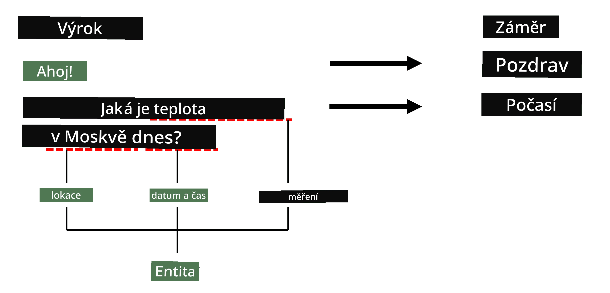
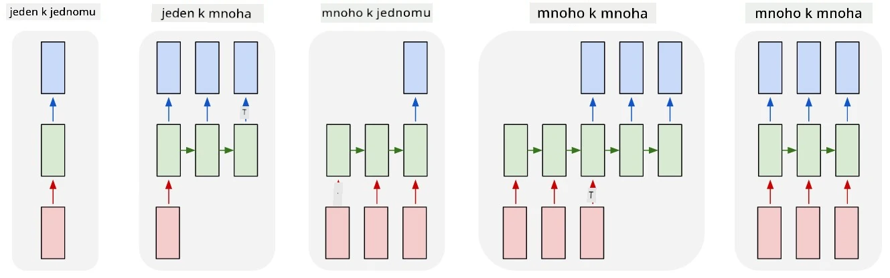

# Rozpoznávání pojmenovaných entit

Doposud jsme se převážně soustředili na jeden úkol v oblasti zpracování přirozeného jazyka (NLP) – klasifikaci. Existují však i další úkoly v NLP, které lze řešit pomocí neuronových sítí. Jedním z těchto úkolů je **[rozpoznávání pojmenovaných entit](https://wikipedia.org/wiki/Named-entity_recognition)** (NER), které se zabývá identifikací konkrétních entit v textu, jako jsou místa, jména osob, časové intervaly, chemické vzorce a podobně.

## [Kvíz před přednáškou](https://ff-quizzes.netlify.app/en/ai/quiz/37)

## Příklad použití NER

Představte si, že chcete vytvořit chatbot pro přirozený jazyk, podobný Amazon Alexe nebo Google Asistentovi. Inteligentní chatboti fungují tak, že *rozumí* tomu, co uživatel chce, pomocí klasifikace textu na vstupní větě. Výsledkem této klasifikace je tzv. **záměr** (intent), který určuje, co by měl chatbot udělat.

> Obrázek od autora

Uživatel však může v rámci fráze poskytnout i některé parametry. Například při dotazu na počasí může specifikovat místo nebo datum. Chatbot by měl být schopen tyto entity pochopit a vyplnit příslušné parametry před provedením akce. A právě zde přichází na řadu NER.

> ✅ Dalším příkladem by mohlo být [analyzování vědeckých lékařských článků](https://soshnikov.com/science/analyzing-medical-papers-with-azure-and-text-analytics-for-health/). Jedním z hlavních cílů je hledání specifických lékařských termínů, jako jsou nemoci a léčivé látky. Zatímco malý počet nemocí lze pravděpodobně extrahovat pomocí vyhledávání podřetězců, složitější entity, jako jsou chemické sloučeniny a názvy léků, vyžadují komplexnější přístup.

## NER jako klasifikace tokenů

Modely NER jsou v podstatě **modely pro klasifikaci tokenů**, protože pro každý vstupní token musíme rozhodnout, zda patří k nějaké entitě, a pokud ano, ke které třídě entity.

Zvažte následující název článku:

**Regurgitace trikuspidální chlopně** a **uhličitan lithný** **toxicita** u novorozence.

Entity zde jsou:

* Regurgitace trikuspidální chlopně je nemoc (`DIS`)
* Uhličitan lithný je chemická látka (`CHEM`)
* Toxicita je také nemoc (`DIS`)

Všimněte si, že jedna entita může zahrnovat několik tokenů. A, jako v tomto případě, musíme rozlišit mezi dvěma po sobě jdoucími entitami. Proto je běžné používat dvě třídy pro každou entitu – jednu pro označení prvního tokenu entity (často se používá předpona `B-` pro **b**eginning, začátek) a druhou pro pokračování entity (`I-`, pro **i**nner token, vnitřní token). Pro označení všech **o**statních tokenů používáme `O`. Takové označování tokenů se nazývá [BIO označování](https://en.wikipedia.org/wiki/Inside%E2%80%93outside%E2%80%93beginning_(tagging)) (nebo IOB). Po označení bude náš název vypadat takto:

Token | Tag
------|-----
Trikuspidální | B-DIS
chlopně | I-DIS
regurgitace | I-DIS
a | O
uhličitan | B-CHEM
lithný | I-CHEM
toxicita | B-DIS
u | O
novorozence | O
. | O

Protože potřebujeme vytvořit jednoznačnou korespondenci mezi tokeny a třídami, můžeme trénovat pravostranný **many-to-many** model neuronové sítě podle tohoto obrázku:

> *Obrázek z [tohoto blogového příspěvku](http://karpathy.github.io/2015/05/21/rnn-effectiveness/) od [Andreje Karpathyho](http://karpathy.github.io/). Modely pro klasifikaci tokenů v NER odpovídají pravostranné architektuře na tomto obrázku.*

## Trénování modelů NER

Protože model NER je v podstatě modelem pro klasifikaci tokenů, můžeme pro tento úkol použít RNN, které již známe. V tomto případě každý blok rekurentní sítě vrátí ID tokenu. Následující ukázkový notebook ukazuje, jak trénovat LSTM pro klasifikaci tokenů.

## ✍️ Ukázkové notebooky: NER

Pokračujte ve studiu v následujícím notebooku:

* [NER s TensorFlow](NER-TF.ipynb)

## Závěr

Model NER je **model pro klasifikaci tokenů**, což znamená, že jej lze použít k provádění klasifikace tokenů. Jedná se o velmi běžný úkol v NLP, který pomáhá rozpoznávat specifické entity v textu, včetně míst, jmen, dat a dalších.

## 🚀 Výzva

Dokončete úkol uvedený níže, kde budete trénovat model pro rozpoznávání pojmenovaných entit v lékařských termínech, a poté jej vyzkoušejte na jiném datasetu.

## [Kvíz po přednášce](https://ff-quizzes.netlify.app/en/ai/quiz/38)

## Přehled a samostudium

Projděte si blog [The Unreasonable Effectiveness of Recurrent Neural Networks](http://karpathy.github.io/2015/05/21/rnn-effectiveness/) a následujte sekci Další čtení v tomto článku, abyste si prohloubili znalosti.

## [Úkol](lab/README.md)

V úkolu pro tuto lekci budete muset natrénovat model pro rozpoznávání lékařských entit. Můžete začít trénováním modelu LSTM, jak je popsáno v této lekci, a pokračovat použitím modelu BERT. Přečtěte si [instrukce](lab/README.md) pro všechny podrobnosti.

---

