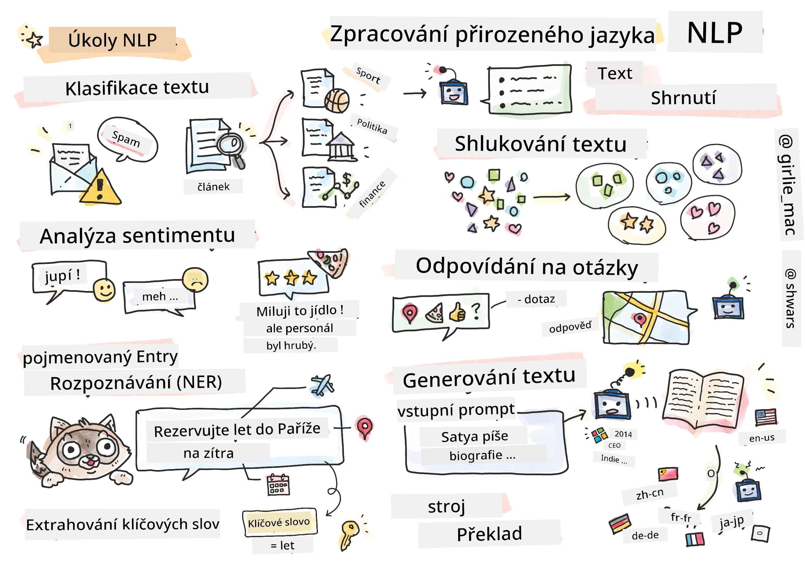

# Zpracování přirozeného jazyka



V této sekci se zaměříme na využití neuronových sítí k řešení úkolů souvisejících se **zpracováním přirozeného jazyka (NLP)**. Existuje mnoho problémů NLP, které chceme, aby počítače dokázaly řešit:

* **Klasifikace textu** je typický klasifikační problém týkající se sekvencí textu. Příklady zahrnují klasifikaci e-mailových zpráv jako spam vs. ne-spam nebo kategorizaci článků jako sport, obchod, politika atd. Také při vývoji chatbotů často potřebujeme pochopit, co uživatel chtěl říct – v tomto případě řešíme **klasifikaci záměru**. Často v klasifikaci záměru musíme pracovat s mnoha kategoriemi.
* **Analýza sentimentu** je typický regresní problém, kde je potřeba přidělit číslo (sentiment) odpovídající tomu, jak pozitivní/negativní je význam věty. Pokročilejší verzí analýzy sentimentu je **analýza sentimentu založená na aspektech** (ABSA), kde přidělujeme sentiment ne celému textu, ale různým jeho částem (aspektům), např. *V této restauraci se mi líbila kuchyně, ale atmosféra byla hrozná*.
* **Rozpoznávání pojmenovaných entit** (NER) se týká problému vyhledávání určitých entit v textu. Například je potřeba pochopit, že ve frázi *Musím zítra letět do Paříže* slovo *zítra* odkazuje na DATUM a *Paříž* je LOKALITA.  
* **Extrahování klíčových slov** je podobné jako NER, ale je potřeba automaticky extrahovat slova důležitá pro význam věty bez předchozího tréninku na konkrétní typy entit.
* **Shlukování textu** může být užitečné, když chceme seskupit podobné věty, například podobné požadavky v konverzacích technické podpory.
* **Odpovídání na otázky** je schopnost modelu odpovědět na konkrétní otázku. Model dostane jako vstup textový úsek a otázku a potřebuje poskytnout místo v textu, kde je odpověď (nebo někdy také vygenerovat text odpovědi).
* **Generování textu** je schopnost modelu generovat nový text. Může být považováno za klasifikační úkol, který předpovídá další písmeno/slovo na základě nějaké *textové výzvy*. Pokročilé modely generování textu, jako GPT-3, dokážou řešit i jiné NLP úkoly, například klasifikaci, pomocí techniky zvané [prompt programming](https://towardsdatascience.com/software-3-0-how-prompting-will-change-the-rules-of-the-game-a982fbfe1e0) nebo [prompt engineering](https://medium.com/swlh/openai-gpt-3-and-prompt-engineering-dcdc2c5fcd29)
* **Shrnutí textu** je technika, kdy chceme, aby počítač „přečetl“ dlouhý text a shrnul ho do několika vět.
* **Strojový překlad** lze vnímat jako kombinaci porozumění textu v jednom jazyce a generování textu v jiném.

Zpočátku byla většina NLP úkolů řešena tradičními metodami, jako byly gramatiky. Například při strojovém překladu se používaly parsery k transformaci počáteční věty do syntaktického stromu, poté byly extrahovány vyšší úrovně sémantických struktur reprezentujících význam věty a na základě tohoto významu a gramatiky cílového jazyka byl generován výsledek. V současnosti je mnoho úkolů NLP efektivněji řešeno pomocí neuronových sítí.

> Mnoho klasických NLP metod je implementováno v Python knihovně [Natural Language Processing Toolkit (NLTK)](https://www.nltk.org). Online je dostupná skvělá [kniha k NLTK](https://www.nltk.org/book/), která pokrývá, jak lze různé úkoly NLP řešit pomocí NLTK.

V našem kurzu se budeme převážně zaměřovat na využití neuronových sítí pro NLP a NLTK použijeme tam, kde to bude potřeba.

Už jsme se naučili využívat neuronové sítě pro práci s tabulkovými daty a s obrázky. Hlavní rozdíl mezi těmito typy dat a textem je, že text je sekvence proměnné délky, zatímco velikost vstupu u obrázků je předem známá. Zatímco konvoluční sítě dokážou extrahovat vzory ze vstupních dat, vzory v textu jsou složitější. Například zápor může být od předmětu oddělen libovolným počtem slov (např. *Nemám rád pomeranče* vs. *Nemám rád ty velké barevné chutné pomeranče*), ale mělo by to být stále interpretováno jako jeden vzor. Proto pro práci s jazykem potřebujeme zavést nové typy neuronových sítí, jako jsou *rekurentní sítě* a *transformery*.

## Instalace knihoven

Pokud používáte lokální instalaci Pythonu pro spuštění tohoto kurzu, možná budete muset nainstalovat všechny požadované knihovny pro NLP pomocí následujících příkazů:

**Pro PyTorch**
```bash
pip install -r requirements-pytorch.txt
```
**Pro TensorFlow**
```bash
pip install -r requirements-tf.txt
```

> NLP s TensorFlow můžete zkusit na [Microsoft Learn](https://docs.microsoft.com/learn/modules/intro-natural-language-processing-tensorflow/?WT.mc_id=academic-77998-cacaste)

## Varování ohledně GPU

V této sekci budeme v některých příkladech trénovat poměrně velké modely.
* **Použijte počítač s podporou GPU**: Doporučuje se spouštět notebooky na počítači s podporou GPU, aby se zkrátila čekací doba při práci s velkými modely.
* **Omezení paměti GPU**: Práce na GPU může vést k situacím, kdy dojde k vyčerpání paměti GPU, zejména při tréninku velkých modelů.
* **Spotřeba paměti GPU**: Množství paměti GPU spotřebované během tréninku závisí na různých faktorech, včetně velikosti minibatch.
* **Minimalizujte velikost minibatch**: Pokud narazíte na problémy s pamětí GPU, zvažte snížení velikosti minibatch ve svém kódu jako možné řešení.
* **Uvolnění paměti GPU v TensorFlow**: Starší verze TensorFlow nemusí spr správně uvolnit paměť GPU při tréninku více modelů v jednom Python kernelu. Pro efektivní správu paměti GPU je možné nastavit TensorFlow tak, aby alokoval GPU paměť pouze podle potřeby.
* **Začlenění kódu**: Pro nastavení TensorFlow, aby rozšiřoval alokaci GPU paměti pouze podle potřeby, zahrňte v notebooku následující kód:

```python
physical_devices = tf.config.list_physical_devices('GPU') 
if len(physical_devices)>0:
    tf.config.experimental.set_memory_growth(physical_devices[0], True) 
```

Pokud máte zájem učit se o NLP z klasické perspektivy strojového učení, navštivte [tuto sadu lekcí](https://github.com/microsoft/ML-For-Beginners/tree/main/6-NLP)

## V této sekci
V této sekci se naučíme o:

* [Reprezentaci textu jako tenzorů](13-TextRep/README.md)
* [Word Embeddings](14-Embeddings/README.md)
* [Jazykovém modelování](15-LanguageModeling/README.md)
* [Rekurentních neuronových sítích](16-RNN/README.md)
* [Generativních sítích](17-GenerativeNetworks/README.md)
* [Transformerech](18-Transformers/README.md)

---

<!-- CO-OP TRANSLATOR DISCLAIMER START -->
**Prohlášení o omezení odpovědnosti**:
Tento dokument byl přeložen pomocí AI překladatelské služby [Co-op Translator](https://github.com/Azure/co-op-translator). Přestože usilujeme o co největší přesnost, mějte prosím na paměti, že automatizované překlady mohou obsahovat chyby nebo nepřesnosti. Originální dokument v jeho mateřském jazyce by měl být považován za autoritativní zdroj. Pro kritické informace se doporučuje profesionální lidský překlad. Nejsme odpovědní za jakékoli nedorozumění nebo nesprávné interpretace vzniklé použitím tohoto překladu.
<!-- CO-OP TRANSLATOR DISCLAIMER END -->