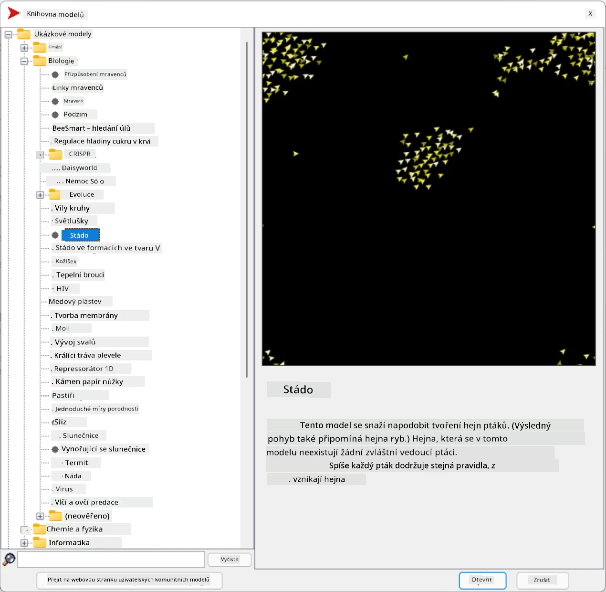
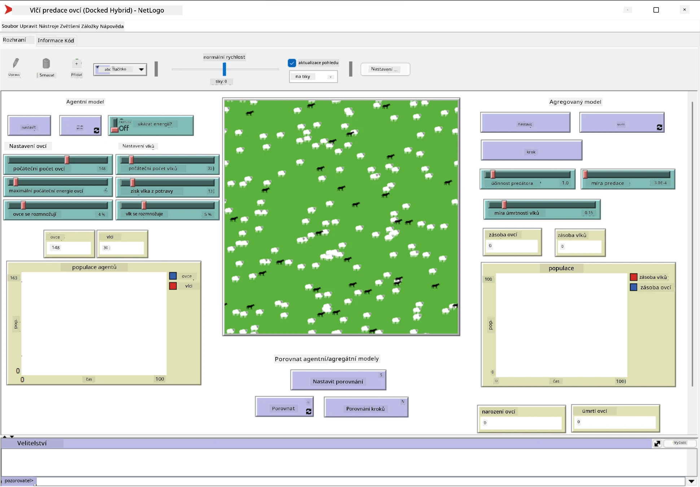

# Multi-Agentní systémy

Jedním z možných způsobů dosažení inteligence je tzv. **emergentní** (nebo **synergický**) přístup, který vychází z faktu, že kombinované chování mnoha relativně jednoduchých agentů může vést k celkově složitějšímu (nebo inteligentnějšímu) chování systému jako celku. Teoreticky je tento přístup založen na principech [kolektivní inteligence](https://en.wikipedia.org/wiki/Collective_intelligence), [emergentismu](https://en.wikipedia.org/wiki/Global_brain) a [evoluční kybernetiky](https://en.wikipedia.org/wiki/Global_brain), které tvrdí, že systémy na vyšší úrovni získávají určitou přidanou hodnotu, pokud jsou správně kombinovány ze systémů na nižší úrovni (tzv. *princip přechodu metasystému*).

## [Kvíz před přednáškou](https://ff-quizzes.netlify.app/en/ai/quiz/45)

Směr **Multi-Agentních systémů** se objevil v oblasti AI v 90. letech jako reakce na rozvoj internetu a distribuovaných systémů. Jedna z klasických učebnic AI, [Artificial Intelligence: A Modern Approach](https://en.wikipedia.org/wiki/Artificial_Intelligence:_A_Modern_Approach), se zaměřuje na pohled klasické AI z perspektivy multi-agentních systémů.

Ústředním pojmem multi-agentního přístupu je **agent** – entita, která žije v nějakém **prostředí**, které může vnímat a na které může působit. Toto je velmi široká definice a existuje mnoho různých typů a klasifikací agentů:

* Podle jejich schopnosti uvažovat:
   - **Reaktivní** agenti obvykle mají jednoduché chování typu požadavek-odpověď
   - **Deliberativní** agenti využívají nějakou formu logického uvažování a/nebo plánovacích schopností
* Podle místa, kde agent vykonává svůj kód:
   - **Statické** agenti pracují na vyhrazeném síťovém uzlu
   - **Mobilní** agenti mohou přesouvat svůj kód mezi síťovými uzly
* Podle jejich chování:
   - **Pasivní agenti** nemají specifické cíle. Takoví agenti mohou reagovat na vnější podněty, ale sami žádné akce nevyvolávají.
   - **Aktivní agenti** mají určité cíle, které sledují
   - **Kognitivní agenti** zahrnují složité plánování a uvažování

Multi-agentní systémy se dnes používají v řadě aplikací:

* Ve hrách mnoho postav ovládaných počítačem využívá nějakou formu AI a lze je považovat za inteligentní agenty
* Ve video produkci je vykreslování složitých 3D scén zahrnujících davy obvykle prováděno pomocí simulace multi-agentních systémů
* V modelování systémů se multi-agentní přístup používá k simulaci chování složitého modelu. Například multi-agentní přístup byl úspěšně použit k předpovědi šíření nemoci COVID-19 po celém světě. Podobný přístup lze použít k modelování dopravy ve městě a sledování, jak reaguje na změny dopravních pravidel.
* V komplexních automatizačních systémech může každé zařízení fungovat jako nezávislý agent, což činí celý systém méně monolitickým a odolnějším.

Nebudeme se podrobně zabývat multi-agentními systémy, ale podíváme se na jeden příklad **modelování multi-agentních systémů**.

## NetLogo

[NetLogo](https://ccl.northwestern.edu/netlogo/) je prostředí pro modelování multi-agentních systémů založené na upravené verzi programovacího jazyka [Logo](https://en.wikipedia.org/wiki/Logo_(programming_language)). Tento jazyk byl vyvinut pro výuku programovacích konceptů dětem a umožňuje ovládat agenta nazývaného **želva**, který se může pohybovat a zanechávat za sebou stopu. To umožňuje vytvářet složité geometrické tvary, což je velmi vizuální způsob, jak pochopit chování agenta.

V NetLogo můžeme vytvořit mnoho želv pomocí příkazu `create-turtles`. Poté můžeme všem želvám přikázat, aby provedly nějaké akce (v níže uvedeném příkladu - posun o 10 bodů vpřed):

```
create-turtles 10
ask turtles [
  forward 10
]
```

Samozřejmě není zajímavé, když všechny želvy dělají totéž, takže můžeme `ask` skupiny želv, například ty, které se nacházejí v blízkosti určitého bodu. Můžeme také vytvořit želvy různých *druhů* pomocí příkazu `breed [cats cat]`. Zde `cat` je název druhu a je třeba specifikovat jak jednotné, tak množné číslo, protože různé příkazy používají různé formy pro přehlednost.

> ✅ Nebudeme se učit samotný jazyk NetLogo - pokud vás zajímá více, můžete navštívit skvělý [Interaktivní slovník pro začátečníky NetLogo](https://ccl.northwestern.edu/netlogo/bind/).

NetLogo si můžete [stáhnout](https://ccl.northwestern.edu/netlogo/download.shtml) a nainstalovat, abyste si ho vyzkoušeli.

### Knihovna modelů

Skvělou věcí na NetLogo je, že obsahuje knihovnu funkčních modelů, které si můžete vyzkoušet. Přejděte na **File &rightarrow; Models Library**, kde máte na výběr mnoho kategorií modelů.



> Screenshot knihovny modelů od Dmitry Soshnikov

Můžete otevřít jeden z modelů, například **Biology &rightarrow; Flocking**.

### Hlavní principy

Po otevření modelu se dostanete na hlavní obrazovku NetLogo. Zde je ukázkový model, který popisuje populaci vlků a ovcí, vzhledem k omezeným zdrojům (tráva).



> Screenshot od Dmitry Soshnikov

Na této obrazovce můžete vidět:

* Sekci **Interface**, která obsahuje:
  - Hlavní pole, kde všichni agenti žijí
  - Různé ovládací prvky: tlačítka, posuvníky atd.
  - Grafy, které můžete použít k zobrazení parametrů simulace
* Záložku **Code**, která obsahuje editor, kde můžete psát program NetLogo

Ve většině případů bude rozhraní obsahovat tlačítko **Setup**, které inicializuje stav simulace, a tlačítko **Go**, které spustí provádění. Tyto akce jsou zpracovány odpovídajícími obslužnými funkcemi v kódu, které vypadají takto:

```
to go [
...
]
```

Svět NetLogo se skládá z následujících objektů:

* **Agenti** (želvy), kteří se mohou pohybovat po poli a něco dělat. Agenty ovládáte pomocí syntaxe `ask turtles [...]`, přičemž kód v závorkách je prováděn všemi agenty v *želvím režimu*.
* **Patches** jsou čtvercové oblasti pole, na kterých agenti žijí. Můžete se odkazovat na všechny agenty na stejném patchi, nebo můžete měnit barvy patchů a některé další vlastnosti. Můžete také `ask patches`, aby něco udělaly.
* **Observer** je unikátní agent, který ovládá svět. Všechny obslužné funkce tlačítek jsou prováděny v *režimu pozorovatele*.

> ✅ Krása multi-agentního prostředí spočívá v tom, že kód, který běží v želvím režimu nebo v režimu patchů, je prováděn současně všemi agenty paralelně. Tím, že napíšete trochu kódu a naprogramujete chování jednotlivého agenta, můžete vytvořit složité chování simulačního systému jako celku.

### Flocking

Jako příklad multi-agentního chování si představme **[Flocking](https://en.wikipedia.org/wiki/Flocking_(behavior))**. Flocking je složitý vzor, který je velmi podobný tomu, jak létají hejna ptáků. Když je pozorujete, můžete si myslet, že následují nějaký kolektivní algoritmus nebo že mají nějakou formu *kolektivní inteligence*. Toto složité chování však vzniká, když každý jednotlivý agent (v tomto případě *pták*) pouze pozoruje některé jiné agenty v krátké vzdálenosti od sebe a řídí se třemi jednoduchými pravidly:

* **Zarovnání** - směřuje k průměrnému směru sousedních agentů
* **Soudržnost** - snaží se směřovat k průměrné pozici sousedů (*dlouhodobá přitažlivost*)
* **Oddělení** - když se dostane příliš blízko k jiným ptákům, snaží se od nich vzdálit (*krátkodobé odpuzování*)

Můžete spustit příklad flockingu a pozorovat chování. Můžete také upravit parametry, jako je *stupeň oddělení* nebo *rozsah vidění*, který určuje, jak daleko každý pták vidí. Všimněte si, že pokud snížíte rozsah vidění na 0, všichni ptáci oslepnou a flocking se zastaví. Pokud snížíte oddělení na 0, všichni ptáci se shromáždí do přímky.

> ✅ Přepněte na záložku **Code** a podívejte se, kde jsou tři pravidla flockingu (zarovnání, soudržnost a oddělení) implementována v kódu. Všimněte si, jak se odkazujeme pouze na ty agenty, kteří jsou v dohledu.

### Další modely k prozkoumání

Existuje několik dalších zajímavých modelů, se kterými můžete experimentovat:

* **Art &rightarrow; Fireworks** ukazuje, jak lze ohňostroj považovat za kolektivní chování jednotlivých proudů ohně
* **Social Science &rightarrow; Traffic Basic** a **Social Science &rightarrow; Traffic Grid** ukazují model městské dopravy v 1D a 2D mřížce s nebo bez semaforů. Každé auto v simulaci následuje tato pravidla:
   - Pokud je prostor před ním prázdný - zrychluje (až na určitou maximální rychlost)
   - Pokud vidí překážku před sebou - brzdí (a můžete upravit, jak daleko řidič vidí)
* **Social Science &rightarrow; Party** ukazuje, jak se lidé shlukují během koktejlové párty. Můžete najít kombinaci parametrů, která vede k nejrychlejšímu zvýšení štěstí skupiny.

Jak je vidět z těchto příkladů, simulace multi-agentních systémů mohou být velmi užitečným způsobem, jak pochopit chování složitého systému skládajícího se z jednotlivců, kteří následují stejnou nebo podobnou logiku. Mohou být také použity k ovládání virtuálních agentů, jako jsou [NPCs](https://en.wikipedia.org/wiki/NPC) v počítačových hrách nebo agenti v 3D animovaných světech.

## Deliberativní agenti

Výše popsaní agenti jsou velmi jednoduchí, reagují na změny v prostředí pomocí nějakého algoritmu. Jako takoví jsou **reaktivní agenti**. Někdy však agenti mohou uvažovat a plánovat své akce, v takovém případě se nazývají **deliberativní**.

Typickým příkladem by byl osobní agent, který obdrží pokyn od člověka, aby rezervoval dovolenou. Předpokládejme, že na internetu žije mnoho agentů, kteří mu mohou pomoci. Měl by kontaktovat jiné agenty, aby zjistil, které lety jsou dostupné, jaké jsou ceny hotelů pro různé termíny, a pokusit se vyjednat nejlepší cenu. Když je plán dovolené dokončen a potvrzen majitelem, může pokračovat v rezervaci.

Aby to bylo možné, agenti musí **komunikovat**. Pro úspěšnou komunikaci potřebují:

* Nějaké **standardní jazyky pro výměnu znalostí**, jako [Knowledge Interchange Format](https://en.wikipedia.org/wiki/Knowledge_Interchange_Format) (KIF) a [Knowledge Query and Manipulation Language](https://en.wikipedia.org/wiki/Knowledge_Query_and_Manipulation_Language) (KQML). Tyto jazyky jsou navrženy na základě [teorie řečových aktů](https://en.wikipedia.org/wiki/Speech_act).
* Tyto jazyky by měly také zahrnovat **protokoly pro vyjednávání**, založené na různých **typech aukcí**.
* **Společnou ontologii**, kterou používají, aby se odkazovali na stejné koncepty a znali jejich význam
* Způsob, jak **zjistit**, co různí agenti dokážou, také na základě nějaké ontologie

Deliberativní agenti jsou mnohem složitější než reaktivní, protože nejen reagují na změny v prostředí, ale také by měli být schopni *iniciovat* akce. Jednou z navrhovaných architektur pro deliberativní agenty je tzv. agent Belief-Desire-Intention (BDI):

* **Beliefs** tvoří soubor znalostí o prostředí agenta. Může být strukturován jako znalostní báze nebo soubor pravidel, které agent může aplikovat na konkrétní situaci v prostředí.
* **Desires** definují, co agent chce dělat, tj. jeho cíle. Například cílem osobního asistenta výše je rezervovat zájezd a cílem hotelového agenta je maximalizovat zisk.
* **Intentions** jsou konkrétní akce, které agent plánuje k dosažení svých cílů. Akce obvykle mění prostředí a způsobují komunikaci s jinými agenty.

Existují některé platformy dostupné pro budování multi-agentních systémů, jako [JADE](https://jade.tilab.com/). [Tento článek](https://arxiv.org/ftp/arxiv/papers/2007/2007.08961.pdf) obsahuje přehled multi-agentních platforem spolu s krátkou historií multi-agentních systémů a jejich různými scénáři použití.

## Závěr

Multi-agentní systémy mohou mít velmi různorodé podoby a být použity v mnoha různých aplikacích. 
Všechny se zaměřují na jednodušší chování jednotlivého agenta a dosahují složitějšího chování celého systému díky **synergickému efektu**.

## 🚀 Výzva

Přeneste tuto lekci do reálného světa a zkuste konceptualizovat multi-agentní systém, který dokáže vyřešit problém. Co by například musel multi-agentní systém udělat, aby optimalizoval trasu školního autobusu? Jak by mohl fungovat v pekárně?

## [Kvíz po přednášce](https://ff-quizzes.netlify.app/en/ai/quiz/46)

## Přehled a samostudium

Prozkoumejte použití tohoto typu systému v průmyslu. Vyberte si oblast, jako je výroba nebo herní průmysl, a zjistěte, jak mohou multi-agentní systémy řešit jedinečné problémy.

## [Úkol NetLogo](assignment.md)

---

