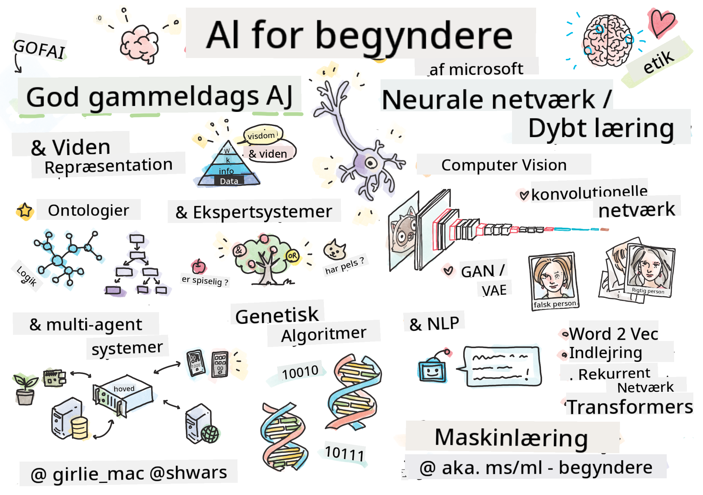

<!--
CO_OP_TRANSLATOR_METADATA:
{
  "original_hash": "c8f6fd940f684ae35bdb7646af1e9aa7",
  "translation_date": "2025-11-18T17:35:34+00:00",
  "source_file": "README.md",
  "language_code": "da"
}
-->
  
  
  
  
  

  
  
  
  
  

  

# Kunstig Intelligens for Begyndere - Et Curriculum  

||  
|:---:|  
| AI For Beginners - _Sketchnote af [@girlie_mac](https://twitter.com/girlie_mac)_ |  

Udforsk verden af **Kunstig Intelligens** (AI) med vores 12-ugers, 24-lektioners curriculum! Det inkluderer praktiske lektioner, quizzer og laboratorier. Curriculumet er begyndervenligt og dækker værktøjer som TensorFlow og PyTorch samt etik i AI.  

### 🌐 Flersproget Support  

#### Understøttet via GitHub Action (Automatiseret & Altid Opdateret)  

<!-- CO-OP TRANSLATOR LANGUAGES TABLE START -->  
[Arabisk](../ar/README.md) | [Bengalsk](../bn/README.md) | [Bulgarsk](../bg/README.md) | [Burmesisk (Myanmar)](../my/README.md) | [Kinesisk (Forenklet)](../zh/README.md) | [Kinesisk (Traditionelt, Hong Kong)](../hk/README.md) | [Kinesisk (Traditionelt, Macau)](../mo/README.md) | [Kinesisk (Traditionelt, Taiwan)](../tw/README.md) | [Kroatisk](../hr/README.md) | [Tjekkisk](../cs/README.md) | [Dansk](./README.md) | [Hollandsk](../nl/README.md) | [Estisk](../et/README.md) | [Finsk](../fi/README.md) | [Fransk](../fr/README.md) | [Tysk](../de/README.md) | [Græsk](../el/README.md) | [Hebraisk](../he/README.md) | [Hindi](../hi/README.md) | [Ungarsk](../hu/README.md) | [Indonesisk](../id/README.md) | [Italiensk](../it/README.md) | [Japansk](../ja/README.md) | [Koreansk](../ko/README.md) | [Litauisk](../lt/README.md) | [Malay](../ms/README.md) | [Marathi](../mr/README.md) | [Nepalesisk](../ne/README.md) | [Nigeriansk Pidgin](../pcm/README.md) | [Norsk](../no/README.md) | [Persisk (Farsi)](../fa/README.md) | [Polsk](../pl/README.md) | [Portugisisk (Brasilien)](../br/README.md) | [Portugisisk (Portugal)](../pt/README.md) | [Punjabi (Gurmukhi)](../pa/README.md) | [Rumænsk](../ro/README.md) | [Russisk](../ru/README.md) | [Serbisk (Kyrillisk)](../sr/README.md) | [Slovakisk](../sk/README.md) | [Slovensk](../sl/README.md) | [Spansk](../es/README.md) | [Swahili](../sw/README.md) | [Svensk](../sv/README.md) | [Tagalog (Filipino)](../tl/README.md) | [Tamil](../ta/README.md) | [Thai](../th/README.md) | [Tyrkisk](../tr/README.md) | [Ukrainsk](../uk/README.md) | [Urdu](../ur/README.md) | [Vietnamesisk](../vi/README.md)  
<!-- CO-OP TRANSLATOR LANGUAGES TABLE END -->  

**Hvis du ønsker yderligere oversættelser, er understøttede sprog listet [her](https://github.com/Azure/co-op-translator/blob/main/getting_started/supported-languages.md)**  

## Deltag i Fællesskabet  
  

## Hvad du vil lære  

**[Mindmap over Kurset](http://soshnikov.com/courses/ai-for-beginners/mindmap.html)**  

I dette curriculum vil du lære:  

* Forskellige tilgange til Kunstig Intelligens, herunder den "gode gamle" symbolske tilgang med **Videnrepræsentation** og ræsonnement ([GOFAI](https://en.wikipedia.org/wiki/Symbolic_artificial_intelligence)).  
* **Neurale Netværk** og **Deep Learning**, som er kernen i moderne AI. Vi vil illustrere koncepterne bag disse vigtige emner ved hjælp af kode i to af de mest populære frameworks - [TensorFlow](http://Tensorflow.org) og [PyTorch](http://pytorch.org).  
* **Neurale Arkitekturer** til arbejde med billeder og tekst. Vi vil dække nyere modeller, men kan mangle lidt i forhold til det nyeste.  
* Mindre populære AI-tilgange, såsom **Genetiske Algoritmer** og **Multi-Agent Systemer**.  

Hvad vi ikke vil dække i dette curriculum:  

> [Find alle yderligere ressourcer til dette kursus i vores Microsoft Learn-samling](https://learn.microsoft.com/en-us/collections/7w28iy2xrqzdj0?WT.mc_id=academic-77998-bethanycheum)  

* Forretningscases for brug af **AI i Erhvervslivet**. Overvej at tage [Introduktion til AI for forretningsbrugere](https://docs.microsoft.com/learn/paths/introduction-ai-for-business-users/?WT.mc_id=academic-77998-bethanycheum) læringssti på Microsoft Learn, eller [AI Business School](https://www.microsoft.com/ai/ai-business-school/?WT.mc_id=academic-77998-bethanycheum), udviklet i samarbejde med [INSEAD](https://www.insead.edu/).  
* **Klassisk Maskinlæring**, som er godt beskrevet i vores [Maskinlæring for Begyndere Curriculum](http://github.com/Microsoft/ML-for-Beginners).  
* Praktiske AI-applikationer bygget ved hjælp af **[Cognitive Services](https://azure.microsoft.com/services/cognitive-services/?WT.mc_id=academic-77998-bethanycheum)**. Til dette anbefaler vi, at du starter med moduler på Microsoft Learn for [vision](https://docs.microsoft.com/learn/paths/create-computer-vision-solutions-azure-cognitive-services/?WT.mc_id=academic-77998-bethanycheum), [natural language processing](https://docs.microsoft.com/learn/paths/explore-natural-language-processing/?WT.mc_id=academic-77998-bethanycheum), **[Generativ AI med Azure OpenAI Service](https://learn.microsoft.com/en-us/training/paths/develop-ai-solutions-azure-openai/?WT.mc_id=academic-77998-bethanycheum)** og andre.  
* Specifikke ML **Cloud Frameworks**, såsom [Azure Machine Learning](https://azure.microsoft.com/services/machine-learning/?WT.mc_id=academic-77998-bethanycheum), [Microsoft Fabric](https://learn.microsoft.com/en-us/training/paths/get-started-fabric/?WT.mc_id=academic-77998-bethanycheum), eller [Azure Databricks](https://docs.microsoft.com/learn/paths/data-engineer-azure-databricks?WT.mc_id=academic-77998-bethanycheum). Overvej at bruge [Byg og drift maskinlæringsløsninger med Azure Machine Learning](https://docs.microsoft.com/learn/paths/build-ai-solutions-with-azure-ml-service/?WT.mc_id=academic-77998-bethanycheum) og [Byg og drift maskinlæringsløsninger med Azure Databricks](https://docs.microsoft.com/learn/paths/build-operate-machine-learning-solutions-azure-databricks/?WT.mc_id=academic-77998-bethanycheum) læringsstier.  
* **Samtale-AI** og **Chatbots**. Der er en separat [Opret samtale-AI-løsninger](https://docs.microsoft.com/learn/paths/create-conversational-ai-solutions/?WT.mc_id=academic-77998-bethanycheum) læringssti, og du kan også henvise til [dette blogindlæg](https://soshnikov.com/azure/hello-bot-conversational-ai-on-microsoft-platform/) for mere detaljer.  
* **Avanceret Matematik** bag deep learning. Til dette vil vi anbefale [Deep Learning](https://www.amazon.com/Deep-Learning-Adaptive-Computation-Machine/dp/0262035618) af Ian Goodfellow, Yoshua Bengio og Aaron Courville, som også er tilgængelig online på [https://www.deeplearningbook.org/](https://www.deeplearningbook.org/).  

For en blid introduktion til _AI i Skyen_ emner kan du overveje at tage [Kom i gang med kunstig intelligens på Azure](https://docs.microsoft.com/learn/paths/get-started-with-artificial-intelligence-on-azure/?WT.mc_id=academic-77998-bethanycheum) læringssti.  

# Indhold  

|     |                                                                 Lektion Link                                                                  |                                           PyTorch/Keras/TensorFlow                                          | Lab                                                            |  
| :-: | :------------------------------------------------------------------------------------------------------------------------------------------: | :---------------------------------------------------------------------------------------------: | ------------------------------------------------------------------------------ |  
| 0  |                                 [Kursusopsætning](./lessons/0-course-setup/setup.md)                                 |                      [Opsæt dit udviklingsmiljø](./lessons/0-course-setup/how-to-run.md)                       |   |  
| I  |               [**Introduktion til AI**](./lessons/1-Intro/README.md)      | | |  
| 01  |       [Introduktion og Historie om AI](./lessons/1-Intro/README.md)       |           -                            | -  |  
| II |              **Symbolsk AI**              |  
| 02  |       [Videnrepræsentation og Ekspertsystemer](./lessons/2-Symbolic/README.md)       |            [Ekspertsystemer](./lessons/2-Symbolic/Animals.ipynb) /  [Ontologi](./lessons/2-Symbolic/FamilyOntology.ipynb) /[Konceptgraf](./lessons/2-Symbolic/MSConceptGraph.ipynb)                             |  |  
| III |                        [**Introduktion til Neurale Netværk**](./lessons/3-NeuralNetworks/README.md) |||  
| 03  |                [Perceptron](./lessons/3-NeuralNetworks/03-Perceptron/README.md)                 |                       [Notebook](./lessons/3-NeuralNetworks/03-Perceptron/Perceptron.ipynb)                      | [Lab](./lessons/3-NeuralNetworks/03-Perceptron/lab/README.md) |  
| 04  |                   [Multi-Layered Perceptron og Oprettelse af vores eget Framework](./lessons/3-NeuralNetworks/04-OwnFramework/README.md)                   |        [Notebook](./lessons/3-NeuralNetworks/04-OwnFramework/OwnFramework.ipynb)        | [Lab](./lessons/3-NeuralNetworks/04-OwnFramework/lab/README.md) |
| 05  |            [Introduktion til Frameworks (PyTorch/TensorFlow) og Overfitting](./lessons/3-NeuralNetworks/05-Frameworks/README.md)             |           [PyTorch](./lessons/3-NeuralNetworks/05-Frameworks/IntroPyTorch.ipynb) / [Keras](./lessons/3-NeuralNetworks/05-Frameworks/IntroKeras.ipynb) / [TensorFlow](./lessons/3-NeuralNetworks/05-Frameworks/IntroKerasTF.ipynb)             | [Lab](./lessons/3-NeuralNetworks/05-Frameworks/lab/README.md) |
| IV  |            [**Computer Vision**](./lessons/4-ComputerVision/README.md)             | [PyTorch](https://docs.microsoft.com/learn/modules/intro-computer-vision-pytorch/?WT.mc_id=academic-77998-cacaste) / [TensorFlow](https://docs.microsoft.com/learn/modules/intro-computer-vision-TensorFlow/?WT.mc_id=academic-77998-cacaste)| [Udforsk Computer Vision på Microsoft Azure](https://learn.microsoft.com/en-us/collections/7w28iy2xrqzdj0?WT.mc_id=academic-77998-bethanycheum) |
| 06  |            [Introduktion til Computer Vision. OpenCV](./lessons/4-ComputerVision/06-IntroCV/README.md)             |           [Notebook](./lessons/4-ComputerVision/06-IntroCV/OpenCV.ipynb)         | [Lab](./lessons/4-ComputerVision/06-IntroCV/lab/README.md) |
| 07  |            [Convolutional Neural Networks](./lessons/4-ComputerVision/07-ConvNets/README.md) &  [CNN Arkitekturer](./lessons/4-ComputerVision/07-ConvNets/CNN_Architectures.md)             |           [PyTorch](./lessons/4-ComputerVision/07-ConvNets/ConvNetsPyTorch.ipynb) /[TensorFlow](./lessons/4-ComputerVision/07-ConvNets/ConvNetsTF.ipynb)             | [Lab](./lessons/4-ComputerVision/07-ConvNets/lab/README.md) |
| 08  |            [Forudtrænede Netværk og Transfer Learning](./lessons/4-ComputerVision/08-TransferLearning/README.md) og [Træningstips](./lessons/4-ComputerVision/08-TransferLearning/TrainingTricks.md)             |           [PyTorch](./lessons/4-ComputerVision/08-TransferLearning/TransferLearningPyTorch.ipynb) / [TensorFlow](./lessons/3-NeuralNetworks/05-Frameworks/IntroKerasTF.ipynb)             | [Lab](./lessons/4-ComputerVision/08-TransferLearning/lab/README.md) |
| 09  |            [Autoencoders og VAEs](./lessons/4-ComputerVision/09-Autoencoders/README.md)             |           [PyTorch](./lessons/4-ComputerVision/09-Autoencoders/AutoEncodersPyTorch.ipynb) / [TensorFlow](./lessons/4-ComputerVision/09-Autoencoders/AutoencodersTF.ipynb)             |  |
| 10  |            [Generative Adversarial Networks & Kunstnerisk Stiloverførsel](./lessons/4-ComputerVision/10-GANs/README.md)             |           [PyTorch](./lessons/4-ComputerVision/10-GANs/GANPyTorch.ipynb) / [TensorFlow](./lessons/4-ComputerVision/10-GANs/GANTF.ipynb)             |  |
| 11  |            [Objektdetektion](./lessons/4-ComputerVision/11-ObjectDetection/README.md)             |         [TensorFlow](./lessons/4-ComputerVision/11-ObjectDetection/ObjectDetection.ipynb)             | [Lab](./lessons/4-ComputerVision/11-ObjectDetection/lab/README.md) |
| 12  |            [Semantisk Segmentering. U-Net](./lessons/4-ComputerVision/12-Segmentation/README.md)             |           [PyTorch](./lessons/4-ComputerVision/12-Segmentation/SemanticSegmentationPytorch.ipynb) / [TensorFlow](./lessons/4-ComputerVision/12-Segmentation/SemanticSegmentationTF.ipynb)             |  |
| V  |            [**Natural Language Processing**](./lessons/5-NLP/README.md)             | [PyTorch](https://docs.microsoft.com/learn/modules/intro-natural-language-processing-pytorch/?WT.mc_id=academic-77998-cacaste) /[TensorFlow](https://docs.microsoft.com/learn/modules/intro-natural-language-processing-TensorFlow/?WT.mc_id=academic-77998-cacaste) | [Udforsk Natural Language Processing på Microsoft Azure](https://learn.microsoft.com/en-us/collections/7w28iy2xrqzdj0?WT.mc_id=academic-77998-bethanycheum)|
| 13  |            [Tekstrepræsentation. Bow/TF-IDF](./lessons/5-NLP/13-TextRep/README.md)             |           [PyTorch](https://github.com/microsoft/AI-For-Beginners/blob/main/lessons/5-NLP/13-TextRep/TextRepresentationPyTorch.ipynb) / [TensorFlow](https://github.com/microsoft/AI-For-Beginners/blob/main/lessons/5-NLP/13-TextRep/TextRepresentationTF.ipynb)             | |
| 14  |            [Semantiske ordindlejringer. Word2Vec og GloVe](./lessons/5-NLP/14-Embeddings/README.md)             |           [PyTorch](https://github.com/microsoft/AI-For-Beginners/blob/main/lessons/5-NLP/14-Embeddings/EmbeddingsPyTorch.ipynb) / [TensorFlow](https://github.com/microsoft/AI-For-Beginners/blob/main/lessons/5-NLP/14-Embeddings/EmbeddingsTF.ipynb)             |  |
| 15  |            [Sprogmodellering. Træn dine egne indlejringer](./lessons/5-NLP/15-LanguageModeling/README.md)             |           [PyTorch](https://github.com/microsoft/AI-For-Beginners/blob/main/lessons/5-NLP/15-LanguageModeling/CBoW-PyTorch.ipynb) / [TensorFlow](https://github.com/microsoft/AI-For-Beginners/blob/main/lessons/5-NLP/15-LanguageModeling/CBoW-TF.ipynb)             | [Lab](./lessons/5-NLP/15-LanguageModeling/lab/README.md) |
| 16  |            [Recurrent Neural Networks](./lessons/5-NLP/16-RNN/README.md)             |           [PyTorch](https://github.com/microsoft/AI-For-Beginners/blob/main/lessons/5-NLP/16-RNN/RNNPyTorch.ipynb) / [TensorFlow](https://github.com/microsoft/AI-For-Beginners/blob/main/lessons/5-NLP/16-RNN/RNNTF.ipynb)             |  |
| 17  |            [Generative Recurrent Networks](./lessons/5-NLP/17-GenerativeNetworks/README.md)             |           [PyTorch](https://github.com/microsoft/AI-For-Beginners/blob/main/lessons/5-NLP/17-GenerativeNetworks/GenerativePyTorch.ipynb) / [TensorFlow](https://github.com/microsoft/AI-For-Beginners/blob/main/lessons/5-NLP/17-GenerativeNetworks/GenerativeTF.ipynb)             | [Lab](./lessons/5-NLP/17-GenerativeNetworks/lab/README.md) |
| 18  |            [Transformers. BERT.](./lessons/5-NLP/18-Transformers/README.md)             |           [PyTorch](https://github.com/microsoft/AI-For-Beginners/blob/main/lessons/5-NLP/18-Transformers/TransformersPyTorch.ipynb) /[TensorFlow](https://github.com/microsoft/AI-For-Beginners/blob/main/lessons/5-NLP/18-Transformers/TransformersTF.ipynb)             |  |
| 19  |            [Named Entity Recognition](./lessons/5-NLP/19-NER/README.md)             |           [TensorFlow](https://microsoft.github.io/AI-For-Beginners/lessons/5-NLP/19-NER/NER-TF.ipynb)             | [Lab](./lessons/5-NLP/19-NER/lab/README.md) |
| 20  |            [Store Sproglige Modeller, Prompt Programmering og Few-Shot Opgaver](./lessons/5-NLP/20-LangModels/README.md)             |           [PyTorch](https://microsoft.github.io/AI-For-Beginners/lessons/5-NLP/20-LangModels/GPT-PyTorch.ipynb) | |
| VI |            **Andre AI-teknikker** || |
| 21  |            [Genetiske Algoritmer](./lessons/6-Other/21-GeneticAlgorithms/README.md)             |           [Notebook](./lessons/6-Other/21-GeneticAlgorithms/Genetic.ipynb) | |
| 22  |            [Deep Reinforcement Learning](./lessons/6-Other/22-DeepRL/README.md)             |           [PyTorch](./lessons/6-Other/22-DeepRL/CartPole-RL-PyTorch.ipynb) /[TensorFlow](./lessons/6-Other/22-DeepRL/CartPole-RL-TF.ipynb)             | [Lab](./lessons/6-Other/22-DeepRL/lab/README.md) |
| 23  |            [Multi-Agent Systemer](./lessons/6-Other/23-MultiagentSystems/README.md)             |  | |
| VII |            **AI Etik** | | |
| 24  |            [AI Etik og Ansvarlig AI](./lessons/7-Ethics/README.md)             |           [Microsoft Learn: Principper for Ansvarlig AI](https://docs.microsoft.com/learn/paths/responsible-ai-business-principles/?WT.mc_id=academic-77998-cacaste) | |
| IX  |            **Ekstra** | | |
| 25  |            [Multi-Modal Netværk, CLIP og VQGAN](./lessons/X-Extras/X1-MultiModal/README.md)             |           [Notebook](./lessons/X-Extras/X1-MultiModal/Clip.ipynb)    | |

## Hver lektion indeholder

* Forberedende læsemateriale
* Eksekverbare Jupyter Notebooks, som ofte er specifikke for frameworket (**PyTorch** eller **TensorFlow**). Den eksekverbare notebook indeholder også en masse teoretisk materiale, så for at forstå emnet skal du gennemgå mindst én version af notebooken (enten PyTorch eller TensorFlow).
* **Labs** tilgængelige for nogle emner, som giver dig mulighed for at prøve at anvende det materiale, du har lært, på et specifikt problem.
* Nogle sektioner indeholder links til [**MS Learn**](https://learn.microsoft.com/en-us/collections/7w28iy2xrqzdj0?WT.mc_id=academic-77998-bethanycheum) moduler, der dækker relaterede emner.

## Kom godt i gang

### 🎯 Ny til AI? Start her!

Hvis du er helt ny til AI og ønsker hurtige, praktiske eksempler, så tjek vores [**Begynder-Venlige Eksempler**](./examples/README.md)! Disse inkluderer:

- 🌟 **Hello AI World** - Dit første AI-program (mønstergenkendelse)
- 🧠 **Simple Neural Network** - Byg et neuralt netværk fra bunden  
- 🖼️ **Image Classifier** - Klassificer billeder med detaljerede kommentarer
- 💬 **Text Sentiment** - Analyser positiv/negativ tekst

Disse eksempler er designet til at hjælpe dig med at forstå AI-konceptet, før du dykker ned i det fulde pensum.

### 📚 Opsætning af fuldt pensum
- Vi har oprettet en [opsætningslektion](./lessons/0-course-setup/setup.md) for at hjælpe dig med at sætte dit udviklingsmiljø op. - For undervisere har vi også oprettet en [curricula opsætningslektion](./lessons/0-course-setup/for-teachers.md)!
- Hvordan man [kører koden i VSCode eller en Codepace](./lessons/0-course-setup/how-to-run.md)

Følg disse trin:

Fork repositoryet: Klik på "Fork"-knappen øverst til højre på denne side.

Clone repositoryet: `git clone https://github.com/microsoft/AI-For-Beginners.git`

Glem ikke at give stjerne (🌟) til dette repo, så du nemmere kan finde det senere.

## Mød andre lærende

Deltag i vores [officielle AI Discord-server](https://aka.ms/genai-discord?WT.mc_id=academic-105485-bethanycheum) for at møde og netværke med andre lærende, der tager dette kursus, og få support.

Hvis du har produktfeedback eller spørgsmål under udviklingen, besøg vores [Azure AI Foundry Developer Forum](https://aka.ms/foundry/forum)

## Quizzer 

> **En note om quizzer**: Alle quizzer findes i Quiz-app-mappen i etc\quiz-app, eller [Online Her](https://ff-quizzes.netlify.app/) De er linket fra lektionerne, og quiz-appen kan køres lokalt eller implementeres på Azure; følg instruktionerne i `quiz-app`-mappen. De bliver gradvist lokaliseret.

## Hjælp ønskes

Har du forslag eller fundet stave- eller kodefejl? Opret en issue eller lav en pull request.

## Speciel tak

* **✍️ Primær forfatter:** [Dmitry Soshnikov](http://soshnikov.com), PhD
* **🔥 Redaktør:** [Jen Looper](https://twitter.com/jenlooper), PhD
* **🎨 Sketchnote illustrator:** [Tomomi Imura](https://twitter.com/girlie_mac)
* **✅ Quiz-skaber:** [Lateefah Bello](https://github.com/CinnamonXI), [MLSA](https://studentambassadors.microsoft.com/)
* **🙏 Kernebidragydere:** [Evgenii Pishchik](https://github.com/Pe4enIks)

## Andre læseplaner

Vores team producerer andre læseplaner! Tjek:

### Azure / Edge / MCP / Agents

---

### Generativ AI-serie

[-9333EA?style=for-the-badge&labelColor=E5E7EB&color=9333EA)](https://github.com/microsoft/Generative-AI-for-beginners-dotnet?WT.mc_id=academic-105485-koreyst)
[-C084FC?style=for-the-badge&labelColor=E5E7EB&color=C084FC)](https://github.com/microsoft/generative-ai-for-beginners-java?WT.mc_id=academic-105485-koreyst)
[-E879F9?style=for-the-badge&labelColor=E5E7EB&color=E879F9)](https://github.com/microsoft/generative-ai-with-javascript?WT.mc_id=academic-105485-koreyst)

---

### Kerneundervisning

---

### Copilot-serie

## Få hjælp

Hvis du sidder fast eller har spørgsmål om at bygge AI-apps. Deltag i diskussioner med andre lærende og erfarne udviklere om MCP. Det er et støttende fællesskab, hvor spørgsmål er velkomne, og viden deles frit.

Hvis du har produktfeedback eller fejl under udviklingen, besøg:

---

<!-- CO-OP TRANSLATOR DISCLAIMER START -->
**Ansvarsfraskrivelse**:  
Dette dokument er blevet oversat ved hjælp af AI-oversættelsestjenesten [Co-op Translator](https://github.com/Azure/co-op-translator). Selvom vi bestræber os på nøjagtighed, skal det bemærkes, at automatiserede oversættelser kan indeholde fejl eller unøjagtigheder. Det originale dokument på dets oprindelige sprog bør betragtes som den autoritative kilde. For kritisk information anbefales professionel menneskelig oversættelse. Vi er ikke ansvarlige for eventuelle misforståelser eller fejltolkninger, der opstår som følge af brugen af denne oversættelse.
<!-- CO-OP TRANSLATOR DISCLAIMER END -->