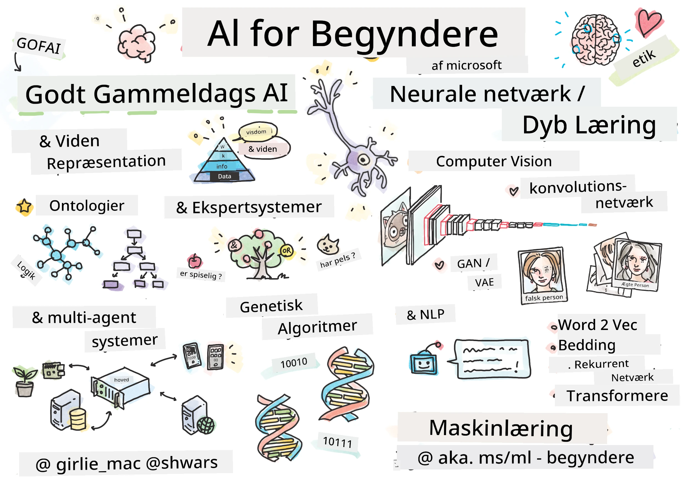

[](https://github.com/microsoft/AI-For-Beginners/blob/main/LICENSE)
[](https://GitHub.com/microsoft/AI-For-Beginners/graphs/contributors/)
[](https://GitHub.com/microsoft/AI-For-Beginners/issues/)
[](https://GitHub.com/microsoft/AI-For-Beginners/pulls/)
[](http://makeapullrequest.com)

[](https://GitHub.com/microsoft/AI-For-Beginners/watchers/)
[](https://GitHub.com/microsoft/AI-For-Beginners/network/)
[](https://GitHub.com/microsoft/AI-For-Beginners/stargazers/)
[](https://mybinder.org/v2/gh/microsoft/ai-for-beginners/HEAD)
[](https://gitter.im/Microsoft/ai-for-beginners?utm_source=badge&utm_medium=badge&utm_campaign=pr-badge)

[](https://discord.gg/nTYy5BXMWG)

# Kunstig intelligens for begyndere - Et pensum

||
|:---:|
| AI For Beginners - _Sketchnote af [@girlie_mac](https://twitter.com/girlie_mac)_ |

Udforsk verden af **kunstig intelligens** (AI) med vores 12-ugers, 24-lektioners pensum! Det inkluderer praktiske lektioner, quizzer og laboratorieøvelser. Pensum er begynder-venligt og dækker værktøjer som TensorFlow og PyTorch samt etik i AI.


### 🌐 Multisprogunderstøttelse

#### Understøttet via GitHub Action (Automatiseret & Altid Opdateret)

<!-- CO-OP TRANSLATOR LANGUAGES TABLE START -->
[Arabic](../ar/README.md) | [Bengali](../bn/README.md) | [Bulgarian](../bg/README.md) | [Burmese (Myanmar)](../my/README.md) | [Chinese (Simplified)](../zh-CN/README.md) | [Chinese (Traditional, Hong Kong)](../zh-HK/README.md) | [Chinese (Traditional, Macau)](../zh-MO/README.md) | [Chinese (Traditional, Taiwan)](../zh-TW/README.md) | [Croatian](../hr/README.md) | [Czech](../cs/README.md) | [Danish](./README.md) | [Dutch](../nl/README.md) | [Estonian](../et/README.md) | [Finnish](../fi/README.md) | [French](../fr/README.md) | [German](../de/README.md) | [Greek](../el/README.md) | [Hebrew](../he/README.md) | [Hindi](../hi/README.md) | [Hungarian](../hu/README.md) | [Indonesian](../id/README.md) | [Italian](../it/README.md) | [Japanese](../ja/README.md) | [Kannada](../kn/README.md) | [Korean](../ko/README.md) | [Lithuanian](../lt/README.md) | [Malay](../ms/README.md) | [Malayalam](../ml/README.md) | [Marathi](../mr/README.md) | [Nepali](../ne/README.md) | [Nigerian Pidgin](../pcm/README.md) | [Norwegian](../no/README.md) | [Persian (Farsi)](../fa/README.md) | [Polish](../pl/README.md) | [Portuguese (Brazil)](../pt-BR/README.md) | [Portuguese (Portugal)](../pt-PT/README.md) | [Punjabi (Gurmukhi)](../pa/README.md) | [Romanian](../ro/README.md) | [Russian](../ru/README.md) | [Serbian (Cyrillic)](../sr/README.md) | [Slovak](../sk/README.md) | [Slovenian](../sl/README.md) | [Spanish](../es/README.md) | [Swahili](../sw/README.md) | [Swedish](../sv/README.md) | [Tagalog (Filipino)](../tl/README.md) | [Tamil](../ta/README.md) | [Telugu](../te/README.md) | [Thai](../th/README.md) | [Turkish](../tr/README.md) | [Ukrainian](../uk/README.md) | [Urdu](../ur/README.md) | [Vietnamese](../vi/README.md)

> **Foretrækker du at klone lokalt?**

> Dette repository inkluderer over 50 sprogoversættelser, hvilket væsentligt øger downloadstørrelsen. For at klone uden oversættelser, brug sparse checkout:
> ```bash
> git clone --filter=blob:none --sparse https://github.com/microsoft/AI-For-Beginners.git
> cd AI-For-Beginners
> git sparse-checkout set --no-cone '/*' '!translations' '!translated_images'
> ```
> Dette giver dig alt, hvad du behøver for at gennemføre kurset med en meget hurtigere download.
<!-- CO-OP TRANSLATOR LANGUAGES TABLE END -->

**Hvis du ønsker yderligere oversættelser, findes understøttede sprog [her](https://github.com/Azure/co-op-translator/blob/main/getting_started/supported-languages.md)**

## Deltag i fællesskabet
[](https://discord.gg/nTYy5BXMWG)

## Hvad du vil lære

**[Kursusets tankekort](http://soshnikov.com/courses/ai-for-beginners/mindmap.html)**

I dette pensum vil du lære:

* Forskellige tilgange til kunstig intelligens, herunder den "gode gamle" symbolske tilgang med **vidensrepræsentation** og ræsonnering ([GOFAI](https://en.wikipedia.org/wiki/Symbolic_artificial_intelligence)).
* **Neurale netværk** og **dyb læring**, som er kernen i moderne AI. Vi vil illustrere koncepterne bag disse vigtige emner med kode i to af de mest populære frameworks - [TensorFlow](http://Tensorflow.org) og [PyTorch](http://pytorch.org).
* **Neurale arkitekturer** til arbejde med billeder og tekst. Vi vil dække nyere modeller, men det kan være lidt mangelfuldt ift. state-of-the-art.
* Mindre populære AI-tilgange, såsom **genetiske algoritmer** og **multi-agent systemer**.

Hvad vi ikke vil dække i dette pensum:

> [Find alle yderligere ressourcer til dette kursus i vores Microsoft Learn-samling](https://learn.microsoft.com/en-us/collections/7w28iy2xrqzdj0?WT.mc_id=academic-77998-bethanycheum)

* Forretningssager for brug af **AI i erhvervslivet**. Overvej at tage [Introduktion til AI for erhvervsbrugere](https://docs.microsoft.com/learn/paths/introduction-ai-for-business-users/?WT.mc_id=academic-77998-bethanycheum) læringssti på Microsoft Learn eller [AI Business School](https://www.microsoft.com/ai/ai-business-school/?WT.mc_id=academic-77998-bethanycheum), udviklet i samarbejde med [INSEAD](https://www.insead.edu/).
* **Klassisk maskinlæring**, som er godt beskrevet i vores [Machine Learning for Beginners Curriculum](http://github.com/Microsoft/ML-for-Beginners).
* Praktiske AI-applikationer bygget ved hjælp af **[Cognitive Services](https://azure.microsoft.com/services/cognitive-services/?WT.mc_id=academic-77998-bethanycheum)**. Til dette anbefaler vi at starte med Microsoft Learn moduler for [vision](https://docs.microsoft.com/learn/paths/create-computer-vision-solutions-azure-cognitive-services/?WT.mc_id=academic-77998-bethanycheum), [naturlig sprogbehandling](https://docs.microsoft.com/learn/paths/explore-natural-language-processing/?WT.mc_id=academic-77998-bethanycheum), **[Generativ AI med Azure OpenAI Service](https://learn.microsoft.com/en-us/training/paths/develop-ai-solutions-azure-openai/?WT.mc_id=academic-77998-bethanycheum)** og andre.
* Specifikke ML **Cloud Frameworks**, såsom [Azure Machine Learning](https://azure.microsoft.com/services/machine-learning/?WT.mc_id=academic-77998-bethanycheum), [Microsoft Fabric](https://learn.microsoft.com/en-us/training/paths/get-started-fabric/?WT.mc_id=academic-77998-bethanycheum), eller [Azure Databricks](https://docs.microsoft.com/learn/paths/data-engineer-azure-databricks?WT.mc_id=academic-77998-bethanycheum). Overvej at bruge [Build and operate machine learning solutions with Azure Machine Learning](https://docs.microsoft.com/learn/paths/build-ai-solutions-with-azure-ml-service/?WT.mc_id=academic-77998-bethanycheum) og [Build and Operate Machine Learning Solutions with Azure Databricks](https://docs.microsoft.com/learn/paths/build-operate-machine-learning-solutions-azure-databricks/?WT.mc_id=academic-77998-bethanycheum) læringsstier.
* **Konversationel AI** og **chatbots**. Der findes en separat [Create conversational AI solutions](https://docs.microsoft.com/learn/paths/create-conversational-ai-solutions/?WT.mc_id=academic-77998-bethanycheum) læringssti, og du kan også henvise til [dette blogindlæg](https://soshnikov.com/azure/hello-bot-conversational-ai-on-microsoft-platform/) for mere detaljeret information.
* **Dyb matematik** bag dyb læring. Til dette anbefaler vi [Deep Learning](https://www.amazon.com/Deep-Learning-Adaptive-Computation-Machine/dp/0262035618) af Ian Goodfellow, Yoshua Bengio og Aaron Courville, som også er tilgængelig online på [https://www.deeplearningbook.org/](https://www.deeplearningbook.org/).

For en blid introduktion til _AI i skyen_-emner kan du overveje at tage [Get started with artificial intelligence on Azure](https://docs.microsoft.com/learn/paths/get-started-with-artificial-intelligence-on-azure/?WT.mc_id=academic-77998-bethanycheum) læringssti.

# Indhold

|     |                                                                 Lektion Link                                                                  |                                           PyTorch/Keras/TensorFlow                                          | Laboratorium                                                            |
| :-: | :------------------------------------------------------------------------------------------------------------------------------------------: | :---------------------------------------------------------------------------------------------: | ------------------------------------------------------------------------------ |
| 0  |                                 [Kursusopsætning](./lessons/0-course-setup/setup.md)                                 |                      [Opsæt dit udviklingsmiljø](./lessons/0-course-setup/how-to-run.md)                       |   |
| I  |               [**Introduktion til AI**](./lessons/1-Intro/README.md)      | | |
| 01  |       [Introduktion og AI's historie](./lessons/1-Intro/README.md)       |           -                            | -  |
| II |              **Symbolsk AI**              |
| 02  |       [Vidensrepræsentation og ekspert-systemer](./lessons/2-Symbolic/README.md)       |            [Ekspertsystemer](./lessons/2-Symbolic/Animals.ipynb) /  [Ontologi](./lessons/2-Symbolic/FamilyOntology.ipynb) /[Konceptgraf](./lessons/2-Symbolic/MSConceptGraph.ipynb)                             |  |
| III |                        [**Introduktion til Neurale Netværk**](./lessons/3-NeuralNetworks/README.md) |||
| 03  |                [Perceptron](./lessons/3-NeuralNetworks/03-Perceptron/README.md)                 |                       [Notebook](./lessons/3-NeuralNetworks/03-Perceptron/Perceptron.ipynb)                      | [Lab](./lessons/3-NeuralNetworks/03-Perceptron/lab/README.md) |
| 04  |                   [Multi-Laget Perceptron og Oprettelse af vores eget Framework](./lessons/3-NeuralNetworks/04-OwnFramework/README.md)                   |        [Notebook](./lessons/3-NeuralNetworks/04-OwnFramework/OwnFramework.ipynb)        | [Lab](./lessons/3-NeuralNetworks/04-OwnFramework/lab/README.md) |
| 05  |            [Introduktion til Frameworks (PyTorch/TensorFlow) og Overfitting](./lessons/3-NeuralNetworks/05-Frameworks/README.md)             |           [PyTorch](./lessons/3-NeuralNetworks/05-Frameworks/IntroPyTorch.ipynb) / [Keras](./lessons/3-NeuralNetworks/05-Frameworks/IntroKeras.ipynb) / [TensorFlow](./lessons/3-NeuralNetworks/05-Frameworks/IntroKerasTF.ipynb)             | [Lab](./lessons/3-NeuralNetworks/05-Frameworks/lab/README.md) |
| IV  |            [**Computersyn**](./lessons/4-ComputerVision/README.md)             | [PyTorch](https://docs.microsoft.com/learn/modules/intro-computer-vision-pytorch/?WT.mc_id=academic-77998-cacaste) / [TensorFlow](https://docs.microsoft.com/learn/modules/intro-computer-vision-TensorFlow/?WT.mc_id=academic-77998-cacaste)| [Udforsk Computersyn på Microsoft Azure](https://learn.microsoft.com/en-us/collections/7w28iy2xrqzdj0?WT.mc_id=academic-77998-bethanycheum) |
| 06  |            [Introduktion til Computersyn. OpenCV](./lessons/4-ComputerVision/06-IntroCV/README.md)             |           [Notebook](./lessons/4-ComputerVision/06-IntroCV/OpenCV.ipynb)         | [Lab](./lessons/4-ComputerVision/06-IntroCV/lab/README.md) |
| 07  |            [Konvolutionelle Neurale Netværk](./lessons/4-ComputerVision/07-ConvNets/README.md) &  [CNN Arkitekturer](./lessons/4-ComputerVision/07-ConvNets/CNN_Architectures.md)             |           [PyTorch](./lessons/4-ComputerVision/07-ConvNets/ConvNetsPyTorch.ipynb) /[TensorFlow](./lessons/4-ComputerVision/07-ConvNets/ConvNetsTF.ipynb)             | [Lab](./lessons/4-ComputerVision/07-ConvNets/lab/README.md) |
| 08  |            [Fortrænede Netværk og Transfer Learning](./lessons/4-ComputerVision/08-TransferLearning/README.md) og [Træningstricks](./lessons/4-ComputerVision/08-TransferLearning/TrainingTricks.md)             |           [PyTorch](./lessons/4-ComputerVision/08-TransferLearning/TransferLearningPyTorch.ipynb) / [TensorFlow](./lessons/3-NeuralNetworks/05-Frameworks/IntroKerasTF.ipynb)             | [Lab](./lessons/4-ComputerVision/08-TransferLearning/lab/README.md) |
| 09  |            [Autoenkodere og VAEs](./lessons/4-ComputerVision/09-Autoencoders/README.md)             |           [PyTorch](./lessons/4-ComputerVision/09-Autoencoders/AutoEncodersPyTorch.ipynb) / [TensorFlow](./lessons/4-ComputerVision/09-Autoencoders/AutoencodersTF.ipynb)             |  |
| 10  |            [Generative Adversarielle Netværk & Kunstnerisk Stil Transfer](./lessons/4-ComputerVision/10-GANs/README.md)             |           [PyTorch](./lessons/4-ComputerVision/10-GANs/GANPyTorch.ipynb) / [TensorFlow](./lessons/4-ComputerVision/10-GANs/GANTF.ipynb)             |  |
| 11  |            [Objektdetektion](./lessons/4-ComputerVision/11-ObjectDetection/README.md)             |         [TensorFlow](./lessons/4-ComputerVision/11-ObjectDetection/ObjectDetection.ipynb)             | [Lab](./lessons/4-ComputerVision/11-ObjectDetection/lab/README.md) |
| 12  |            [Semantisk Segmentering. U-Net](./lessons/4-ComputerVision/12-Segmentation/README.md)             |           [PyTorch](./lessons/4-ComputerVision/12-Segmentation/SemanticSegmentationPytorch.ipynb) / [TensorFlow](./lessons/4-ComputerVision/12-Segmentation/SemanticSegmentationTF.ipynb)             |  |
| V  |            [**Naturlig Sprogbearbejdning**](./lessons/5-NLP/README.md)             | [PyTorch](https://docs.microsoft.com/learn/modules/intro-natural-language-processing-pytorch/?WT.mc_id=academic-77998-cacaste) /[TensorFlow](https://docs.microsoft.com/learn/modules/intro-natural-language-processing-TensorFlow/?WT.mc_id=academic-77998-cacaste) | [Udforsk Naturlig Sprogbearbejdning på Microsoft Azure](https://learn.microsoft.com/en-us/collections/7w28iy2xrqzdj0?WT.mc_id=academic-77998-bethanycheum)|
| 13  |            [Tekstrepræsentation. Bow/TF-IDF](./lessons/5-NLP/13-TextRep/README.md)             |           [PyTorch](https://github.com/microsoft/AI-For-Beginners/blob/main/lessons/5-NLP/13-TextRep/TextRepresentationPyTorch.ipynb) / [TensorFlow](https://github.com/microsoft/AI-For-Beginners/blob/main/lessons/5-NLP/13-TextRep/TextRepresentationTF.ipynb)             | |
| 14  |            [Semantiske ordindlejringer. Word2Vec og GloVe](./lessons/5-NLP/14-Embeddings/README.md)             |           [PyTorch](https://github.com/microsoft/AI-For-Beginners/blob/main/lessons/5-NLP/14-Embeddings/EmbeddingsPyTorch.ipynb) / [TensorFlow](https://github.com/microsoft/AI-For-Beginners/blob/main/lessons/5-NLP/14-Embeddings/EmbeddingsTF.ipynb)             |  |
| 15  |            [Sprogmodellering. Træn dine egne indlejringer](./lessons/5-NLP/15-LanguageModeling/README.md)             |           [PyTorch](https://github.com/microsoft/AI-For-Beginners/blob/main/lessons/5-NLP/15-LanguageModeling/CBoW-PyTorch.ipynb) / [TensorFlow](https://github.com/microsoft/AI-For-Beginners/blob/main/lessons/5-NLP/15-LanguageModeling/CBoW-TF.ipynb)             | [Lab](./lessons/5-NLP/15-LanguageModeling/lab/README.md) |
| 16  |            [Rekurrente Neurale Netværk](./lessons/5-NLP/16-RNN/README.md)             |           [PyTorch](https://github.com/microsoft/AI-For-Beginners/blob/main/lessons/5-NLP/16-RNN/RNNPyTorch.ipynb) / [TensorFlow](https://github.com/microsoft/AI-For-Beginners/blob/main/lessons/5-NLP/16-RNN/RNNTF.ipynb)             |  |
| 17  |            [Generative Rekurrente Netværk](./lessons/5-NLP/17-GenerativeNetworks/README.md)             |           [PyTorch](https://github.com/microsoft/AI-For-Beginners/blob/main/lessons/5-NLP/17-GenerativeNetworks/GenerativePyTorch.ipynb) / [TensorFlow](https://github.com/microsoft/AI-For-Beginners/blob/main/lessons/5-NLP/17-GenerativeNetworks/GenerativeTF.ipynb)             | [Lab](./lessons/5-NLP/17-GenerativeNetworks/lab/README.md) |
| 18  |            [Transformers. BERT.](./lessons/5-NLP/18-Transformers/README.md)             |           [PyTorch](https://github.com/microsoft/AI-For-Beginners/blob/main/lessons/5-NLP/18-Transformers/TransformersPyTorch.ipynb) /[TensorFlow](https://github.com/microsoft/AI-For-Beginners/blob/main/lessons/5-NLP/18-Transformers/TransformersTF.ipynb)             |  |
| 19  |            [Navngiven Entitetsgenkendelse](./lessons/5-NLP/19-NER/README.md)             |           [TensorFlow](https://microsoft.github.io/AI-For-Beginners/lessons/5-NLP/19-NER/NER-TF.ipynb)             | [Lab](./lessons/5-NLP/19-NER/lab/README.md) |
| 20  |            [Store Sprogmodeller, Prompt-programmering og Få-skuds-opgaver](./lessons/5-NLP/20-LangModels/README.md)             |           [PyTorch](https://microsoft.github.io/AI-For-Beginners/lessons/5-NLP/20-LangModels/GPT-PyTorch.ipynb) | |
| VI |            **Andre AI-teknikker** || |
| 21  |            [Genetiske Algoritmer](./lessons/6-Other/21-GeneticAlgorithms/README.md)             |           [Notebook](./lessons/6-Other/21-GeneticAlgorithms/Genetic.ipynb) | |
| 22  |            [Dyb Forstærkningslæring](./lessons/6-Other/22-DeepRL/README.md)             |           [PyTorch](./lessons/6-Other/22-DeepRL/CartPole-RL-PyTorch.ipynb) /[TensorFlow](./lessons/6-Other/22-DeepRL/CartPole-RL-TF.ipynb)             | [Lab](./lessons/6-Other/22-DeepRL/lab/README.md) |
| 23  |            [Multi-Agent Systemer](./lessons/6-Other/23-MultiagentSystems/README.md)             |  | |
| VII |            **AI-etik** | | |
| 24  |            [AI-etik og Ansvarlig AI](./lessons/7-Ethics/README.md)             |           [Microsoft Learn: Ansvarlige AI-principper](https://docs.microsoft.com/learn/paths/responsible-ai-business-principles/?WT.mc_id=academic-77998-cacaste) | |
| IX  |            **Ekstra** | | |
| 25  |            [Multi-modale Netværk, CLIP og VQGAN](./lessons/X-Extras/X1-MultiModal/README.md)             |           [Notebook](./lessons/X-Extras/X1-MultiModal/Clip.ipynb)    | |

## Hver lektion indeholder

* Forudlæsningsmateriale
* Eksekverbare Jupyter Notebooks, som ofte er specifikke for frameworket (**PyTorch** eller **TensorFlow**). Den eksekverbare notebook indeholder også meget teoretisk materiale, så for at forstå emnet skal du gennemgå mindst en version af notebook’en (enten PyTorch eller TensorFlow).
* **Labs** tilgængelige for nogle emner, som giver dig mulighed for at prøve at anvende det lærte materiale på et specifikt problem.
* Nogle sektioner indeholder links til [**MS Learn**](https://learn.microsoft.com/en-us/collections/7w28iy2xrqzdj0?WT.mc_id=academic-77998-bethanycheum) moduler, der dækker relaterede emner.

## Kom i gang

### 🎯 Ny til AI? Start her!

Hvis du er helt ny til AI og vil have hurtige, praktiske eksempler, så tjek vores [**Begyndervenlige Eksempler**](./examples/README.md) ud! De inkluderer:

- 🌟 **Hej AI-verden** - Dit første AI-program (mønster-genkendelse)
- 🧠 **Simpelt Neuralt Netværk** - Byg et neuralt netværk fra bunden  
- 🖼️ **Billedklassificerer** - Klassificer billeder med detaljerede kommentarer  
- 💬 **Tekstfølelse** - Analyser positiv/negativ tekst  

Disse eksempler er designet til at hjælpe dig med at forstå AI-koncepter, inden du dykker ned i det fulde pensum.  

### 📚 Opsætning af fuldt pensum  

- Vi har lavet en [opsætningslektion](./lessons/0-course-setup/setup.md) til at hjælpe dig med at sætte dit udviklingsmiljø op. - For undervisere har vi også lavet en [pensumopsætningslektion](./lessons/0-course-setup/for-teachers.md)!  
- Hvordan man [kører koden i VSCode eller en Codespace](./lessons/0-course-setup/how-to-run.md)  

Følg disse trin:  

Fork Repository: Klik på "Fork" knappen øverst til højre på denne side.  

Klon Repository: `git clone https://github.com/microsoft/AI-For-Beginners.git`  

Glem ikke at give en stjerne (🌟) til dette repo, så du nemmere kan finde det senere.  

## Mød andre lærende  

Deltag i vores [officielle AI Discord-server](https://aka.ms/genai-discord?WT.mc_id=academic-105485-bethanycheum) for at møde og netværke med andre lærende, der tager dette kursus, og få support.  

Hvis du har produktfeedback eller spørgsmål under opbygningen, besøg vores [Azure AI Foundry Developer Forum](https://aka.ms/foundry/forum)  

## Quizzer  

> **En note om quizzer**: Alle quizzer findes i Quiz-app mappen i etc\quiz-app, eller [Online her](https://ff-quizzes.netlify.app/) De er linket inde fra lektionerne, quiz appen kan køres lokalt eller deployeres til Azure; følg instruktionen i `quiz-app` mappen. De bliver gradvist lokaliseret.  

## Hjælp ønskes  

Har du forslag eller fundet stave- eller kodefejl? Opret en issue eller send en pull request.  

## Særlige tak  

* **✍️ Hovedforfatter:** [Dmitry Soshnikov](http://soshnikov.com), PhD  
* **🔥 Redaktør:** [Jen Looper](https://twitter.com/jenlooper), PhD  
* **🎨 Sketchnote-illustrator:** [Tomomi Imura](https://twitter.com/girlie_mac)  
* **✅ Quizskaber:** [Lateefah Bello](https://github.com/CinnamonXI), [MLSA](https://studentambassadors.microsoft.com/)  
* **🙏 Kernemedarbejdere:** [Evgenii Pishchik](https://github.com/Pe4enIks)  

## Andre pensum  

Vores team producerer andre pensum! Tjek disse ud:  

<!-- CO-OP TRANSLATOR OTHER COURSES START -->  
### LangChain  
[](https://aka.ms/langchain4j-for-beginners)  
[](https://aka.ms/langchainjs-for-beginners?WT.mc_id=m365-94501-dwahlin)  
[](https://github.com/microsoft/langchain-for-beginners?WT.mc_id=m365-94501-dwahlin)  
---  

### Azure / Edge / MCP / Agenter  
[](https://github.com/microsoft/AZD-for-beginners?WT.mc_id=academic-105485-koreyst)  
[](https://github.com/microsoft/edgeai-for-beginners?WT.mc_id=academic-105485-koreyst)  
[](https://github.com/microsoft/mcp-for-beginners?WT.mc_id=academic-105485-koreyst)  
[](https://github.com/microsoft/ai-agents-for-beginners?WT.mc_id=academic-105485-koreyst)  

---  
   
### Generativ AI Serie  
[](https://github.com/microsoft/generative-ai-for-beginners?WT.mc_id=academic-105485-koreyst)  
[-9333EA?style=for-the-badge&labelColor=E5E7EB&color=9333EA)](https://github.com/microsoft/Generative-AI-for-beginners-dotnet?WT.mc_id=academic-105485-koreyst)  
[-C084FC?style=for-the-badge&labelColor=E5E7EB&color=C084FC)](https://github.com/microsoft/generative-ai-for-beginners-java?WT.mc_id=academic-105485-koreyst)  
[-E879F9?style=for-the-badge&labelColor=E5E7EB&color=E879F9)](https://github.com/microsoft/generative-ai-with-javascript?WT.mc_id=academic-105485-koreyst)  

---  
   
### Kerne Læring  
[](https://aka.ms/ml-beginners?WT.mc_id=academic-105485-koreyst)  
[](https://aka.ms/datascience-beginners?WT.mc_id=academic-105485-koreyst)  
[](https://aka.ms/ai-beginners?WT.mc_id=academic-105485-koreyst)  
[](https://github.com/microsoft/Security-101?WT.mc_id=academic-96948-sayoung)  
[](https://aka.ms/webdev-beginners?WT.mc_id=academic-105485-koreyst)  
[](https://aka.ms/iot-beginners?WT.mc_id=academic-105485-koreyst)  
[](https://github.com/microsoft/xr-development-for-beginners?WT.mc_id=academic-105485-koreyst)  

---  
   
### Copilot Serie  
[](https://aka.ms/GitHubCopilotAI?WT.mc_id=academic-105485-koreyst)  
[](https://github.com/microsoft/mastering-github-copilot-for-dotnet-csharp-developers?WT.mc_id=academic-105485-koreyst)  
[](https://github.com/microsoft/CopilotAdventures?WT.mc_id=academic-105485-koreyst)  
<!-- CO-OP TRANSLATOR OTHER COURSES END -->  

## Få hjælp  

Hvis du sidder fast eller har spørgsmål om at bygge AI-apps, så deltag med andre lærende og erfarne udviklere i diskussioner om MCP. Det er et støttende fællesskab, hvor spørgsmål er velkomne, og viden deles frit.  

[](https://discord.gg/nTYy5BXMWG)  

Hvis du har produktfeedback eller oplever fejl under opbygningen, besøg:  

[](https://aka.ms/foundry/forum)

---

<!-- CO-OP TRANSLATOR DISCLAIMER START -->
**Ansvarsfraskrivelse**:  
Dette dokument er blevet oversat ved hjælp af AI-oversættelsestjenesten [Co-op Translator](https://github.com/Azure/co-op-translator). Selvom vi bestræber os på nøjagtighed, bedes du være opmærksom på, at automatiserede oversættelser kan indeholde fejl eller unøjagtigheder. Det oprindelige dokument på dets modersmål bør betragtes som den autoritative kilde. For vigtig information anbefales professionel menneskelig oversættelse. Vi påtager os intet ansvar for misforståelser eller fejltolkninger, der måtte opstå som følge af brugen af denne oversættelse.
<!-- CO-OP TRANSLATOR DISCLAIMER END -->