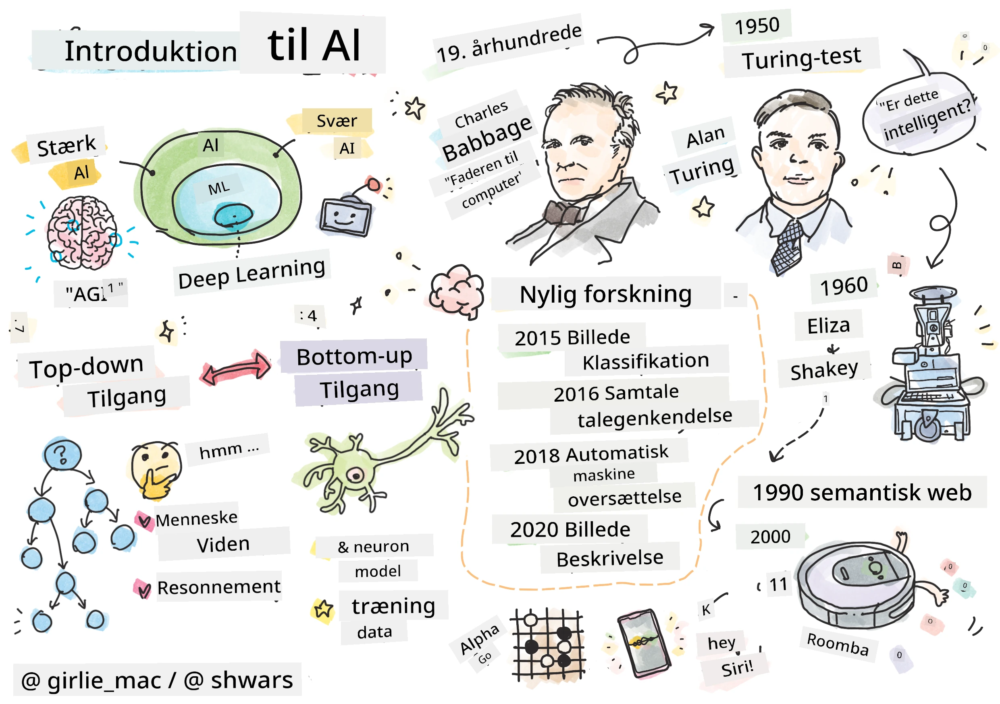
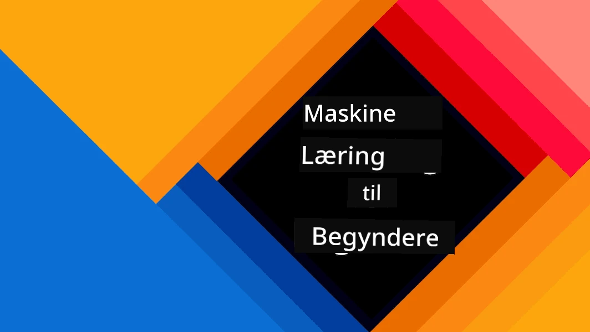
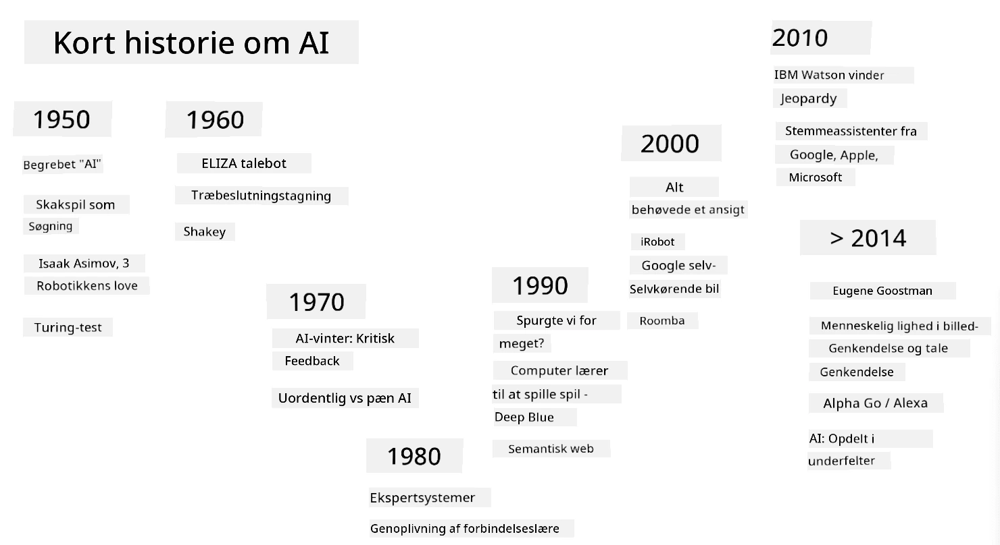
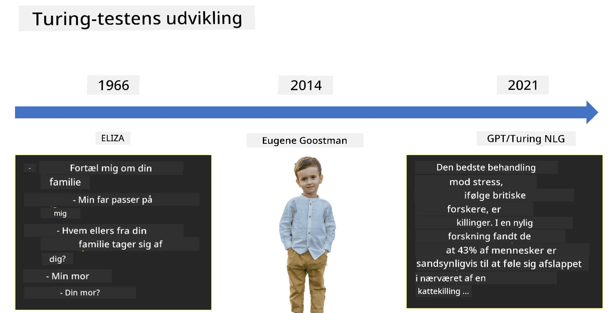

# Introduktion til AI

> Sketchnote af [Tomomi Imura](https://twitter.com/girlie_mac)

## [Quiz før forelæsning](https://ff-quizzes.netlify.app/en/ai/quiz/1)

**Kunstig intelligens** er en spændende videnskabelig disciplin, der undersøger, hvordan vi kan få computere til at udvise intelligent adfærd, f.eks. udføre de ting, som mennesker er gode til.

Oprindeligt blev computere opfundet af [Charles Babbage](https://en.wikipedia.org/wiki/Charles_Babbage) til at arbejde med tal ved at følge en veldefineret procedure - en algoritme. Moderne computere, selvom de er betydeligt mere avancerede end den oprindelige model foreslået i det 19. århundrede, følger stadig den samme idé om kontrollerede beregninger. Derfor er det muligt at programmere en computer til at udføre noget, hvis vi kender den præcise rækkefølge af trin, der skal til for at nå målet.

> Foto af [Vickie Soshnikova](http://twitter.com/vickievalerie)

> ✅ At definere en persons alder ud fra et fotografi er en opgave, der ikke kan programmeres eksplicit, fordi vi ikke ved, hvordan vi kommer frem til et tal i vores hoved, når vi gør det.

---

Der er dog nogle opgaver, som vi ikke eksplicit ved, hvordan vi skal løse. Overvej at bestemme en persons alder ud fra et fotografi. Vi lærer det på en eller anden måde, fordi vi har set mange eksempler på mennesker i forskellige aldre, men vi kan ikke forklare præcist, hvordan vi gør det, og vi kan heller ikke programmere computeren til at gøre det. Det er netop denne type opgaver, der er interessante for **Kunstig Intelligens** (forkortet AI).

✅ Tænk på nogle opgaver, som du kunne overlade til en computer, der ville drage fordel af AI. Overvej områder som finans, medicin og kunst - hvordan drager disse områder fordel af AI i dag?

## Svag AI vs. Stærk AI

Svag AI | Stærk AI
---------------------------------------|-------------------------------------
Svag AI refererer til AI-systemer, der er designet og trænet til en specifik opgave eller et snævert sæt af opgaver.|Stærk AI, eller Artificial General Intelligence (AGI), refererer til AI-systemer med menneskelignende intelligens og forståelse.
Disse AI-systemer er ikke generelt intelligente; de er fremragende til at udføre en foruddefineret opgave, men mangler ægte forståelse eller bevidsthed.|Disse AI-systemer har evnen til at udføre enhver intellektuel opgave, som et menneske kan, tilpasse sig forskellige domæner og besidder en form for bevidsthed eller selvforståelse.
Eksempler på svag AI inkluderer virtuelle assistenter som Siri eller Alexa, anbefalingsalgoritmer brugt af streamingtjenester og chatbots designet til specifikke kundeserviceopgaver.|At opnå stærk AI er et langsigtet mål for AI-forskning og vil kræve udvikling af AI-systemer, der kan ræsonnere, lære, forstå og tilpasse sig på tværs af en bred vifte af opgaver og kontekster.
Svag AI er højt specialiseret og besidder ikke menneskelignende kognitive evner eller generelle problemløsningsevner uden for sit snævre domæne.|Stærk AI er i øjeblikket et teoretisk koncept, og intet AI-system har nået dette niveau af generel intelligens.

For mere information henvises til **[Artificial General Intelligence](https://en.wikipedia.org/wiki/Artificial_general_intelligence)** (AGI).

## Definitionen af intelligens og Turing-testen

Et af problemerne ved at arbejde med begrebet **[Intelligens](https://en.wikipedia.org/wiki/Intelligence)** er, at der ikke findes en klar definition af dette begreb. Man kan argumentere for, at intelligens er forbundet med **abstrakt tænkning** eller **selvbevidsthed**, men vi kan ikke definere det præcist.

> [Foto](https://unsplash.com/photos/75715CVEJhI) af [Amber Kipp](https://unsplash.com/@sadmax) fra Unsplash

For at se, hvor tvetydigt begrebet *intelligens* er, kan du prøve at besvare spørgsmålet: "Er en kat intelligent?". Forskellige mennesker har en tendens til at give forskellige svar på dette spørgsmål, da der ikke findes en universelt accepteret test til at bevise, om påstanden er sand eller ej. Og hvis du tror, der gør - så prøv at lade din kat tage en IQ-test...

✅ Tænk et øjeblik over, hvordan du definerer intelligens. Er en krage, der kan løse en labyrint for at få fat i mad, intelligent? Er et barn intelligent?

---

Når vi taler om AGI, har vi brug for en måde at afgøre, om vi har skabt et virkelig intelligent system. [Alan Turing](https://en.wikipedia.org/wiki/Alan_Turing) foreslog en metode kaldet en **[Turing-test](https://en.wikipedia.org/wiki/Turing_test)**, som også fungerer som en definition af intelligens. Testen sammenligner et givet system med noget, der er iboende intelligent - et rigtigt menneske, og fordi enhver automatisk sammenligning kan omgås af et computerprogram, bruger vi en menneskelig forhører. Så hvis et menneske ikke er i stand til at skelne mellem en rigtig person og et computersystem i en tekstbaseret dialog, betragtes systemet som intelligent.

> En chatbot kaldet [Eugene Goostman](https://en.wikipedia.org/wiki/Eugene_Goostman), udviklet i Skt. Petersborg, kom tæt på at bestå Turing-testen i 2014 ved at bruge et smart personlighedstrick. Den annoncerede på forhånd, at den var en 13-årig ukrainsk dreng, hvilket kunne forklare manglen på viden og nogle uoverensstemmelser i teksten. Botten overbeviste 30% af dommerne om, at den var menneskelig efter en 5-minutters dialog, en måling som Turing mente, en maskine ville kunne opnå inden år 2000. Men man skal forstå, at dette ikke indikerer, at vi har skabt et intelligent system, eller at et computersystem har narret den menneskelige forhører - systemet narrede ikke menneskene, men snarere bot-skaberne gjorde!

✅ Er du nogensinde blevet narret af en chatbot til at tro, at du talte med et menneske? Hvordan overbeviste den dig?

## Forskellige tilgange til AI

Hvis vi vil have en computer til at opføre sig som et menneske, skal vi på en eller anden måde modellere vores måde at tænke på inde i computeren. Derfor skal vi forsøge at forstå, hvad der gør et menneske intelligent.

> For at kunne programmere intelligens ind i en maskine, skal vi forstå, hvordan vores egne beslutningsprocesser fungerer. Hvis du laver lidt selvransagelse, vil du indse, at der er nogle processer, der sker ubevidst – f.eks. kan vi skelne en kat fra en hund uden at tænke over det - mens andre involverer ræsonnement.

Der er to mulige tilgange til dette problem:

Top-down tilgang (Symbolsk ræsonnement) | Bottom-up tilgang (Neurale netværk)
---------------------------------------|-------------------------------------
En top-down tilgang modellerer den måde, en person ræsonnerer for at løse et problem. Det indebærer at udtrække **viden** fra et menneske og repræsentere det i en computerlæsbar form. Vi skal også udvikle en måde at modellere **ræsonnement** inde i en computer.|En bottom-up tilgang modellerer strukturen af en menneskelig hjerne, der består af et stort antal simple enheder kaldet **neuroner**. Hver neuron fungerer som et vægtet gennemsnit af sine input, og vi kan træne et netværk af neuroner til at løse nyttige problemer ved at give **træningsdata**.

Der er også nogle andre mulige tilgange til intelligens:

* En **Emergent**, **Synergetisk** eller **multi-agent tilgang** er baseret på det faktum, at kompleks intelligent adfærd kan opnås ved interaktion mellem et stort antal simple agenter. Ifølge [evolutionær kybernetik](https://en.wikipedia.org/wiki/Global_brain#Evolutionary_cybernetics) kan intelligens *opstå* fra mere simpel, reaktiv adfærd i processen med *metasystem transition*.

* En **Evolutionær tilgang**, eller **genetisk algoritme**, er en optimeringsproces baseret på evolutionens principper.

Vi vil overveje disse tilgange senere i kurset, men lige nu vil vi fokusere på to hovedretninger: top-down og bottom-up.

### Top-Down Tilgang

I en **top-down tilgang** forsøger vi at modellere vores ræsonnement. Fordi vi kan følge vores tanker, når vi ræsonnerer, kan vi forsøge at formalisere denne proces og programmere den ind i computeren. Dette kaldes **symbolsk ræsonnement**.

Folk har en tendens til at have nogle regler i deres hoved, der guider deres beslutningsprocesser. For eksempel, når en læge diagnosticerer en patient, kan han eller hun indse, at en person har feber, og derfor kan der være en betændelse i kroppen. Ved at anvende et stort sæt regler på et specifikt problem kan en læge muligvis komme frem til den endelige diagnose.

Denne tilgang er stærkt afhængig af **vidensrepræsentation** og **ræsonnement**. At udtrække viden fra en menneskelig ekspert kan være den sværeste del, fordi en læge i mange tilfælde ikke præcist ved, hvorfor han eller hun kommer frem til en bestemt diagnose. Nogle gange dukker løsningen bare op i hovedet uden eksplicit tænkning. Nogle opgaver, såsom at bestemme en persons alder ud fra et fotografi, kan slet ikke reduceres til at manipulere viden.

### Bottom-Up Tilgang

Alternativt kan vi forsøge at modellere de simpleste elementer i vores hjerne – en neuron. Vi kan konstruere et såkaldt **kunstig neuralt netværk** inde i en computer og derefter forsøge at lære det at løse problemer ved at give det eksempler. Denne proces ligner, hvordan et nyfødt barn lærer om sine omgivelser ved at lave observationer.

✅ Lav lidt research om, hvordan babyer lærer. Hvad er de grundlæggende elementer i en babys hjerne?

> | Hvad med ML?         |      |
> |--------------|-----------|
> | En del af Kunstig Intelligens, der er baseret på, at computeren lærer at løse et problem baseret på nogle data, kaldes **Machine Learning**. Vi vil ikke overveje klassisk machine learning i dette kursus - vi henviser dig til en separat [Machine Learning for Beginners](http://aka.ms/ml-beginners) læseplan. |       |

## En Kort Historie om AI

Kunstig Intelligens blev startet som et felt i midten af det tyvende århundrede. Oprindeligt var symbolsk ræsonnement en fremherskende tilgang, og det førte til en række vigtige succeser, såsom ekspertsystemer – computerprogrammer, der kunne fungere som en ekspert inden for nogle begrænsede problemområder. Det blev dog hurtigt klart, at en sådan tilgang ikke skalerer godt. At udtrække viden fra en ekspert, repræsentere det i en computer og holde denne vidensbase nøjagtig viser sig at være en meget kompleks opgave og for dyr til at være praktisk i mange tilfælde. Dette førte til den såkaldte [AI-vinter](https://en.wikipedia.org/wiki/AI_winter) i 1970'erne.

> Billede af [Dmitry Soshnikov](http://soshnikov.com)

Som tiden gik, blev computerressourcer billigere, og mere data blev tilgængeligt, så neurale netværksmetoder begyndte at demonstrere stor ydeevne i at konkurrere med mennesker på mange områder, såsom computer vision eller talegenkendelse. I det sidste årti er begrebet Kunstig Intelligens for det meste blevet brugt som et synonym for neurale netværk, fordi de fleste af de AI-succeser, vi hører om, er baseret på dem.

Vi kan observere, hvordan tilgange har ændret sig, for eksempel i skabelsen af et skakspillende computerprogram:

* Tidlige skakprogrammer var baseret på søgning – et program forsøgte eksplicit at estimere mulige træk fra en modstander for et givet antal næste træk og valgte et optimalt træk baseret på den optimale position, der kunne opnås i nogle få træk. Dette førte til udviklingen af den såkaldte [alpha-beta beskæring](https://en.wikipedia.org/wiki/Alpha%E2%80%93beta_pruning) søgealgoritme.
* Søgestrategier fungerer godt mod slutningen af spillet, hvor søgerummet er begrænset af et lille antal mulige træk. Men i begyndelsen af spillet er søgerummet enormt, og algoritmen kan forbedres ved at lære af eksisterende kampe mellem menneskelige spillere. Efterfølgende eksperimenter anvendte såkaldt [case-baseret ræsonnement](https://en.wikipedia.org/wiki/Case-based_reasoning), hvor programmet søgte efter tilfælde i vidensbasen, der ligner den aktuelle position i spillet.
* Moderne programmer, der vinder over menneskelige spillere, er baseret på neurale netværk og [forstærkningslæring](https://en.wikipedia.org/wiki/Reinforcement_learning), hvor programmerne lærer at spille udelukkende ved at spille længe mod sig selv og lære af deres egne fejl – meget ligesom mennesker gør, når de lærer at spille skak. Dog kan et computerprogram spille mange flere spil på meget kortere tid og dermed lære meget hurtigere.

✅ Lav lidt research om andre spil, der er blevet spillet af AI.

På samme måde kan vi se, hvordan tilgangen til at skabe "talende programmer" (der måske kan bestå Turing-testen) har ændret sig:

* Tidlige programmer af denne type, såsom [Eliza](https://en.wikipedia.org/wiki/ELIZA), var baseret på meget simple grammatiske regler og omformulering af input-sætningen til et spørgsmål.
* Moderne assistenter, såsom Cortana, Siri eller Google Assistant, er alle hybride systemer, der bruger neurale netværk til at konvertere tale til tekst og genkende vores intention, og derefter anvender noget ræsonnement eller eksplicitte algoritmer til at udføre de nødvendige handlinger.
* I fremtiden kan vi forvente en komplet neural-baseret model til at håndtere dialoger selvstændigt. De seneste GPT- og [Turing-NLG](https://www.microsoft.com/research/blog/turing-nlg-a-17-billion-parameter-language-model-by-microsoft) familier af neurale netværk viser stor succes i dette.

> Billede af Dmitry Soshnikov, [foto](https://unsplash.com/photos/r8LmVbUKgns) af [Marina Abrosimova](https://unsplash.com/@abrosimova_marina_foto), Unsplash

## Nyere AI-forskning

Den enorme vækst i forskning inden for neurale netværk begyndte omkring 2010, da store offentlige datasæt blev tilgængelige. En stor samling af billeder kaldet [ImageNet](https://en.wikipedia.org/wiki/ImageNet), som indeholder omkring 14 millioner annoterede billeder, gav anledning til [ImageNet Large Scale Visual Recognition Challenge](https://image-net.org/challenges/LSVRC/).

> Billede af [Dmitry Soshnikov](http://soshnikov.com)

I 2012 blev [Convolutional Neural Networks](../4-ComputerVision/07-ConvNets/README.md) først brugt til billedklassifikation, hvilket førte til et markant fald i klassifikationsfejl (fra næsten 30% til 16,4%). I 2015 opnåede ResNet-arkitekturen fra Microsoft Research [menneskelignende nøjagtighed](https://doi.org/10.1109/ICCV.2015.123).

Siden da har neurale netværk vist sig at være meget succesfulde i mange opgaver:

---

År | Menneskelig paritet opnået
-----|--------
2015 | [Billedklassifikation](https://doi.org/10.1109/ICCV.2015.123)
2016 | [Samtale-baseret talegenkendelse](https://arxiv.org/abs/1610.05256)
2018 | [Automatisk maskinoversættelse](https://arxiv.org/abs/1803.05567) (Kinesisk-til-Engelsk)
2020 | [Billedtekstning](https://arxiv.org/abs/2009.13682)

I løbet af de seneste år har vi været vidne til store succeser med store sprogmodeller som BERT og GPT-3. Dette skete primært på grund af, at der findes en stor mængde generel tekstdata, som gør det muligt at træne modeller til at fange strukturen og betydningen af tekster, fortræne dem på generelle tekstsamlinger og derefter specialisere disse modeller til mere specifikke opgaver. Vi vil lære mere om [Natural Language Processing](../5-NLP/README.md) senere i dette kursus.

## 🚀 Udfordring

Tag en tur på internettet for at finde ud af, hvor du mener, AI bliver mest effektivt brugt. Er det i en kortlægningsapp, en tale-til-tekst-tjeneste eller et videospil? Undersøg, hvordan systemet blev bygget.

## [Quiz efter forelæsning](https://ff-quizzes.netlify.app/en/ai/quiz/2)

## Gennemgang & Selvstudie

Gennemgå AI's og ML's historie ved at læse [denne lektion](https://github.com/microsoft/ML-For-Beginners/tree/main/1-Introduction/2-history-of-ML). Tag et element fra sketchnoten øverst i den lektion eller denne og undersøg det mere i dybden for at forstå den kulturelle kontekst, der har informeret dets udvikling.

**Opgave**: [Game Jam](assignment.md)

---

<!-- CO-OP TRANSLATOR DISCLAIMER START -->
**Ansvarsfraskrivelse**:  
Dette dokument er blevet oversat ved hjælp af AI-oversættelsestjenesten [Co-op Translator](https://github.com/Azure/co-op-translator). Selvom vi bestræber os på nøjagtighed, skal det bemærkes, at automatiserede oversættelser kan indeholde fejl eller unøjagtigheder. Det originale dokument på dets oprindelige sprog bør betragtes som den autoritative kilde. For kritisk information anbefales professionel menneskelig oversættelse. Vi er ikke ansvarlige for eventuelle misforståelser eller fejltolkninger, der opstår som følge af brugen af denne oversættelse.
<!-- CO-OP TRANSLATOR DISCLAIMER END -->