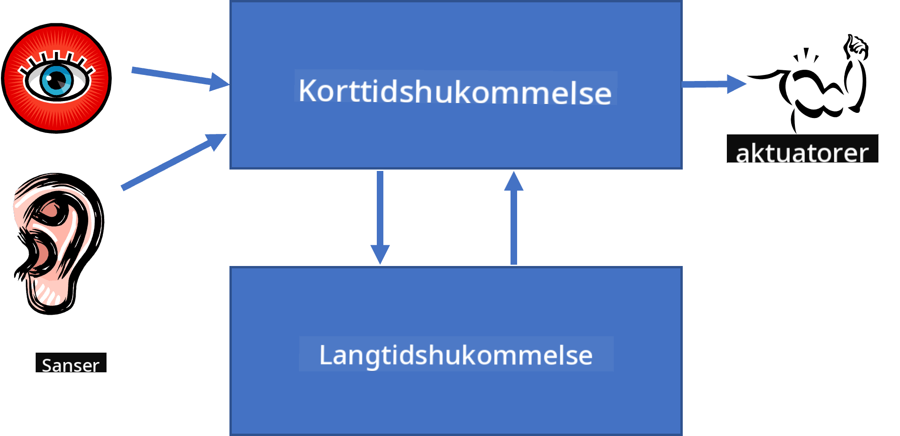

<!--
CO_OP_TRANSLATOR_METADATA:
{
  "original_hash": "7d097f7fda9166ead615e4c34552381b",
  "translation_date": "2025-09-23T09:31:30+00:00",
  "source_file": "lessons/2-Symbolic/README.md",
  "language_code": "da"
}
-->
# Videnrepræsentation og Ekspertsystemer


> Sketchnote af [Tomomi Imura](https://twitter.com/girlie_mac)

Jagten på kunstig intelligens handler om at finde viden og forstå verden på samme måde som mennesker gør. Men hvordan kan man gøre dette?

## [Quiz før forelæsning](https://ff-quizzes.netlify.app/en/ai/quiz/3)

I AI's tidlige dage var den top-down tilgang til at skabe intelligente systemer (diskuteret i den forrige lektion) populær. Ideen var at udtrække viden fra mennesker i en maskinlæsbar form og derefter bruge den til automatisk at løse problemer. Denne tilgang var baseret på to store idéer:

* Videnrepræsentation
* Ræsonnement

## Videnrepræsentation

Et af de vigtige begreber i Symbolsk AI er **viden**. Det er vigtigt at skelne viden fra *information* eller *data*. For eksempel kan man sige, at bøger indeholder viden, fordi man kan studere bøger og blive ekspert. Men det, bøger faktisk indeholder, kaldes *data*, og ved at læse bøger og integrere denne data i vores verdensmodel, konverterer vi data til viden.

> ✅ **Viden** er noget, der findes i vores hoved og repræsenterer vores forståelse af verden. Det opnås gennem en aktiv **læringsproces**, som integrerer de informationer, vi modtager, i vores aktive verdensmodel.

Ofte definerer vi ikke viden strengt, men vi relaterer det til andre begreber ved hjælp af [DIKW-pyramiden](https://en.wikipedia.org/wiki/DIKW_pyramid). Den indeholder følgende begreber:

* **Data** er noget, der er repræsenteret på fysisk medie, såsom skrevet tekst eller talte ord. Data eksisterer uafhængigt af mennesker og kan overføres mellem personer.
* **Information** er, hvordan vi fortolker data i vores hoved. For eksempel, når vi hører ordet *computer*, har vi en forståelse af, hvad det er.
* **Viden** er information, der integreres i vores verdensmodel. For eksempel, når vi lærer, hvad en computer er, begynder vi at få idéer om, hvordan den fungerer, hvad den koster, og hvad den kan bruges til. Dette netværk af sammenhængende begreber udgør vores viden.
* **Visdom** er endnu et niveau af vores forståelse af verden og repræsenterer *meta-viden*, dvs. en idé om, hvordan og hvornår viden skal bruges.


*Billede [fra Wikipedia](https://commons.wikimedia.org/w/index.php?curid=37705247), af Longlivetheux - Eget arbejde, CC BY-SA 4.0*

Problemet med **videnrepræsentation** er derfor at finde en effektiv måde at repræsentere viden i en computer i form af data, så den kan bruges automatisk. Dette kan ses som et spektrum:


> Billede af [Dmitry Soshnikov](http://soshnikov.com)

* Til venstre er der meget simple typer af videnrepræsentationer, som kan bruges effektivt af computere. Den simpleste er algoritmisk, hvor viden er repræsenteret af et computerprogram. Dette er dog ikke den bedste måde at repræsentere viden på, fordi det ikke er fleksibelt. Viden i vores hoved er ofte ikke-algoritmisk.
* Til højre er der repræsentationer som naturlig tekst. Det er den mest kraftfulde, men kan ikke bruges til automatisk ræsonnement.

> ✅ Tænk et øjeblik over, hvordan du repræsenterer viden i dit hoved og konverterer det til noter. Er der et bestemt format, der fungerer godt for dig til at hjælpe med at huske?

## Klassificering af computerbaserede videnrepræsentationer

Vi kan klassificere forskellige metoder til videnrepræsentation i følgende kategorier:

* **Netværksrepræsentationer** er baseret på det faktum, at vi har et netværk af sammenhængende begreber i vores hoved. Vi kan forsøge at reproducere de samme netværk som en graf i en computer - et såkaldt **semantisk netværk**.

1. **Objekt-Attribut-Værdi tripler** eller **attribut-værdi par**. Da en graf kan repræsenteres i en computer som en liste af noder og kanter, kan vi repræsentere et semantisk netværk som en liste af tripler, der indeholder objekter, attributter og værdier. For eksempel kan vi bygge følgende tripler om programmeringssprog:

Objekt | Attribut | Værdi
-------|----------|------
Python | er | Utypet-sprog
Python | opfundet-af | Guido van Rossum
Python | blok-syntaks | indrykning
Utypet-sprog | har ikke | type-definitioner

> ✅ Tænk over, hvordan tripler kan bruges til at repræsentere andre typer af viden.

2. **Hierarkiske repræsentationer** understreger det faktum, at vi ofte skaber en hierarki af objekter i vores hoved. For eksempel ved vi, at en kanariefugl er en fugl, og alle fugle har vinger. Vi har også en idé om, hvilken farve en kanariefugl normalt har, og hvad dens flyvehastighed er.

   - **Ramme-repræsentation** er baseret på at repræsentere hvert objekt eller klasse af objekter som en **ramme**, der indeholder **slots**. Slots har mulige standardværdier, værdirestriktioner eller gemte procedurer, der kan kaldes for at få værdien af en slot. Alle rammer danner en hierarki, der ligner en objekt-hierarki i objektorienterede programmeringssprog.
   - **Scenarier** er en særlig type rammer, der repræsenterer komplekse situationer, der kan udfolde sig over tid.

**Python**

Slot | Værdi | Standardværdi | Interval |
-----|-------|---------------|----------|
Navn | Python | | |
Er-A | Utypet-sprog | | |
Variabel Case | | CamelCase | |
Programlængde | | | 5-5000 linjer |
Blok-syntaks | Indrykning | | |

3. **Proceduremæssige repræsentationer** er baseret på at repræsentere viden som en liste af handlinger, der kan udføres, når en bestemt betingelse opstår.
   - Produktionsregler er hvis-så udsagn, der giver os mulighed for at drage konklusioner. For eksempel kan en læge have en regel, der siger, at **HVIS** en patient har høj feber **ELLER** højt niveau af C-reaktivt protein i blodprøven **SÅ** har han en betændelse. Når vi støder på en af betingelserne, kan vi drage en konklusion om betændelse og derefter bruge den i videre ræsonnement.
   - Algoritmer kan betragtes som en anden form for proceduremæssig repræsentation, selvom de næsten aldrig bruges direkte i videnbaserede systemer.

4. **Logik** blev oprindeligt foreslået af Aristoteles som en måde at repræsentere universel menneskelig viden.
   - Predikatlogik som en matematisk teori er for rig til at være beregnelig, derfor bruges normalt en delmængde af den, såsom Horn-klausuler, der bruges i Prolog.
   - Beskrivende logik er en familie af logiske systemer, der bruges til at repræsentere og ræsonnere om hierarkier af objekter i distribuerede videnrepræsentationer som *semantisk web*.

## Ekspertsystemer

En af de tidlige succeser inden for symbolsk AI var de såkaldte **ekspertsystemer** - computersystemer designet til at fungere som en ekspert inden for et begrænset problemområde. De var baseret på en **vidensbase** udtrukket fra en eller flere menneskelige eksperter og indeholdt en **slutningsmotor**, der udførte ræsonnement ovenpå den.

 | 
---------------------------------------------|------------------------------------------------
Forenklet struktur af et menneskeligt neuralt system | Arkitektur af et videnbaseret system

Ekspertsystemer er bygget som det menneskelige ræsonnementsystem, der indeholder **korttidshukommelse** og **langtidshukommelse**. Tilsvarende skelner vi i videnbaserede systemer mellem følgende komponenter:

* **Problemhukommelse**: indeholder viden om det problem, der aktuelt løses, dvs. patientens temperatur eller blodtryk, om han har betændelse eller ej osv. Denne viden kaldes også **statisk viden**, fordi den indeholder et øjebliksbillede af, hvad vi aktuelt ved om problemet - den såkaldte *problemtilstand*.
* **Vidensbase**: repræsenterer langtidshukommelse om et problemområde. Den udtrækkes manuelt fra menneskelige eksperter og ændrer sig ikke fra konsultation til konsultation. Fordi den giver os mulighed for at navigere fra en problemtilstand til en anden, kaldes den også **dynamisk viden**.
* **Slutningsmotor**: orkestrerer hele processen med at søge i problemtilstandsrummet, stille spørgsmål til brugeren, når det er nødvendigt. Den er også ansvarlig for at finde de rigtige regler, der skal anvendes på hver tilstand.

Som et eksempel kan vi overveje følgende ekspertsystem til at bestemme et dyr baseret på dets fysiske egenskaber:


> Billede af [Dmitry Soshnikov](http://soshnikov.com)

Dette diagram kaldes et **AND-OR træ**, og det er en grafisk repræsentation af et sæt produktionsregler. At tegne et træ er nyttigt i begyndelsen af udtrækning af viden fra eksperten. For at repræsentere viden i computeren er det mere praktisk at bruge regler:

```
IF the animal eats meat
OR (animal has sharp teeth
    AND animal has claws
    AND animal has forward-looking eyes
) 
THEN the animal is a carnivore
```

Du kan bemærke, at hver betingelse på venstre side af reglen og handlingen i bund og grund er objekt-attribut-værdi (OAV) tripler. **Arbejds-hukommelse** indeholder det sæt af OAV tripler, der svarer til det problem, der aktuelt løses. En **regelmotor** leder efter regler, hvor en betingelse er opfyldt, og anvender dem, hvilket tilføjer endnu en tripel til arbejds-hukommelsen.

> ✅ Lav dit eget AND-OR træ om et emne, du kan lide!

### Fremadrettet vs. Bagudrettet Slutning

Den ovenfor beskrevne proces kaldes **fremadrettet slutning**. Den starter med nogle indledende data om problemet, der er tilgængelige i arbejds-hukommelsen, og udfører derefter følgende ræsonnementsloop:

1. Hvis mål-attributten er til stede i arbejds-hukommelsen - stop og giv resultatet
2. Søg efter alle regler, hvis betingelse aktuelt er opfyldt - opnå **konfliktsæt** af regler.
3. Udfør **konfliktløsning** - vælg én regel, der vil blive udført i dette trin. Der kan være forskellige strategier for konfliktløsning:
   - Vælg den første anvendelige regel i vidensbasen
   - Vælg en tilfældig regel
   - Vælg en *mere specifik* regel, dvs. den, der opfylder flest betingelser på venstre side (LHS)
4. Anvend den valgte regel og indsæt ny viden i problemtilstanden
5. Gentag fra trin 1.

Men i nogle tilfælde ønsker vi måske at starte med tom viden om problemet og stille spørgsmål, der hjælper os med at nå frem til en konklusion. For eksempel, når vi laver medicinsk diagnose, udfører vi normalt ikke alle medicinske analyser på forhånd, før vi begynder at diagnosticere patienten. Vi ønsker snarere at udføre analyser, når en beslutning skal træffes.

Denne proces kan modelleres ved hjælp af **bagudrettet slutning**. Den er drevet af **målet** - den attributværdi, vi søger at finde:

1. Vælg alle regler, der kan give os værdien af et mål (dvs. med målet på højre side (RHS)) - et konfliktsæt
1. Hvis der ikke er regler for denne attribut, eller der er en regel, der siger, at vi skal spørge brugeren om værdien - spørg om den, ellers:
1. Brug konfliktløsningsstrategi til at vælge én regel, som vi vil bruge som *hypotese* - vi vil forsøge at bevise den
1. Gentag processen rekursivt for alle attributter på venstre side af reglen, og prøv at bevise dem som mål
1. Hvis processen på noget tidspunkt fejler - brug en anden regel i trin 3.

> ✅ I hvilke situationer er fremadrettet slutning mere passende? Hvad med bagudrettet slutning?

### Implementering af Ekspertsystemer

Ekspertsystemer kan implementeres ved hjælp af forskellige værktøjer:

* Programmering direkte i et højniveau programmeringssprog. Dette er ikke den bedste idé, fordi den største fordel ved et videnbaseret system er, at viden er adskilt fra slutning, og en ekspert i problemområdet potentielt bør kunne skrive regler uden at forstå detaljerne i slutningsprocessen.
* Brug af **ekspertsystemskaller**, dvs. et system specifikt designet til at blive fyldt med viden ved hjælp af et videnrepræsentationssprog.

## ✍️ Øvelse: Dyreslutning

Se [Animals.ipynb](https://github.com/microsoft/AI-For-Beginners/blob/main/lessons/2-Symbolic/Animals.ipynb) for et eksempel på implementering af fremadrettet og bagudrettet slutning i et ekspertsystem.

> **Note**: Dette eksempel er ret simpelt og giver kun en idé om, hvordan et ekspertsystem ser ud. Når du begynder at oprette et sådant system, vil du først bemærke en *intelligent* adfærd fra det, når du når et vist antal regler, omkring 200+. På et tidspunkt bliver reglerne for komplekse til at holde dem alle i hovedet, og på dette tidspunkt kan du begynde at undre dig over, hvorfor systemet træffer visse beslutninger. Men en vigtig egenskab ved videnbaserede systemer er, at du altid kan *forklare* præcis, hvordan en beslutning blev truffet.

## Ontologier og Semantisk Web

I slutningen af det 20. århundrede var der en initiativ til at bruge videnrepræsentation til at annotere internetressourcer, så det ville være muligt at finde ressourcer, der svarer til meget specifikke forespørgsler. Denne bevægelse blev kaldt **Semantisk Web**, og den byggede på flere begreber:

- En særlig videnrepræsentation baseret på **[beskrivende logik](https://en.wikipedia.org/wiki/Description_logic)** (DL). Den ligner ramme-videnrepræsentation, fordi den bygger en hierarki af objekter med egenskaber, men den har formel logisk semantik og slutning. Der findes en hel familie af DL'er, som balancerer mellem udtryksfuldhed og algoritmisk kompleksitet af slutning.
- Distribueret videnrepræsentation, hvor alle begreber er repræsenteret af en global URI-identifikator, hvilket gør det muligt at skabe videnhierarkier, der spænder over internettet.
- En familie af XML-baserede sprog til vidensbeskrivelse: RDF (Resource Description Framework), RDFS (RDF Schema), OWL (Ontology Web Language).

Et kernekoncept i det semantiske web er begrebet **Ontologi**. Det refererer til en eksplicit specifikation af et problemområde ved hjælp af en formel vidensrepræsentation. Den simpleste ontologi kan blot være en hierarki af objekter i et problemområde, men mere komplekse ontologier vil inkludere regler, der kan bruges til at drage konklusioner.

I det semantiske web er alle repræsentationer baseret på tripletter. Hvert objekt og hver relation er unikt identificeret ved en URI. For eksempel, hvis vi vil angive, at dette AI Curriculum er udviklet af Dmitry Soshnikov den 1. januar 2022 - her er de tripletter, vi kan bruge:


```
http://github.com/microsoft/ai-for-beginners http://www.example.com/terms/creation-date “Jan 13, 2007”
http://github.com/microsoft/ai-for-beginners http://purl.org/dc/elements/1.1/creator http://soshnikov.com
```

> ✅ Her er `http://www.example.com/terms/creation-date` og `http://purl.org/dc/elements/1.1/creator` nogle velkendte og universelt accepterede URI'er til at udtrykke begreberne *skaber* og *oprettelsesdato*.

I et mere komplekst tilfælde, hvis vi vil definere en liste over skabere, kan vi bruge nogle datastrukturer defineret i RDF.


> Diagrammerne ovenfor er lavet af [Dmitry Soshnikov](http://soshnikov.com)

Udviklingen af det semantiske web blev på en måde bremset af succesen med søgemaskiner og teknikker inden for naturlig sprogbehandling, som gør det muligt at udtrække struktureret data fra tekst. Dog er der stadig betydelige bestræbelser på at opretholde ontologier og vidensbaser inden for visse områder. Nogle projekter, der er værd at nævne:

* [WikiData](https://wikidata.org/) er en samling af maskinlæsbare vidensbaser forbundet med Wikipedia. Det meste af dataene udvindes fra Wikipedia *InfoBoxes*, stykker af struktureret indhold inde i Wikipedia-sider. Du kan [forespørge](https://query.wikidata.org/) WikiData i SPARQL, et specielt forespørgselssprog for det semantiske web. Her er en eksempelforespørgsel, der viser de mest populære øjenfarver blandt mennesker:

```sparql
#defaultView:BubbleChart
SELECT ?eyeColorLabel (COUNT(?human) AS ?count)
WHERE
{
  ?human wdt:P31 wd:Q5.       # human instance-of homo sapiens
  ?human wdt:P1340 ?eyeColor. # human eye-color ?eyeColor
  SERVICE wikibase:label { bd:serviceParam wikibase:language "en". }
}
GROUP BY ?eyeColorLabel
```

* [DBpedia](https://www.dbpedia.org/) er en anden indsats, der ligner WikiData.

> ✅ Hvis du vil eksperimentere med at bygge dine egne ontologier eller åbne eksisterende, er der en fantastisk visuel ontologiredigeringsværktøj kaldet [Protégé](https://protege.stanford.edu/). Download det, eller brug det online.


*Web Protégé editor åbnet med Romanov-familieontologien. Screenshot af Dmitry Soshnikov*

## ✍️ Øvelse: En familieontologi

Se [FamilyOntology.ipynb](https://github.com/Ezana135/AI-For-Beginners/blob/main/lessons/2-Symbolic/FamilyOntology.ipynb) for et eksempel på brug af semantiske webteknikker til at ræsonnere om familierelationer. Vi vil tage et familietræ repræsenteret i det almindelige GEDCOM-format og en ontologi af familierelationer og bygge en graf over alle familierelationer for et givet sæt af individer.

## Microsoft Concept Graph

I de fleste tilfælde bliver ontologier omhyggeligt skabt manuelt. Det er dog også muligt at **udvinde** ontologier fra ustruktureret data, for eksempel fra tekster i naturligt sprog.

En sådan indsats blev gjort af Microsoft Research og resulterede i [Microsoft Concept Graph](https://blogs.microsoft.com/ai/microsoft-researchers-release-graph-that-helps-machines-conceptualize/?WT.mc_id=academic-77998-cacaste).

Det er en stor samling af enheder grupperet sammen ved hjælp af `is-a` arv-relationen. Det gør det muligt at besvare spørgsmål som "Hvad er Microsoft?" - svaret kunne være noget i retning af "en virksomhed med sandsynlighed 0,87, og et brand med sandsynlighed 0,75".

Grafen er tilgængelig enten som REST API eller som en stor downloadbar tekstfil, der lister alle enhedspar.

## ✍️ Øvelse: En konceptgraf

Prøv [MSConceptGraph.ipynb](https://github.com/microsoft/AI-For-Beginners/blob/main/lessons/2-Symbolic/MSConceptGraph.ipynb) notebook for at se, hvordan vi kan bruge Microsoft Concept Graph til at gruppere nyhedsartikler i flere kategorier.

## Konklusion

I dag bliver AI ofte betragtet som synonymt med *Machine Learning* eller *Neurale Netværk*. Dog udviser et menneske også eksplicit ræsonnement, hvilket er noget, der i øjeblikket ikke håndteres af neurale netværk. I virkelige projekter bruges eksplicit ræsonnement stadig til at udføre opgaver, der kræver forklaringer eller evnen til at ændre systemets adfærd på en kontrolleret måde.

## 🚀 Udfordring

I Family Ontology-notebooken, der er knyttet til denne lektion, er der mulighed for at eksperimentere med andre familierelationer. Prøv at opdage nye forbindelser mellem personer i familietræet.

## [Quiz efter lektionen](https://ff-quizzes.netlify.app/en/ai/quiz/4)

## Gennemgang & Selvstudie

Undersøg på internettet for at opdage områder, hvor mennesker har forsøgt at kvantificere og kodificere viden. Tag et kig på Bloom's Taxonomy, og gå tilbage i historien for at lære, hvordan mennesker har forsøgt at forstå deres verden. Udforsk Linnaeus' arbejde med at skabe en taksonomi for organismer, og observer, hvordan Dmitri Mendeleev skabte en måde at beskrive og gruppere kemiske elementer på. Hvilke andre interessante eksempler kan du finde?

**Opgave**: [Byg en ontologi](assignment.md)

---

