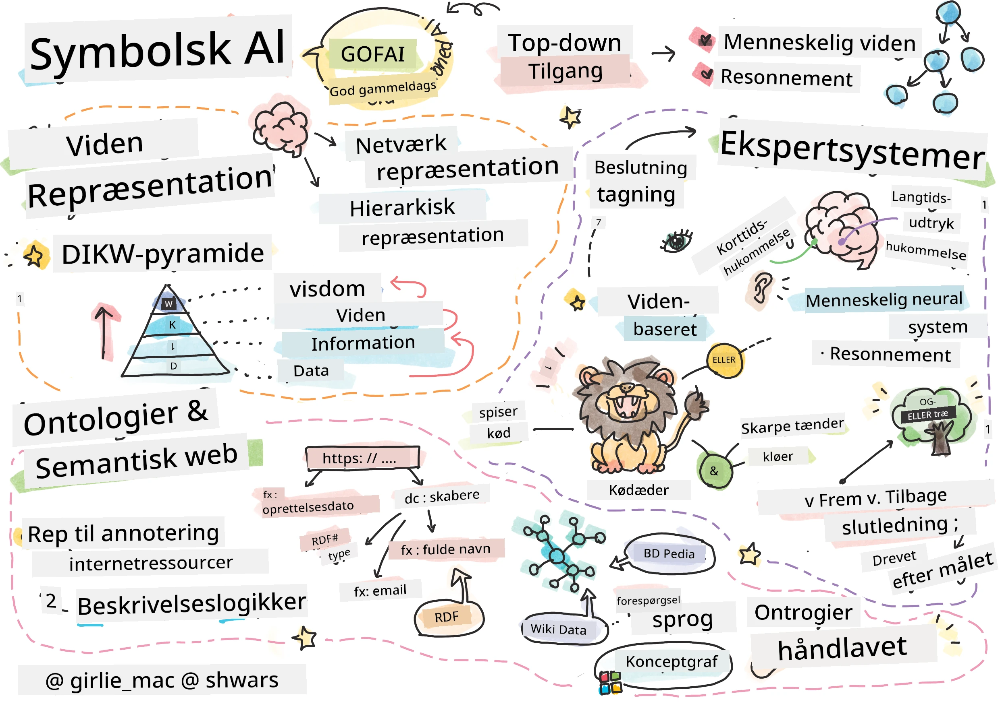
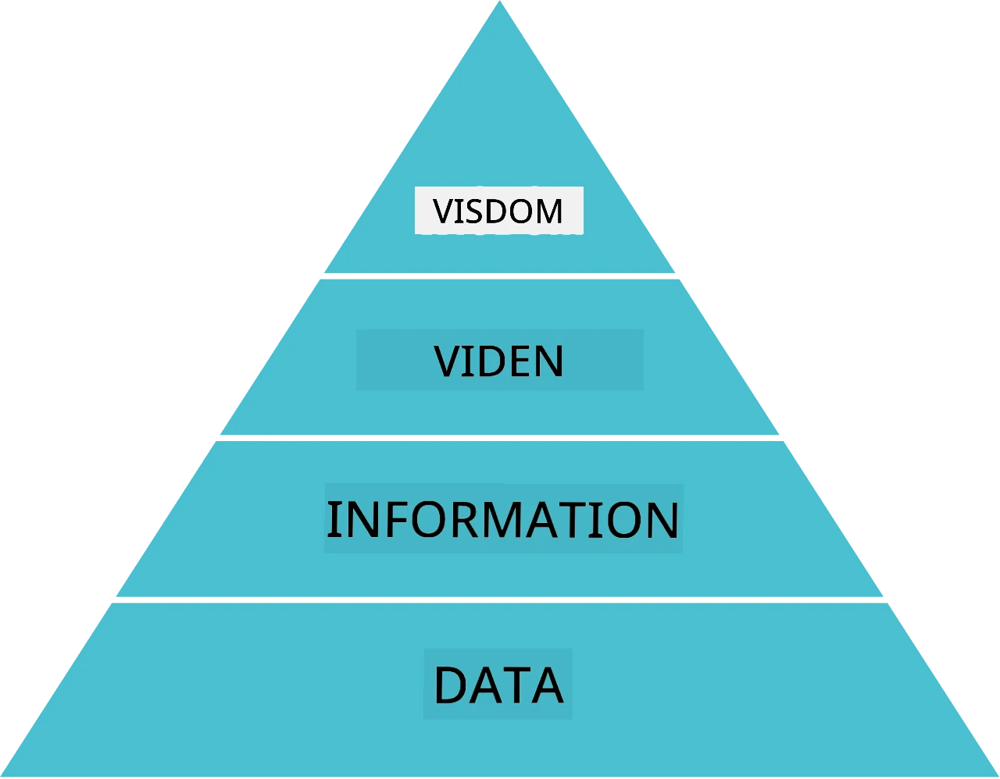
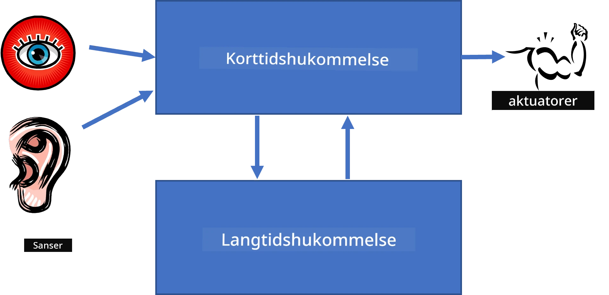
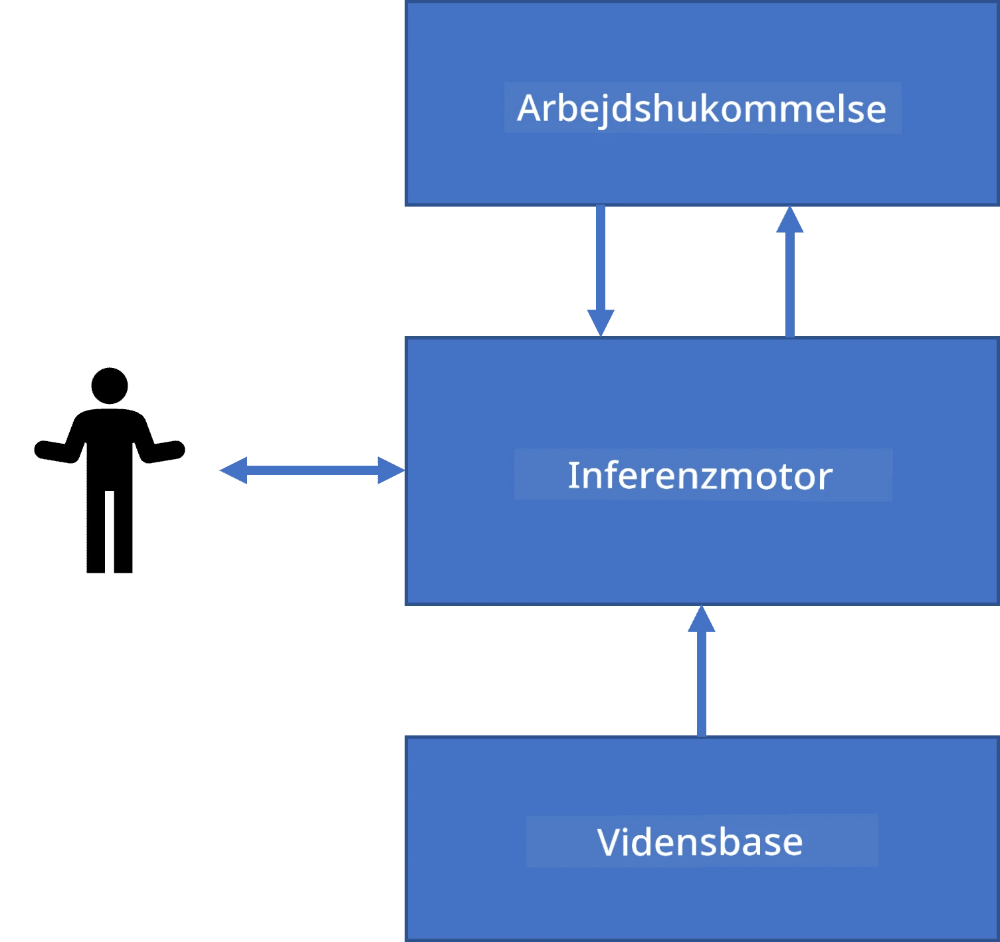
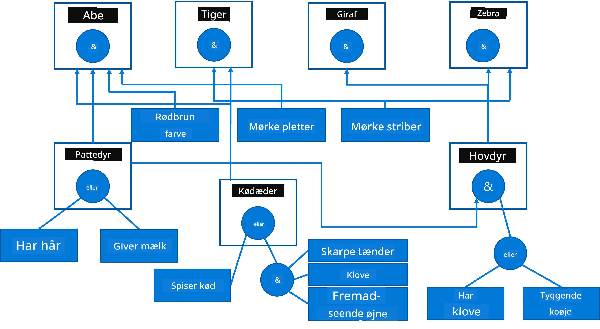
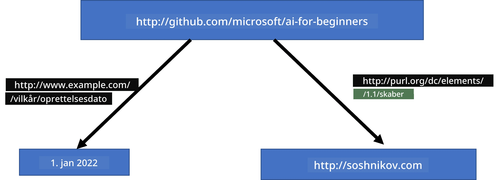
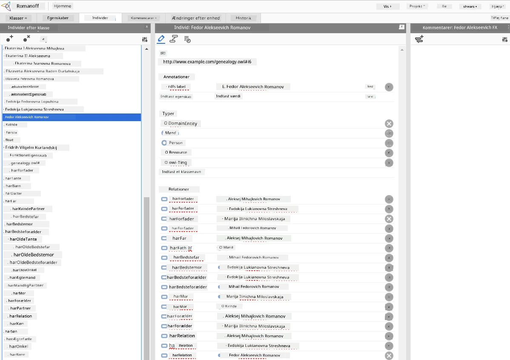

# Videnrepræsentation og Ekspertsystemer



> Sketchnote af [Tomomi Imura](https://twitter.com/girlie_mac)

Jagten på kunstig intelligens bygger på en søgen efter viden, for at forstå verden på en måde, der ligner, hvordan mennesker gør det. Men hvordan kan man nærme sig dette?

## [For-forelæsning quiz](https://ff-quizzes.netlify.app/en/ai/quiz/3)

I AI's tidlige dage var top-down tilgangen til at skabe intelligente systemer (beskrevet i den forrige lektion) populær. Ideen var at udvinde viden fra mennesker i en maskinlæsbar form og derefter bruge den til automatisk at løse problemer. Denne tilgang var baseret på to store ideer:

* Videnrepræsentation
* Resonnering

## Videnrepræsentation

Et af de vigtige begreber i Symbolsk AI er **viden**. Det er vigtigt at skelne mellem viden og *information* eller *data*. For eksempel kan man sige, at bøger indeholder viden, fordi man kan studere bøger og blive ekspert. Men det, bøger egentlig indeholder, kaldes *data*, og ved at læse bøger og integrere disse data i vores verdensmodel omdanner vi data til viden.

> ✅ **Viden** er noget, der findes i vores hoved og repræsenterer vores forståelse af verden. Det opnås gennem en aktiv **læringsproces**, som integrerer de informationsstykker, vi modtager, i vores aktive model af verden.

Ofte definerer vi ikke viden strengt, men vi placerer den i forhold til andre relaterede begreber ved hjælp af [DIKW-pyramiden](https://en.wikipedia.org/wiki/DIKW_pyramid). Den indeholder følgende begreber:

* **Data** er noget, der er repræsenteret i fysisk materiale som skrevet tekst eller talte ord. Data eksisterer uafhængigt af mennesker og kan overføres mellem personer.
* **Information** er, hvordan vi fortolker data i vores hoved. For eksempel, når vi hører ordet *computer*, har vi en vis forståelse af, hvad det er.
* **Viden** er information, der er integreret i vores verdensmodel. For eksempel, når vi har lært, hvad en computer er, begynder vi at have ideer om, hvordan den virker, hvor meget den koster, og hvad den kan bruges til. Dette netværk af sammenkoblede begreber udgør vores viden.
* **Visdom** er endnu et niveau af vores forståelse af verden, og det repræsenterer *meta-viden*, fx et begreb om hvordan og hvornår viden bør anvendes.



*Billede [fra Wikipedia](https://commons.wikimedia.org/w/index.php?curid=37705247), af Longlivetheux - Eget arbejde, CC BY-SA 4.0*

Derfor er problemet med **videnrepræsentation** at finde en effektiv måde at repræsentere viden inden i en computer i form af data, så det kan bruges automatisk. Dette kan ses som et spektrum:


> Billede af [Dmitry Soshnikov](http://soshnikov.com)

* Til venstre findes meget simple typer af videnrepræsentation, som computere effektivt kan bruge. Den simpleste er algoritmisk, når viden er repræsenteret som et computerprogram. Dette er dog ikke den bedste måde at repræsentere viden på, fordi det ikke er fleksibelt. Viden i vores hoved er ofte ikke-algoritmisk.
* Til højre findes repræsentationer såsom naturlig tekst. Det er den mest magtfulde, men kan ikke bruges til automatisk ræsonnering.

> ✅ Tænk et øjeblik over, hvordan du repræsenterer viden i dit hoved og omdanner det til noter. Er der et bestemt format, der fungerer godt for dig til at hjælpe med at fastholde det?

## Klassificering af computerbaserede videnrepræsentationer

Vi kan klassificere forskellige metoder til computerbaseret videnrepræsentation i følgende kategorier:

* **Netværksrepræsentationer** er baseret på det faktum, at vi har et netværk af indbyrdes forbundne begreber i vores hoved. Vi kan forsøge at genskabe de samme netværk som en graf inde i en computer – et såkaldt **semantisk netværk**.

1. **Objekt-Attribut-Værdi tripletter** eller **attribut-værdi par**. Da en graf kan repræsenteres i en computer som en liste over noder og kanter, kan vi repræsentere et semantisk netværk som en liste af tripletter, der indeholder objekter, attributter og værdier. For eksempel kan vi bygge følgende tripletter om programmeringssprog:

Objekt | Attribut | Værdi
-------|----------|------
Python | er | Untyped-Language
Python | opfundet-af | Guido van Rossum
Python | blok-syntaks | indrykning
Untyped-Language | har ikke | typedefinitioner

> ✅ Tænk over, hvordan tripletter kan bruges til at repræsentere andre typer viden.

2. **Hierarkiske repræsentationer** understreger det faktum, at vi ofte skaber et hierarki af objekter i vores hoved. For eksempel ved vi, at kanariefugl er en fugl, og alle fugle har vinger. Vi har også en idé om, hvilken farve en kanariefugl typisk har, og deres flyvehastighed.

   - **Frame-repræsentation** er baseret på at repræsentere hvert objekt eller klasse af objekter som en **frame**, der indeholder **slots**. Slots har mulige standardværdier, værdibegrænsninger eller lagrede procedurer, der kan kaldes for at få slotværdien. Alle frames danner et hierarki svarende til et objekthierarki i objektorienterede programmeringssprog.
   - **Scenarier** er en særlig slags frames, der repræsenterer komplekse situationer, som kan udvikle sig over tid.

**Python**

Slot | Værdi | Standardværdi | Interval |
-----|--------|--------------|----------|
Navn | Python | | |
Er-En | Untyped-Language | | |
Variabel Case | | CamelCase | |
Programlængde | | | 5-5000 linjer |
Blok-syntaks | Indrykning | | |

3. **Procedurale repræsentationer** er baseret på at repræsentere viden som en liste af handlinger, der kan udføres, når en bestemt betingelse indtræder.
   - Produktionsregler er hvis-så udsagn, der tillader os at drage konklusioner. For eksempel kan en læge have en regel, der siger, at **HVIS** en patient har høj feber **ELLER** et højt niveau af C-reaktivt protein i blodprøven, **SÅ** har patienten en betændelse. Når vi møder en af betingelserne, kan vi konkludere, at der er betændelse, og derefter bruge det i videre ræsonnering.
   - Algoritmer kan betragtes som en anden form for procedural repræsentation, selvom de næsten aldrig bruges direkte i videnbaserede systemer.

4. **Logik** blev oprindeligt foreslået af Aristoteles som en måde at repræsentere universel menneskelig viden på.
   - Predikatlogik som matematisk teori er for rig til at kunne beregnes, derfor bruges normalt et delmængde af den, som f.eks. Horn-klausuler brugt i Prolog.
   - Beskrivende logik er en familie af logiske systemer, der bruges til at repræsentere og ræsonnere om hierarkier af objekter i distribuerede videnrepræsentationer som *semantisk web*.

## Ekspertsystemer

En af de tidlige succeser inden for symbolsk AI var de såkaldte **ekspertsystemer** – computersystemer designet til at optræde som eksperter inden for et begrænset problemområde. De var baseret på en **videndatabase** udvundet fra én eller flere menneskelige eksperter, og indeholdt en **inferenmotor**, der udførte ræsonnering ovenpå denne.

 | 
---------------------------------------------|------------------------------------------------
Forenklet struktur af et menneskeligt neuralt system | Arkitektur af et videnbaseret system

Ekspertsystemer er bygget som det menneskelige ræsonneringssystem, der indeholder **korttidshukommelse** og **langtidshukommelse**. Ligeledes skelnes der i videnbaserede systemer mellem følgende komponenter:

* **Problemhukommelse**: indeholder viden om det problem, der aktuelt bliver løst, fx en patients temperatur eller blodtryk, om patienten har betændelse eller ikke, osv. Denne viden kaldes også **statisk viden**, fordi den indeholder et øjebliksbillede af, hvad vi aktuelt ved om problemet – den såkaldte *problemtilstand*.
* **Videndatabase**: repræsenterer langsigtet viden om et problemområde. Den udvindes manuelt fra menneskelige eksperter og ændres ikke fra konsultation til konsultation. Da den tillader os at navigere fra én problemtilstand til en anden, kaldes den også **dynamisk viden**.
* **Inferenzmotor**: orkestrerer hele processen med at søge i problemtilstandsrummet og spørger brugeren, når det er nødvendigt. Den er også ansvarlig for at finde de rigtige regler, der skal anvendes på hver tilstand.

Som eksempel kan vi tage følgende ekspertsystem til at bestemme et dyr baseret på dets fysiske karakteristika:



> Billede af [Dmitry Soshnikov](http://soshnikov.com)

Dette diagram kaldes et **AND-OR træ**, og det er en grafisk repræsentation af et sæt produktionsregler. At tegne et træ er nyttigt i starten af videnudvinding fra eksperten. For at repræsentere viden inde i computeren er det mere bekvemt at bruge regler:

```
IF the animal eats meat
OR (animal has sharp teeth
    AND animal has claws
    AND animal has forward-looking eyes
) 
THEN the animal is a carnivore
```

Du kan bemærke, at hver betingelse på venstresiden af reglen og handlingen i det væsentlige er objekt-attribut-værdi (OAV) tripletter. **Arbejds hukommelse** indeholder sættet af OAV-tripletter, der svarer til det problem, der aktuelt bliver løst. En **regelmotor** søger efter regler, hvor betingelsen er opfyldt, og anvender dem, hvilket tilføjer en ny triplet til arbejds hukommelsen.

> ✅ Skriv dit eget AND-OR træ om et emne, du godt kan lide!

### Fremadrettet vs. Bagudrettet inference

Den beskrevne proces kaldes **fremadrettet inference**. Den starter med nogle initielle data om problemet, der findes i arbejds hukommelsen, og udfører herefter følgende ræsonneringsloop:

1. Hvis mål-attributten er til stede i arbejds hukommelsen – stop og giv resultatet
2. Søg efter alle regler, hvis betingelse er opfyldt lige nu – få **konfliktsæt** af regler.
3. Udfør **konfliktløsning** – vælg en regel, der skal udføres dette trin. Der kan være forskellige konfliktløsningsstrategier:
   - Vælg den første anvendelige regel i videndatabasen
   - Vælg en tilfældig regel
   - Vælg en *mere specifik* regel, dvs. den, der opfylder flest betingelser i venstresiden (LHS)
4. Anvend den valgte regel og indsæt ny viden i problemtilstanden
5. Gentag fra trin 1.

Men i nogle tilfælde ønsker vi måske at starte med tom viden om problemet og stille spørgsmål, som vil hjælpe os til at nå frem til konklusionen. For eksempel, når vi laver medicinsk diagnostik, foretager vi normalt ikke alle medicinske analyser på forhånd, før vi begynder at diagnosticere patienten. Vi ønsker snarere at foretage analyser, når en beslutning skal træffes.

Denne proces kan modelleres ved hjælp af **bagudrettet inference**. Den drives af **målet** – den attributværdi, vi søger at finde:

1. Vælg alle regler, der kan give os værdien af et mål (dvs. med målet på højresiden (RHS)) – et konfliktsæt
1. Hvis der ikke findes regler for denne attribut, eller der er en regel, der siger, at vi skal spørge brugeren efter værdien – spørg om den, ellers:
1. Brug konfliktløsningsstrategi til at vælge en regel, som vi bruger som *hypotese* – vi vil forsøge at bevise den
1. Gentag processen rekursivt for alle attributter i venstresiden (LHS) af reglen, og prøv at bevise disse som mål
1. Hvis processen fejler på et tidspunkt – brug en anden regel i trin 3.

> ✅ I hvilke situationer er fremadrettet inference mere passende? Hvad med bagudrettet inference?

### Implementering af ekspertsystemer

Ekspertsystemer kan implementeres ved hjælp af forskellige værktøjer:

* Programmere dem direkte i et højniveau programmeringssprog. Dette er ikke den bedste idé, fordi hovedfordelen ved et videnbaseret system er, at viden er adskilt fra inference, og potentielt burde en fagdomæneekspert kunne skrive regler uden at forstå detaljerne i inferenceprocessen.
* Bruge et **ekspertsystem-skal**, dvs. et system specielt designet til at blive fyldt med viden ved hjælp af et videnrepræsentationssprog.

## ✍️ Øvelse: Dyreinference

Se [Animals.ipynb](https://github.com/microsoft/AI-For-Beginners/blob/main/lessons/2-Symbolic/Animals.ipynb) for et eksempel på implementering af fremadrettet og bagudrettet ekspertsystem.

> **Bemærk**: Dette eksempel er ret enkelt og giver kun en idé om, hvordan et ekspertsystem ser ud. Når du begynder at lave et sådant system, vil det først vise noget *intelligent* adfærd, når du når et vist antal regler, omkring 200+. På et tidspunkt bliver reglerne for komplicerede til at holde styr på dem alle, og da kan du begynde at undre dig over, hvorfor systemet træffer bestemte beslutninger. Men den vigtige egenskab ved videnbaserede systemer er, at du altid kan *forklare* præcist, hvordan nogen af beslutningerne blev taget.

## Ontologier og det Semantiske Web

I slutningen af det 20. århundrede var der et initiativ til at bruge videnrepræsentation til at annotere internetressourcer, så det ville være muligt at finde ressourcer, der svarer til meget specifikke forespørgsler. Denne bevægelse blev kaldt **Semantisk Web**, og den byggede på flere koncepter:

- En særlig videnrepræsentation baseret på **[beskrivende logikker](https://en.wikipedia.org/wiki/Description_logic)** (DL). Den ligner frame-videnrepræsentation, fordi den bygger et hierarki af objekter med egenskaber, men har formel logisk semantik og inferens. Der findes en hel familie af DL'er, som balancerer mellem udtryksfuldhed og algoritmisk kompleksitet af inferens.
- Distribueret videnrepræsentation, hvor alle begreber repræsenteres med en global URI-identifikator, hvilket gør det muligt at skabe videnhierarkier, der spænder over internettet.
- En familie af XML-baserede sprog til vidensbeskrivelse: RDF (Resource Description Framework), RDFS (RDF Schema), OWL (Ontology Web Language).

Et kernebegreb i det Semantiske Web er et begreb om **Ontologi**. Det henviser til en eksplicit specifikation af et problemområde ved hjælp af en formel videnrepræsentation. Den simpleste ontologi kan blot være en hierarki af objekter inden for et problemområde, men mere komplekse ontologier vil inkludere regler, der kan bruges til inferens.

I det semantiske web er alle repræsentationer baseret på tripler. Hvert objekt og hver relation identificeres entydigt ved URI. For eksempel, hvis vi vil angive faktaet, at dette AI Curriculum er udviklet af Dmitry Soshnikov den 1. januar 2022 - her er de tripler, vi kan bruge:



```
http://github.com/microsoft/ai-for-beginners http://www.example.com/terms/creation-date “Jan 1, 2022”
http://github.com/microsoft/ai-for-beginners http://purl.org/dc/elements/1.1/creator http://soshnikov.com
```

> ✅ Her er `http://www.example.com/terms/creation-date` og `http://purl.org/dc/elements/1.1/creator` nogle velkendte og universelt accepterede URI'er til at udtrykke begreberne *skaber* og *oprettelsesdato*.

I et mere komplekst tilfælde, hvis vi vil definere en liste af skabere, kan vi bruge nogle datastrukturer defineret i RDF.


> Diagrammer ovenfor af [Dmitry Soshnikov](http://soshnikov.com)

Fremskridtene med opbygningen af det Semantiske Web blev på en måde bremset af succesen med søgemaskiner og teknikker til behandling af naturligt sprog, som gør det muligt at udtrække strukturerede data fra tekst. Dog er der i nogle områder stadig betydelige bestræbelser på at vedligeholde ontologier og vidensbaser. Et par projekter, der er værd at bemærke:

* [WikiData](https://wikidata.org/) er en samling af maskinlæsbare vidensbaser knyttet til Wikipedia. Det meste af dataene bliver udvundet fra Wikipedias *InfoBoxes*, stykker af struktureret indhold inde i Wikipedia-sider. Du kan [forespørge](https://query.wikidata.org/) wikidata i SPARQL, et specielt forespørgselssprog til det Semantiske Web. Her er et eksempel på en forespørgsel, der viser de mest populære øjenfarver blandt mennesker:

```sparql
#defaultView:BubbleChart
SELECT ?eyeColorLabel (COUNT(?human) AS ?count)
WHERE
{
  ?human wdt:P31 wd:Q5.       # human instance-of homo sapiens
  ?human wdt:P1340 ?eyeColor. # human eye-color ?eyeColor
  SERVICE wikibase:label { bd:serviceParam wikibase:language "en". }
}
GROUP BY ?eyeColorLabel
```

* [DBpedia](https://www.dbpedia.org/) er en anden indsats, der ligner WikiData.

> ✅ Hvis du vil eksperimentere med at opbygge dine egne ontologier eller åbne eksisterende, er der en fremragende visuel ontologiredigerer kaldet [Protégé](https://protege.stanford.edu/). Download det, eller brug det online.



*Web Protégé editor åben med Romanov-familiens ontologi. Skærmbillede af Dmitry Soshnikov*

## ✍️ Øvelse: En Familieontologi

Se [FamilyOntology.ipynb](https://github.com/Ezana135/AI-For-Beginners/blob/main/lessons/2-Symbolic/FamilyOntology.ipynb) for et eksempel på brug af semantiske web-teknikker til at ræsonnere om familierelationer. Vi tager et stamtræ repræsenteret i det almindelige GEDCOM-format og en ontologi af familierelationer og bygger en graf over alle familierelationer for et givet sæt af individer.

## Microsoft Concept Graph

I de fleste tilfælde bliver ontologier omhyggeligt skabt manuelt. Det er dog også muligt at **udvinde** ontologier fra ustrukturerede data, for eksempel fra naturlige sprogtekster.

Et sådant forsøg blev lavet af Microsoft Research og resulterede i [Microsoft Concept Graph](https://blogs.microsoft.com/ai/microsoft-researchers-release-graph-that-helps-machines-conceptualize/?WT.mc_id=academic-77998-cacaste).

Det er en stor samling af entiteter grupperet sammen ved hjælp af `is-a` arv-relation. Det tillader at besvare spørgsmål som "Hvad er Microsoft?" – svaret er noget i retning af "et firma med sandsynlighed 0,87, og et mærke med sandsynlighed 0,75".

Grafen er tilgængelig enten som REST API eller som en stor downloadbar tekstfil, der oplister alle entitetpar.

## ✍️ Øvelse: En Konceptgraf

Prøv [MSConceptGraph.ipynb](https://github.com/microsoft/AI-For-Beginners/blob/main/lessons/2-Symbolic/MSConceptGraph.ipynb) notebooken for at se, hvordan vi kan bruge Microsoft Concept Graph til at gruppere nyhedsartikler i flere kategorier.

## Konklusion

I dag betragtes AI ofte som synonymt med *Maskinlæring* eller *Neurale Netværk*. Dog udviser et menneske også eksplicit ræsonnering, hvilket i øjeblikket ikke håndteres af neurale netværk. I virkelige projekter bruges eksplicit ræsonnering stadig til at udføre opgaver, der kræver forklaringer eller mulighed for at modificere systemets adfærd på en kontrolleret måde.

## 🚀 Udfordring

I Family Ontology-notebooken tilknyttet denne lektion er der mulighed for at eksperimentere med andre familierelationer. Prøv at opdage nye forbindelser mellem folk i stamtræet.

## [Quiz efter forelæsning](https://ff-quizzes.netlify.app/en/ai/quiz/4)

## Review & Selvstudie

Undersøg på internettet for at opdage områder, hvor mennesker har forsøgt at kvantificere og kodeificere viden. Tag et kig på Blooms Taksonomi, og gå tilbage i historien for at lære, hvordan mennesker har forsøgt at forstå deres verden. Udforsk Linnaeus’ arbejde med at skabe en taksonomi af organismer, og observer, hvordan Dmitri Mendeleev skabte en måde for kemiske elementer at blive beskrevet og grupperet på. Hvilke andre interessante eksempler kan du finde?

**Opgave**: [Byg en Ontologi](assignment.md)

---

<!-- CO-OP TRANSLATOR DISCLAIMER START -->
**Ansvarsfraskrivelse**:
Dette dokument er blevet oversat ved hjælp af AI-oversættelsestjenesten [Co-op Translator](https://github.com/Azure/co-op-translator). Selvom vi bestræber os på nøjagtighed, skal du være opmærksom på, at automatiserede oversættelser kan indeholde fejl eller unøjagtigheder. Det oprindelige dokument på dets oprindelige sprog bør betragtes som den autoritative kilde. For vigtig information anbefales professionel menneskelig oversættelse. Vi påtager os intet ansvar for misforståelser eller fejltolkninger som følge af brugen af denne oversættelse.
<!-- CO-OP TRANSLATOR DISCLAIMER END -->