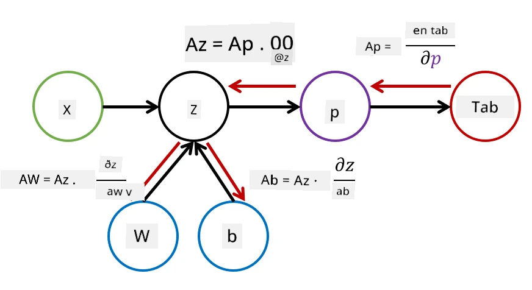

# Introduktion til Neurale Netværk. Multi-Layered Perceptron

I den forrige sektion lærte du om den simpleste model for neurale netværk - enlaget perceptron, en lineær to-klasse klassifikationsmodel.

I denne sektion vil vi udvide denne model til en mere fleksibel ramme, der giver os mulighed for at:

* udføre **multi-klasse klassifikation** ud over to-klasse
* løse **regressionsproblemer** ud over klassifikation
* adskille klasser, der ikke er lineært adskillelige

Vi vil også udvikle vores egen modulære ramme i Python, som giver os mulighed for at konstruere forskellige arkitekturer for neurale netværk.

## [Quiz før lektionen](https://ff-quizzes.netlify.app/en/ai/quiz/7)

## Formalisering af Maskinlæring

Lad os starte med at formalisere maskinlæringsproblemet. Antag, at vi har et træningsdatasæt **X** med labels **Y**, og vi skal bygge en model *f*, der kan lave de mest præcise forudsigelser. Kvaliteten af forudsigelserne måles ved hjælp af **tab-funktionen** &lagran;. Følgende tab-funktioner bruges ofte:

* For regressionsproblemer, hvor vi skal forudsige et tal, kan vi bruge **absolut fejl** &sum;i|f(x(i))-y(i)| eller **kvadreret fejl** &sum;i(f(x(i))-y(i))2
* For klassifikation bruger vi **0-1 tab** (som i bund og grund er det samme som modellens **nøjagtighed**) eller **logistisk tab**.

For enlaget perceptron blev funktionen *f* defineret som en lineær funktion *f(x)=wx+b* (her er *w* vægtmatricen, *x* er vektoren af inputfunktioner, og *b* er bias-vektoren). For forskellige arkitekturer af neurale netværk kan denne funktion antage en mere kompleks form.

> I tilfælde af klassifikation er det ofte ønskværdigt at få sandsynligheder for de tilsvarende klasser som netværkets output. For at konvertere vilkårlige tal til sandsynligheder (f.eks. for at normalisere outputtet) bruger vi ofte **softmax**-funktionen &sigma;, og funktionen *f* bliver *f(x)=&sigma;(wx+b)*

I definitionen af *f* ovenfor kaldes *w* og *b* for **parametre** &theta;=⟨*w,b*⟩. Givet datasættet ⟨**X**,**Y**⟩ kan vi beregne en samlet fejl på hele datasættet som en funktion af parametrene &theta;.

> ✅ **Målet med træning af neurale netværk er at minimere fejlen ved at variere parametrene &theta;**

## Gradient Descent Optimering

Der findes en velkendt metode til funktionsoptimering kaldet **gradient descent**. Ideen er, at vi kan beregne en afledt (i det flerdimensionale tilfælde kaldet **gradient**) af tab-funktionen med hensyn til parametrene og variere parametrene på en måde, så fejlen mindskes. Dette kan formaliseres som følger:

* Initialiser parametrene med nogle tilfældige værdier w(0), b(0)
* Gentag følgende trin mange gange:
    - w(i+1) = w(i)-&eta;&part;&lagran;/&part;w
    - b(i+1) = b(i)-&eta;&part;&lagran;/&part;b

Under træningen skal optimeringstrinene beregnes med hensyn til hele datasættet (husk, at tabet beregnes som en sum gennem alle træningsprøver). I praksis tager vi dog små dele af datasættet, kaldet **minibatches**, og beregner gradienter baseret på et delmængde af data. Fordi delmængden vælges tilfældigt hver gang, kaldes denne metode **stochastic gradient descent** (SGD).

## Multi-Layered Perceptrons og Backpropagation

Et enlaget netværk, som vi har set ovenfor, er i stand til at klassificere lineært adskillelige klasser. For at bygge en rigere model kan vi kombinere flere lag i netværket. Matematisk betyder det, at funktionen *f* får en mere kompleks form og beregnes i flere trin:
* z1=w1x+b1
* z2=w2&alpha;(z1)+b2
* f = &sigma;(z2)

Her er &alpha; en **ikke-lineær aktiveringsfunktion**, &sigma; er en softmax-funktion, og parametrene er &theta;=<*w1,b1,w2,b2*>.

Gradient descent-algoritmen forbliver den samme, men det bliver mere udfordrende at beregne gradienter. Ved hjælp af kædereglen for differentiation kan vi beregne afledte som:

* &part;&lagran;/&part;w2 = (&part;&lagran;/&part;&sigma;)(&part;&sigma;/&part;z2)(&part;z2/&part;w2)
* &part;&lagran;/&part;w1 = (&part;&lagran;/&part;&sigma;)(&part;&sigma;/&part;z2)(&part;z2/&part;&alpha;)(&part;&alpha;/&part;z1)(&part;z1/&part;w1)

> ✅ Kædereglen bruges til at beregne afledte af tab-funktionen med hensyn til parametrene.

Bemærk, at den venstre del af alle disse udtryk er den samme, og derfor kan vi effektivt beregne afledte ved at starte fra tab-funktionen og gå "baglæns" gennem beregningsgrafen. Derfor kaldes metoden til træning af et flerlaget perceptron for **backpropagation**, eller 'backprop'.

> TODO: billedhenvisning

> ✅ Vi vil dække backpropagation meget mere detaljeret i vores notebook-eksempel.  

## Konklusion

I denne lektion har vi bygget vores eget bibliotek til neurale netværk, og vi har brugt det til en simpel todimensionel klassifikationsopgave.

## 🚀 Udfordring

I den medfølgende notebook vil du implementere din egen ramme til at bygge og træne flerlagede perceptrons. Du vil kunne se i detaljer, hvordan moderne neurale netværk fungerer.

Gå videre til [OwnFramework](OwnFramework.ipynb)-notebooken og arbejd dig igennem den.

## [Quiz efter lektionen](https://ff-quizzes.netlify.app/en/ai/quiz/8)

## Gennemgang & Selvstudie

Backpropagation er en almindelig algoritme, der bruges i AI og ML, og det er værd at studere [mere detaljeret](https://wikipedia.org/wiki/Backpropagation)

## [Opgave](lab/README.md)

I dette laboratorium bliver du bedt om at bruge den ramme, du har konstrueret i denne lektion, til at løse MNIST-håndskrevne cifre klassifikation.

* [Instruktioner](lab/README.md)
* [Notebook](lab/MyFW_MNIST.ipynb)

---

