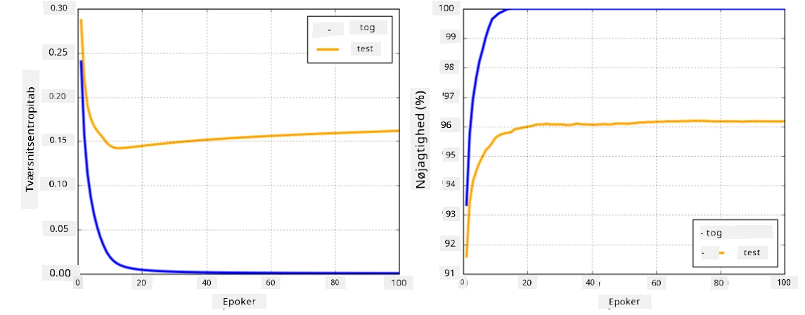

# Neural Netværk Frameworks

Som vi allerede har lært, skal vi gøre to ting for at kunne træne neurale netværk effektivt:

* Arbejde med tensorer, f.eks. multiplicere, addere og beregne funktioner som sigmoid eller softmax
* Beregne gradienter af alle udtryk for at udføre gradient descent optimering

## [Quiz før lektionen](https://ff-quizzes.netlify.app/en/ai/quiz/9)

Mens `numpy` biblioteket kan klare den første del, har vi brug for en mekanisme til at beregne gradienter. I [vores framework](../04-OwnFramework/OwnFramework.ipynb), som vi udviklede i det foregående afsnit, var vi nødt til manuelt at programmere alle afledte funktioner i `backward` metoden, der udfører backpropagation. Ideelt set bør et framework give os mulighed for at beregne gradienter af *ethvert udtryk*, vi kan definere.

En anden vigtig ting er at kunne udføre beregninger på GPU eller andre specialiserede beregningsenheder, såsom [TPU](https://en.wikipedia.org/wiki/Tensor_Processing_Unit). Træning af dybe neurale netværk kræver *mange* beregninger, og det er meget vigtigt at kunne parallelisere disse beregninger på GPU'er.

> ✅ Udtrykket 'parallelisere' betyder at fordele beregningerne over flere enheder.

De to mest populære neurale frameworks i øjeblikket er: [TensorFlow](http://TensorFlow.org) og [PyTorch](https://pytorch.org/). Begge tilbyder en lav-niveau API til at arbejde med tensorer på både CPU og GPU. Oven på lav-niveau API'en findes der også høj-niveau API'er, kaldet [Keras](https://keras.io/) og [PyTorch Lightning](https://pytorchlightning.ai/) henholdsvis.

Low-Level API | [TensorFlow](http://TensorFlow.org) | [PyTorch](https://pytorch.org/)
--------------|-------------------------------------|--------------------------------
High-level API| [Keras](https://keras.io/) | [PyTorch Lightning](https://pytorchlightning.ai/)

**Lav-niveau API'er** i begge frameworks giver dig mulighed for at bygge såkaldte **beregningsgrafer**. Denne graf definerer, hvordan output (normalt tab-funktionen) beregnes med givne inputparametre og kan sendes til beregning på GPU, hvis den er tilgængelig. Der findes funktioner til at differentiere denne beregningsgraf og beregne gradienter, som derefter kan bruges til at optimere modelparametre.

**Høj-niveau API'er** betragter stort set neurale netværk som en **sekvens af lag** og gør konstruktionen af de fleste neurale netværk meget lettere. Træning af modellen kræver normalt, at man forbereder dataene og derefter kalder en `fit` funktion for at udføre arbejdet.

Høj-niveau API'en giver dig mulighed for hurtigt at konstruere typiske neurale netværk uden at bekymre dig om mange detaljer. Samtidig tilbyder lav-niveau API'en meget mere kontrol over træningsprocessen og bruges derfor ofte i forskning, når man arbejder med nye neurale netværksarkitekturer.

Det er også vigtigt at forstå, at du kan bruge begge API'er sammen, f.eks. kan du udvikle din egen netværkslagsarkitektur ved hjælp af lav-niveau API'en og derefter bruge den i et større netværk, der er konstrueret og trænet med høj-niveau API'en. Eller du kan definere et netværk ved hjælp af høj-niveau API'en som en sekvens af lag og derefter bruge din egen lav-niveau træningssløjfe til at udføre optimering. Begge API'er bruger de samme grundlæggende underliggende begreber og er designet til at fungere godt sammen.

## Læring

I dette kursus tilbyder vi det meste af indholdet både for PyTorch og TensorFlow. Du kan vælge dit foretrukne framework og kun gennemgå de tilsvarende notebooks. Hvis du ikke er sikker på, hvilket framework du skal vælge, kan du læse nogle diskussioner på internettet om **PyTorch vs. TensorFlow**. Du kan også kigge på begge frameworks for at få en bedre forståelse.

Hvor det er muligt, vil vi bruge høj-niveau API'er for enkelhedens skyld. Vi mener dog, at det er vigtigt at forstå, hvordan neurale netværk fungerer fra bunden, så i starten begynder vi med at arbejde med lav-niveau API'er og tensorer. Hvis du imidlertid ønsker at komme hurtigt i gang og ikke vil bruge meget tid på at lære disse detaljer, kan du springe dem over og gå direkte til høj-niveau API notebooks.

## ✍️ Øvelser: Frameworks

Fortsæt din læring i følgende notebooks:

Low-Level API | [TensorFlow+Keras Notebook](IntroKerasTF.ipynb) | [PyTorch](IntroPyTorch.ipynb)
--------------|-------------------------------------|--------------------------------
High-level API| [Keras](IntroKeras.ipynb) | *PyTorch Lightning*

Efter at have mestret frameworks, lad os genopfriske begrebet overfitting.

# Overfitting

Overfitting er et ekstremt vigtigt begreb inden for maskinlæring, og det er meget vigtigt at forstå det korrekt!

Overvej følgende problem med at approximere 5 punkter (repræsenteret ved `x` på graferne nedenfor):

 | 
-------------------------|--------------------------
**Lineær model, 2 parametre** | **Ikke-lineær model, 7 parametre**
Træningsfejl = 5.3 | Træningsfejl = 0
Valideringsfejl = 5.1 | Valideringsfejl = 20

* Til venstre ser vi en god ret linje-approksimation. Fordi antallet af parametre er passende, forstår modellen punktfordelingen korrekt.
* Til højre er modellen for kraftfuld. Fordi vi kun har 5 punkter, og modellen har 7 parametre, kan den justere sig sådan, at den passer gennem alle punkter, hvilket gør træningsfejlen til 0. Dette forhindrer dog modellen i at forstå det korrekte mønster bag dataene, hvilket resulterer i en meget høj valideringsfejl.

Det er meget vigtigt at finde den rette balance mellem modellens kompleksitet (antal parametre) og antallet af træningsprøver.

## Hvorfor opstår overfitting

  * Ikke nok træningsdata
  * For kraftfuld model
  * For meget støj i inputdata

## Hvordan man opdager overfitting

Som du kan se på grafen ovenfor, kan overfitting opdages ved en meget lav træningsfejl og en høj valideringsfejl. Normalt under træning vil vi se både trænings- og valideringsfejl begynde at falde, og på et tidspunkt kan valideringsfejlen stoppe med at falde og begynde at stige. Dette vil være et tegn på overfitting og en indikator for, at vi sandsynligvis bør stoppe træningen på dette tidspunkt (eller i det mindste tage et snapshot af modellen).

## Hvordan man forhindrer overfitting

Hvis du kan se, at overfitting opstår, kan du gøre følgende:

 * Øge mængden af træningsdata
 * Mindske modellens kompleksitet
 * Bruge en [regulariseringsteknik](../../4-ComputerVision/08-TransferLearning/TrainingTricks.md), såsom [Dropout](../../4-ComputerVision/08-TransferLearning/TrainingTricks.md#Dropout), som vi vil overveje senere.

## Overfitting og Bias-Variance Tradeoff

Overfitting er faktisk et tilfælde af et mere generelt problem inden for statistik kaldet [Bias-Variance Tradeoff](https://en.wikipedia.org/wiki/Bias%E2%80%93variance_tradeoff). Hvis vi overvejer de mulige kilder til fejl i vores model, kan vi se to typer fejl:

* **Bias fejl** skyldes, at vores algoritme ikke er i stand til korrekt at fange forholdet mellem træningsdata. Det kan skyldes, at vores model ikke er kraftfuld nok (**underfitting**).
* **Variance fejl**, som skyldes, at modellen approximere støj i inputdataene i stedet for meningsfulde forhold (**overfitting**).

Under træning falder bias-fejlen (da vores model lærer at approximere dataene), og variance-fejlen stiger. Det er vigtigt at stoppe træningen - enten manuelt (når vi opdager overfitting) eller automatisk (ved at introducere regularisering) - for at forhindre overfitting.

## Konklusion

I denne lektion lærte du om forskellene mellem de forskellige API'er for de to mest populære AI frameworks, TensorFlow og PyTorch. Derudover lærte du om et meget vigtigt emne, overfitting.

## 🚀 Udfordring

I de medfølgende notebooks finder du 'opgaver' nederst; gennemgå notebooks og fuldfør opgaverne.

## [Quiz efter lektionen](https://ff-quizzes.netlify.app/en/ai/quiz/10)

## Gennemgang & Selvstudie

Undersøg følgende emner:

- TensorFlow
- PyTorch
- Overfitting

Spørg dig selv følgende spørgsmål:

- Hvad er forskellen mellem TensorFlow og PyTorch?
- Hvad er forskellen mellem overfitting og underfitting?

## [Opgave](lab/README.md)

I denne lab skal du løse to klassifikationsproblemer ved hjælp af enkelt- og flerlagede fuldt forbundne netværk med PyTorch eller TensorFlow.

* [Instruktioner](lab/README.md)
* [Notebook](lab/LabFrameworks.ipynb)

---

