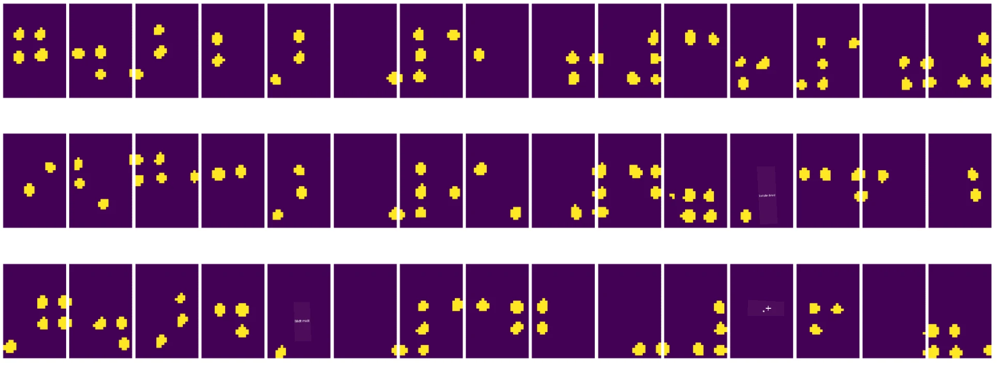
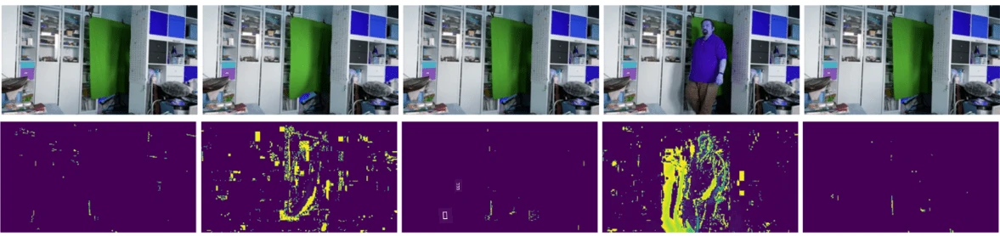

# Introduktion til Computer Vision

[Computer Vision](https://wikipedia.org/wiki/Computer_vision) er en disciplin, der har til formål at give computere en højere forståelse af digitale billeder. Dette er en bred definition, da *forståelse* kan betyde mange forskellige ting, herunder at finde et objekt på et billede (**objektdetektion**), forstå hvad der sker (**begivenhedsdetektion**), beskrive et billede med tekst eller rekonstruere en scene i 3D. Der er også særlige opgaver relateret til menneskelige billeder: alder- og følelsesestimering, ansigtsdetektion og -identifikation samt 3D-positur-estimering, for blot at nævne nogle få.

## [Quiz før lektionen](https://ff-quizzes.netlify.app/en/ai/quiz/11)

En af de enkleste opgaver inden for computer vision er **billedklassifikation**.

Computer vision betragtes ofte som en gren af AI. I dag løses de fleste opgaver inden for computer vision ved hjælp af neurale netværk. Vi vil lære mere om den særlige type neurale netværk, der bruges til computer vision, [convolutional neural networks](../07-ConvNets/README.md), i denne sektion.

Men før du sender et billede til et neuralt netværk, giver det i mange tilfælde mening at bruge nogle algoritmiske teknikker til at forbedre billedet.

Der findes flere Python-biblioteker til billedbehandling:

* **[imageio](https://imageio.readthedocs.io/en/stable/)** kan bruges til at læse/skrive forskellige billedformater. Det understøtter også ffmpeg, et nyttigt værktøj til at konvertere videorammer til billeder.
* **[Pillow](https://pillow.readthedocs.io/en/stable/index.html)** (også kendt som PIL) er lidt mere kraftfuldt og understøtter også nogle billedmanipulationer såsom morfning, paletjusteringer og mere.
* **[OpenCV](https://opencv.org/)** er et kraftfuldt billedbehandlingsbibliotek skrevet i C++, som er blevet den *de facto* standard inden for billedbehandling. Det har en praktisk Python-grænseflade.
* **[dlib](http://dlib.net/)** er et C++-bibliotek, der implementerer mange maskinlæringsalgoritmer, herunder nogle af Computer Vision-algoritmerne. Det har også en Python-grænseflade og kan bruges til udfordrende opgaver som ansigts- og ansigtslandmærkedetektion.

## OpenCV

[OpenCV](https://opencv.org/) betragtes som den *de facto* standard inden for billedbehandling. Det indeholder mange nyttige algoritmer, implementeret i C++. Du kan også bruge OpenCV fra Python.

Et godt sted at lære OpenCV er [denne Learn OpenCV-kursus](https://learnopencv.com/getting-started-with-opencv/). I vores pensum er målet ikke at lære OpenCV, men at vise dig nogle eksempler på, hvornår det kan bruges, og hvordan.

### Indlæsning af billeder

Billeder i Python kan bekvemt repræsenteres af NumPy-arrays. For eksempel vil gråtonede billeder med en størrelse på 320x200 pixels blive gemt i et 200x320-array, og farvebilleder med samme dimension vil have formen 200x320x3 (for 3 farvekanaler). For at indlæse et billede kan du bruge følgende kode:

```python
import cv2
import matplotlib.pyplot as plt

im = cv2.imread('image.jpeg')
plt.imshow(im)
```
  
Traditionelt bruger OpenCV BGR (Blå-Grøn-Rød) kodning til farvebilleder, mens resten af Python-værktøjerne bruger den mere traditionelle RGB (Rød-Grøn-Blå). For at billedet skal se korrekt ud, skal du konvertere det til RGB-farverummet, enten ved at bytte dimensioner i NumPy-arrayet eller ved at kalde en OpenCV-funktion:

```python
im = cv2.cvtColor(im,cv2.COLOR_BGR2RGB)
```
  
Den samme `cvtColor`-funktion kan bruges til at udføre andre farverumstransformationer, såsom at konvertere et billede til gråtoner eller til HSV (Hue-Saturation-Value) farverummet.

Du kan også bruge OpenCV til at indlæse video frame-for-frame - et eksempel er givet i øvelsen [OpenCV Notebook](OpenCV.ipynb).

### Billedbehandling

Før du sender et billede til et neuralt netværk, kan det være en god idé at anvende flere forbehandlingsskridt. OpenCV kan gøre mange ting, herunder:

* **Ændre størrelse** på billedet ved hjælp af `im = cv2.resize(im, (320,200),interpolation=cv2.INTER_LANCZOS)`
* **Sløre** billedet ved hjælp af `im = cv2.medianBlur(im,3)` eller `im = cv2.GaussianBlur(im, (3,3), 0)`
* Ændring af **lysstyrke og kontrast** på billedet kan gøres ved hjælp af NumPy-arraymanipulationer, som beskrevet [i denne Stackoverflow-note](https://stackoverflow.com/questions/39308030/how-do-i-increase-the-contrast-of-an-image-in-python-opencv).
* Brug af [thresholding](https://docs.opencv.org/4.x/d7/d4d/tutorial_py_thresholding.html) ved at kalde `cv2.threshold`/`cv2.adaptiveThreshold`-funktioner, hvilket ofte er at foretrække frem for at justere lysstyrke eller kontrast.
* Anvendelse af forskellige [transformationer](https://docs.opencv.org/4.5.5/da/d6e/tutorial_py_geometric_transformations.html) på billedet:
    - **[Affine transformationer](https://docs.opencv.org/4.5.5/d4/d61/tutorial_warp_affine.html)** kan være nyttige, hvis du skal kombinere rotation, ændring af størrelse og skævhed på billedet, og du kender kilde- og destinationsplaceringen af tre punkter i billedet. Affine transformationer holder parallelle linjer parallelle.
    - **[Perspektivtransformationer](https://medium.com/analytics-vidhya/opencv-perspective-transformation-9edffefb2143)** kan være nyttige, når du kender kilde- og destinationspositionerne for 4 punkter i billedet. For eksempel, hvis du tager et billede af et rektangulært dokument med et smartphonekamera fra en vinkel, og du vil lave et rektangulært billede af selve dokumentet.
* Forståelse af bevægelse i billedet ved hjælp af **[optisk flow](https://docs.opencv.org/4.5.5/d4/dee/tutorial_optical_flow.html)**.

## Eksempler på brug af Computer Vision

I vores [OpenCV Notebook](OpenCV.ipynb) giver vi nogle eksempler på, hvornår computer vision kan bruges til at udføre specifikke opgaver:

* **Forbehandling af et fotografi af en Braille-bog**. Vi fokuserer på, hvordan vi kan bruge thresholding, feature detection, perspektivtransformation og NumPy-manipulationer til at adskille individuelle Braille-symboler til videre klassifikation af et neuralt netværk.

 |  |   
----|-----|-----

> Billede fra [OpenCV.ipynb](OpenCV.ipynb)

* **Detektion af bevægelse i video ved hjælp af frame difference**. Hvis kameraet er fast, bør frames fra kameraets feed være ret ens. Da frames er repræsenteret som arrays, vil vi ved blot at trække disse arrays fra hinanden for to efterfølgende frames få pixel-forskellen, som bør være lav for statiske frames og blive højere, når der er betydelig bevægelse i billedet.



> Billede fra [OpenCV.ipynb](OpenCV.ipynb)

* **Detektion af bevægelse ved hjælp af optisk flow**. [Optisk flow](https://docs.opencv.org/3.4/d4/dee/tutorial_optical_flow.html) giver os mulighed for at forstå, hvordan individuelle pixels på video frames bevæger sig. Der er to typer optisk flow:

   - **Dense Optical Flow** beregner vektorfeltet, der viser, hvor hver pixel bevæger sig hen.
   - **Sparse Optical Flow** er baseret på at tage nogle karakteristiske træk i billedet (f.eks. kanter) og bygge deres bane fra frame til frame.


> Billede fra [OpenCV.ipynb](OpenCV.ipynb)

## ✍️ Eksempel Notebooks: OpenCV [prøv OpenCV i aktion](OpenCV.ipynb)

Lad os lave nogle eksperimenter med OpenCV ved at udforske [OpenCV Notebook](OpenCV.ipynb).

## Konklusion

Nogle gange kan relativt komplekse opgaver som bevægelsesdetektion eller fingerspidsdetektion løses udelukkende ved hjælp af computer vision. Derfor er det meget nyttigt at kende de grundlæggende teknikker inden for computer vision og hvad biblioteker som OpenCV kan gøre.

## 🚀 Udfordring

Se [denne video](https://docs.microsoft.com/shows/ai-show/ai-show--2021-opencv-ai-competition--grand-prize-winners--cortic-tigers--episode-32?WT.mc_id=academic-77998-cacaste) fra AI-showet for at lære om Cortic Tigers-projektet og hvordan de byggede en blokbaseret løsning til at demokratisere computer vision-opgaver via en robot. Undersøg andre projekter som dette, der hjælper nye lærere med at komme ind i feltet.

## [Quiz efter lektionen](https://ff-quizzes.netlify.app/en/ai/quiz/12)

## Gennemgang & Selvstudie

Læs mere om optisk flow [i denne fremragende tutorial](https://learnopencv.com/optical-flow-in-opencv/).

## [Opgave](lab/README.md)

I denne opgave skal du tage en video med simple gestusser, og dit mål er at udtrække op/ned/venstre/højre bevægelser ved hjælp af optisk flow.


---

