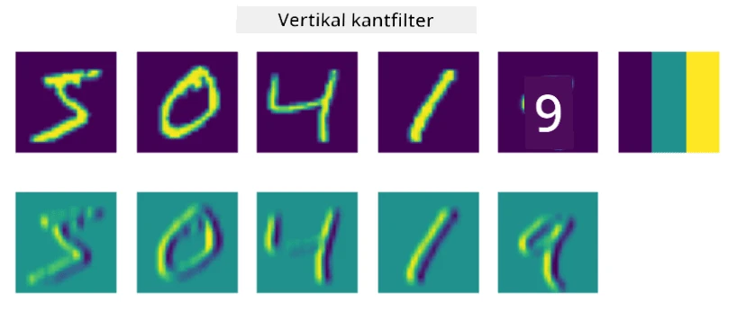
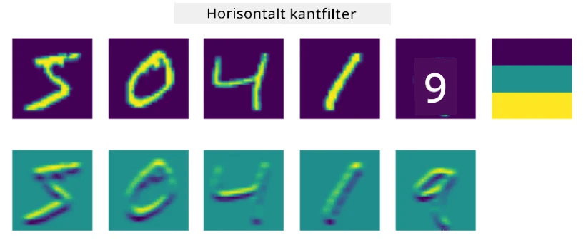
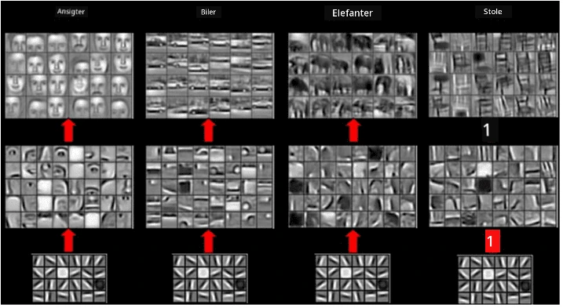
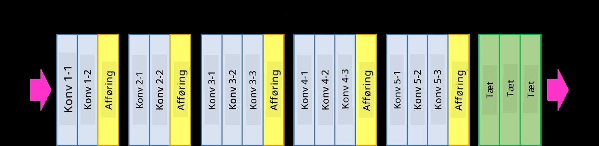
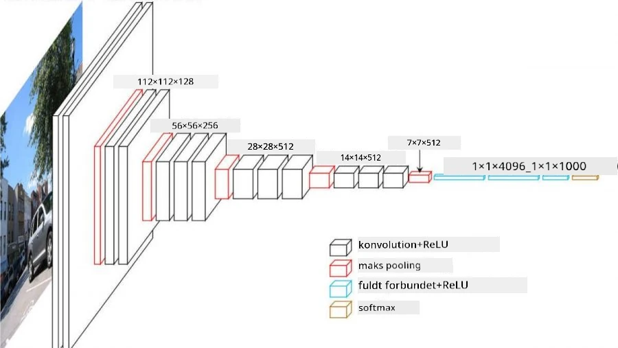

# Konvolutionelle Neurale Netværk

Vi har tidligere set, at neurale netværk er ret gode til at arbejde med billeder, og selv et enkeltlags perceptron kan genkende håndskrevne cifre fra MNIST-datasættet med rimelig nøjagtighed. Dog er MNIST-datasættet meget specielt, da alle cifre er centreret i billedet, hvilket gør opgaven enklere.

## [Quiz før forelæsning](https://ff-quizzes.netlify.app/en/ai/quiz/13)

I virkeligheden ønsker vi at kunne genkende objekter på et billede, uanset deres præcise placering i billedet. Computer vision adskiller sig fra generel klassifikation, fordi vi, når vi forsøger at finde et bestemt objekt på et billede, scanner billedet for at finde specifikke **mønstre** og deres kombinationer. For eksempel, når vi leder efter en kat, kan vi først kigge efter horisontale linjer, som kan danne knurhår, og derefter kan en bestemt kombination af knurhår fortælle os, at det faktisk er et billede af en kat. Den relative position og tilstedeværelsen af visse mønstre er vigtig, og ikke deres præcise placering på billedet.

For at udtrække mønstre vil vi bruge begrebet **konvolutionelle filtre**. Som du ved, repræsenteres et billede af en 2D-matrix eller en 3D-tensor med farvedybde. At anvende et filter betyder, at vi tager en relativt lille **filterkerne**-matrix, og for hver pixel i det oprindelige billede beregner vi det vægtede gennemsnit med nabopunkterne. Vi kan se dette som et lille vindue, der glider hen over hele billedet og udjævner alle pixels i henhold til vægtene i filterkernematrixen.

 | 
----|----

> Billede af Dmitry Soshnikov

For eksempel, hvis vi anvender 3x3 vertikale og horisontale kantfiltre på MNIST-cifre, kan vi fremhæve (f.eks. høje værdier), hvor der er vertikale og horisontale kanter i vores oprindelige billede. Disse to filtre kan således bruges til at "lede efter" kanter. På samme måde kan vi designe forskellige filtre til at finde andre lavniveau-mønstre:

> Billede af [Leung-Malik Filter Bank](https://www.robots.ox.ac.uk/~vgg/research/texclass/filters.html)

Men selvom vi kan designe filtrene manuelt til at udtrække nogle mønstre, kan vi også designe netværket på en sådan måde, at det lærer mønstrene automatisk. Dette er en af hovedidéerne bag CNN.

## Hovedidéer bag CNN

Måden CNN'er fungerer på, er baseret på følgende vigtige idéer:

* Konvolutionelle filtre kan udtrække mønstre
* Vi kan designe netværket, så filtrene trænes automatisk
* Vi kan bruge den samme tilgang til at finde mønstre i højere niveauer af funktioner, ikke kun i det oprindelige billede. CNN's funktionsekstraktion arbejder således på en hierarki af funktioner, der starter fra lavniveau-pixelkombinationer og går op til højere niveau-kombinationer af billeddele.

> Billede fra [en artikel af Hislop-Lynch](https://www.semanticscholar.org/paper/Computer-vision-based-pedestrian-trajectory-Hislop-Lynch/26e6f74853fc9bbb7487b06dc2cf095d36c9021d), baseret på [deres forskning](https://dl.acm.org/doi/abs/10.1145/1553374.1553453)

## ✍️ Øvelser: Konvolutionelle Neurale Netværk

Lad os fortsætte med at udforske, hvordan konvolutionelle neurale netværk fungerer, og hvordan vi kan opnå trænbare filtre, ved at arbejde igennem de tilsvarende notebooks:

* [Konvolutionelle Neurale Netværk - PyTorch](ConvNetsPyTorch.ipynb)
* [Konvolutionelle Neurale Netværk - TensorFlow](ConvNetsTF.ipynb)

## Pyramidearkitektur

De fleste CNN'er, der bruges til billedbehandling, følger en såkaldt pyramidearkitektur. Det første konvolutionelle lag, der anvendes på de oprindelige billeder, har typisk et relativt lavt antal filtre (8-16), som svarer til forskellige pixelkombinationer, såsom horisontale/vertikale linjer eller streger. På det næste niveau reducerer vi netværkets rumlige dimension og øger antallet af filtre, hvilket svarer til flere mulige kombinationer af simple funktioner. Med hvert lag, efterhånden som vi bevæger os mod den endelige klassifikator, mindskes billedets rumlige dimensioner, og antallet af filtre vokser.

Som et eksempel kan vi se på arkitekturen af VGG-16, et netværk der opnåede 92,7% nøjagtighed i ImageNet's top-5 klassifikation i 2014:

> Billede fra [Researchgate](https://www.researchgate.net/figure/Vgg16-model-structure-To-get-the-VGG-NIN-model-we-replace-the-2-nd-4-th-6-th-7-th_fig2_335194493)

## Mest Kendte CNN-arkitekturer

[Fortsæt din læring om de mest kendte CNN-arkitekturer](CNN_Architectures.md)

---

