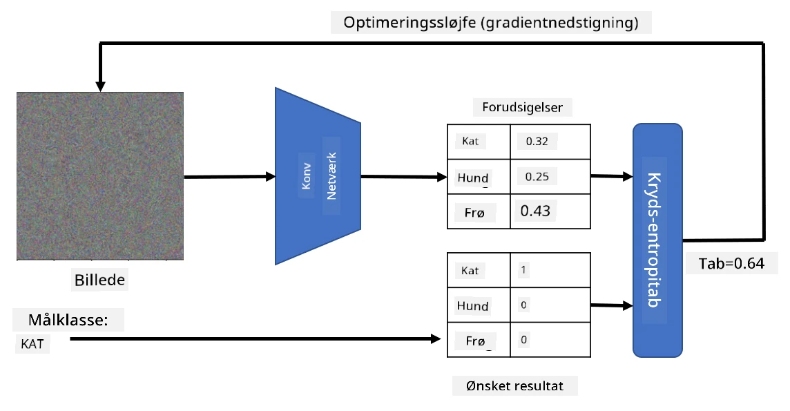

# Forudtrænede Netværk og Transfer Learning

Træning af CNN'er kan tage meget tid, og der kræves en stor mængde data til denne opgave. Meget af tiden bruges dog på at lære de bedste lavniveau-filtre, som et netværk kan bruge til at udtrække mønstre fra billeder. Et naturligt spørgsmål opstår: Kan vi bruge et neuralt netværk, der er trænet på ét datasæt, og tilpasse det til at klassificere andre billeder uden at skulle gennemgå en fuld træningsproces?

## [Pre-lecture quiz](https://ff-quizzes.netlify.app/en/ai/quiz/15)

Denne tilgang kaldes **transfer learning**, fordi vi overfører noget viden fra én neuralt netværksmodel til en anden. I transfer learning starter vi typisk med en forudtrænet model, som er blevet trænet på et stort billeddatasæt, såsom **ImageNet**. Disse modeller er allerede gode til at udtrække forskellige funktioner fra generiske billeder, og i mange tilfælde kan man opnå gode resultater blot ved at bygge en klassifikator oven på de udtrukne funktioner.

> ✅ Transfer Learning er et begreb, der også findes i andre akademiske felter, såsom uddannelse. Det refererer til processen med at tage viden fra ét område og anvende det på et andet.

## Forudtrænede Modeller som Funktionsudtrækkere

De konvolutionsnetværk, vi har talt om i det foregående afsnit, indeholder en række lag, som hver især skal udtrække nogle funktioner fra billedet. Dette starter med lavniveau-pixelkombinationer (såsom horisontale/vertikale linjer eller streger) og går op til højere niveau-kombinationer af funktioner, der svarer til ting som et øje på en flamme. Hvis vi træner et CNN på et tilstrækkeligt stort datasæt af generiske og forskellige billeder, bør netværket lære at udtrække disse fælles funktioner.

Både Keras og PyTorch indeholder funktioner til nemt at indlæse forudtrænede neurale netværksvægte for nogle almindelige arkitekturer, hvoraf de fleste er trænet på ImageNet-billeder. De mest anvendte er beskrevet på siden [CNN Architectures](../07-ConvNets/CNN_Architectures.md) fra den tidligere lektion. Især kan du overveje at bruge en af følgende:

* **VGG-16/VGG-19**, som er relativt simple modeller, der stadig giver god nøjagtighed. Ofte er det en god idé at starte med VGG for at se, hvordan transfer learning fungerer.
* **ResNet** er en familie af modeller foreslået af Microsoft Research i 2015. De har flere lag og kræver derfor flere ressourcer.
* **MobileNet** er en familie af modeller med reduceret størrelse, der er velegnede til mobile enheder. Brug dem, hvis du har begrænsede ressourcer og kan ofre lidt nøjagtighed.

Her er eksempler på funktioner udtrukket fra et billede af en kat ved hjælp af VGG-16-netværket:

## Datasæt: Katte vs. Hunde

I dette eksempel vil vi bruge et datasæt med [Katte og Hunde](https://www.microsoft.com/download/details.aspx?id=54765&WT.mc_id=academic-77998-cacaste), som ligger meget tæt på et realistisk scenarie for billedklassifikation.

## ✍️ Øvelse: Transfer Learning

Lad os se transfer learning i aktion i de tilhørende notebooks:

* [Transfer Learning - PyTorch](TransferLearningPyTorch.ipynb)
* [Transfer Learning - TensorFlow](TransferLearningTF.ipynb)

## Visualisering af Adversarial Kat

Et forudtrænet neuralt netværk indeholder forskellige mønstre i sin *hjerne*, herunder forestillinger om en **ideel kat** (samt ideel hund, ideel zebra osv.). Det kunne være interessant på en eller anden måde at **visualisere dette billede**. Det er dog ikke simpelt, fordi mønstrene er spredt ud over netværkets vægte og også organiseret i en hierarkisk struktur.

En tilgang, vi kan tage, er at starte med et tilfældigt billede og derefter bruge **gradient descent-optimering** til at justere billedet på en sådan måde, at netværket begynder at tro, at det er en kat.

Hvis vi gør dette, vil vi dog få noget, der minder meget om tilfældig støj. Dette skyldes, at *der er mange måder at få netværket til at tro, at inputbilledet er en kat*, herunder nogle, der ikke giver mening visuelt. Selvom disse billeder indeholder mange mønstre, der er typiske for en kat, er der intet, der tvinger dem til at være visuelt genkendelige.

For at forbedre resultatet kan vi tilføje et andet led til tab-funktionen, som kaldes **variationstab**. Det er en måling, der viser, hvor ens nabopixels i billedet er. Ved at minimere variationstabet bliver billedet glattere og fjerner støj – hvilket afslører mere visuelt tiltalende mønstre. Her er et eksempel på sådanne "ideelle" billeder, der klassificeres som henholdsvis kat og zebra med høj sandsynlighed:

 | 
-----|-----
 *Ideel Kat* | *Ideel Zebra*

En lignende tilgang kan bruges til at udføre såkaldte **adversarielle angreb** på et neuralt netværk. Antag, at vi vil narre et neuralt netværk og få en hund til at ligne en kat. Hvis vi tager et billede af en hund, som netværket genkender som en hund, kan vi justere det lidt ved hjælp af gradient descent-optimering, indtil netværket begynder at klassificere det som en kat:

 | 
-----|-----
*Originalt billede af en hund* | *Billede af en hund klassificeret som en kat*

Se koden for at genskabe resultaterne ovenfor i følgende notebook:

* [Ideel og Adversarial Kat - TensorFlow](AdversarialCat_TF.ipynb)

## Konklusion

Ved hjælp af transfer learning kan du hurtigt sammensætte en klassifikator til en brugerdefineret objektklassifikationsopgave og opnå høj nøjagtighed. Du kan se, at mere komplekse opgaver, som vi løser nu, kræver højere computerkraft og ikke let kan løses på en CPU. I den næste enhed vil vi forsøge at bruge en mere letvægtsimplementering til at træne den samme model med lavere computerressourcer, hvilket resulterer i en lidt lavere nøjagtighed.

## 🚀 Udfordring

I de tilhørende notebooks er der noter nederst om, hvordan transfer learning fungerer bedst med nogenlunde lignende træningsdata (måske en ny type dyr). Lav nogle eksperimenter med helt nye typer billeder for at se, hvor godt eller dårligt dine transfer learning-modeller klarer sig.

## [Post-lecture quiz](https://ff-quizzes.netlify.app/en/ai/quiz/16)

## Gennemgang & Selvstudie

Læs [TrainingTricks.md](TrainingTricks.md) for at uddybe din viden om andre måder at træne dine modeller på.

## [Opgave](lab/README.md)

I dette laboratorium vil vi bruge det virkelige [Oxford-IIIT](https://www.robots.ox.ac.uk/~vgg/data/pets/) kæledyrsdatasæt med 35 racer af katte og hunde og bygge en transfer learning-klassifikator.

---

