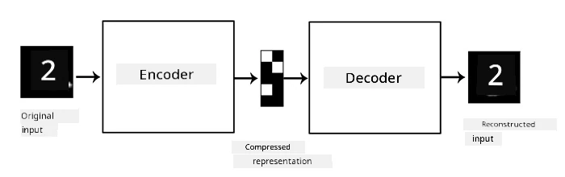

# Autoencodere

Når vi træner CNN'er, er en af udfordringerne, at vi har brug for en stor mængde mærkede data. I tilfælde af billedklassifikation skal vi opdele billeder i forskellige klasser, hvilket kræver manuelt arbejde.

## [Quiz før lektionen](https://ff-quizzes.netlify.app/en/ai/quiz/17)

Vi kan dog ønske at bruge rå (umærkede) data til at træne CNN-featureekstraktorer, hvilket kaldes **selv-superviseret læring**. I stedet for labels bruger vi træningsbilleder som både netværksinput og -output. Hovedideen bag en **autoencoder** er, at vi har et **encoder-netværk**, der konverterer inputbilledet til et **latent rum** (normalt en vektor af mindre størrelse), og derefter et **decoder-netværk**, hvis mål er at rekonstruere det oprindelige billede.

> ✅ En [autoencoder](https://wikipedia.org/wiki/Autoencoder) er "en type kunstigt neuralt netværk, der bruges til at lære effektive kodninger af umærkede data."

Da vi træner en autoencoder til at fange så meget information som muligt fra det oprindelige billede for at opnå en præcis rekonstruktion, forsøger netværket at finde den bedste **indlejring** af inputbilleder for at fange meningen.

> Billede fra [Keras blog](https://blog.keras.io/building-autoencoders-in-keras.html)

## Scenarier for brug af autoencodere

Selvom rekonstruktion af oprindelige billeder måske ikke virker nyttigt i sig selv, er der nogle scenarier, hvor autoencodere er særligt anvendelige:

* **Reducering af billeddimensioner til visualisering** eller **træning af billedindlejringer**. Autoencodere giver ofte bedre resultater end PCA, fordi de tager højde for billedernes rumlige natur og hierarkiske træk.
* **Denoising**, dvs. fjernelse af støj fra billeder. Da støj indeholder en masse unyttig information, kan autoencoderen ikke passe det hele ind i det relativt lille latente rum og fanger derfor kun de vigtige dele af billedet. Når vi træner støjfjernerne, starter vi med oprindelige billeder og bruger billeder med kunstigt tilføjet støj som input til autoencoderen.
* **Superopløsning**, dvs. øgning af billedopløsning. Vi starter med billeder i høj opløsning og bruger billeder med lavere opløsning som input til autoencoderen.
* **Generative modeller**. Når vi har trænet autoencoderen, kan decoder-delen bruges til at skabe nye objekter ud fra tilfældige latente vektorer.

## Variationsautoencodere (VAE)

Traditionelle autoencodere reducerer inputdataens dimensioner og finder de vigtige træk ved inputbillederne. Dog giver latente vektorer ofte ikke meget mening. Med andre ord, hvis vi tager MNIST-datasættet som eksempel, er det ikke nemt at finde ud af, hvilke cifre der svarer til forskellige latente vektorer, fordi nærliggende latente vektorer ikke nødvendigvis svarer til de samme cifre.

For at træne *generative* modeller er det derimod bedre at have en forståelse af det latente rum. Denne idé fører os til **variationsautoencoder** (VAE).

En VAE er en autoencoder, der lærer at forudsige en *statistisk fordeling* af de latente parametre, det såkaldte **latente fordeling**. For eksempel kan vi ønske, at latente vektorer er normalfordelte med en middelværdi zmean og en standardafvigelse zsigma (både middelværdi og standardafvigelse er vektorer med en vis dimensionalitet d). Encoderen i VAE lærer at forudsige disse parametre, og decoder-delen tager en tilfældig vektor fra denne fordeling for at rekonstruere objektet.

Opsummeret:

 * Fra inputvektoren forudsiger vi `z_mean` og `z_log_sigma` (i stedet for at forudsige standardafvigelsen direkte, forudsiger vi dens logaritme).
 * Vi sampler en vektor `sample` fra fordelingen N(zmean,exp(zlog\_sigma)).
 * Decoderen forsøger at dekode det oprindelige billede ved hjælp af `sample` som inputvektor.

 

> Billede fra [denne blogpost](https://ijdykeman.github.io/ml/2016/12/21/cvae.html) af Isaak Dykeman

Variationsautoencodere bruger en kompleks tab-funktion, der består af to dele:

* **Rekonstruktionstab** er tab-funktionen, der viser, hvor tæt det rekonstruerede billede er på målet (det kan være Mean Squared Error eller MSE). Det er den samme tab-funktion som i normale autoencodere.
* **KL-tab**, som sikrer, at de latente variabels fordelinger forbliver tæt på normalfordelingen. Det er baseret på begrebet [Kullback-Leibler-divergens](https://www.countbayesie.com/blog/2017/5/9/kullback-leibler-divergence-explained) - en metrik til at estimere, hvor ens to statistiske fordelinger er.

En vigtig fordel ved VAE'er er, at de gør det relativt nemt at generere nye billeder, fordi vi ved, hvilken fordeling vi skal sample latente vektorer fra. For eksempel, hvis vi træner en VAE med en 2D latent vektor på MNIST, kan vi derefter variere komponenterne i den latente vektor for at få forskellige cifre:

> Billede af [Dmitry Soshnikov](http://soshnikov.com)

Bemærk, hvordan billederne flyder ind i hinanden, når vi begynder at tage latente vektorer fra forskellige dele af det latente parameter-rum. Vi kan også visualisere dette rum i 2D:

 

> Billede af [Dmitry Soshnikov](http://soshnikov.com)

## ✍️ Øvelser: Autoencodere

Lær mere om autoencodere i disse tilhørende notebooks:

* [Autoencodere i TensorFlow](AutoencodersTF.ipynb)
* [Autoencodere i PyTorch](AutoEncodersPyTorch.ipynb)

## Egenskaber ved autoencodere

* **Dataspecifikke** - de fungerer kun godt med den type billeder, de er blevet trænet på. For eksempel, hvis vi træner et superopløsningsnetværk på blomster, vil det ikke fungere godt på portrætter. Dette skyldes, at netværket kan producere billeder i højere opløsning ved at tage fine detaljer fra træk, der er lært fra træningsdatasættet.
* **Tabsgivende** - det rekonstruerede billede er ikke det samme som det oprindelige billede. Arten af tabet defineres af den *tab-funktion*, der bruges under træningen.
* Fungerer på **umærkede data**

## [Quiz efter lektionen](https://ff-quizzes.netlify.app/en/ai/quiz/18)

## Konklusion

I denne lektion lærte du om de forskellige typer autoencodere, der er tilgængelige for AI-forskeren. Du lærte, hvordan man bygger dem, og hvordan man bruger dem til at rekonstruere billeder. Du lærte også om VAE og hvordan man bruger det til at generere nye billeder.

## 🚀 Udfordring

I denne lektion lærte du om brugen af autoencodere til billeder. Men de kan også bruges til musik! Tjek Magenta-projektets [MusicVAE](https://magenta.tensorflow.org/music-vae)-projekt, som bruger autoencodere til at lære at rekonstruere musik. Lav nogle [eksperimenter](https://colab.research.google.com/github/magenta/magenta-demos/blob/master/colab-notebooks/Multitrack_MusicVAE.ipynb) med dette bibliotek for at se, hvad du kan skabe.

## [Quiz efter lektionen](https://ff-quizzes.netlify.app/en/ai/quiz/16)

## Gennemgang & Selvstudie

Til reference kan du læse mere om autoencodere i disse ressourcer:

* [Building Autoencoders in Keras](https://blog.keras.io/building-autoencoders-in-keras.html)
* [Blogpost på NeuroHive](https://neurohive.io/ru/osnovy-data-science/variacionnyj-avtojenkoder-vae/)
* [Variational Autoencoders Explained](https://kvfrans.com/variational-autoencoders-explained/)
* [Conditional Variational Autoencoders](https://ijdykeman.github.io/ml/2016/12/21/cvae.html)

## Opgave

I slutningen af [denne notebook med TensorFlow](AutoencodersTF.ipynb) finder du en 'opgave' - brug denne som din opgave.

---

