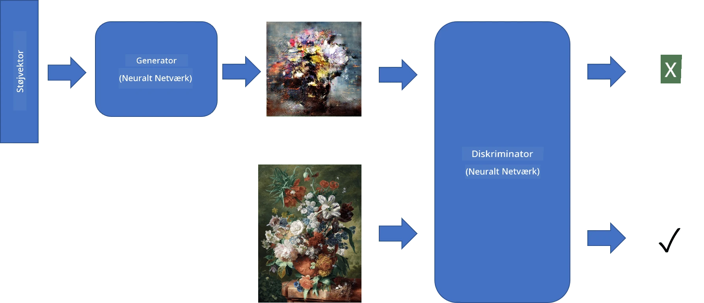
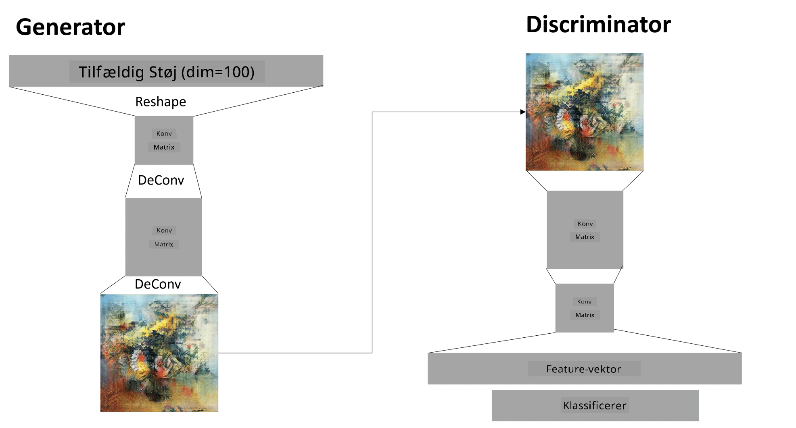

# Generative Adversarial Networks

I den forrige sektion lærte vi om **generative modeller**: modeller, der kan generere nye billeder, der ligner dem i træningsdatasættet. VAE var et godt eksempel på en generativ model.

## [Pre-lecture quiz](https://ff-quizzes.netlify.app/en/ai/quiz/19)

Men hvis vi forsøger at generere noget virkelig meningsfuldt, som et maleri i rimelig opløsning, med VAE, vil vi se, at træningen ikke konvergerer godt. Til dette formål bør vi lære om en anden arkitektur, der er specifikt rettet mod generative modeller - **Generative Adversarial Networks**, eller GANs.

Hovedideen bag en GAN er at have to neurale netværk, der trænes mod hinanden:

> Billede af [Dmitry Soshnikov](http://soshnikov.com)

> ✅ En lille ordliste:
> * **Generator** er et netværk, der tager en tilfældig vektor og producerer et billede som resultat.
> * **Discriminator** er et netværk, der tager et billede og skal afgøre, om det er et ægte billede (fra træningsdatasættet) eller genereret af en generator. Det er i bund og grund en billedklassifikator.

### Discriminator

Discriminatorens arkitektur adskiller sig ikke fra et almindeligt billedklassifikationsnetværk. I det simpleste tilfælde kan det være en fuldt forbundet klassifikator, men oftest vil det være et [konvolutionelt netværk](../07-ConvNets/README.md).

> ✅ En GAN baseret på konvolutionelle netværk kaldes en [DCGAN](https://arxiv.org/pdf/1511.06434.pdf)

En CNN-discriminator består af følgende lag: flere konvolutioner+pooling (med faldende rumlig størrelse) og en eller flere fuldt forbundne lag for at få en "feature vector", samt en endelig binær klassifikator.

> ✅ 'Pooling' i denne sammenhæng er en teknik, der reducerer billedets størrelse. "Pooling-lag reducerer dimensionerne af data ved at kombinere output fra neuron-klynger i ét lag til en enkelt neuron i det næste lag." - [kilde](https://wikipedia.org/wiki/Convolutional_neural_network#Pooling_layers)

### Generator

En generator er lidt mere kompleks. Du kan betragte den som en omvendt discriminator. Den starter med en latent vektor (i stedet for en feature vector), har et fuldt forbundet lag til at konvertere det til den ønskede størrelse/form, efterfulgt af dekonvolutioner+opskalering. Dette ligner *decoder*-delen af [autoencoder](../09-Autoencoders/README.md).

> ✅ Fordi konvolutionslaget implementeres som et lineært filter, der bevæger sig hen over billedet, er dekonvolution i bund og grund det samme som konvolution og kan implementeres med samme laglogik.

> Billede af [Dmitry Soshnikov](http://soshnikov.com)

### Træning af GAN

GANs kaldes **adversarial**, fordi der er en konstant konkurrence mellem generatoren og discriminator. Under denne konkurrence forbedres både generatoren og discriminator, og netværket lærer dermed at producere bedre og bedre billeder.

Træningen sker i to trin:

* **Træning af discriminator**. Denne opgave er ret ligetil: vi genererer en batch af billeder med generatoren, mærker dem som 0, hvilket står for falske billeder, og tager en batch af billeder fra inputdatasættet (med mærket 1, ægte billeder). Vi opnår en *discriminator loss* og udfører backpropagation.
* **Træning af generatoren**. Dette er lidt mere komplekst, fordi vi ikke direkte kender det forventede output for generatoren. Vi tager hele GAN-netværket, som består af en generator efterfulgt af en discriminator, fodrer det med nogle tilfældige vektorer og forventer, at resultatet er 1 (svarende til ægte billeder). Vi fryser derefter discriminatorens parametre (vi ønsker ikke, at den skal trænes i dette trin) og udfører backpropagation.

Under denne proces falder både generatorens og discriminatorens tab ikke markant. Ideelt set bør de oscillere, hvilket svarer til, at begge netværk forbedrer deres ydeevne.

## ✍️ Øvelser: GANs

* [GAN Notebook i TensorFlow/Keras](GANTF.ipynb)
* [GAN Notebook i PyTorch](GANPyTorch.ipynb)

### Problemer med GAN-træning

GANs er kendt for at være særligt svære at træne. Her er nogle problemer:

* **Mode Collapse**. Dette betyder, at generatoren lærer at producere ét succesfuldt billede, der narrer discriminator, men ikke en række forskellige billeder.
* **Følsomhed over for hyperparametre**. Ofte kan man se, at en GAN slet ikke konvergerer, og så pludselig falder læringsraten, hvilket fører til konvergens.
* At holde en **balance** mellem generatoren og discriminator. I mange tilfælde kan discriminatorens tab hurtigt falde til nul, hvilket resulterer i, at generatoren ikke kan træne videre. For at overvinde dette kan vi prøve at indstille forskellige læringsrater for generatoren og discriminator eller springe discriminatorens træning over, hvis tabet allerede er for lavt.
* Træning for **høj opløsning**. Dette problem, som også ses med autoencoders, opstår, fordi rekonstruktion af for mange lag i et konvolutionelt netværk fører til artefakter. Problemet løses typisk med såkaldt **progressiv vækst**, hvor de første lag trænes på billeder med lav opløsning, og derefter "låses lagene op" eller tilføjes. En anden løsning er at tilføje ekstra forbindelser mellem lagene og træne flere opløsninger på én gang - se denne [Multi-Scale Gradient GANs paper](https://arxiv.org/abs/1903.06048) for detaljer.

## Style Transfer

GANs er en fantastisk måde at generere kunstneriske billeder på. En anden interessant teknik er den såkaldte **style transfer**, som tager ét **indholdsbillede** og tegner det i en anden stil ved at anvende filtre fra et **stilbillede**.

Sådan fungerer det:
* Vi starter med et tilfældigt støjbillede (eller med et indholdsbillede, men for forståelsens skyld er det lettere at starte med tilfældig støj).
* Vores mål er at skabe et billede, der er tæt på både indholdsbilledet og stilbilledet. Dette bestemmes af to tabfunktioner:
   - **Content loss** beregnes baseret på de features, der udtrækkes af CNN på nogle lag fra det aktuelle billede og indholdsbilledet.
   - **Style loss** beregnes mellem det aktuelle billede og stilbilledet på en smart måde ved hjælp af Gram-matricer (flere detaljer i [eksempelfilen](StyleTransfer.ipynb)).
* For at gøre billedet glattere og fjerne støj introducerer vi også **Variation loss**, som beregner den gennemsnitlige afstand mellem nabopixels.
* Den primære optimeringssløjfe justerer det aktuelle billede ved hjælp af gradient descent (eller en anden optimeringsalgoritme) for at minimere det samlede tab, som er en vægtet sum af alle tre tab.

## ✍️ Eksempel: [Style Transfer](StyleTransfer.ipynb)

## [Post-lecture quiz](https://ff-quizzes.netlify.app/en/ai/quiz/20)

## Konklusion

I denne lektion lærte du om GANs og hvordan man træner dem. Du lærte også om de særlige udfordringer, som denne type neurale netværk kan stå overfor, og nogle strategier til at overvinde dem.

## 🚀 Udfordring

Gennemgå [Style Transfer-notebooken](StyleTransfer.ipynb) med dine egne billeder.

## Review & Selvstudie

For reference, læs mere om GANs i disse ressourcer:

* Marco Pasini, [10 Lessons I Learned Training GANs for one Year](https://towardsdatascience.com/10-lessons-i-learned-training-generative-adversarial-networks-gans-for-a-year-c9071159628)
* [StyleGAN](https://en.wikipedia.org/wiki/StyleGAN), en *de facto* GAN-arkitektur at overveje
* [Creating Generative Art using GANs on Azure ML](https://soshnikov.com/scienceart/creating-generative-art-using-gan-on-azureml/)

## Opgave

Gennemgå en af de to notebooks, der er knyttet til denne lektion, og gen-træn GAN på dine egne billeder. Hvad kan du skabe?

---

