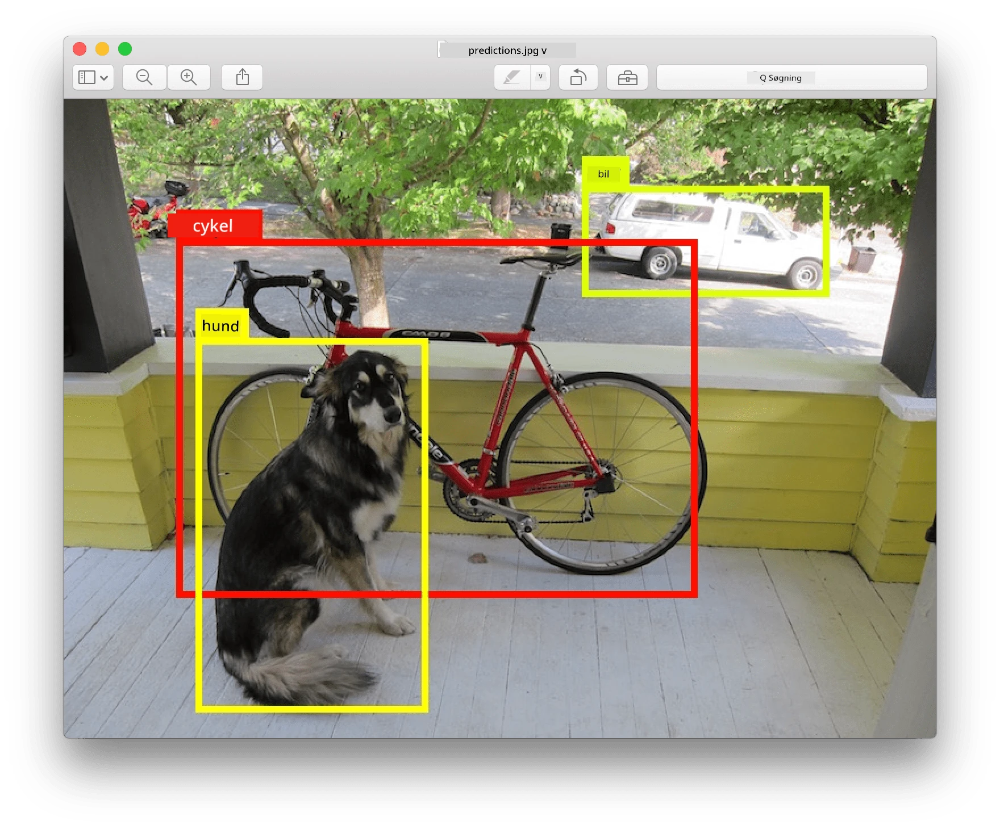
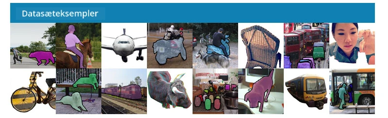
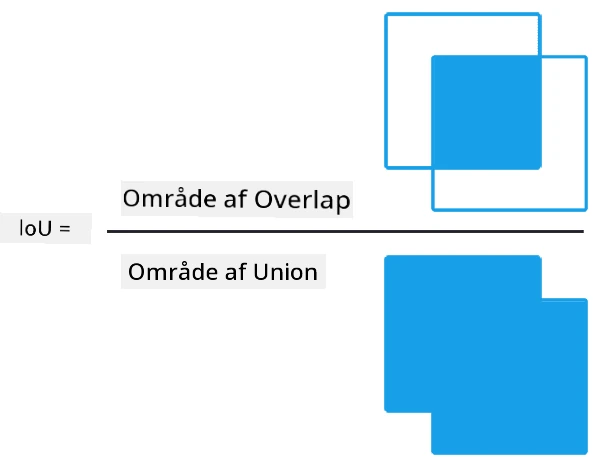
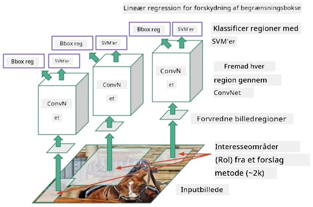
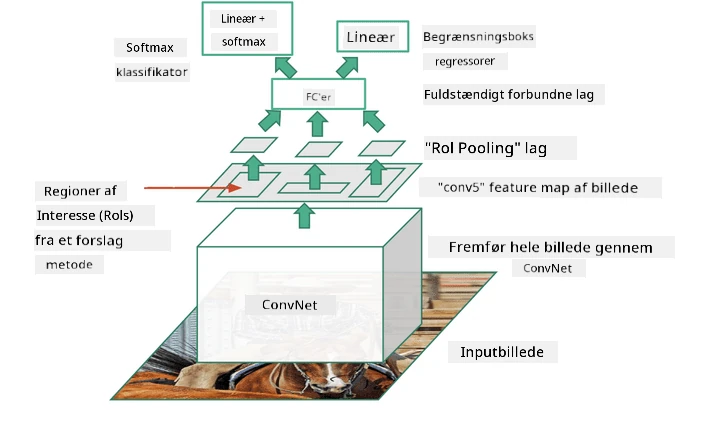
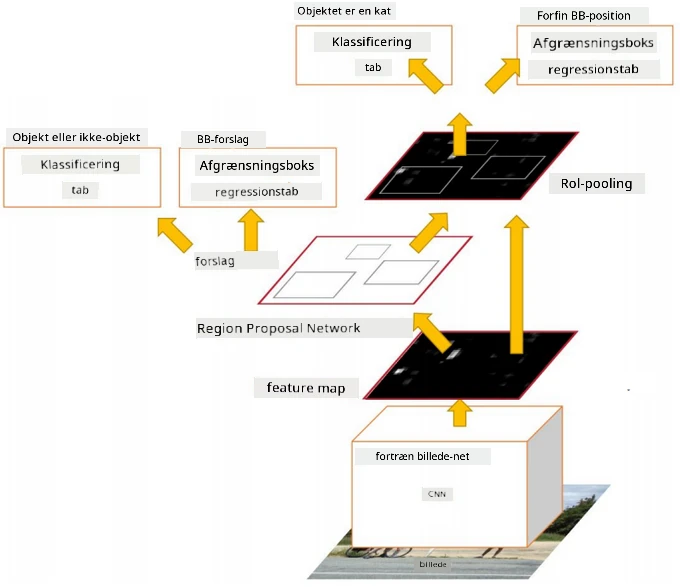
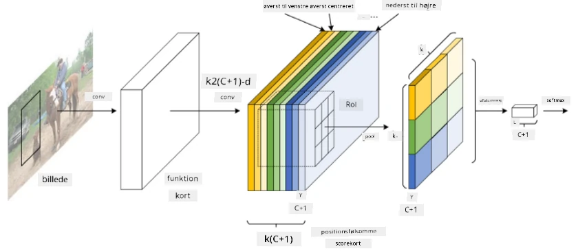
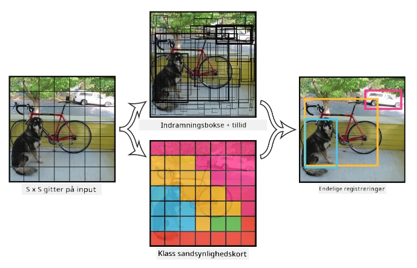

# Objektgenkendelse

De billedklassifikationsmodeller, vi hidtil har arbejdet med, tog et billede og producerede et kategorisk resultat, som f.eks. klassen 'nummer' i et MNIST-problem. Men i mange tilfælde ønsker vi ikke blot at vide, at et billede viser objekter – vi vil også kunne bestemme deres præcise placering. Det er netop formålet med **objektgenkendelse**.

## [Quiz før lektionen](https://ff-quizzes.netlify.app/en/ai/quiz/21)

> Billede fra [YOLO v2 hjemmeside](https://pjreddie.com/darknet/yolov2/)

## En naiv tilgang til objektgenkendelse

Hvis vi antager, at vi vil finde en kat på et billede, kunne en meget naiv tilgang til objektgenkendelse være følgende:

1. Opdel billedet i et antal fliser.
2. Kør billedklassifikation på hver flise.
3. De fliser, der resulterer i tilstrækkelig høj aktivering, kan betragtes som indeholdende det ønskede objekt.

> *Billede fra [Øvelsesnotebook](ObjectDetection-TF.ipynb)*

Denne tilgang er dog langt fra ideel, da den kun tillader algoritmen at lokalisere objektets afgrænsningsboks meget upræcist. For en mere præcis placering skal vi udføre en form for **regression** for at forudsige koordinaterne for afgrænsningsboksene – og til det har vi brug for specifikke datasæt.

## Regression til objektgenkendelse

[Dette blogindlæg](https://towardsdatascience.com/object-detection-with-neural-networks-a4e2c46b4491) giver en god introduktion til at detektere former.

## Datasæt til objektgenkendelse

Du kan støde på følgende datasæt til denne opgave:

* [PASCAL VOC](http://host.robots.ox.ac.uk/pascal/VOC/) - 20 klasser
* [COCO](http://cocodataset.org/#home) - Common Objects in Context. 80 klasser, afgrænsningsbokse og segmenteringsmasker

## Metrikker for objektgenkendelse

### Intersection over Union

Mens det er nemt at måle, hvor godt en algoritme klarer sig i billedklassifikation, skal vi i objektgenkendelse måle både korrektheden af klassen og præcisionen af den forudsagte placering af afgrænsningsboksen. Til det sidste bruger vi den såkaldte **Intersection over Union** (IoU), som måler, hvor godt to bokse (eller to vilkårlige områder) overlapper.

> *Figur 2 fra [dette fremragende blogindlæg om IoU](https://pyimagesearch.com/2016/11/07/intersection-over-union-iou-for-object-detection/)*

Ideen er simpel – vi dividerer arealet af overlap mellem to figurer med arealet af deres union. For to identiske områder vil IoU være 1, mens det for helt adskilte områder vil være 0. Ellers vil det variere fra 0 til 1. Vi overvejer typisk kun de afgrænsningsbokse, hvor IoU er over en bestemt værdi.

### Gennemsnitlig præcision

Antag, at vi vil måle, hvor godt en given klasse af objekter $C$ genkendes. Til dette bruger vi metrikken **Gennemsnitlig præcision**, som beregnes således:

1. Overvej en Precision-Recall-kurve, der viser nøjagtigheden afhængigt af en detektionstærskelværdi (fra 0 til 1).
2. Afhængigt af tærsklen vil vi få flere eller færre objekter detekteret i billedet og forskellige værdier for præcision og recall.
3. Kurven vil se sådan ud:

> *Billede fra [NeuroWorkshop](http://github.com/shwars/NeuroWorkshop)*

Den gennemsnitlige præcision for en given klasse $C$ er arealet under denne kurve. Mere præcist opdeles Recall-aksen typisk i 10 dele, og præcisionen gennemsnittes over alle disse punkter:

$$
AP = {1\over11}\sum_{i=0}^{10}\mbox{Precision}(\mbox{Recall}={i\over10})
$$

### AP og IoU

Vi overvejer kun de detektioner, hvor IoU er over en bestemt værdi. For eksempel antages $\mbox{IoU Threshold} = 0.5$ typisk i PASCAL VOC-datasættet, mens AP i COCO måles for forskellige værdier af $\mbox{IoU Threshold}$.

> *Billede fra [NeuroWorkshop](http://github.com/shwars/NeuroWorkshop)*

### Gennemsnitlig gennemsnitlig præcision - mAP

Den vigtigste metrik for objektgenkendelse kaldes **Gennemsnitlig gennemsnitlig præcision**, eller **mAP**. Det er værdien af gennemsnitlig præcision, gennemsnittet over alle objektklasser og nogle gange også over $\mbox{IoU Threshold}$. Processen for at beregne **mAP** er beskrevet mere detaljeret
[i dette blogindlæg](https://medium.com/@timothycarlen/understanding-the-map-evaluation-metric-for-object-detection-a07fe6962cf3)), og også [her med kodeeksempler](https://gist.github.com/tarlen5/008809c3decf19313de216b9208f3734).

## Forskellige tilgange til objektgenkendelse

Der er to brede klasser af algoritmer til objektgenkendelse:

* **Region Proposal Networks** (R-CNN, Fast R-CNN, Faster R-CNN). Hovedideen er at generere **Regions of Interest** (ROI) og køre CNN over dem for at finde maksimal aktivering. Det minder lidt om den naive tilgang, bortset fra at ROIs genereres på en mere intelligent måde. En af de største ulemper ved sådanne metoder er, at de er langsomme, fordi vi har brug for mange gennemløb af CNN-klassifikatoren over billedet.
* **One-pass** (YOLO, SSD, RetinaNet) metoder. I disse arkitekturer designer vi netværket til at forudsige både klasser og ROIs i én gennemløb.

### R-CNN: Region-baseret CNN

[R-CNN](http://islab.ulsan.ac.kr/files/announcement/513/rcnn_pami.pdf) bruger [Selective Search](http://www.huppelen.nl/publications/selectiveSearchDraft.pdf) til at generere en hierarkisk struktur af ROI-regioner, som derefter sendes gennem CNN-featureekstraktorer og SVM-klassifikatorer for at bestemme objektklassen og lineær regression for at bestemme *afgrænsningsboksens* koordinater. [Officiel artikel](https://arxiv.org/pdf/1506.01497v1.pdf)

> *Billede fra van de Sande et al. ICCV’11*

> *Billeder fra [denne blog](https://towardsdatascience.com/r-cnn-fast-r-cnn-faster-r-cnn-yolo-object-detection-algorithms-36d53571365e)*

### F-RCNN - Fast R-CNN

Denne tilgang ligner R-CNN, men regioner defineres efter, at konvolutionslagene er blevet anvendt.

> Billede fra [den officielle artikel](https://www.cv-foundation.org/openaccess/content_iccv_2015/papers/Girshick_Fast_R-CNN_ICCV_2015_paper.pdf), [arXiv](https://arxiv.org/pdf/1504.08083.pdf), 2015

### Faster R-CNN

Hovedideen med denne tilgang er at bruge et neuralt netværk til at forudsige ROIs – det såkaldte *Region Proposal Network*. [Artikel](https://arxiv.org/pdf/1506.01497.pdf), 2016

> Billede fra [den officielle artikel](https://arxiv.org/pdf/1506.01497.pdf)

### R-FCN: Region-baseret fuldt konvolutionelt netværk

Denne algoritme er endnu hurtigere end Faster R-CNN. Hovedideen er følgende:

1. Vi udtrækker features ved hjælp af ResNet-101.
2. Features behandles af **Position-Sensitive Score Map**. Hvert objekt fra $C$ klasser opdeles i $k\times k$ regioner, og vi træner til at forudsige dele af objekter.
3. For hver del fra $k\times k$ regioner stemmer alle netværk for objektklasser, og den objektklasse med flest stemmer vælges.

> Billede fra [officiel artikel](https://arxiv.org/abs/1605.06409)

### YOLO - You Only Look Once

YOLO er en realtids one-pass algoritme. Hovedideen er følgende:

 * Billedet opdeles i $S\times S$ regioner.
 * For hver region forudsiger **CNN** $n$ mulige objekter, *afgrænsningsboksens* koordinater og *tillid*=*sandsynlighed* * IoU.

 

> Billede fra [officiel artikel](https://arxiv.org/abs/1506.02640)

### Andre algoritmer

* RetinaNet: [officiel artikel](https://arxiv.org/abs/1708.02002)
   - [PyTorch-implementering i Torchvision](https://pytorch.org/vision/stable/_modules/torchvision/models/detection/retinanet.html)
   - [Keras-implementering](https://github.com/fizyr/keras-retinanet)
   - [Objektgenkendelse med RetinaNet](https://keras.io/examples/vision/retinanet/) i Keras-eksempler
* SSD (Single Shot Detector): [officiel artikel](https://arxiv.org/abs/1512.02325)

## ✍️ Øvelser: Objektgenkendelse

Fortsæt din læring i følgende notebook:

[ObjectDetection.ipynb](ObjectDetection.ipynb)

## Konklusion

I denne lektion fik du en hurtig gennemgang af de forskellige måder, hvorpå objektgenkendelse kan udføres!

## 🚀 Udfordring

Læs disse artikler og notebooks om YOLO, og prøv dem selv:

* [Godt blogindlæg](https://www.analyticsvidhya.com/blog/2018/12/practical-guide-object-detection-yolo-framewor-python/) om YOLO
 * [Officiel hjemmeside](https://pjreddie.com/darknet/yolo/)
 * Yolo: [Keras-implementering](https://github.com/experiencor/keras-yolo2), [trin-for-trin notebook](https://github.com/experiencor/basic-yolo-keras/blob/master/Yolo%20Step-by-Step.ipynb)
 * Yolo v2: [Keras-implementering](https://github.com/experiencor/keras-yolo2), [trin-for-trin notebook](https://github.com/experiencor/keras-yolo2/blob/master/Yolo%20Step-by-Step.ipynb)

## [Quiz efter lektionen](https://ff-quizzes.netlify.app/en/ai/quiz/22)

## Gennemgang & Selvstudie

* [Objektgenkendelse](https://tjmachinelearning.com/lectures/1718/obj/) af Nikhil Sardana
* [En god sammenligning af algoritmer til objektgenkendelse](https://lilianweng.github.io/lil-log/2018/12/27/object-detection-part-4.html)
* [Gennemgang af dyb læringsalgoritmer til objektgenkendelse](https://medium.com/comet-app/review-of-deep-learning-algorithms-for-object-detection-c1f3d437b852)
* [En trin-for-trin introduktion til de grundlæggende algoritmer for objektgenkendelse](https://www.analyticsvidhya.com/blog/2018/10/a-step-by-step-introduction-to-the-basic-object-detection-algorithms-part-1/)
* [Implementering af Faster R-CNN i Python til objektgenkendelse](https://www.analyticsvidhya.com/blog/2018/11/implementation-faster-r-cnn-python-object-detection/)

## [Opgave: Objektgenkendelse](lab/README.md)

---

